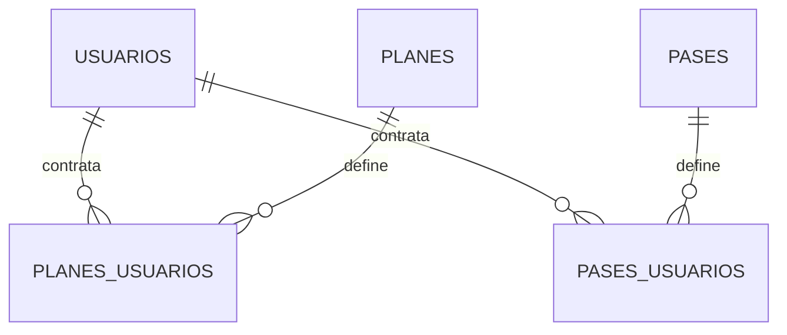

# Modelo relacional para PostgreSQL

## 1. Propósito

Este documento transforma las decisiones de `1_organizacion.md` y `2_criterios_del_sistema.md` en una estructura relacional orientada a PostgreSQL 17: tablas de negocio, columnas, claves, restricciones e integridad transaccional. Incluye los detalles físicos que determina Django cuando forman parte del esquema y no define contratos de API.

---

## 2. Convenciones generales

### 2.1 Nombres e identificadores

- Tablas y columnas utilizarán `snake_case` y nombres en plural para tablas.
- Las claves primarias simples serán `bigint GENERATED ALWAYS AS IDENTITY`.
- Las tablas de relación utilizarán claves primarias compuestas cuando corresponda.
- Las claves foráneas terminarán en `_id`.

### 2.2 Fechas, horas e importes

- Fechas civiles: `date`.
- Horas operativas: `time without time zone`.
- Auditoría: `timestamptz`.
- Importes: `numeric(12,2)` no negativo para precios y positivo para movimientos.
- La zona horaria funcional será `America/Argentina/Buenos_Aires`.

### 2.3 Valores fijos y auditoría

Los estados, modalidades, superficies, tipos de pase y medios de pago se validan mediante las opciones definidas en Django antes de guardar. Los roles se almacenan en un catálogo fijo `roles`, referenciado mediante una clave foránea desde `usuarios_roles`. Las actividades guardan `creado_en` y `actualizado_en` en `eventos`. La modificación de sus datos específicos actualiza también la marca del evento. Las demás tablas mutables mantienen sus propias marcas; las tablas de vínculos inmutables no necesitan una fecha de modificación.

### 2.4 Contraseñas

Se utiliza el hash predeterminado de Django: PBKDF2 con SHA-256 (`pbkdf2_sha256`). Django genera y verifica el hash, incluyendo el salt y el número de iteraciones, mediante su sistema de autenticación. La base nunca almacena la contraseña en texto plano.

El campo físico es `usuarios.password`, de tipo `varchar(128)`. La recuperación utiliza el mecanismo nativo de Django, sin una tabla de tokens (ver 4.25).

### 2.5 Columnas `Nullable` y `Unique`

En las tablas de la sección 4, ambas columnas solo muestran `Sí` cuando aplica; se dejan vacías en caso contrario. `Unique` marca reglas de unicidad sobre una sola columna, incluidas las que comparan su valor normalizado, distintas de la clave primaria (que ya implica unicidad y se identifica en `Clave`). Las restricciones de unicidad que abarcan más de una columna se describen en el texto debajo de cada tabla.

---

## 3. Estructura de ocupación

Un turno representa una hora de una cancha en una fecha. Un evento representa la actividad que utiliza uno o varios turnos y concentra su estado. Cada evento corresponde exactamente a una reserva, una clase o un bloqueo; las tres especializaciones son excluyentes.

Las restricciones únicas identifican cada turno y evitan repetir vínculos. Para confirmar una actividad, se bloquean sus turnos y se comprueba que ningún evento Programado o Finalizado los ocupe. La consulta de disponibilidad utiliza `eventos_turnos` y `eventos.estado`, sin consultar por separado reservas, clases y bloqueos. El esquema no necesita una exclusión de intervalos mediante `btree_gist`: la ocupación se coordina por identificadores de turnos dentro de las operaciones transaccionales.

## 4. Tablas

### 4.1 `usuarios`

Representa a toda persona gestionada por la academia —alumno, profesor, administrador o simplemente alguien que reserva una cancha—, siempre con credenciales propias.

| Clave | Columna | Tipo de dato | Nullable | Unique | Ejemplo |
|---|---|---|---|---|---|
| PK | `id` | `bigint` identity | | | `1` |
| | `password` | `varchar(128)` | | | `pbkdf2_sha256$...` |
| | `last_login` | `timestamptz` | Sí | | `2026-03-18 09:30:00-03` |
| | `is_superuser` | `boolean` | | | `false` |
| | `username` | `varchar(150)` | | Sí | `gomezm` |
| | `first_name` | `varchar(150)` | | | `Martina` |
| | `last_name` | `varchar(150)` | | | `Gómez` |
| | `email` | `varchar(254)` | | Sí | `martina.gomez@gmail.com` |
| | `is_staff` | `boolean` | | | `false` |
| | `is_active` | `boolean` | | | `true` |
| | `fecha_baja` | `timestamptz` | Sí | | `2026-03-20 18:45:00-03` |
| | `debe_cambiar_contrasena` | `boolean` | | | `true` |
| | `date_joined` | `timestamptz` | | | `2026-03-01 10:15:00-03` |
| | `fecha_nacimiento` | `date` | | | `1998-04-12` |
| | `celular_contacto` | `varchar(30)` | | | `+5493875551234` |
| | `observaciones` | `text` | | | `Celular es de la madre` |
| | `actualizado_en` | `timestamptz` | | | `2026-03-01 10:15:00-03` |

`Usuario` hereda de `AbstractUser`; por eso `password`, `last_login`, `is_superuser`, `username`, `first_name`, `last_name`, `is_staff`, `is_active` y `date_joined` son columnas físicas de `usuarios`. `date_joined` registra el alta, `actualizado_en` la última modificación y `fecha_baja` el momento de la inactivación. Una cuenta activa conserva `fecha_baja = NULL`. `observaciones` admite una cadena vacía, pero no `NULL`.

Los formularios de alta exigen nombre, apellido, correo, celular y fecha de nacimiento. Nombre y apellido admiten hasta 100 caracteres y no contienen números; sus columnas heredadas de Django admiten hasta 150. El celular se valida como móvil argentino y se guarda en formato internacional E.164; puede pertenecer a un tercero y no es único. La fecha de nacimiento se encuentra entre la fecha local actual menos 120 años y la fecha local actual, sin una edad mínima adicional.

Después del alta, la única columna de datos personales editable es `email`, mediante la gestión administrativa. El titular cambia su propia contraseña mediante el mecanismo de autenticación, que guarda su hash en `password`. `first_name`, `last_name`, `username`, `celular_contacto`, `fecha_nacimiento` y `observaciones` no tienen edición desde la aplicación. El estado y los roles se modifican mediante operaciones independientes. `actualizado_en` se actualiza al modificar el correo, cambiar o restablecer la contraseña y activar o desactivar la cuenta; `date_joined` conserva el momento del alta.

PostgreSQL garantiza la unicidad de `email` y `username` sin distinguir mayúsculas de minúsculas mediante restricciones funcionales sobre `LOWER(email)` y `LOWER(username)`. Los formularios comprueban la disponibilidad del email antes de guardar. En el alta administrativa y el autorregistro, el sistema genera `username` combinando el apellido normalizado con la inicial del nombre y agrega un sufijo numérico desde `1` cuando la combinación ya existe. El nombre generado se muestra sin permitir su edición y se confirma al guardar. `celular_contacto` no es único. `is_active` determina si la cuenta puede autenticarse. `is_superuser` vale `true` para las cuentas con el rol Administrador y permite que el sistema de permisos de Django les conceda acceso total. `is_staff` permanece en `false`, garantizado por la restricción `usuarios_is_staff_false`, porque la aplicación no expone la interfaz administrativa técnica de Django.

`debe_cambiar_contrasena` indica que la contraseña vigente fue establecida por otra persona durante el alta administrativa, la creación mediante `crear_administrador` o un restablecimiento, y es provisoria. Mientras vale `true`, la sesión queda restringida al cambio o recuperación de contraseña y al cierre de sesión. El sistema guarda el hash de la contraseña elegida por la persona y cambia la marca a `false` en la misma transacción. El restablecimiento administrativo solo puede aplicarse a otro usuario; para la cuenta propia se utiliza el cambio de contraseña o la recuperación.

El autorregistro guarda `debe_cambiar_contrasena = false`, porque la contraseña fue elegida y confirmada por su titular. El cambio voluntario y el obligatorio exigen verificar la contraseña actual y confirmar una nueva distinta que cumpla los validadores de Django. Si el cambio falla, no se modifica el hash ni la marca. Las contraseñas provisorias del alta y del restablecimiento se muestran una sola vez y no pueden recuperarse desde el hash almacenado.

Los atributos heredados `groups` y `user_permissions` son relaciones muchos a muchos, no columnas de `usuarios`. Django las almacena en las tablas intermedias `usuarios_groups` y `usuarios_user_permissions`; sirven para sus permisos de autenticación y son independientes de los roles funcionales de `roles` y `usuarios_roles`.

Al inactivar una cuenta, la aplicación establece `is_active = false` y registra `fecha_baja` con el momento actual. Al reactivarla, establece `is_active = true` y limpia `fecha_baja`. La operación bloquea las filas de los administradores activos dentro de la misma transacción y se rechaza si el actor intenta desactivar su propia cuenta o si la cuenta objetivo es el único administrador activo. Así, las solicitudes concurrentes no pueden dejar al sistema sin administradores.

Relaciones:

- Un usuario no administrador puede tener varios roles asignados. Un administrador tiene únicamente el rol Administrador.
- Un rol asignado pertenece a exactamente un usuario.
- Un usuario puede tener cero, una o varias contrataciones en `planes_usuarios` y en `pases_usuarios`.
- Cada contratación pertenece exactamente a un usuario.
- Un usuario puede organizar cero, una o varias reservas.
- Una reserva pertenece a exactamente un usuario organizador.
- Un usuario puede ser invitado en cero, una o varias reservas.
- Un invitado de reserva es exactamente un usuario.
- Un usuario puede estar asignado a cero, una o varias clases como alumno.
- Una asignación de alumno pertenece a exactamente un usuario.
- Un usuario puede estar asignado a cero, una o varias clases como profesor.
- Una asignación de profesor pertenece a exactamente un usuario.
- Un usuario puede estar previsto en cero, uno o varios turnos de planilla como alumno.
- Una previsión de alumno pertenece a exactamente un usuario.
- Un usuario puede estar previsto en cero, uno o varios turnos de planilla como profesor.
- Una previsión de profesor pertenece a exactamente un usuario.
- Un usuario puede tener cero, uno o varios registros de asistencia.
- Un registro de asistencia pertenece a exactamente un usuario.
- Un usuario puede tener cero, uno o varios intentos de pago con MercadoPago.
- Un intento de pago con MercadoPago pertenece a exactamente un usuario.

### 4.2 `roles` y `usuarios_roles`

#### Catálogo `roles`

Catálogo fijo cargado por migración, sin altas, modificaciones ni bajas desde la aplicación.

| Clave | Columna | Tipo de dato | Nullable | Unique | Ejemplo |
|---|---|---|---|---|---|
| PK | `id` | `bigint` identity | | | `5` |
| | `codigo` | `varchar(20)` | | Sí | `publico` |
| | `nombre` | `varchar(50)` | | | `Público` |

Contiene Administrador (`administrador`), Profesor (`profesor`), Alumno (`alumno`), Reservas (`reservas`) y Público (`publico`). El código permite identificar el rol en las reglas de negocio sin depender de un número de fila. La integridad referencial depende de la clave foránea a `roles.id`, no de un enum.

#### Asignaciones `usuarios_roles`

Representa que un usuario tiene asignado uno de los roles del catálogo cerrado del sistema.

| Clave | Columna | Tipo de dato | Nullable | Unique | Ejemplo |
|---|---|---|---|---|---|
| PK | `id` | `bigint` identity | | | `12` |
| FK | `usuario_id` | `bigint` | | | `1` |
| FK | `rol_id` | `bigint` | | | `2` |
| FK | `asignado_por_id` | `bigint` | Sí | | `4` |
| | `creado_en` | `timestamptz` | | | `2026-03-01 10:15:00-03` |

La restricción única `(usuario_id, rol_id)` impide repetir una asignación. `rol_id` referencia `roles.id`: no acepta roles inexistentes y Django protege contra el borrado de roles referenciados. Público y Reservas se asignan automáticamente en la misma transacción del alta de cuentas no administrativas. Público no puede retirarse; Reservas, Profesor y Alumno se gestionan según las condiciones de FL-07. Alumno también puede otorgarse automáticamente a cuentas no administrativas (ver sección 6).

Administrador es exclusivo: su asignación no puede coexistir con ninguna otra del mismo usuario. La aplicación valida esta regla al guardar una asignación y bloquea la cuenta durante la operación para coordinar cambios concurrentes. La creación de una cuenta administrativa guarda únicamente este rol junto con el usuario en una misma transacción.

Para eliminar una asignación de `usuarios_roles`, se aplican estas reglas entre tablas:

- **Público:** se rechaza siempre su retiro.
- **Reservas:** se rechaza si existe una fila de `reservas` cuyo `organizador_id` sea el titular y cuyo evento relacionado tenga `estado = 'programado'`.
- **Alumno:** se rechaza si existe una fila de `planes_usuarios` del titular con `estado = 'activo'`. Una contratación de pase no impide retirar este rol.
- **Profesor:** se rechaza si existe una fila de `clases_profesores` del usuario con `estado = 'activo'`, vinculada a una clase cuyo evento tenga `estado = 'programado'`.

La comprobación y el retiro forman una única operación transaccional, coordinada con las operaciones que crean o reactivan esas relaciones para impedir que una escritura concurrente invalide la comprobación. Un rechazo conserva la asignación y no modifica las reservas, contrataciones ni clases. El retiro permitido conserva sus registros históricos y no elimina ninguna fila del catálogo `roles`.

Administrador es un rol funcional almacenado en `usuarios_roles`, igual que los demás roles del catálogo. Una cuenta activa con esa asignación mantiene `is_superuser = true`, por lo que Django le concede todos los permisos; los usuarios sin el rol conservan el comportamiento normal de permisos individuales y por grupos. El comando `crear_administrador` crea la cuenta con contraseña provisoria, activa `debe_cambiar_contrasena` e `is_superuser`, y registra su asignación en una sola transacción. La aplicación no permite otorgar ni retirar Administrador desde sus pantallas.

Los roles funcionales expresan la forma en que cada persona participa en el negocio. Los permisos técnicos de Django expresan qué operaciones puede ejecutar una cuenta sobre los modelos y se almacenan en las tablas de autenticación. No existe una relación `roles_permisos`: Administrador obtiene todos los permisos mediante `is_superuser`, mientras que Profesor, Alumno, Reservas y Público habilitan sus funciones mediante comprobaciones del rol correspondiente.

En el DER, `roles` se relaciona uno a muchos con `usuarios_roles`, y `usuarios` también se relaciona uno a muchos con `usuarios_roles`. Cada asignación referencia al usuario y al rol mediante sus claves foráneas.

Relaciones:

- Un rol asignado pertenece a exactamente un usuario.
- Un usuario no administrador puede tener varios roles asignados. Un administrador tiene únicamente el rol Administrador.

### 4.3 `sedes`

Representa una sede física donde opera la academia.

| Clave | Columna | Tipo de dato | Nullable | Unique | Ejemplo |
|---|---|---|---|---|---|
| PK | `id` | `bigint` identity | | | `1` |
| | `nombre` | `varchar(120)` | | Sí | `Sociedad Española` |
| | `direccion` | `varchar(250)` | | | `Av. Sarmiento 320` |
| | `precio_reserva_vigente` | `numeric(12,2)` | Sí | | `30000.00` |
| | `observaciones` | `text` | Sí | | `Ingreso por calle lateral` |
| | `estado` | `varchar(10)` | | | `activa` (o `inactiva`) |
| | `creado_en` | `timestamptz` | | | `2026-01-05 09:00:00-03` |
| | `actualizado_en` | `timestamptz` | | | `2026-01-05 09:00:00-03` |

PostgreSQL garantiza la unicidad de `nombre` sin distinguir mayúsculas de minúsculas mediante una restricción funcional sobre `LOWER(nombre)`; por ejemplo, no permite registrar `CENTRO` cuando ya existe `Centro`. El formulario aplica la misma comparación para informar el conflicto antes de guardar.

La sede conserva un único precio vigente por turno, común a todas sus canchas. Puede quedar vacío mientras no se configure; cuando está informado debe ser positivo. El Administrador lo establece o actualiza en una transacción que bloquea la sede y actualiza `actualizado_en`. Una reserva normal copia el valor validado en `reservas.precio_por_turno_aplicado` al registrarse.

Relaciones:

- Una sede puede tener cero, una o varias canchas.
- Una cancha pertenece a exactamente una sede.
- Una sede puede tener cero a siete horarios de funcionamiento, uno por día de la semana.
- Un horario de funcionamiento pertenece a exactamente una sede.

### 4.4 `canchas`

Representa una cancha disponible dentro de una sede.

| Clave | Columna | Tipo de dato | Nullable | Unique | Ejemplo |
|---|---|---|---|---|---|
| PK | `id` | `bigint` identity | | | `1` |
| FK | `sede_id` | `bigint` | | | `1` |
| | `nombre` | `varchar(120)` | | | `Cancha 1` |
| | `superficie` | `varchar(30)` | | | `cemento` (o `polvo_ladrillo`) |
| | `observaciones` | `text` | Sí | | `Con luminaria` |
| | `estado` | `varchar(10)` | | | `activa` (o `inactiva`) |
| | `creado_en` | `timestamptz` | | | `2026-01-05 09:00:00-03` |
| | `actualizado_en` | `timestamptz` | | | `2026-01-05 09:00:00-03` |

PostgreSQL garantiza la unicidad de la combinación `sede_id, LOWER(nombre)`, por lo que no admite nombres equivalentes sin distinguir mayúsculas de minúsculas dentro de una misma sede. El formulario aplica la misma comparación para informar el conflicto antes de guardar. Dos sedes diferentes sí pueden tener canchas con el mismo nombre. La sede de una actividad se obtiene mediante sus turnos y la cancha de cada turno; no se duplica en el evento ni en sus especializaciones.

Relaciones:

- Una cancha pertenece a exactamente una sede.
- Una sede puede tener cero, una o varias canchas.
- Una cancha puede tener cero, uno o varios turnos de planilla.
- Un turno de planilla pertenece a exactamente una cancha.
- Una cancha puede tener cero, uno o varios turnos concretos.
- Un turno concreto pertenece a exactamente una cancha.

### 4.5 `planes`

Representa un producto mensual de clases, completo en su propia tabla.

| Clave | Columna | Tipo de dato | Nullable | Unique | Ejemplo |
|---|---|---|---|---|---|
| PK | `id` | `bigint` identity | | | `12` |
| | `nombre` | `varchar(150)` | | | `Grupal dos encuentros semanales` |
| | `descripcion` | `text` | | | `Dos clases de una hora por encuentro` |
| | `modalidad` | `varchar(15)` | | | `grupal` (o `individual`) |
| | `frecuencia_semanal` | `smallint` | | | `2` |
| | `cantidad_clases_por_encuentro` | `smallint` | | | `2` |
| | `precio_vigente` | `numeric(12,2)` | | | `45000.00` |
| | `estado` | `varchar(10)` | | | `activo` (o `inactivo`) |
| | `creado_en` | `timestamptz` | | | `2026-10-01 10:00:00-03` |
| | `actualizado_en` | `timestamptz` | | | `2026-10-01 10:00:00-03` |

El nombre es único entre planes activos. La frecuencia se encuentra entre uno y siete y la cantidad de clases por encuentro es uno o dos. Cada clase concreta dura una hora. Descripción admite una cadena vacía, sin `NULL`. El precio no puede ser negativo.

Nombre, descripción y precio vigente pueden actualizarse. Modalidad, frecuencia y cantidad de clases por encuentro no se modifican si el plan tiene contrataciones históricas. Desactivar impide nuevas contrataciones y conserva las existentes. Las clases se organizan independientemente: contratar un plan no genera clases ni asigna horarios automáticamente.

Relaciones:

- Un plan puede tener cero, una o varias contrataciones en `planes_usuarios`.
- Cada contratación referencia exactamente un plan.
- Un plan puede aparecer en cero, uno o varios intentos de pago online.

### 4.6 `pases`

Representa un producto mensual de acceso a canchas, completo en su propia tabla.

| Clave | Columna | Tipo de dato | Nullable | Unique | Ejemplo |
|---|---|---|---|---|---|
| PK | `id` | `bigint` identity | | | `18` |
| | `nombre` | `varchar(150)` | | | `Pase libre` |
| | `descripcion` | `text` | | | `Acceso todos los días` |
| | `tipo` | `varchar(15)` | | | `libre` (o `fin_de_semana`) |
| | `limite_horas_diarias` | `smallint` | | | `2` |
| | `precio_vigente` | `numeric(12,2)` | | | `35000.00` |
| | `precio_invitado_vigente` | `numeric(12,2)` | | | `1500.00` |
| | `estado` | `varchar(10)` | | | `activo` (o `inactivo`) |
| | `creado_en` | `timestamptz` | | | `2026-10-01 10:00:00-03` |
| | `actualizado_en` | `timestamptz` | | | `2026-10-01 10:00:00-03` |

El nombre es único entre pases activos, independientemente de los nombres de planes. El límite diario es positivo y los precios no pueden ser negativos. Descripción admite una cadena vacía. Libre habilita todos los días y Fin de semana sólo sábados y domingos; no se configura otro calendario por fila.

Nombre, descripción y precios vigentes pueden actualizarse. Tipo y límite diario no se modifican si el pase tiene contrataciones históricas. Desactivar impide nuevas contrataciones y conserva las existentes. Contratar un pase no otorga Alumno.

Relaciones:

- Un pase puede tener cero, una o varias contrataciones en `pases_usuarios`.
- Cada contratación referencia exactamente un pase.
- Un pase puede aparecer en cero, uno o varios intentos de pago online.

### 4.7 `planes_usuarios`

Representa la contratación de un plan por un usuario para un mes calendario.

| Clave | Columna | Tipo de dato | Nullable | Unique | Ejemplo |
|---|---|---|---|---|---|
| PK | `id` | `bigint` identity | | | `301` |
| FK | `usuario_id` | `bigint` | | | `1` |
| FK | `plan_id` | `bigint` | | | `12` |
| | `mes_cubierto` | `date` | | | `2026-10-01` |
| | `fecha_alta` | `date` | | | `2026-10-01` |
| | `precio_aplicado` | `numeric(12,2)` | | | `42750.00` |
| FK | `registrado_por_id` | `bigint` | Sí | | `4` |
| | `observaciones` | `text` | | | `Importe acordado con descuento` |
| | `estado` | `varchar(10)` | | | `activo` (o `anulado`, `vencido`) |
| | `aviso_vencimiento_enviado` | `boolean` | | | `false` |
| FK | `anulado_por_id` | `bigint` | Sí | | `4` |
| | `anulado_en` | `timestamptz` | Sí | | `2026-10-02 11:00:00-03` |
| | `motivo_anulacion` | `text` | | | `Contratación cargada por error` |
| | `creado_en` | `timestamptz` | | | `2026-10-01 11:00:00-03` |
| | `actualizado_en` | `timestamptz` | | | `2026-10-01 11:00:00-03` |

`mes_cubierto` siempre es el primer día del mes contratado. Inicio y fin se calculan a partir de ese mes. `fecha_alta` es la fecha efectiva de alta y `creado_en` el momento de carga; una carga histórica puede tener fechas diferentes.

`precio_aplicado` es el importe mensual acordado, no la suma abonada. En el alta administrativa se propone el precio vigente y se permite establecer el importe final cuando corresponde un ajuste. En un alta por MercadoPago se copia el importe congelado del intento aprobado. No se recalcula al cambiar el catálogo.

La combinación usuario y mes es única entre registros Activos o Vencidos. Los Anulados se conservan y permiten registrar un reemplazo. Usuario, plan, mes y precio aplicado son inmutables; renovar para otro mes crea otra fila. Se bloquea al usuario al comprobar exclusividad e insertar.

El alta de un mes pasado nace Vencida. Una contratación de un mes futuro puede estar Activa, pero su vigencia corresponde a ese mes. Registrar una contratación Activa de plan otorga Alumno si el usuario no lo tiene y no es administrador; anular o vencer no retira ese rol automáticamente.

`registrado_por_id` queda vacío sólo para altas automáticas por MercadoPago. Observaciones y motivo admiten una cadena vacía. Anular exige administrador, momento y motivo no vacío; esos datos permanecen vacíos en estados Activo y Vencido. La operación actualiza la marca de modificación y conserva ingresos e historia.

Relaciones:

- Cada contratación pertenece exactamente a un usuario y a un plan.
- Una contratación puede recibir cero, uno o varios ingresos.
- El titular puede consultar sus propias contrataciones.
- Las asignaciones y asistencias de clases no se duplican en esta tabla.

### 4.8 `pases_usuarios`

Representa la contratación de un pase por un usuario para un mes calendario.

| Clave | Columna | Tipo de dato | Nullable | Unique | Ejemplo |
|---|---|---|---|---|---|
| PK | `id` | `bigint` identity | | | `340` |
| FK | `usuario_id` | `bigint` | | | `1` |
| FK | `pase_id` | `bigint` | | | `18` |
| | `mes_cubierto` | `date` | | | `2026-10-01` |
| | `fecha_alta` | `date` | | | `2026-10-01` |
| | `precio_aplicado` | `numeric(12,2)` | | | `35000.00` |
| FK | `registrado_por_id` | `bigint` | Sí | | `4` |
| | `observaciones` | `text` | | | `Pase contratado en sede` |
| | `estado` | `varchar(10)` | | | `activo` (o `anulado`, `vencido`) |
| | `aviso_vencimiento_enviado` | `boolean` | | | `false` |
| FK | `anulado_por_id` | `bigint` | Sí | | `4` |
| | `anulado_en` | `timestamptz` | Sí | | `2026-10-02 11:00:00-03` |
| | `motivo_anulacion` | `text` | | | `Contratación cargada por error` |
| | `creado_en` | `timestamptz` | | | `2026-10-01 11:00:00-03` |
| | `actualizado_en` | `timestamptz` | | | `2026-10-01 11:00:00-03` |

Aplica las reglas de mes, fecha efectiva, precio acordado, exclusividad, auditoría y renovación de 4.7 dentro de su propia tabla, con referencia obligatoria a un pase. Un usuario puede combinar un plan y un pase para el mismo mes.

La cobertura de una reserva exige titular correcto, estado Activo, mes que incluya la fecha de uso, día habilitado por el tipo de pase y horas disponibles. El consumo diario se calcula contando turnos de eventos de reservas no Anulados como organizador o invitado cubierto. No se almacena un saldo de horas.

Anular impide nuevas aplicaciones del pase, sin modificar automáticamente reservas, coberturas o ingresos ya registrados. Consultar el pase propio no exige Alumno. Los campos de anulación se completan sólo en estado Anulado.

Relaciones:

- Cada contratación pertenece exactamente a un usuario y a un pase.
- Una contratación puede recibir cero, uno o varios ingresos.
- Una contratación puede cubrir cero, una o varias reservas del organizador.
- Una contratación puede cubrir cero, uno o varios invitados de reservas.

### 4.9 Precios vigentes e importes aplicados

El precio vigente es el valor actual del catálogo o de la sede para una operación nueva. El importe aplicado se conserva en la operación y no cambia cuando se actualiza ese valor.

| Precio vigente | Importe conservado |
|---|---|
| `planes.precio_vigente` | `planes_usuarios.precio_aplicado` |
| `pases.precio_vigente` | `pases_usuarios.precio_aplicado` |
| `sedes.precio_reserva_vigente` | `reservas.precio_por_turno_aplicado` |
| `pases.precio_invitado_vigente` | `reservas.precio_invitado_aplicado` |

Actualizar modifica el valor vigente y la marca de modificación de su registro. El historial comercial se obtiene de los importes conservados en contrataciones y reservas, sin un historial independiente de cambios del catálogo.

Una reserva normal calcula su total con cantidad de turnos por precio unitario aplicado. Una contratación mensual conserva el importe acordado, con los descuentos o recargos que correspondan. Los cobros efectivos se registran en Ingresos.

### 4.10 `feriados`

Representa una fecha sin dictado de clases, válida por igual para todas las sedes. La usa la generación de clases para omitir esa fecha en los turnos de la planilla que coincidan.

| Clave | Columna | Tipo de dato | Nullable | Unique | Ejemplo |
|---|---|---|---|---|---|
| PK | `id` | `bigint` identity | | | `1` |
| | `fecha` | `date` | | Sí | `2026-05-25` |
| | `descripcion` | `varchar(150)` | | | `Feriado nacional` |
| | `creado_en` | `timestamptz` | | | `2026-01-05 09:00:00-03` |

`fecha` es única: no existe un feriado por sede, rige siempre para todas.

Sin relaciones con otras tablas de negocio; la generación de clases (**7.2**) la consulta directamente por fecha.

### 4.11 `turnos_planilla`

Representa una celda ocupada en la planilla semanal viva de una cancha: un día de la semana y un horario en el que la academia quiere generar clases. No hay una planilla por período: es una única planilla por cancha que se edita en el tiempo. Un turno solo existe mientras forma parte de la planilla; quitarlo lo elimina.

| Clave | Columna | Tipo de dato | Nullable | Unique | Ejemplo |
|---|---|---|---|---|---|
| PK | `id` | `bigint` identity | | | `55` |
| FK | `cancha_id` | `bigint` | | | `1` |
| | `dia_semana` | `smallint` | | | `3` (1 = lunes … 7 = domingo) |
| | `hora_inicio` | `time` | | | `18:00` |
| | `modalidad` | `varchar(15)` | Sí | | `grupal` (o `individual`) |
| | `observaciones` | `text` | Sí | | `Cancha techada en invierno` |
| | `creado_en` | `timestamptz` | | | `2026-02-20 15:00:00-03` |
| | `actualizado_en` | `timestamptz` | | | `2026-02-20 15:00:00-03` |

La combinación `cancha_id, dia_semana, hora_inicio` es única. La sede se obtiene a través de la cancha.

Relaciones:

- Un turno de planilla pertenece a exactamente una cancha.
- Una cancha puede tener cero, uno o varios turnos de planilla.
- Un turno de planilla puede tener uno o varios profesores previstos.
- Una previsión de profesor pertenece a exactamente un turno de planilla.
- Un turno de planilla puede tener cero, uno o varios usuarios previstos.
- Una previsión de usuario pertenece a exactamente un turno de planilla.
- Un turno de planilla puede haber originado cero, una o varias clases.
- Una clase puede provenir, como máximo, de un turno de planilla.

### 4.12 `turnos_planilla_profesores`

Representa qué profesores están previstos para un turno de la planilla.

| Clave | Columna | Tipo de dato | Nullable | Unique | Ejemplo |
|---|---|---|---|---|---|
| PK, FK | `turno_planilla_id` | `bigint` | | | `55` |
| PK, FK | `profesor_id` | `bigint` | | | `4` |
| | `creado_en` | `timestamptz` | | | `2026-02-20 15:00:00-03` |

`profesor_id` debe pertenecer a un usuario con rol profesor activo.

Relaciones:

- Una previsión de profesor pertenece a exactamente un turno de planilla.
- Un turno de planilla puede tener uno o varios profesores previstos.
- Una previsión de profesor es exactamente un usuario.
- Un usuario puede estar previsto en cero, uno o varios turnos de planilla como profesor.

### 4.13 `turnos_planilla_alumnos`

Representa qué alumnos están previstos para un turno de la planilla.

| Clave | Columna | Tipo de dato | Nullable | Unique | Ejemplo |
|---|---|---|---|---|---|
| PK, FK | `turno_planilla_id` | `bigint` | | | `55` |
| PK, FK | `usuario_id` | `bigint` | | | `1` |
| | `creado_en` | `timestamptz` | | | `2026-02-20 15:00:00-03` |

Relaciones:

- Una previsión de alumno pertenece a exactamente un turno de planilla.
- Un turno de planilla puede tener cero, uno o varios alumnos previstos.
- Una previsión de alumno referencia exactamente a un usuario.
- Un usuario puede estar previsto en cero, uno o varios turnos de planilla como alumno.

### 4.14 Turnos y eventos

#### 4.14.1 `turnos`

Representa una unidad indivisible de una hora de una cancha en una fecha. Su existencia no indica ocupación: un turno puede estar libre o vinculado a eventos históricos.

| Clave | Columna | Tipo de dato | Nullable | Unique | Ejemplo |
|---|---|---|---|---|---|
| PK | `id` | `bigint` identity | | | `900` |
| FK | `cancha_id` | `bigint` | | | `1` |
| | `fecha` | `date` | | | `2026-10-06` |
| | `hora_inicio` | `time` | | | `18:00` |
| | `creado_en` | `timestamptz` | | | `2026-10-01 10:00:00-03` |

La combinación `cancha_id, fecha, hora_inicio` es única. El inicio es una hora en punto; el fin se calcula sumando una hora. El turno comienza y termina dentro de la misma fecha, por lo que su inicio se encuentra entre 00:00 y 22:00 inclusive. Cancha, fecha y hora son inmutables. La sede se obtiene mediante la cancha.

Los turnos se preparan al consultar disponibilidad o registrar una actividad, sin duplicar los existentes. La preparación no registra un evento ni ocupa la cancha. Los turnos de reservas se ofrecen dentro de las franjas de funcionamiento; las clases y bloqueos aplican sus reglas de calendario específicas. Cambiar un horario de sede no modifica los turnos ni eventos históricos.

Relaciones:

- Una cancha tiene cero, uno o varios turnos.
- Un turno pertenece exactamente a una cancha.
- Un turno puede participar en cero, uno o varios eventos históricos mediante `eventos_turnos`.
- Sólo un evento Programado o Finalizado puede conservar la ocupación de ese turno.

#### 4.14.2 `eventos`

Representa una reserva, una clase o un bloqueo y concentra su estado, observaciones y auditoría. La cancha, fechas, horas y duración se obtienen de sus turnos; no se almacenan en esta tabla ni en sus especializaciones.

| Clave | Columna | Tipo de dato | Nullable | Unique | Ejemplo |
|---|---|---|---|---|---|
| PK | `id` | `bigint` identity | | | `1200` |
| | `tipo` | `varchar(10)` | | | `reserva` (o `clase`, `bloqueo`) |
| | `estado` | `varchar(10)` | | | `programado` (o `anulado`, `finalizado`) |
| FK | `registrado_por_id` | `bigint` | | | `4` |
| | `observaciones` | `text` | | | `Solicitó cancha techada` |
| | `creado_en` | `timestamptz` | | | `2026-10-01 10:00:00-03` |
| | `actualizado_en` | `timestamptz` | | | `2026-10-01 10:00:00-03` |
| FK | `anulado_por_id` | `bigint` | Sí | | `4` |
| | `anulado_en` | `timestamptz` | Sí | | `2026-10-05 09:00:00-03` |
| | `motivo_anulacion` | `text` | | | `Cancha cerrada por mantenimiento` |
| | `finalizado_en` | `timestamptz` | Sí | | `2026-10-06 20:00:00-03` |

`observaciones` y `motivo_anulacion` admiten una cadena vacía, sin `NULL`. Las referencias a usuarios identifican quién registra o anula la actividad. La responsabilidad de finalización manual se registra únicamente en `clases.finalizado_por_id`; una reserva no tiene ese campo, tampoco cuando se finaliza mediante la acción de emergencia.

El estado rige sobre todos los turnos vinculados:

- **Programado:** ocupa sus turnos. No tiene datos de anulación ni de finalización.
- **Anulado:** deja de ocuparlos, conservando usuario, momento y motivo. Una liberación de bloqueo utiliza este estado.
- **Finalizado:** conserva la ocupación histórica y el momento de procesamiento, sin datos de anulación. Sólo corresponde a clases y reservas.

Las únicas transiciones son Programado a Anulado y Programado a Finalizado. Una operación repetida no sobrescribe su auditoría. La finalización exige que el último turno termine antes o en el momento actual. Un bloqueo no se finaliza automáticamente: se libera mediante su anulación.

Cada evento tiene exactamente una fila en `reservas`, `clases` o `bloqueos`, coherente con `tipo`. Una clase tiene exactamente un turno. Una reserva tiene uno o varios turnos consecutivos de la misma cancha y fecha, dentro de una misma franja. Un bloqueo tiene uno o varios turnos y un único motivo.

Relaciones:

- Un evento contiene uno o varios vínculos en `eventos_turnos`.
- Un evento corresponde exactamente a una reserva, una clase o un bloqueo.
- Cada reserva, clase o bloqueo pertenece exactamente a un evento.

#### 4.14.3 `eventos_turnos`

Relaciona cada evento con los turnos que utiliza.

| Clave | Columna | Tipo de dato | Nullable | Unique | Ejemplo |
|---|---|---|---|---|---|
| PK | `id` | `bigint` identity | | | `1800` |
| FK | `evento_id` | `bigint` | | | `1200` |
| FK | `turno_id` | `bigint` | | | `900` |

El par `evento_id, turno_id` es único. Las consultas de disponibilidad utilizan un índice sobre `turno_id`; el índice único del par permite consultar los turnos de cada evento. `turno_id` no es único por sí solo: una reserva anulada y otra que utiliza el mismo turno conservan ambos vínculos históricos. La unicidad del par no garantiza la exclusividad de ocupación; esa condición se comprueba después de bloquear los turnos dentro de la transacción.

Para una reserva, estos vínculos son sus detalles horarios. Reservar tres horas registra una reserva, un evento y tres vínculos; no crea tres reservas ni tres eventos. La cantidad de vínculos determina la duración y, en una reserva normal, cada detalle tiene como subtotal el importe conservado en `precio_por_turno_aplicado`.

Relaciones:

- Cada vínculo pertenece exactamente a un evento y a un turno.
- Un evento tiene uno o varios vínculos.
- Un turno tiene cero, uno o varios vínculos históricos.

### 4.15 `clases`

Representa los datos específicos de una clase de una hora. Su evento tiene exactamente un turno.

| Clave | Columna | Tipo de dato | Nullable | Unique | Ejemplo |
|---|---|---|---|---|---|
| PK | `id` | `bigint` identity | | | `700` |
| FK | `evento_id` | `bigint` | | Sí | `1200` |
| FK | `turno_planilla_id` | `bigint` | Sí | | `55` |
| | `es_generada` | `boolean` | | | `true` |
| | `modalidad` | `varchar(15)` | Sí | | `grupal` (o `individual`) |
| FK | `finalizado_por_id` | `bigint` | Sí | | `6` |

`evento_id` es único y referencia un evento de tipo `clase`. El estado, observaciones y fechas de registro, modificación, anulación y finalización pertenecen al evento. Los profesores, alumnos y asistencias utilizan sus tablas relacionadas.

`es_generada` indica si la clase proviene de la planilla. La regeneración lo utiliza para determinar qué clases puede eliminar y recrear. `turno_planilla_id` queda vacío para las clases manuales y cuando se elimina el turno de planilla que originó una clase; `es_generada` conserva su valor.

`finalizado_por_id` sólo se informa al finalizar manualmente y el evento debe quedar Finalizado en la misma transacción. La finalización automática lo deja vacío. Antes de finalizar y en una clase Anulada permanece vacío.

Cambiar la cancha de una clase Programada sustituye su vínculo horario por el turno de la nueva cancha en la misma fecha y hora. No modifica el turno original ni los eventos de otras actividades. La operación bloquea los turnos involucrados y valida la disponibilidad del destino. Fecha y hora no pueden cambiarse mediante esta edición.

Relaciones:

- Una clase pertenece exactamente a un evento de tipo clase.
- Una clase puede provenir de un turno de planilla.
- Un turno de planilla puede originar cero, una o varias clases.
- Una clase tiene uno o varios profesores asignados.
- Una clase tiene cero, uno o varios alumnos asignados y registros de asistencia.

### 4.16 `clases_profesores`

Representa qué profesores dictan una clase concreta. Permite cubrir una clase con más de uno.

| Clave | Columna | Tipo de dato | Nullable | Unique | Ejemplo |
|---|---|---|---|---|---|
| PK, FK | `clase_id` | `bigint` | | | `700` |
| PK, FK | `profesor_id` | `bigint` | | | `4` |
| | `estado` | `varchar(10)` | | | `activo` (o `inactivo`) |
| | `creado_en` | `timestamptz` | | | `2026-02-25 10:00:00-03` |
| | `actualizado_en` | `timestamptz` | | | `2026-02-25 10:00:00-03` |

Toda clase debe tener al menos un profesor activo al finalizar la transacción.

Relaciones:

- Una asignación de profesor pertenece a exactamente una clase.
- Una clase puede tener uno o varios profesores asignados.
- Una asignación de profesor es exactamente un usuario.
- Un usuario puede estar asignado a cero, una o varias clases como profesor.

### 4.17 `clases_alumnos`

Representa la asignación prevista de un usuario a una clase concreta, como alumno.

| Clave | Columna | Tipo de dato | Nullable | Unique | Ejemplo |
|---|---|---|---|---|---|
| PK, FK | `clase_id` | `bigint` | | | `700` |
| PK, FK | `usuario_id` | `bigint` | | | `1` |
| | `observaciones` | `text` | Sí | | `Se suma solo por marzo` |
| | `estado` | `varchar(10)` | | | `activo` (o `inactivo`) |
| | `recordatorio_enviado` | `boolean` | | | `false` |
| | `creado_en` | `timestamptz` | | | `2026-02-25 10:00:00-03` |
| | `actualizado_en` | `timestamptz` | | | `2026-02-25 10:00:00-03` |

Representa asignación prevista, no asistencia efectiva. `recordatorio_enviado` es por asignación, no por clase, porque el recordatorio se envía a cada alumno individualmente: así un envío fallido o un alumno agregado después no dependen del resto de la clase. Vuelve a `false` si esta asignación pasa de `inactivo` a `activo`.

Relaciones:

- Una asignación de alumno pertenece a exactamente una clase.
- Una clase puede tener cero, uno o varios alumnos asignados.
- Una asignación de alumno es exactamente un usuario.
- Un usuario puede estar asignado a cero, una o varias clases como alumno.

### 4.18 `asistencias`

Representa la asistencia efectiva de un usuario a una clase concreta. Solo puede registrarse o modificarse en estado `presente` o `ausente` cuando el evento de la clase ya está Finalizado.

| Clave | Columna | Tipo de dato | Nullable | Unique | Ejemplo |
|---|---|---|---|---|---|
| PK, FK | `clase_id` | `bigint` | | | `700` |
| PK, FK | `usuario_id` | `bigint` | | | `1` |
| | `estado` | `varchar(15)` | | | `presente` (o `ausente`, `sin_registrar`) |
| FK | `registrada_por_id` | `bigint` | Sí | | `6` |
| | `observaciones` | `text` | Sí | | `Llegó sobre la hora` |
| | `registrada_en` | `timestamptz` | Sí | | `2026-03-04 19:04:00-03` |
| | `actualizado_en` | `timestamptz` | | | `2026-03-04 19:04:00-03` |

`registrada_en` es obligatorio para `presente` o `ausente`. Admite usuarios no asignados previamente a la clase. `registrada_por_id` es una referencia de auditoría a `usuarios`, no una relación de negocio.

Relaciones:

- Un registro de asistencia pertenece a exactamente una clase.
- Una clase puede tener cero, uno o varios registros de asistencia.
- Un registro de asistencia pertenece a exactamente un usuario.
- Un usuario puede tener cero, uno o varios registros de asistencia.

### 4.19 `reservas`

Representa los datos comerciales de una reserva normal o con pase. Su evento contiene todos los turnos consecutivos reservados.

| Clave | Columna | Tipo de dato | Nullable | Unique | Ejemplo |
|---|---|---|---|---|---|
| PK | `id` | `bigint` identity | | | `1200` |
| FK | `evento_id` | `bigint` | | Sí | `1300` |
| FK | `organizador_id` | `bigint` | | | `1` |
| | `precio_por_turno_aplicado` | `numeric(12,2)` | Sí | | `30000.00` |
| FK | `pase_usuario_id` | `bigint` | Sí | | `340` |
| | `cantidad_invitados` | `integer` | Sí | | `3` |
| | `precio_invitado_aplicado` | `numeric(12,2)` | Sí | | `1500.00` |
| FK | `reprogramada_desde_id` | `bigint` | Sí | Sí | `1180` |
| | `anulada_por_organizador` | `boolean` | Sí | | `true` |

`evento_id` es único y referencia un evento de tipo `reserva`. Organizador y responsable del registro pueden ser personas diferentes; el segundo se obtiene de `eventos.registrado_por_id`. El número se presenta como `R-000001` a partir del identificador de la reserva y la fecha de registro se obtiene de `eventos.creado_en`.

Exactamente uno de `precio_por_turno_aplicado` y `pase_usuario_id` está informado:

- **Reserva normal:** guarda una copia positiva del precio vigente validado de la sede en `precio_por_turno_aplicado`. Invitados y precio adicional quedan vacíos. El total se calcula multiplicando ese importe por la cantidad de turnos; no se almacena un total adicional.
- **Reserva con pase:** referencia la contratación en `pases_usuarios` aplicada al organizador. Conserva la cantidad total de invitados y el precio adicional unitario aplicado, porque el catálogo de pases puede modificar ese importe. El total es ese precio unitario por la cantidad de invitados sin cobertura, incluidos los no identificados. Los invitados identificados y sus contrataciones de pase aplicadas se guardan en `reservas_invitados`.

`anulada_por_organizador` permanece vacío mientras el evento no esté Anulado. Vale verdadero para la anulación del organizador desde el portal y falso para la administrativa. Es una condición de negocio para la reprogramación; usuario, motivo y momento de la operación se conservan en el evento.

`reprogramada_desde_id` referencia una reserva anulada administrativamente y no puede repetirse. El organizador, la modalidad, el importe o pase aplicado y los turnos son inmutables. Cambiar cancha, fecha u horario requiere anular y registrar otra reserva. Las modificaciones de invitados admitidas por PP sólo se realizan mientras el evento siga Programado y actualizan también `eventos.actualizado_en`.

Relaciones:

- Una reserva pertenece exactamente a un evento de tipo reserva.
- Una reserva pertenece exactamente a un organizador.
- Una reserva normal conserva el precio por turno aplicado como importe.
- Una reserva con pase referencia exactamente una contratación en `pases_usuarios` del organizador.
- Una reserva tiene cero, uno o varios invitados identificados.
- Una reserva puede reemplazar una reserva anulada y ser reemplazada por otra, como máximo una en cada caso.
- Una reserva puede recibir cero, uno o varios ingresos.

### 4.20 `reservas_invitados`

Representa a un invitado de una reserva con pase que ya existe como usuario.

| Clave | Columna | Tipo de dato | Nullable | Unique | Ejemplo |
|---|---|---|---|---|---|
| PK, FK | `reserva_id` | `bigint` | | | `1200` |
| PK, FK | `usuario_id` | `bigint` | | | `9` |
| FK | `pase_usuario_id` | `bigint` | Sí | | `340` |
| | `creado_en` | `timestamptz` | | | `2026-03-02 17:00:00-03` |
| | `actualizado_en` | `timestamptz` | | | `2026-03-02 17:00:00-03` |

Solo admite reservas con pase. El organizador no puede repetirse como invitado. `pase_usuario_id` vacío indica que el invitado no tiene pase aplicable ese día. La cantidad de filas no supera `reservas.cantidad_invitados`.

Relaciones:

- Un invitado identificado pertenece a exactamente una reserva.
- Una reserva puede tener cero, uno o varios invitados identificados.
- Un invitado identificado es exactamente un usuario.
- Un usuario puede ser invitado en cero, una o varias reservas.
- Un invitado identificado puede tener, como máximo, una contratación de pase.
- Una contratación de pase puede estar aplicada a cero, uno o varios invitados de reserva.

### 4.21 `ingresos`

Representa dinero efectivamente recibido, con un único origen.

| Clave | Columna | Tipo de dato | Nullable | Unique | Ejemplo |
|---|---|---|---|---|---|
| PK | `id` | `bigint` identity | | | `5000` |
| | `pagado_en` | `timestamptz` | | | `2026-10-02 17:10:00-03` |
| | `monto` | `numeric(12,2)` | | | `35000.00` |
| | `medio_pago` | `varchar(20)` | | | `efectivo` (o `transferencia`, `debito`, `credito`, `qr`, `mercadopago`) |
| FK | `registrado_por_id` | `bigint` | Sí | | `4` |
| FK | `plan_usuario_id` | `bigint` | Sí | | `301` |
| FK | `pase_usuario_id` | `bigint` | Sí | | `340` |
| FK | `reserva_id` | `bigint` | Sí | | `1200` |
| | `concepto_otro` | `text` | Sí | | `Venta de pelotas` |
| | `observaciones` | `text` | | | `Pago parcial` |
| | `estado` | `varchar(10)` | | | `cobrado` (o `anulado`) |
| FK | `anulado_por_id` | `bigint` | Sí | | `4` |
| | `anulado_en` | `timestamptz` | Sí | | `2026-10-03 09:00:00-03` |
| | `motivo_anulacion` | `text` | | | `Ingreso duplicado por error` |
| | `creado_en` | `timestamptz` | | | `2026-10-02 17:10:00-03` |

Exactamente uno de `plan_usuario_id`, `pase_usuario_id`, `reserva_id` y `concepto_otro` está informado. El texto de otro concepto debe ser no vacío. Los ingresos referencian la contratación concreta y no el producto del catálogo.

Monto debe ser positivo. La administración registra y anula ingresos; `registrado_por_id` queda vacío sólo para un cobro creado automáticamente por MercadoPago. Anular siempre exige administrador, momento y motivo; esos campos permanecen vacíos mientras el ingreso esté Cobrado.

Una contratación o reserva puede recibir pagos parciales mediante varios ingresos. El total cobrado se obtiene sumando los Cobrado; los Anulado no suman. Los ingresos no se editan ni eliminan y su anulación no anula el origen comercial. Un cobro que supera el importe acordado exige confirmar el excedente y conservar su motivo.

Relaciones:

- Un ingreso pertenece a una contratación de plan, una contratación de pase, una reserva o un concepto libre, exclusivamente.
- Cada contratación o reserva puede tener cero, uno o varios ingresos.
- Un ingreso automático puede estar vinculado con el intento de pago que lo originó.

### 4.22 `sedes_horarios`

Representa el horario de funcionamiento de una sede: por día de la semana, hasta dos franjas horarias en las que la sede opera. Rige para todas las reservas, tanto del portal como administrativas. Las clases mantienen su advertencia administrativa confirmable fuera de horario (ver `2_criterios_del_sistema.md`, 2).

| Clave | Columna | Tipo de dato | Nullable | Unique | Ejemplo |
|---|---|---|---|---|---|
| PK, FK | `sede_id` | `bigint` | | | `1` |
| PK | `dia_semana` | `smallint` | | | `3` (1 = lunes … 7 = domingo) |
| | `hora_inicio_1` | `time` | | | `08:00` |
| | `hora_fin_1` | `time` | | | `12:00` |
| | `hora_inicio_2` | `time` | Sí | | `16:00` |
| | `hora_fin_2` | `time` | Sí | | `22:00` |
| | `creado_en` | `timestamptz` | | | `2026-01-05 09:00:00-03` |
| | `actualizado_en` | `timestamptz` | | | `2026-01-05 09:00:00-03` |

Los cuatro campos horarios admiten únicamente horas en punto, con minutos, segundos y fracciones de segundo en cero. `hora_inicio_2` y `hora_fin_2` están ambas presentes o ambas vacías. Un día de la semana sin fila para la sede indica que esa sede no funciona ese día. El fin de cada franja debe ser posterior a su inicio. Si existe una segunda franja, debe comenzar al menos una hora después de terminar la primera. Las franjas no pueden ser contiguas ni superponerse. El formulario y las restricciones de base de datos controlan estas condiciones.

Relaciones:

- Un horario de funcionamiento pertenece a exactamente una sede.
- Una sede puede tener cero a siete horarios de funcionamiento, uno por día de la semana.

### 4.23 `pagos_mercadopago`

Representa un intento de pago online de un plan o pase para un usuario y mes determinados.

| Clave | Columna | Tipo de dato | Nullable | Unique | Ejemplo |
|---|---|---|---|---|---|
| PK | `id` | `bigint` identity | | | `501` |
| FK | `usuario_id` | `bigint` | | | `1` |
| FK | `plan_id` | `bigint` | Sí | | `12` |
| FK | `pase_id` | `bigint` | Sí | | `18` |
| | `mes_cubierto` | `date` | | | `2026-10-01` |
| | `precio_aplicado` | `numeric(12,2)` | | | `42750.00` |
| | `referencia_externa` | `uuid` | | Sí | `b3f1...` |
| | `preference_id` | `varchar(120)` | | Sí | `123456789-abcd...` |
| | `payment_id` | `varchar(120)` | Sí | Sí | `987654321` |
| | `estado` | `varchar(20)` | | | `pendiente` (o `aprobado`, `rechazado`) |
| FK | `plan_usuario_id` | `bigint` | Sí | | `301` |
| FK | `pase_usuario_id` | `bigint` | Sí | | `340` |
| FK | `ingreso_id` | `bigint` | Sí | | `5000` |
| | `creado_en` | `timestamptz` | | | `2026-10-01 10:00:00-03` |
| | `actualizado_en` | `timestamptz` | | | `2026-10-01 10:05:00-03` |

Exactamente uno de `plan_id` y `pase_id` está informado. `mes_cubierto` es el primer día del mes y `precio_aplicado` conserva el importe congelado al iniciar el pago. El precio no se recalcula con el catálogo cuando se aprueba.

Dos restricciones únicas parciales impiden repetir un intento Pendiente del mismo usuario, producto y mes: una sobre usuario, plan y mes cuando `plan_id` está informado, y otra sobre usuario, pase y mes cuando `pase_id` está informado. La creación se coordina para reutilizar un intento existente.

La referencia externa se genera antes de solicitar el checkout. El intento se registra cuando la preferencia se creó correctamente; si falla esa solicitud, no se persiste el intento. El identificador de pago se completa al procesar la confirmación.

Una aprobación aplicada tiene exactamente una referencia de contratación, coherente con el producto, usuario y mes del intento, y una referencia de ingreso. Se crean ambas en una transacción. Antes de aplicar el efecto, las tres referencias quedan vacías. Un intento Aprobado sin referencias señala una activación pendiente de resolución administrativa; Pendiente o Rechazado no tiene contratación ni ingreso resultantes.

Repetir una notificación no duplica contrataciones ni ingresos. Un intento terminal no vuelve a Pendiente. La operación utiliza el importe congelado, valida el pago confirmado y vuelve a comprobar la exclusividad del mes.

Relaciones:

- Un usuario puede tener cero, uno o varios intentos.
- Cada intento referencia exactamente un producto: plan o pase.
- Un intento aprobado puede generar una contratación de ese producto y un ingreso.
- Las reservas no se cobran online mediante este circuito.

### 4.24 Bloqueos y trazabilidad

#### 4.24.1 `bloqueos`

Representa una restricción de uso que ocupa uno o varios turnos por un mismo motivo. Puede crearse sobre turnos libres o al anular actividades por una causa que impide utilizar la cancha.

| Clave | Columna | Tipo de dato | Nullable | Unique | Ejemplo |
|---|---|---|---|---|---|
| PK | `id` | `bigint` identity | | | `40` |
| FK | `evento_id` | `bigint` | | Sí | `1400` |
| | `motivo` | `varchar(20)` | | | `clima_adverso` (o `torneo`, `mantenimiento`) |

`evento_id` es único y referencia un evento de tipo `bloqueo`. Sus turnos se vinculan mediante `eventos_turnos`. Estado, observaciones y auditoría se guardan en el evento.

`motivo` no admite `otro`: una anulación administrativa por otro imprevisto libera los turnos sin crear un bloqueo. Liberar un bloqueo cambia su evento a Anulado y guarda usuario, momento y motivo de liberación. La operación actúa sobre todos sus turnos y conserva los vínculos históricos.

La liberación parcial de los turnos de un mismo bloqueo es una decisión funcional pendiente. No se representa un estado independiente por vínculo ni se modifica la historia para simular una liberación parcial.

Relaciones:

- Un bloqueo pertenece exactamente a un evento de tipo bloqueo.
- Su evento tiene uno o varios turnos.
- Un bloqueo puede registrar cero, uno o varios eventos de origen mediante `bloqueos_origenes`.

#### 4.24.2 `bloqueos_origenes`

Relaciona un bloqueo con las actividades anuladas que dieron origen a su creación.

| Clave | Columna | Tipo de dato | Nullable | Unique | Ejemplo |
|---|---|---|---|---|---|
| PK, FK | `bloqueo_id` | `bigint` | | | `40` |
| PK, FK | `evento_origen_id` | `bigint` | | Sí | `1300` |

El par forma la clave primaria y `evento_origen_id` es único: una actividad anulada puede originar como máximo un bloqueo. Un bloqueo directo sobre turnos libres no tiene filas de origen. Si reemplaza varias reservas o clases, registra una fila por cada evento Anulado. Los orígenes deben ser de tipo reserva o clase, estar anulados y compartir turnos con el bloqueo. Registrar la anulación, el bloqueo y sus orígenes forma una única operación transaccional.

Estas referencias se conservan para consultar la historia; liberar el bloqueo no elimina sus orígenes.

### 4.25 Recuperación de contraseña con Django

Se utiliza `PasswordResetTokenGenerator` junto con las vistas y formularios de recuperación de Django (FL-46).

El enlace contiene el identificador codificado del usuario y un token autenticado mediante HMAC, calculado con la clave secreta del proyecto, datos de la cuenta y una marca temporal. No se almacena una fila por solicitud. Su vigencia se limita a una hora mediante `PASSWORD_RESET_TIMEOUT = 3600`.

Al completar la recuperación cambia el hash de la contraseña, por lo que el enlace utilizado y los demás enlaces anteriores quedan invalidados. Cambiar el email o registrar un nuevo inicio de sesión también puede invalidarlos. Solicitar otro enlace no modifica por sí solo la cuenta ni invalida los anteriores.

---

## 5. Claves foráneas y eliminación

- Usuarios, sedes, canchas, planes, pases y contrataciones con historia se protegen contra la eliminación física. Las contrataciones referencian obligatoriamente a su usuario y producto.
- `usuarios_roles` utilizará cascada desde `usuarios`.
- `usuarios_roles.rol_id` referencia `roles.id`; la integridad referencial impide borrar un rol que tenga asignaciones.
- Las asignaciones de un turno de planilla (`turnos_planilla_profesores`, `turnos_planilla_alumnos`) utilizarán cascada desde `turnos_planilla`.
- `sedes_horarios.sede_id` protege la sede mientras tenga horarios registrados.
- `clases.turno_planilla_id` utilizará `ON DELETE SET NULL`: eliminar un turno de la planilla no elimina las clases que ya generó, solo desvincula su origen.
- Turnos y eventos históricos se conservan. Sólo pueden eliminarse eventos de clases generadas sin actividad efectiva mediante las operaciones autorizadas; se eliminan sus vínculos y datos de clase en la misma transacción, sin borrar los turnos ni otras actividades (ver 7.3).
- Clases, reservas, contrataciones de planes o pases e ingresos con historia no se eliminan como mecanismo operativo habitual.
- Los intentos de MercadoPago protegen al usuario, producto y resultados relacionados, y se conservan como historia de pagos.
- `eventos_turnos` protege sus turnos; `reservas`, `clases` y `bloqueos` protegen su evento. Las referencias de `bloqueos_origenes` se conservan y protegen los eventos de origen mientras exista trazabilidad.

---

## 6. Reglas y validaciones de integridad

El sistema aplica, como mínimo:

1. Actualización automática de `actualizado_en`.
2. Catálogos independientes de planes y pases, con referencia obligatoria a su producto en cada tabla de contrataciones.
3. Inmutabilidad de la configuración estructural de planes y pases con historia; los importes aplicados se conservan en cada contratación o reserva.
4. Mes calendario y estados válidos en `planes_usuarios` y `pases_usuarios`, con unicidad por usuario y mes entre Activos o Vencidos en cada tabla. Un usuario puede combinar un plan y un pase.
5. Vencimiento idempotente de las contrataciones Activas de planes y pases cuyo mes terminó.
6. Unicidad de `turnos_planilla` por cancha, día de la semana y hora.
7. Exactamente un subtipo por `eventos` y coherencia con `eventos.tipo`.
8. Turnos de una hora con inicio en punto y fin calculado. Unicidad por cancha, fecha y hora; una clase tiene exactamente un turno y una reserva tiene turnos consecutivos de una misma cancha, fecha y franja.
9. Sede y cancha activas al crear o mover eventos.
10. Al menos un profesor activo por clase.
11. Protección de clases y reservas con evento Anulado o Finalizado y autorización para finalizarlas.
12. Exclusividad entre precio por turno aplicado y contratación de pase en reservas.
13. Una reserva normal copia el precio positivo vigente de su sede al confirmar y conserva `precio_por_turno_aplicado`. El total es ese importe por cantidad de turnos. Cambiar la tarifa de la sede no altera reservas existentes.
14. Vigencia, titularidad, día habilitado según el tipo de pase (`pases.tipo`) y horas diarias disponibles del pase del organizador al crear o modificar una reserva con pase; el día se valida antes que las horas.
15. Coherencia de invitados, cantidad declarada, contrataciones de pase aplicadas, día habilitado y horas diarias disponibles de cada invitado identificado con pase.
16. Congelamiento de reservas, sus vínculos horarios e invitados cuando el evento queda Anulado o Finalizado.
17. Exactamente un origen por ingreso.
18. Registro obligatorio de motivo al cancelar una reserva.
19. Inmutabilidad de ingresos salvo su anulación.
20. Bloqueo de registro o modificación de una asistencia en estado `presente` o `ausente` mientras el evento de la clase no esté `finalizado`.
21. Bloqueo de superposición horaria de un mismo profesor entre actividades no canceladas, sin importar la cancha.
22. Un usuario activo autorizado (administrador, o el propio organizador en una reserva de autoservicio) registrará usuario y momento al cancelar un evento. La finalización de reservas registra únicamente el momento de procesamiento; las clases conservan responsable cuando la finalización es manual.
23. Alta automática de Público y Reservas en `usuarios_roles` para todo usuario nuevo, en la misma transacción que lo crea. Público no puede retirarse; Reservas solo puede retirarse si el usuario no tiene reservas programadas. Cada asignación referencia una fila del catálogo `roles`.
24. Alta automática de Alumno cuando se activa una contratación en `planes_usuarios`, si el titular no lo tiene. Una contratación de pase no lo otorga; se conserva también la asignación administrativa.
25. Finalización idempotente de eventos de clase o reserva Programados cuyo último turno terminó; su fin se obtiene de los vínculos horarios y la duración fija del turno.
26. Aviso idempotente de vencimiento próximo de contrataciones de planes y pases, con marca de envío para no repetirlo.
27. Recordatorio idempotente de la próxima clase asignada, con marca de envío por asignación alumno–clase para no repetirlo, reseteada al reactivar la asignación.
28. Al regenerar clases, eliminar y recrear sólo las generadas por planilla cuyo evento esté `programado` y sin actividad efectiva. Las clases con evento `finalizado` o `anulado`, o con `es_generada = false`, se conservan.
29. En pagos online, exactamente un producto de origen y, al aplicar una aprobación, exactamente una contratación resultante junto con el ingreso. No se repiten intentos Pendientes del mismo usuario, producto y mes ni efectos de una confirmación.
30. Retiro condicionado de roles: no se permite retirar Alumno mientras el usuario tenga un plan contratado Activo, ni Profesor mientras tenga una asignación activa como profesor en una clase programada. Junto con el ítem 23, estas restricciones se verifican en la misma operación que elimina la asignación (ver 4.2 y FL-07).
31. Contraseña provisoria obligatoria: el alta administrativa realizada desde la aplicación, la creación mediante `crear_administrador` y el restablecimiento administrativo de una contraseña activan `usuarios.debe_cambiar_contrasena`; mientras permanezca activa, el usuario solo puede cambiar o recuperar su contraseña o cerrar sesión. El nuevo hash y la desactivación de la marca se guardan en la misma transacción (ver FL-68 y FL-69).
32. Estado y fecha de baja coherentes: una cuenta inactiva registra el momento de su baja y una cuenta activa conserva `fecha_baja = NULL` (ver FL-05).
33. Edición de usuarios limitada al correo por el Administrador y a la contraseña propia por su titular. El restablecimiento administrativo sólo se aplica a otra cuenta; nombre, apellido, nombre de usuario, celular, fecha de nacimiento y observaciones no se editan desde la aplicación (ver FL-04, FL-59 y FL-69).
34. En el cambio voluntario u obligatorio de contraseña se verifica la vigente y se exige una nueva distinta, confirmada y validada por Django. El autorregistro no activa el cambio obligatorio, mientras que el alta administrativa y el restablecimiento sí lo hacen.
35. Estado y auditoría únicos en `eventos`; sus especializaciones no repiten esos campos. El estado sólo admite `programado`, `anulado` o `finalizado`, con los datos coherentes para cada caso; un bloqueo no admite Finalizado.
36. Vínculos únicos por evento y turno, al menos uno por evento y sólo un evento no Anulado que conserve la ocupación de cada turno. Las operaciones bloquean los turnos y consultan su ocupación antes de escribir.
37. Trazabilidad de bloqueos mediante `bloqueos_origenes`, conservando todas las actividades anuladas que originaron un bloqueo.

Las reglas que deben observar varias filas se ejecutan dentro de operaciones transaccionales. Cuando existe riesgo de concurrencia, el backend bloquea las filas involucradas antes de validar y guardar.

La superposición horaria de una persona se comprueba en el backend sobre todos sus modos de participación: profesor o alumno de una clase, organizador o invitado identificado de una reserva. Las operaciones que crean clases o reservas y la generación desde la planilla bloquean las filas de los usuarios involucrados en orden de identificador antes de consultar y escribir. Para un profesor la superposición rechaza la operación; para los demás participantes produce una advertencia confirmable. La garantía supone que las escrituras operativas pasan por estos servicios; se complementa con el bloqueo de los turnos concretos y la comprobación de ocupación compartida en `eventos_turnos` y `eventos`.

El horario de funcionamiento se comprueba en el backend porque depende de datos de otra tabla. Toda reserva debe permanecer dentro de una misma franja de `sedes_horarios`, también cuando la crea el Administrador. Las clases mantienen su advertencia administrativa confirmable fuera de horario. Crear un turno fuera de una franja no autoriza por sí solo a reservarlo.

Una reserva nueva debe comenzar en un horario futuro y su fecha debe estar entre hoy y catorce días después, inclusive. El backend vuelve a validar ese límite al confirmar, tanto para el Administrador como para el portal.

El límite diario de horas de un pase depende de una suma sobre turnos de reservas existentes. La transacción bloquea las filas de `pases_usuarios` del organizador y de los invitados cuya cobertura se evalúa antes de contar el uso diario. El bloqueo se realiza en orden de identificador para coordinar reservas concurrentes y evitar que dos operaciones superen el mismo límite sin verse entre sí.

---

## 7. Operaciones transaccionales críticas

### 7.1 Registro de productos y contrataciones

Registrar un plan o pase guarda una fila completa en su catálogo. Actualizar modifica datos comerciales y precios vigentes, protegiendo la configuración estructural usada en contrataciones.

Contratar guarda una fila en `planes_usuarios` o `pases_usuarios`, con usuario, producto, mes e importe acordado. El alta bloquea al usuario y comprueba la exclusividad del mes en la tabla correspondiente. La contratación de un mes pasado nace Vencida; una Activa de plan otorga Alumno en la misma transacción cuando falta ese rol y el titular no es administrador. El ingreso manual se registra mediante su operación específica.

Anular una contratación bloquea su fila, valida estado Activo y registra actor, momento y motivo. Conserva ingresos y relaciones históricas; una anulación de pase no modifica reservas ni coberturas ya registradas.

### 7.2 Generación de clases para un período

Para cada fecha que corresponde a un turno de planilla y no es feriado, obtiene o crea el turno concreto de la cancha. Bloquea los turnos involucrados en orden de identificador y comprueba su ocupación mediante eventos no Anulados. Crea un evento Programado, un vínculo horario, una clase con `es_generada = true` y sus asignaciones.

Las fechas ocupadas se omiten y se informan. Las fechas fuera del horario de la sede se incluyen como advertencia confirmable en la vista previa. La generación conserva las confirmaciones y límites de período descriptos en los criterios del sistema.

### 7.3 Regeneración de clases para un período

En una transacción, elimina únicamente los eventos de clases generadas por planilla que siguen Programados y no tienen actividad efectiva, con sus vínculos y datos de clase. Conserva los turnos concretos. Vuelve a generar sobre esos turnos aplicando 7.2, sin modificar reservas, bloqueos, clases Anuladas o Finalizadas ni clases manuales.

### 7.4 Reserva normal

Exige un organizador activo con rol Reservas o Administrador y un actor con acceso vigente. El portal sólo puede reservar para sí mismo. Comprueba sede y cancha activas, fecha entre hoy y catorce días después, inicio futuro y uno o varios turnos consecutivos de una misma cancha y fecha, dentro de una franja de la sede. El Administrador aplica las mismas condiciones.

Bloquea la sede y obtiene `precio_reserva_vigente`, que debe estar informado y ser positivo. Calcula el total por cantidad de turnos. Si el valor cambió desde la confirmación preparada, presenta el nuevo total y exige confirmar nuevamente.

Bloquea los turnos en orden de identificador y vuelve a comprobar que ningún evento Programado o Finalizado los ocupe. Registra un evento Programado, la reserva y todos los vínculos horarios, junto con el ingreso opcional autorizado. Guarda el importe unitario aplicado como copia, sin almacenar otro total en la reserva. Un error revierte toda la operación.

### 7.5 Reserva con pase

Aplica las mismas reglas de turnos, acceso y calendario de 7.4. Valida vigencia, titularidad, día habilitado y horas disponibles del pase del organizador, así como la cobertura de los invitados identificados.

Bloquea las contrataciones de pase involucradas y los turnos en un orden estable. El consumo diario se obtiene contando los turnos de eventos de reservas no Anulados, tanto como organizador como invitado cubierto. Crea evento, vínculos horarios, reserva, invitados e ingreso opcional en una transacción. Conserva el precio adicional unitario aplicado y calcula el total según los invitados sin cobertura.

### 7.6 Cancelación de una reserva

Bloquea los turnos y el evento de la reserva. Valida estado Programado, permiso, motivo de al menos 25 caracteres y plazo: antes del primer turno para el Administrador y con al menos una hora de antelación para el organizador del portal.

Cambia el evento a Anulado y registra actor, momento y motivo. En `reservas.anulada_por_organizador` registra el origen de la anulación. Conserva los vínculos horarios, el precio o pase aplicado y los ingresos.

Una anulación administrativa por clima adverso, torneo o mantenimiento crea un bloqueo sobre todos los turnos afectados y vincula su evento de origen mediante `bloqueos_origenes`, en la misma transacción. Por otro imprevisto, los turnos quedan libres. La reprogramación sigue las condiciones de 7.7.

### 7.7 Reprogramación de una reserva

Exclusiva de reservas canceladas por el administrador (nunca de una cancelada por el propio organizador vía autoservicio) y aún no reprogramadas. Crea una nueva reserva para el turno acordado —siguiendo el procedimiento de 7.4 o 7.5 según corresponda— vinculada mediante `reprogramada_desde_id` a la cancelada. Si no se reprograma en el momento de cancelar, no se crea ningún otro registro: resolver el dinero ya cobrado queda fuera del sistema. Puede ejecutarse inmediatamente después de 7.6 o más tarde, sobre una reserva ya cancelada.

### 7.8 Registro de un ingreso

Creará una sola fila de `ingresos` con exactamente una columna de origen informada. Exclusivo del rol Administrador.

### 7.9 Registro de un usuario

La operación centralizada de creación guardará la fila de `usuarios` con sus credenciales y, en la misma transacción, dos filas de `usuarios_roles`, con referencias a Público y Reservas. Si cualquiera de las tres escrituras falla, el alta completa se revierte. Aplica tanto si la propia persona se registra desde el portal como si la administración crea la cuenta.

### 7.10 Confirmación de pago de MercadoPago

Valida la notificación y consulta el pago confirmado en la plataforma. Localiza el intento por su referencia externa y valida moneda e importe contra `precio_aplicado`. Una referencia ajena al sistema se descarta sin crear datos.

En una aprobación, bloquea el intento y al usuario, y comprueba si su efecto ya fue aplicado. Si no existe una contratación incompatible para ese mes, crea una fila en `planes_usuarios` o `pases_usuarios` según el producto y copia el importe congelado. Registra un ingreso con medio MercadoPago que referencia esa contratación. Guarda en el intento la contratación resultante y el ingreso, y asigna Alumno sólo para un plan que queda Activo cuyo titular no sea administrador.

Todo el efecto se confirma en una transacción. Si aparece un conflicto de exclusividad, el intento queda Aprobado sin resultados y se identifica para resolución administrativa. Una repetición no duplica datos. Pendiente y Rechazado no crean contrataciones ni ingresos; un estado terminal no vuelve a Pendiente.

El procesamiento conserva las condiciones de validación, reintento y notificación descriptas en el proceso 4.4 de `4_flujos_del_sistema.md`.

### 7.11 Finalización de clases y reservas vencidas

Celery Beat ejecuta la tarea cada hora en punto de Buenos Aires. Consulta eventos de tipo clase o reserva que siguen Programados y cuyo último turno terminó antes o en el momento actual. Para cada uno, bloquea los turnos y luego el evento, y vuelve a comprobar las condiciones.

Cambia el evento a Finalizado y guarda `finalizado_en` con el momento real de procesamiento. No modifica asistencias ni sobrescribe eventos Anulados o Finalizados. En clases, la finalización automática deja `clases.finalizado_por_id` vacío. Los bloqueos quedan fuera de esta tarea.

El Administrador puede finalizar una reserva vencida mediante la acción de emergencia, con las mismas condiciones y sin depender de Celery ni Redis. Las reservas no tienen responsable de finalización. La finalización manual de clases registra al administrador o profesor autorizado en `clases.finalizado_por_id`.

Cada ejecución procesa todas las vencidas pendientes, incluidas las que terminaron durante una interrupción de los servicios. La concurrencia entre finalización manual, tarea automática y anulación se coordina mediante los mismos turnos y evento; una segunda operación no sobrescribe el momento registrado.

### 7.12 Vencimiento y aviso de contrataciones

La tarea diaria consulta por separado `planes_usuarios` y `pases_usuarios`. Cambia a Vencido los Activos cuyo mes terminó y actualiza su fecha de modificación, sin alterar Anulados ni relaciones históricas. La vigencia para cada uso se comprueba también con el mes, aunque la tarea no haya procesado todavía la fila.

El aviso de vencimiento consulta contrataciones Activas cuyo fin calculado está dentro de los próximos tres días y cuya marca de envío es falsa. Envía el email y conserva la marca para no repetirlo.

### 7.13 Recordatorio de la próxima clase asignada

Tarea diaria idempotente. Localizará asignaciones `clases_alumnos` en estado `activo` de clases cuyo evento esté `programado` y cuyo turno tenga `fecha` igual a la de mañana y `recordatorio_enviado = false`. Enviará el email a cada alumno por su propia asignación y marcará `recordatorio_enviado = true` en la misma operación por fila, de forma independiente por alumno.

### 7.14 Registro y liberación de bloqueos

El registro obtiene los turnos seleccionados, los bloquea en orden estable y comprueba su ocupación. Si reemplaza reservas o clases, sólo permite anular actividades completas y aplica sus condiciones de anulación. Registra el evento de bloqueo, sus vínculos horarios y todos los orígenes anulados en una misma transacción.

Liberar un bloqueo cambia su evento Programado a Anulado y registra actor, momento y motivo. Conserva vínculos y orígenes, y libera todos los turnos del evento. La operación en lote actúa sobre bloqueos completos. La liberación parcial permanece pendiente de definición funcional.
