# Flujos del sistema

## 1. Propósito y criterio de separación

Este documento describe cómo circula la información durante los procesos del sistema. Complementa `2_criterios_del_sistema.md` sin redefinir la estructura de los datos (ver `3_modelo_relacional.md`).

Cada flujo representa una única intención de un actor humano (administrador, profesor, usuario del portal, etc.) y produce un único resultado principal. Crear, consultar, modificar, reprogramar, cancelar, completar y cambiar estados se documentan como operaciones diferentes, aunque compartan datos o validaciones.

Un flujo puede invocar otro por su identificador. Las decisiones internas se reservan para variantes de una misma operación, no para combinar operaciones independientes.

Cada flujo indica objetivo, actor, entradas o precondiciones, recorrido, alternativas, resultado, datos involucrados y un diagrama resumido.

Lo que el sistema hace por sí solo, sin que ningún actor lo pida en el momento (tareas periódicas de Celery, el envío de notificaciones), no es un flujo: nadie tiene la intención de "ejecutarlo" en ese instante, ocurre como consecuencia de otra cosa. Esos procesos se documentan aparte, en la sección 4, y se referencian desde los flujos que los disparan.

---

## Criterio temporal común

Todos los flujos de este documento aplican los límites temporales definidos en `2_criterios_del_sistema.md`, sección 2.0. En síntesis: la operación comienza el **01/08/2026**; los eventos llegan como máximo hasta un año después de la fecha local actual; la generación de clases abarca hasta 62 días; las consultas por período, hasta 366 días; las membresías pueden cubrir hasta el mes siguiente; los ingresos no pueden tener fecha futura; los feriados llegan hasta cinco años; y una fecha de nacimiento debe corresponder a una persona de hasta 120 años. Las validaciones son de servidor y los límites visibles de los campos no las reemplazan.

---

## 2. Índice de flujos

| Área | Identificador | Proceso |
|---|---|---|
| Disponibilidad | FL-01 | Consultar disponibilidad de canchas |
| Usuarios | FL-02 | Registrar un usuario |
| Usuarios | FL-03 | Consultar un usuario |
| Usuarios | FL-04 | Modificar el correo de un usuario |
| Usuarios | FL-05 | Cambiar el estado de un usuario |
| Usuarios | FL-69 | Restablecer la contraseña de un usuario |
| Usuarios | FL-06 | Registrarse |
| Usuarios | FL-07 | Asignar o quitar un rol a un usuario |
| Sedes y canchas | FL-08 | Consultar sedes y canchas |
| Sedes y canchas | FL-09 | Registrar una sede |
| Sedes y canchas | FL-10 | Actualizar una sede |
| Sedes y canchas | FL-11 | Cambiar el estado de una sede |
| Sedes y canchas | FL-12 | Registrar una cancha |
| Sedes y canchas | FL-13 | Actualizar una cancha |
| Sedes y canchas | FL-14 | Cambiar el estado de una cancha |
| Sedes y canchas | FL-57 | Consultar el horario de funcionamiento de una sede |
| Sedes y canchas | FL-58 | Configurar el horario de funcionamiento de una sede |
| Membresías | FL-15 | Consultar membresías |
| Membresías | FL-16 | Registrar una membresía |
| Membresías | FL-17 | Actualizar una membresía |
| Membresías | FL-18 | Cambiar el estado de una membresía |
| Membresías de usuarios | FL-19 | Consultar una membresía de usuario |
| Membresías de usuarios | FL-20 | Registrar una membresía para un usuario |
| Membresías de usuarios | FL-21 | Cancelar una membresía de usuario |
| Membresías de usuarios | FL-22 | Suscribirse a una membresía o pase |
| Planilla y generación de clases | FL-23 | Consultar la planilla de una cancha |
| Planilla y generación de clases | FL-24 | Crear un turno de planilla |
| Planilla y generación de clases | FL-25 | Modificar un turno de planilla |
| Planilla y generación de clases | FL-26 | Quitar un turno de planilla |
| Planilla y generación de clases | FL-27 | Gestionar feriados |
| Planilla y generación de clases | FL-28 | Generar clases para un período |
| Planilla y generación de clases | FL-29 | Regenerar clases para un período |
| Planilla y generación de clases | FL-30 | Eliminar manualmente una clase generada |
| Agenda | FL-31 | Consultar la agenda diaria de clases |
| Agenda | FL-32 | Consultar la agenda semanal de clases |
| Agenda | FL-33 | Consultar el detalle de una clase |
| Clases | FL-34 | Crear una clase concreta |
| Clases | FL-35 | Actualizar los datos, participantes y cancha de una clase |
| Clases | FL-37 | Cancelar una clase |
| Clases | FL-38 | Completar una clase |
| Asistencia | FL-39 | Registrar la asistencia de una clase |
| Reservas | FL-40 | Crear una reserva propia |
| Reservas | FL-41 | Reprogramar una reserva |
| Reservas | FL-42 | Completar una reserva |
| Ingresos | FL-43 | Registrar un ingreso |
| Ingresos | FL-44 | Anular un ingreso |
| Acceso | FL-45 | Iniciar sesión normalmente |
| Acceso | FL-46 | Recuperar contraseña |
| Acceso | FL-59 | Cambiar contraseña |
| Acceso | FL-68 | Iniciar sesión con cambio obligatorio de contraseña |
| Precios | FL-47 | Consultar precios de reservas |
| Precios | FL-48 | Registrar un precio de reserva |
| Precios | FL-49 | Actualizar un precio de reserva |
| Precios | FL-50 | Cambiar el estado de un precio |
| Reservas | FL-51 | Crear una reserva para un usuario |
| Reservas | FL-52 | Modificar invitados identificados de una reserva con pase |
| Consultas | FL-53 | Consultar el uso de un pase |
| Consultas | FL-54 | Consultar actividad de clases de un usuario |
| Reservas | FL-55 | Consultar reservas |
| Ingresos | FL-56 | Consultar ingresos |
| Reservas | FL-60 | Cancelar una reserva propia |
| Reservas | FL-61 | Cancelar una reserva (administrador) |
| Membresías de usuarios | FL-62 | Consultar intentos de pago de MercadoPago |
| Bloqueos | FL-63 | Bloquear un turno |
| Bloqueos | FL-64 | Bloquear varios turnos en lote |
| Bloqueos | FL-65 | Liberar un bloqueo |
| Bloqueos | FL-66 | Liberar varios bloqueos en lote |
| Bloqueos | FL-67 | Consultar bloqueos |

Procesos automáticos (no son flujos, ver sección 4): 4.1 Vencimiento de membresías, 4.2 Notificaciones por email, 4.3 Auto-completado de clases y reservas vencidas, 4.4 Confirmación de pago de MercadoPago, 4.5 Aviso de vencimiento próximo de una membresía, 4.6 Recordatorio de la próxima clase asignada.

---

## 3. Flujos

### 3.1 Disponibilidad

#### FL-01. Consultar disponibilidad de una cancha

- **Objetivo:** ver, para una cancha y un día, qué bloques horarios están ocupados y cuáles libres, para reservar u organizar una clase directamente sobre un espacio disponible.
- **Actor:** administrador; cualquier usuario autenticado, desde el portal (ver **FL-40**).
- **Entradas:** fecha y cancha obligatorias.
- **Precondición:** la cancha se elige dentro de una sede.

Recorrido:

1. El actor selecciona una sede y luego una de sus canchas.
2. Indica la fecha.
3. El sistema determina la franja de funcionamiento de la sede para ese día de la semana (**FL-57**).
4. Dentro de esa franja, consulta los eventos vigentes de esa cancha en esa fecha y arma la vista completa del día: cada hora alcanzada por el intervalo de una clase, reserva o bloqueo se muestra ocupada, y las restantes se muestran libres.
5. El actor puede operar directamente sobre cualquier bloque libre para dar de alta una clase o una reserva.

Alternativas:

- Las actividades canceladas no ocupan el turno.
- Sin franjas configuradas para ese día, la cancha se muestra sin disponibilidad ese día completo.
- Fuera del horario de funcionamiento de la sede no se ofrece como espacio disponible; para una reserva o clase de autoservicio eso equivale a no disponible (el portal no permite continuar), mientras que el administrador igual puede forzar la confirmación fuera de horario (ver **FL-28**, **FL-34**, **FL-40**, **FL-51**).

- **Resultado:** vista de ocupación del día para una cancha, sin modificar datos.
- **Datos:** sedes, canchas, horarios de sede y eventos.

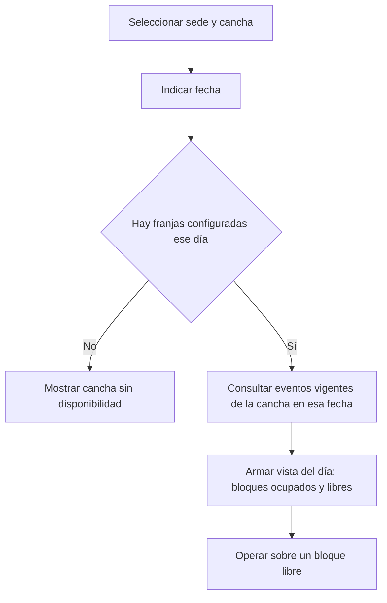
```mermaid
flowchart TD
    A[Seleccionar sede y cancha] --> B[Indicar fecha]
    B --> C{Hay franjas configuradas ese día}
    C -->|No| D[Mostrar cancha sin disponibilidad]
    C -->|Sí| E[Consultar eventos vigentes de la cancha en esa fecha]
    E --> F[Armar vista del día: bloques ocupados y libres]
    F --> G[Operar sobre un bloque libre]
```

### 3.2 Usuarios

No existe un flujo separado de "registrar usuario": toda persona gestionada por la academia se registra como usuario mediante **FL-02**, siempre con credenciales de acceso propias y con Público y Reservas otorgados automáticamente en la misma operación. Los roles Profesor y Alumno pueden asignarse ya en ese mismo alta o en cualquier momento posterior mediante **FL-07**; Alumno, además, puede otorgarse automáticamente (ver **FL-20** y 4.4). Las asignaciones referencian el catálogo fijo `roles`, sin flujos para crear, modificar o eliminar sus cinco registros.

#### FL-02. Registrar un usuario

- **Objetivo:** crear un usuario activo con credenciales de acceso, Público y Reservas, y opcionalmente Profesor o Alumno.
- **Actor:** administrador.
- **Entradas:** nombre, apellido, celular y email obligatorios; nombre de usuario y contraseña, sugeridos por el sistema y editables; fecha de nacimiento y observaciones opcionales; roles adicionales opcionales (Profesor, Alumno o ambos).

Recorrido:

1. El administrador completa nombre, apellido, celular y email.
2. El sistema sugiere un nombre de usuario formado por el apellido y la inicial del nombre, agregando un número si ya existe, y genera una contraseña alfanumérica aleatoria. Las credenciales se completan en el formulario sin enviarlo ni perder los demás datos ingresados. El administrador puede aceptarlas o reemplazarlas; en ambos casos se aplican los validadores de contraseña configurados en Django.
3. El administrador puede marcar, opcionalmente, los roles Profesor o Alumno para otorgar junto con el alta.
4. El sistema valida los campos obligatorios y la unicidad de email y nombre de usuario sin distinguir mayúsculas de minúsculas.
5. Django genera el hash PBKDF2-SHA256 de la contraseña; la base nunca recibe la contraseña en texto plano.
6. En una transacción, el sistema crea el usuario con estado **Activo** y `debe_cambiar_contrasena = true`, le asigna automáticamente **Público** y **Reservas** y, si se marcaron, los roles Profesor o Alumno seleccionados. Cada asignación guarda una clave foránea al catálogo `roles`.
7. Muestra la contraseña provisoria en texto plano una única vez, para que el administrador se la comunique a la persona.

Alternativas:

- El celular puede pertenecer a un tercero y no es único. El email y el nombre de usuario, en cambio, son siempre obligatorios y únicos sin distinguir mayúsculas de minúsculas.
- La persona debe reemplazar la contraseña provisoria en su primer inicio de sesión mediante **FL-68**. Si no la recuerda, puede establecer una propia mediante recuperación (**FL-46**).
- Administrador, Público y Reservas no pueden elegirse en este paso: Administrador se crea mediante el comando de gestión `crear_administrador`; Público y Reservas se asignan automáticamente.
- No marcar ningún rol adicional no impide asignarlo después mediante **FL-07**.
- Si se cancela antes de confirmar, no se crea el usuario.
- Este flujo es siempre un paso previo e independiente: ninguna otra operación (como crear una reserva o dar de alta una membresía) lo invoca ni registra un usuario nuevo dentro de su propio trámite. El usuario debe existir antes.

- **Resultado:** nuevo usuario activo con contraseña provisoria pendiente de reemplazo, Público, Reservas y los roles adicionales seleccionados.
- **Datos:** usuarios, usuarios_roles.

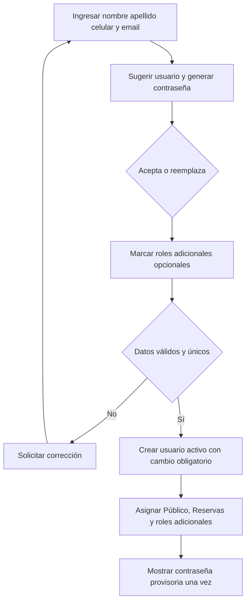
```mermaid
flowchart TD
    A[Ingresar nombre apellido celular y email] --> B[Sugerir usuario y generar contraseña]
    B --> C{Acepta o reemplaza}
    C --> D[Marcar roles adicionales opcionales]
    D --> E{Datos válidos y únicos}
    E -->|No| F[Solicitar corrección]
    F --> A
    E -->|Sí| G[Crear usuario activo con cambio obligatorio]
    G --> H[Asignar Público, Reservas y roles adicionales]
    H --> I[Mostrar contraseña provisoria una vez]
```

#### FL-03. Consultar un usuario

- **Objetivo:** localizar y visualizar la información de un usuario.
- **Actor:** administrador.
- **Entradas:** nombre, apellido, celular, email, nombre de usuario, rol, estado u otro criterio disponible.

Recorrido:

1. El administrador ingresa criterios de búsqueda.
2. El sistema muestra coincidencias activas e inactivas e identifica con una estrella a quienes tienen el rol Administrador.
3. El administrador selecciona un usuario.
4. El sistema muestra sus datos, roles y estado, nunca el hash de contraseña.

Alternativas:

- Si no hay coincidencias, informa que no se encontraron usuarios.
- Compartir celular no se considera duplicación.
- Filtrar por rol permite, por ejemplo, listar todos los usuarios con rol Alumno o Profesor.

- **Resultado:** detalle del usuario sin modificarlo.
- **Datos:** usuarios, usuarios_roles.

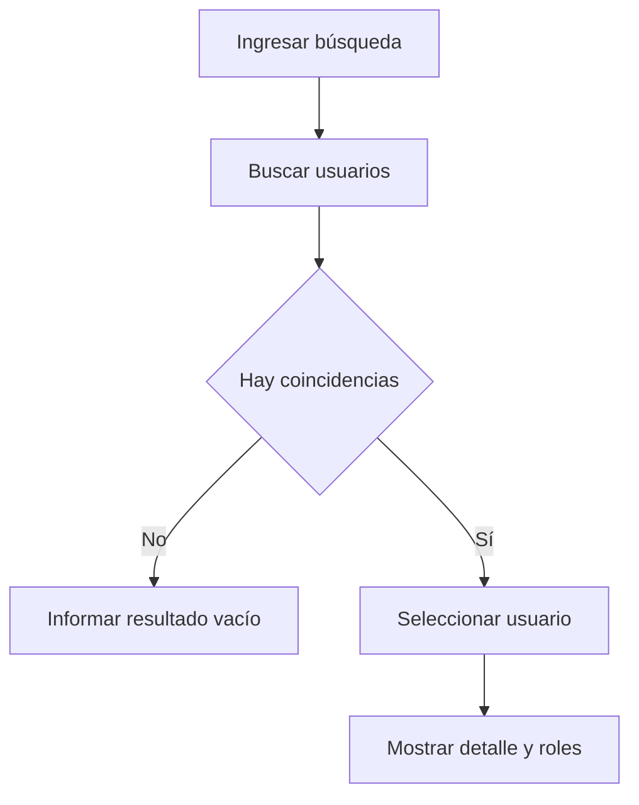
```mermaid
flowchart TD
    A[Ingresar búsqueda] --> B[Buscar usuarios]
    B --> C{Hay coincidencias}
    C -->|No| D[Informar resultado vacío]
    C -->|Sí| E[Seleccionar usuario]
    E --> F[Mostrar detalle y roles]
```

#### FL-04. Modificar el correo de un usuario

- **Objetivo:** modificar el correo de un usuario existente.
- **Actor:** administrador.
- **Precondición:** usuario localizado mediante **FL-03**.
- **Entrada:** nuevo correo.

Recorrido:

1. El sistema presenta el correo actual.
2. El administrador ingresa el nuevo correo.
3. El sistema valida el formato, que no quede vacío y que no pertenezca a otro usuario, sin distinguir mayúsculas de minúsculas.
4. Guarda el correo y actualiza la fecha de última modificación.

Alternativas:

- Este flujo no modifica los demás datos personales, el nombre de usuario, la contraseña, el estado ni los roles.
- Si el correo no es válido o ya está registrado, se informa el error sin modificar la cuenta.
- Cancelar la modificación conserva el correo anterior.

- **Resultado:** usuario con el correo actualizado.
- **Datos:** usuarios.

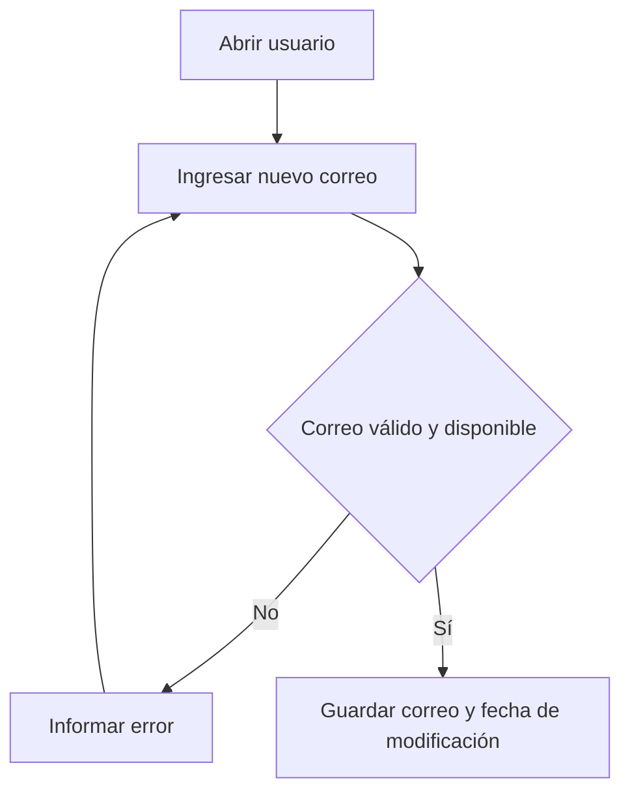
```mermaid
flowchart TD
    A[Abrir usuario] --> B[Ingresar nuevo correo]
    B --> C{Correo válido y disponible}
    C -->|No| D[Informar error]
    D --> B
    C -->|Sí| E[Guardar correo y fecha de modificación]
```

#### FL-05. Cambiar el estado de un usuario

- **Objetivo:** activar o inactivar un usuario sin eliminar su historia.
- **Actor:** administrador.
- **Precondición:** usuario localizado mediante **FL-03**.
- **Entrada:** nuevo estado.

Recorrido:

1. El administrador solicita cambiar el estado.
2. El sistema muestra el estado actual y el solicitado.
3. El administrador confirma.
4. El sistema valida que el actor no esté desactivando su propia cuenta y, si el usuario es administrador, que permanezca al menos otro administrador activo.
5. Si la cuenta queda inactiva, el sistema registra el momento actual en `fecha_baja`; si queda activa, limpia ese campo. Actualiza el estado, la fecha de baja y la fecha de última modificación dentro de la misma transacción de validación.

Alternativas:

- La inactivación no elimina clases, reservas, asistencias, membresías de usuarios, ingresos ni roles asignados.
- Reactivar la cuenta limpia `fecha_baja`; el campo representa la baja vigente, no un historial de cambios de estado.
- Un usuario inactivo no podrá iniciar sesión ni ser asignado como profesor activo, aunque conserve credenciales cargadas.
- Ningún usuario con permiso para cambiar estados puede desactivar su propia cuenta.
- El último administrador activo no puede ser desactivado. Las filas de los administradores activos se bloquean durante la validación para que dos operaciones concurrentes no puedan eludir esta regla.
- El estado ya aplicado no genera cambios.

- **Resultado:** usuario activo sin fecha de baja, o usuario inactivo con la fecha de baja registrada.
- **Datos:** usuarios.

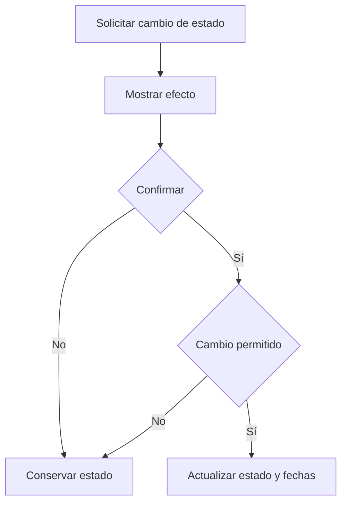
```mermaid
flowchart TD
    A[Solicitar cambio de estado] --> B[Mostrar efecto]
    B --> C{Confirmar}
    C -->|No| D[Conservar estado]
    C -->|Sí| E{Cambio permitido}
    E -->|No| D
    E -->|Sí| F[Actualizar estado y fechas]
```

#### FL-69. Restablecer la contraseña de un usuario

- **Objetivo:** reemplazar administrativamente una contraseña desconocida por una nueva contraseña provisoria.
- **Actor:** administrador.
- **Precondición:** usuario localizado mediante **FL-03**.
- **Entrada:** confirmación del restablecimiento.

Recorrido:

1. El administrador solicita restablecer la contraseña desde el detalle del usuario.
2. El sistema informa que la contraseña actual dejará de funcionar y solicita confirmación.
3. Genera una contraseña alfanumérica aleatoria que cumple los validadores configurados.
4. En una transacción, guarda solamente su hash PBKDF2-SHA256 de Django, activa `debe_cambiar_contrasena` y actualiza la fecha de última modificación.
5. Muestra la contraseña provisoria en texto plano una única vez para que el administrador se la comunique a la persona.
6. En el próximo inicio de sesión se ejecuta **FL-68**.

Alternativas:

- Cancelar la confirmación conserva la contraseña vigente.
- Ningún administrador puede restablecer su propia contraseña. Para su cuenta debe utilizar **FL-59** o, si no puede iniciar sesión, **FL-46**.
- La operación no modifica el correo, los datos personales, el estado ni los roles.
- La contraseña provisoria no se almacena ni puede volver a consultarse en texto plano.

- **Resultado:** contraseña restablecida y cambio obligatorio pendiente.
- **Datos:** usuarios.

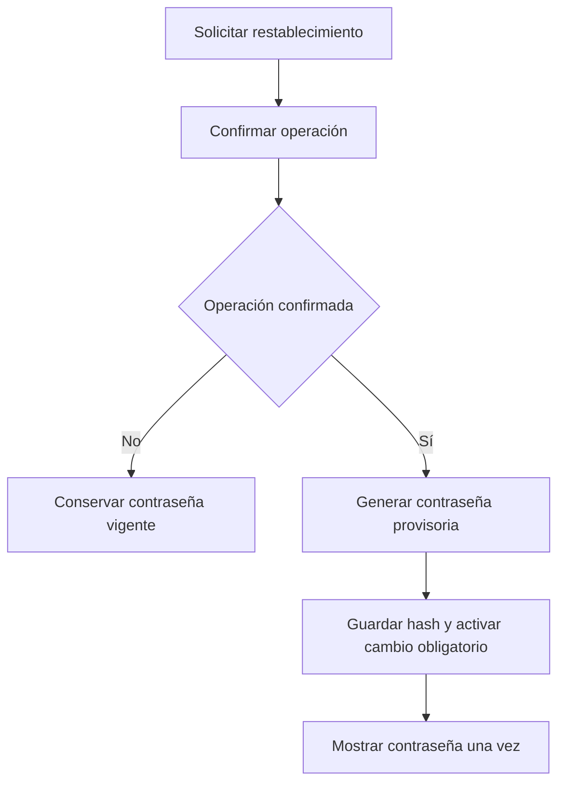
```mermaid
flowchart TD
    A[Solicitar restablecimiento] --> B[Confirmar operación]
    B --> C{Operación confirmada}
    C -->|No| D[Conservar contraseña vigente]
    C -->|Sí| E[Generar contraseña provisoria]
    E --> F[Guardar hash y activar cambio obligatorio]
    F --> G[Mostrar contraseña una vez]
```

#### FL-06. Registrarse

- **Objetivo:** crear una cuenta de usuario con credenciales propias, igual que **FL-02** pero autogestionada desde el portal.
- **Actor:** público, sin cuenta previa.
- **Entradas:** nombre, apellido, celular, email, nombre de usuario y contraseña.

Recorrido:

1. La persona completa sus datos personales y de acceso, desde el portal.
2. El sistema valida obligatorios y la unicidad de email y nombre de usuario sin distinguir mayúsculas de minúsculas.
3. Django genera el hash PBKDF2-SHA256 de la contraseña.
4. En una transacción, crea el usuario **Activo** y le asigna automáticamente **Público** y **Reservas**, igual que en **FL-02**.
5. Envía la confirmación de alta por email (ver 4.2).

Alternativas:

- Si el email o el nombre de usuario ya pertenecen a un usuario existente (por ejemplo, registrado antes por la administración mediante **FL-02**), el alta se rechaza informando que la cuenta ya existe; la persona podrá iniciar sesión con esas credenciales o recuperar la contraseña (**FL-46**) en vez de registrarse de nuevo.
- La base nunca recibe la contraseña en texto plano.

- **Resultado:** nuevo usuario activo con Público, Reservas y sesión iniciable.
- **Datos:** usuarios, usuarios_roles.

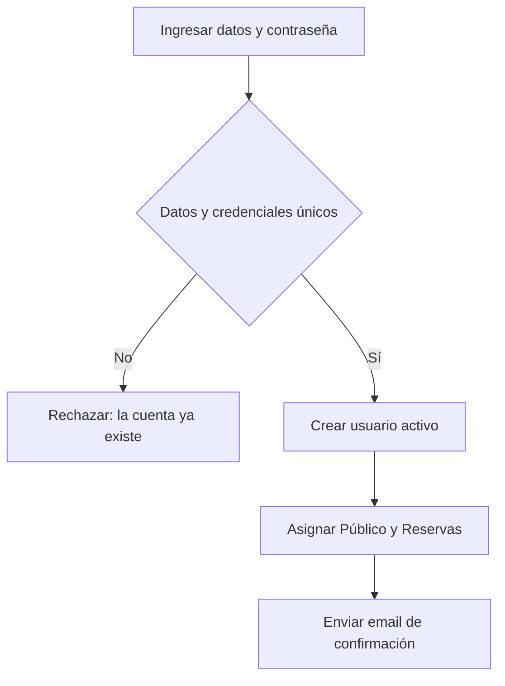
```mermaid
flowchart TD
    A[Ingresar datos y contraseña] --> B{Datos y credenciales únicos}
    B -->|No| C[Rechazar: la cuenta ya existe]
    B -->|Sí| D[Crear usuario activo]
    D --> E[Asignar Público y Reservas]
    E --> F[Enviar email de confirmación]
```

#### FL-07. Asignar o quitar un rol a un usuario

- **Objetivo:** otorgar o retirar Reservas, Profesor o Alumno a un usuario, conservando la coherencia con sus actividades y membresías.
- **Actor:** administrador.
- **Precondición:** usuario localizado mediante **FL-03**.
- **Entrada:** rol (Reservas, Profesor o Alumno) y acción (asignar o quitar).

Recorrido:

1. El administrador localiza al usuario.
2. El sistema muestra los roles vigentes del usuario.
3. El administrador elige Reservas, Profesor o Alumno y confirma asignarlo o quitarlo.
4. Si solicita quitarlo, el sistema comprueba que no existan relaciones que bloqueen el retiro: reservas propias programadas para Reservas, cualquier membresía activa para Alumno, o asignaciones activas como profesor en clases programadas para Profesor.
5. Si la operación está permitida, actualiza `usuarios_roles`. La comprobación y el retiro se realizan en una misma operación transaccional, coordinada con la creación o reactivación de las relaciones involucradas.

Alternativas:

- **Público no se puede quitar.** Se asigna automáticamente en el alta. Administrador se gestiona exclusivamente mediante comandos ejecutados por el desarrollador. Este flujo tampoco permite crear, renombrar ni eliminar registros del catálogo `roles`.
- Reservas sigue asignándose automáticamente en el alta (**FL-02**, **FL-06**), pero puede retirarse si no hay reservas propias programadas y otorgarse nuevamente mediante este flujo.
- Si el usuario tiene reservas programadas, se rechaza el retiro de Reservas. Si tiene una membresía activa, sea plan o pase, se rechaza el retiro de Alumno. Si tiene clases programadas con una asignación activa como profesor, se rechaza el retiro de Profesor.
- Ante un rechazo, se informa la causa, se conserva el rol y no se cancelan ni modifican las relaciones que lo bloquean. Los estados registrados determinan el bloqueo; una fecha pasada por sí sola no lo libera.
- El rol Alumno también puede otorgarse automáticamente mediante **FL-20** o 4.4, además de por este flujo; ambas vías conviven sin conflicto.
- Quitar Reservas, Profesor o Alumno no elimina el historial de reservas, membresías, clases ni asistencia. Las reservas y clases canceladas o completadas y las membresías vencidas o canceladas no bloquean por sí solas el retiro.
- Asignar un rol ya vigente, o quitar uno que el usuario no tiene, no genera cambios.

- **Resultado:** asignación actualizada, o retiro rechazado conservando el rol y sus relaciones.
- **Datos:** usuarios_roles, roles, reservas, membresias_usuarios, clases_profesores, clases y eventos.

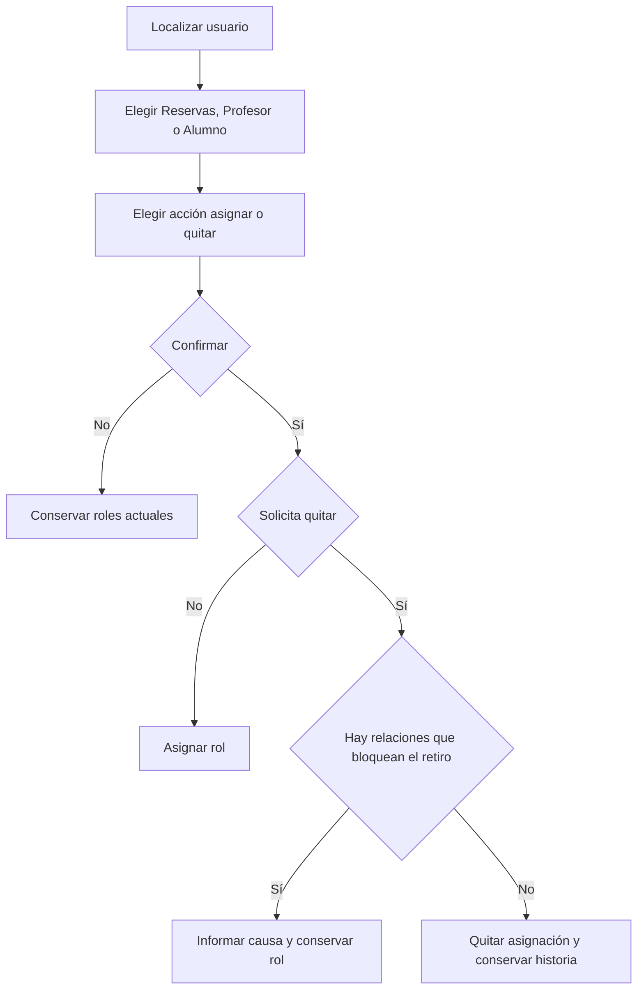
```mermaid
flowchart TD
    A[Localizar usuario] --> B[Elegir Reservas, Profesor o Alumno]
    B --> C[Elegir acción asignar o quitar]
    C --> D{Confirmar}
    D -->|No| E[Conservar roles actuales]
    D -->|Sí| F{Solicita quitar}
    F -->|No| G[Asignar rol]
    F -->|Sí| H{Hay relaciones que bloquean el retiro}
    H -->|Sí| I[Informar causa y conservar rol]
    H -->|No| J[Quitar asignación y conservar historia]
```

### 3.3 Sedes y canchas

#### FL-08. Consultar sedes y canchas

- **Objetivo:** visualizar las sedes y sus canchas asociadas.
- **Actor:** administrador.
- **Entradas:** filtros opcionales por nombre, estado o superficie.

Recorrido:

1. El administrador accede a la consulta.
2. El sistema muestra las sedes.
3. Al seleccionar una sede, muestra sus canchas, superficies y estados.

Alternativas:

- Una sede sin canchas muestra una lista vacía.
- La consulta puede incluir registros inactivos.

- **Resultado:** jerarquía de sedes y canchas sin modificaciones.
- **Datos:** sedes y canchas.

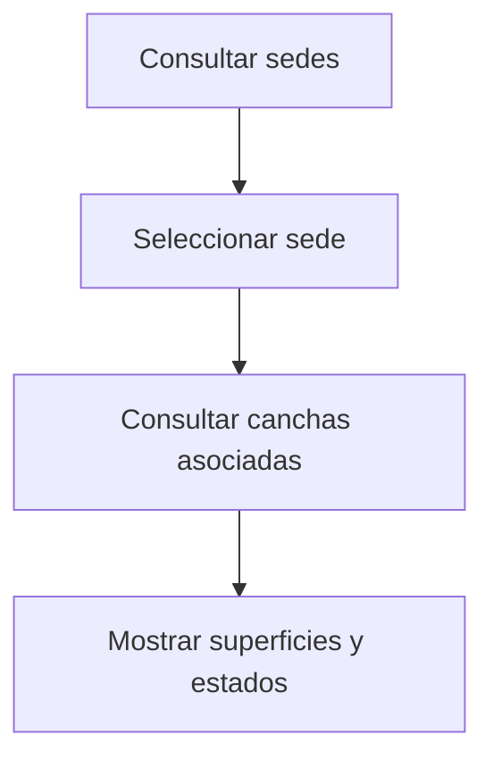
```mermaid
flowchart TD
    A[Consultar sedes] --> B[Seleccionar sede]
    B --> C[Consultar canchas asociadas]
    C --> D[Mostrar superficies y estados]
```

#### FL-09. Registrar una sede

- **Objetivo:** crear una sede activa.
- **Actor:** administrador.
- **Entradas:** nombre y dirección obligatorios; observaciones opcionales.

Recorrido:

1. El administrador completa los datos.
2. El sistema valida que el nombre no esté vacío ni repetido, sin distinguir mayúsculas de minúsculas.
3. Crea la sede con estado **Activa**.

Alternativas:

- Registrar la sede no crea canchas ni horario de funcionamiento automáticamente: hasta configurarlo mediante **FL-58**, la sede queda sin franjas y no funciona ningún día.

- **Resultado:** nueva sede activa.
- **Datos:** sedes.

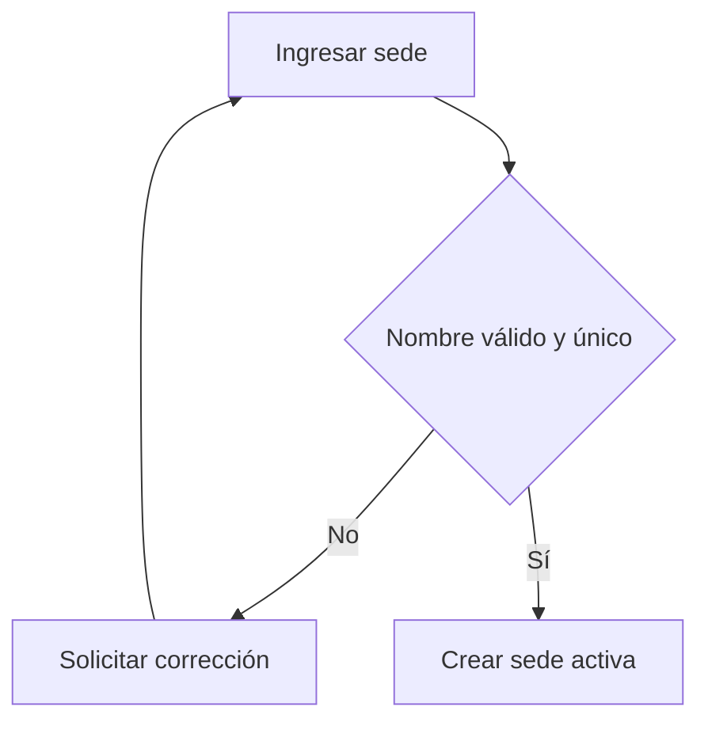
```mermaid
flowchart TD
    A[Ingresar sede] --> B{Nombre válido y único}
    B -->|No| C[Solicitar corrección]
    C --> A
    B -->|Sí| D[Crear sede activa]
```

#### FL-10. Actualizar una sede

- **Objetivo:** modificar nombre, dirección u observaciones de una sede.
- **Actor:** administrador.
- **Precondición:** sede seleccionada mediante **FL-08**.

Recorrido:

1. El sistema presenta los datos actuales.
2. El administrador realiza cambios.
3. El sistema valida que el nombre sea único sin distinguir mayúsculas de minúsculas.
4. Guarda la sede.

Alternativas:

- Este flujo no cambia el estado ni modifica canchas.

- **Resultado:** sede actualizada.
- **Datos:** sedes.

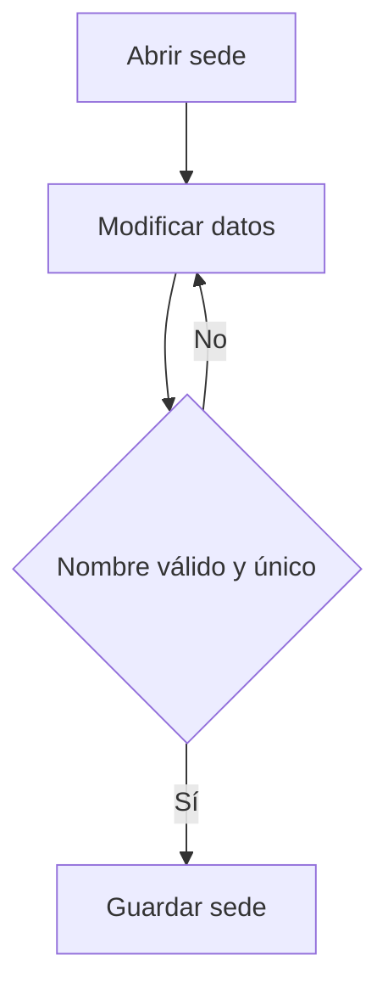
```mermaid
flowchart TD
    A[Abrir sede] --> B[Modificar datos]
    B --> C{Nombre válido y único}
    C -->|No| B
    C -->|Sí| D[Guardar sede]
```

#### FL-11. Cambiar el estado de una sede

- **Objetivo:** activar o inactivar una sede conservando su historia.
- **Actor:** administrador.
- **Precondición:** sede seleccionada mediante **FL-08**.

Recorrido:

1. El administrador solicita el nuevo estado.
2. El sistema muestra las canchas asociadas y el impacto operativo.
3. El administrador confirma.
4. El sistema actualiza el estado de la sede.

Alternativas:

- La operación no elimina ni cambia automáticamente el estado de sus canchas.
- Una sede inactiva no se ofrece para nuevas actividades.

- **Resultado:** sede activa o inactiva.
- **Datos:** sedes y canchas para informar impacto.

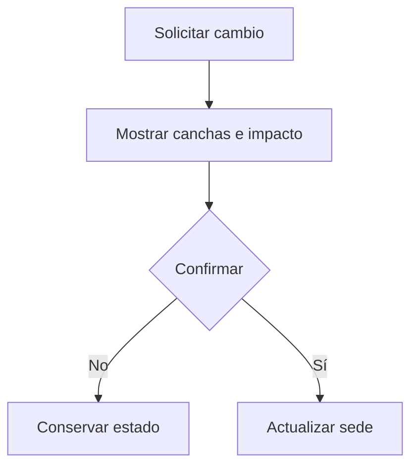
```mermaid
flowchart TD
    A[Solicitar cambio] --> B[Mostrar canchas e impacto]
    B --> C{Confirmar}
    C -->|No| D[Conservar estado]
    C -->|Sí| E[Actualizar sede]
```

#### FL-12. Registrar una cancha

- **Objetivo:** crear una cancha activa dentro de una sede.
- **Actor:** administrador.
- **Entradas:** sede, nombre, superficie; observaciones opcionales.
- **Precondición:** sede activa seleccionada mediante **FL-08**.

Recorrido:

1. El administrador completa los datos.
2. El sistema valida superficie y nombre único dentro de la sede sin distinguir mayúsculas de minúsculas.
3. Crea la cancha con estado **Activa**.

Alternativas:

- La superficie debe ser **Cemento** o **Polvo de ladrillo**.

- **Resultado:** nueva cancha activa.
- **Datos:** sedes y canchas.

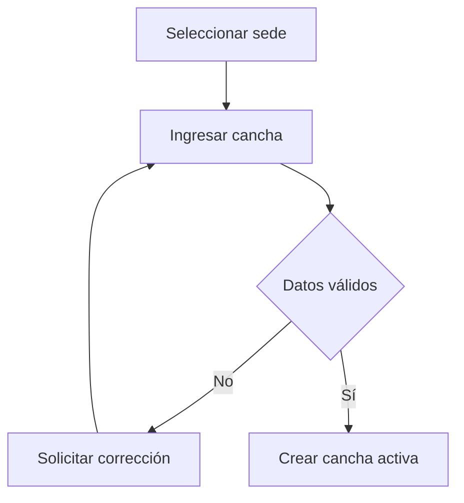
```mermaid
flowchart TD
    A[Seleccionar sede] --> B[Ingresar cancha]
    B --> C{Datos válidos}
    C -->|No| D[Solicitar corrección]
    D --> B
    C -->|Sí| E[Crear cancha activa]
```

#### FL-13. Actualizar una cancha

- **Objetivo:** modificar nombre, superficie u observaciones de una cancha.
- **Actor:** administrador.
- **Precondición:** cancha seleccionada mediante **FL-08**.

Recorrido:

1. El sistema presenta los datos actuales.
2. El administrador realiza cambios.
3. El sistema valida superficie y nombre único dentro de la sede sin distinguir mayúsculas de minúsculas.
4. Guarda la cancha.

Alternativas:

- Este flujo no cambia el estado de la cancha.
- La sede de contexto determina el ámbito del nombre.

- **Resultado:** cancha actualizada.
- **Datos:** canchas y sedes.

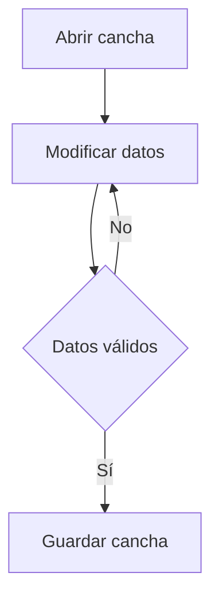
```mermaid
flowchart TD
    A[Abrir cancha] --> B[Modificar datos]
    B --> C{Datos válidos}
    C -->|No| B
    C -->|Sí| D[Guardar cancha]
```

#### FL-14. Cambiar el estado de una cancha

- **Objetivo:** activar o inactivar una cancha conservando su historia.
- **Actor:** administrador.
- **Precondición:** cancha seleccionada mediante **FL-08**.

Recorrido:

1. El administrador solicita el nuevo estado.
2. El sistema muestra el impacto sobre nuevas actividades.
3. El administrador confirma.
4. El sistema actualiza el estado.

Alternativas:

- Una cancha inactiva no se ofrece para nuevas clases, reservas o turnos de planilla.
- Las actividades históricas conservan la referencia.

- **Resultado:** cancha activa o inactiva.
- **Datos:** canchas.

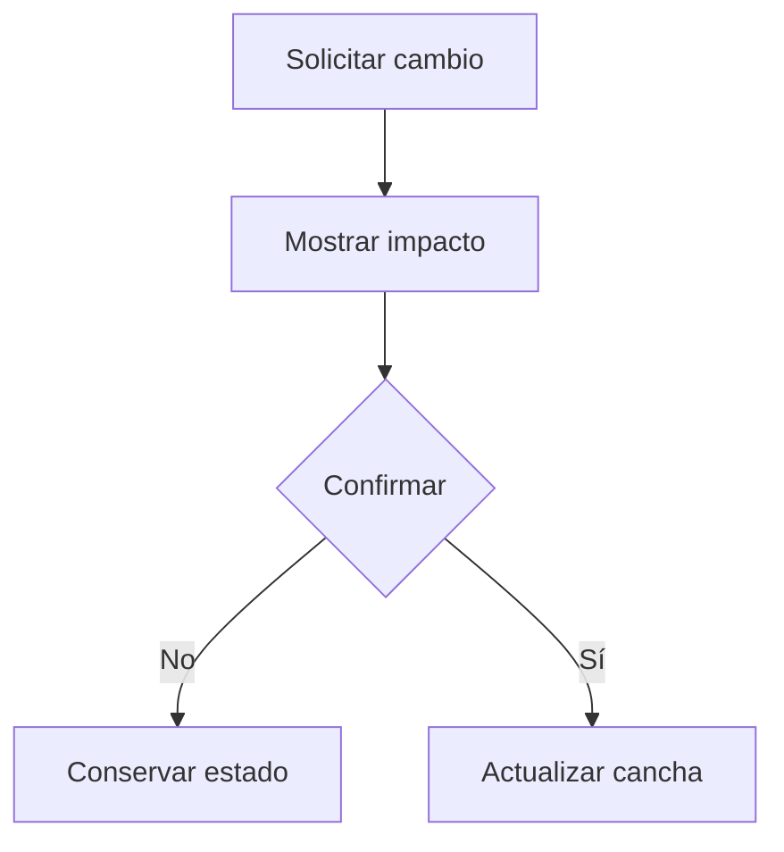
```mermaid
flowchart TD
    A[Solicitar cambio] --> B[Mostrar impacto]
    B --> C{Confirmar}
    C -->|No| D[Conservar estado]
    C -->|Sí| E[Actualizar cancha]
```

#### FL-57. Consultar el horario de funcionamiento de una sede

- **Objetivo:** visualizar los días y franjas horarias en los que una sede funciona.
- **Actores:** administrador; cualquier persona, sin necesidad de cuenta, desde el portal.
- **Entradas:** sede.

Recorrido:

1. El actor selecciona una sede, entre las activas mediante **FL-08** o directamente en el portal.
2. El sistema muestra los siete días de la semana con sus franjas habilitadas, cuando las tiene.
3. Un día sin franjas configuradas se muestra sin funcionamiento.

Alternativas:

- Esta consulta muestra el horario general de la sede, no la ocupación real de cada cancha; para disponibilidad concreta ver **FL-01**.
- Este horario rige tanto para clases como para reservas, aunque con distinta exigencia según quién actúa (ver **FL-28**, **FL-34**, **FL-40** y **FL-51**).

- **Resultado:** horario semanal de funcionamiento de la sede consultado sin modificaciones.
- **Datos:** sedes y horarios de sede.

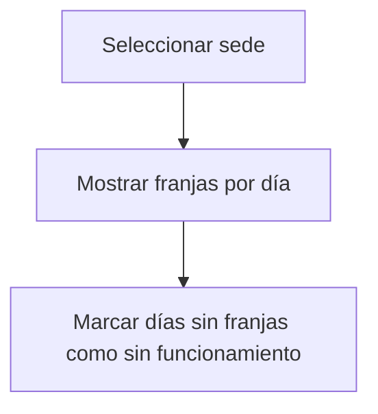
```mermaid
flowchart TD
    A[Seleccionar sede] --> B[Mostrar franjas por día]
    B --> C[Marcar días sin franjas como sin funcionamiento]
```

#### FL-58. Configurar el horario de funcionamiento de una sede

- **Objetivo:** definir o modificar, para un día de la semana, hasta dos franjas horarias en las que la sede funciona.
- **Actor:** administrador.
- **Precondición:** sede localizada mediante **FL-08**.
- **Entradas:** día de la semana y, para ese día, ninguna, una o dos franjas horarias (hora de inicio y fin de cada una).

Recorrido:

1. El administrador selecciona la sede y un día de la semana, mediante **FL-57**.
2. Ingresa la primera franja y, opcionalmente, una segunda.
3. El sistema valida que cada franja tenga el fin posterior al inicio y que, si hay dos, no se superpongan.
4. El administrador confirma y el sistema guarda la configuración de ese día, reemplazando la anterior si existía.

Alternativas:

- Guardar el día sin ninguna franja lo deja sin funcionamiento ese día, tanto para reservas como para clases.
- Este horario es independiente de la planilla (ver **FL-23** a **FL-26**): configurarlo no crea, modifica ni elimina turnos de planilla. Sí afecta la generación de clases (**FL-28**, **FL-29**) y la creación o el cambio de cancha de clases, y la creación o reprogramación de reservas, que lo validan en el momento (ver **FL-34**, **FL-35**, **FL-40**, **FL-51**).
- Cambiar el horario no afecta clases ni reservas ya creadas; solo rige para actividades nuevas a partir de ese momento.

- **Resultado:** horario de funcionamiento de la sede, para ese día, actualizado.
- **Datos:** sedes y horarios de sede.

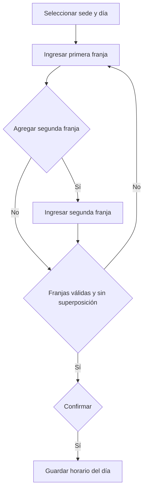
```mermaid
flowchart TD
    A[Seleccionar sede y día] --> B[Ingresar primera franja]
    B --> C{Agregar segunda franja}
    C -->|Sí| D[Ingresar segunda franja]
    C -->|No| E{Franjas válidas y sin superposición}
    D --> E
    E -->|No| B
    E -->|Sí| F{Confirmar}
    F -->|Sí| G[Guardar horario del día]
```

### 3.4 Membresías

#### FL-15. Consultar membresías

- **Objetivo:** visualizar membresías de planes y pases.
- **Actores:** administrador, sin restricción de estado; usuario autenticado con rol Público, desde el catálogo del portal y limitado a membresías **Activas**.
- **Entradas:** filtros opcionales por nombre, subtipo, modalidad o estado.

Recorrido:

1. El sistema aplica los filtros.
2. Muestra datos comunes, configuración específica y precio vigente.
3. El actor puede abrir el detalle.

Alternativas:

- Desde el catálogo del portal, solo se listan membresías **Activas** y no se ofrece filtro de estado.
- Un pase libre y un pase de fin de semana se listan como membresías distintas, cada una con su propio precio.

- **Resultado:** membresías consultadas sin modificaciones.
- **Datos:** membresías, planes y pases.

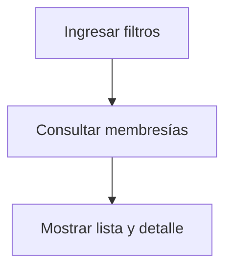
```mermaid
flowchart TD
    A[Ingresar filtros] --> B[Consultar membresías]
    B --> C[Mostrar lista y detalle]
```

#### FL-16. Registrar una membresía

- **Objetivo:** crear una membresía activa con exactamente un subtipo.
- **Actor:** administrador.
- **Entradas:** nombre, descripción, precio vigente y configuración de plan o pase.

Recorrido:

1. El administrador elige plan o pase y completa los datos.
2. El sistema valida nombre y configuración.
3. En una transacción crea la membresía y su subtipo.

Alternativas:

- Un plan exige modalidad, frecuencia entre uno y siete y una o dos clases por encuentro.
- Un pase exige su tipo (libre o fin de semana), límite diario positivo y precio por invitado no negativo. El tipo fija qué días habilita: no es un dato configurable aparte.

- **Resultado:** membresía activa con un único subtipo.
- **Datos:** membresías, planes o pases.

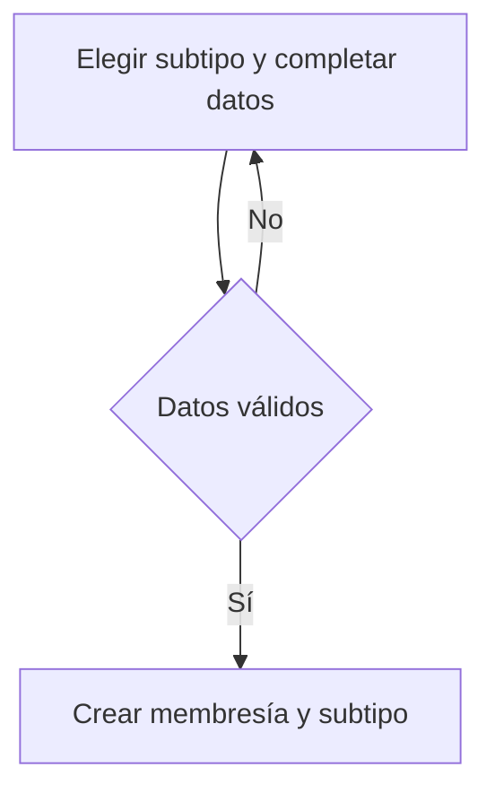
```mermaid
flowchart TD
    A[Elegir subtipo y completar datos] --> B{Datos válidos}
    B -->|No| A
    B -->|Sí| C[Crear membresía y subtipo]
```

#### FL-17. Actualizar una membresía

- **Objetivo:** modificar información comercial permitida.
- **Actor:** administrador.
- **Precondición:** membresía localizada mediante **FL-15**.

Recorrido:

1. El sistema informa si existe uso histórico.
2. El administrador modifica nombre, descripción o precio.
3. Sin uso histórico también puede modificar la configuración estructural.
4. El sistema valida y guarda.

Alternativas:

- Con uso histórico no se cambia subtipo ni estructura.
- Cambiar el precio no modifica membresías de usuarios existentes.

- **Resultado:** membresía actualizada.
- **Datos:** membresías, subtipos y membresías de usuarios.

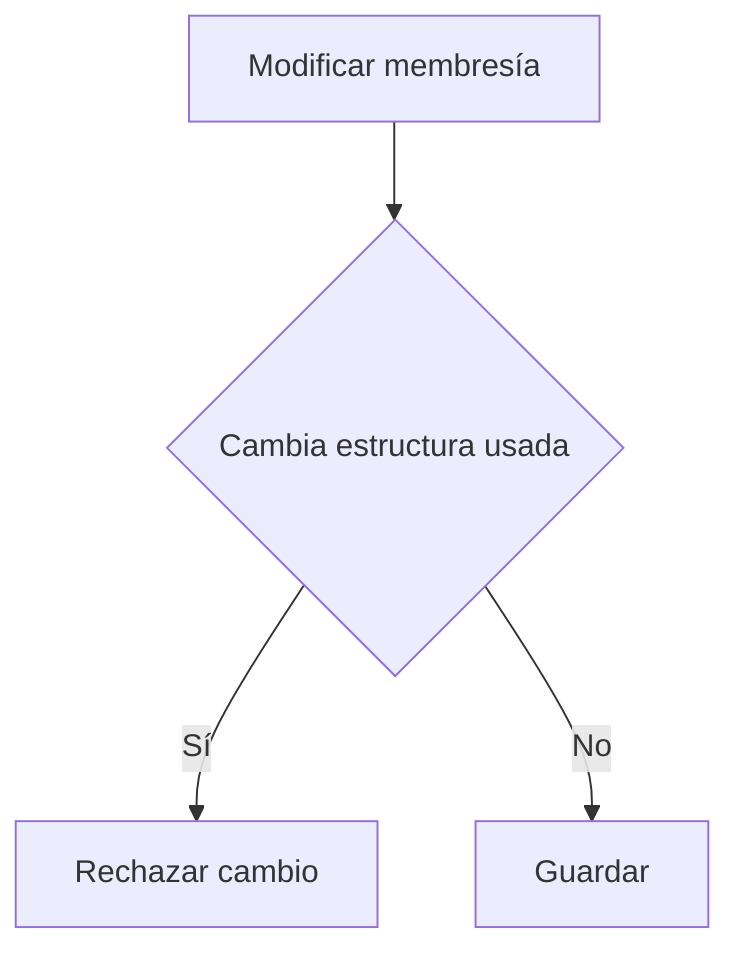
```mermaid
flowchart TD
    A[Modificar membresía] --> B{Cambia estructura usada}
    B -->|Sí| C[Rechazar cambio]
    B -->|No| D[Guardar]
```

#### FL-18. Cambiar el estado de una membresía

- **Objetivo:** activar o inactivar una membresía sin alterar su historia.
- **Actor:** administrador.
- **Precondición:** membresía localizada mediante **FL-15**.

Recorrido:

1. El administrador utiliza la acción **Activar** o **Desactivar** de la membresía, separada de la edición de sus datos comerciales.
2. El sistema muestra el impacto.
3. Al confirmar, actualiza el estado.

- Inactivar no cancela membresías de usuarios existentes.
- Una membresía inactiva no admite nuevas altas.

- **Resultado:** estado actualizado.
- **Datos:** membresías.

```mermaid
flowchart TD
    A[Solicitar cambio] --> B{Confirmar}
    B -->|No| C[Conservar]
    B -->|Sí| D[Actualizar estado]
```

### 3.5 Membresías de usuarios

#### FL-19. Consultar una membresía de usuario

- **Objetivo:** visualizar período, precio, estado, ingresos y usos de una membresía.
- **Actores:** administrador; usuario con rol alumno, limitado a sus propias membresías, desde el portal.
- **Entradas:** usuario, membresía, período o estado; un alumno no ingresa criterios, ve directamente las suyas.

Recorrido:

1. El sistema busca coincidencias, o directamente las membresías del usuario autenticado si el actor es un alumno.
2. El actor selecciona una.
3. Muestra detalle, ingresos y, para pases, reservas donde fue aplicado.

Alternativas:

- Un alumno solo ve sus propias membresías, en modo de solo lectura.

- **Resultado:** detalle consultado.
- **Datos:** usuarios, membresías de usuarios, ingresos y reservas.

```mermaid
flowchart TD
    A[Ingresar criterios] --> B[Buscar membresías de usuarios]
    B --> C[Mostrar detalle]
```

#### FL-20. Registrar una membresía para un usuario

- **Objetivo:** dar de alta una membresía mensual para un usuario.
- **Actor:** administrador.
- **Entradas:** usuario, membresía activa, mes cubierto, fecha de alta y observaciones.

Recorrido:

1. El administrador selecciona usuario, membresía y mes.
2. El sistema propone el primer y último día del mes.
3. Copia el precio vigente como precio aplicado.
4. El administrador confirma y, en una transacción que serializa las altas del mismo usuario, el sistema crea la membresía **Activa**, salvo que el mes ya haya finalizado, en cuyo caso nace **Vencida**; si se trata de un plan y el usuario todavía no tiene el rol Alumno, se lo otorga automáticamente.

Alternativas:

- Un usuario no puede tener más de un plan mensual vigente en el mismo período, ni más de un pase vigente (cualquiera sea su variante); sí puede combinar un plan con un pase (ver `1_organizacion.md`, 4).
- El mes debe estar comprendido entre agosto de 2026 y el mes calendario siguiente al actual.
- El ingreso se registra por separado mediante **FL-43**.

- **Resultado:** membresía de usuario activa y rol Alumno otorgado si el usuario todavía no lo tenía.
- **Datos:** usuarios, membresías, membresías de usuarios y usuarios_roles.

```mermaid
flowchart TD
    A[Seleccionar usuario membresía y mes] --> B[Proponer período y precio]
    B --> C{Confirmar}
    C -->|Sí| D[Crear membresía de usuario]
    D --> E{Ya tiene rol alumno}
    E -->|No| F[Otorgar rol alumno]
    E -->|Sí| G[Finalizar]
    F --> G
```

#### FL-21. Cancelar una membresía de usuario

- **Objetivo:** impedir nuevos usos sin eliminar la historia.
- **Actor:** administrador.
- **Precondición:** membresía activa localizada mediante **FL-19**.

Recorrido:

1. El sistema muestra usos e ingresos asociados.
2. El administrador confirma la cancelación.
3. Cambia el estado a **Cancelada**.

Alternativas:

- No se anulan ingresos ni reservas existentes.
- Una membresía cancelada no cubre nuevos usos.

- **Resultado:** membresía de usuario cancelada.
- **Datos:** membresías de usuarios, ingresos y reservas.

```mermaid
flowchart TD
    A[Solicitar cancelación] --> B[Mostrar impacto]
    B --> C{Confirmar}
    C -->|No| D[Conservar activa]
    C -->|Sí| E[Marcar cancelada]
```

#### FL-22. Suscribirse a una membresía o pase

- **Objetivo:** iniciar, desde el portal, el pago online de una membresía a través de MercadoPago, para uno mismo.
- **Actor:** usuario autenticado con rol Público.
- **Entradas:** membresía activa elegida, mes a cubrir.

Recorrido:

1. El usuario elige una membresía del catálogo (**FL-15**) y el mes a cubrir.
2. El sistema valida que el usuario no tenga ya una membresía vigente incompatible para ese mes: no más de un plan, ni más de un pase (cualquiera sea su variante), mismo criterio que **FL-20**.
3. Calcula el precio: si la membresía elegida es un plan, aplica el descuento o recargo vigente por fecha de pago (`1_organizacion.md`, 3.1); si es un pase, usa directamente su `precio_vigente`, sin ajuste.
4. Busca si el usuario ya tiene un intento propio en estado **Pendiente** para esa misma membresía y mes.
   - Si existe, redirige directamente a su Checkout ya creado (mismo `preference_id`, mismo precio ya congelado en su momento), sin generar una preferencia nueva.
   - Si no existe, genera una referencia propia (`referencia_externa`) y llama a la API de MercadoPago para crear la preferencia de pago, enviándola como `external_reference`.
     - Si la llamada falla, no persiste nada e informa el error; el usuario puede reintentar.
     - Si tiene éxito, crea el intento en `pagos_mercadopago` en estado **Pendiente**, con el precio ya calculado y el `preference_id` recibido, y redirige al usuario al Checkout de MercadoPago.
5. El usuario completa el pago en la plataforma de MercadoPago.
6. El sistema queda a la espera de la confirmación del pago (ver 4.4); no activa nada hasta recibirla.

Alternativas:

- Si el usuario abandona el checkout sin pagar, el intento queda **Pendiente** sin confirmar; no se crea membresía de usuario ni ingreso.
- Este flujo no admite pago parcial: el monto a cobrar es el precio calculado completo.
- A diferencia de **FL-20**, este flujo no crea la membresía de forma inmediata: solo la confirmación del pago (4.4) la activa.
- El intento en `pagos_mercadopago` solo se crea después de que MercadoPago confirma la preferencia: no queda ningún registro de intentos que ni siquiera llegaron a generar una preferencia.
- Un usuario no puede tener dos intentos **Pendientes** simultáneos para la misma membresía y mes (`3_modelo_relacional.md`, 4.23): esto evita que un doble clic, dos pestañas o dos dispositivos generen dos preferencias pagables para el mismo cobro.

- **Resultado:** pago iniciado en MercadoPago, pendiente de confirmación.
- **Datos:** pagos_mercadopago.

```mermaid
flowchart TD
    A[Elegir membresía y mes] --> B{Membresía vigente incompatible}
    B -->|Sí| Z[Rechazar]
    B -->|No| C[Calcular precio según plan o pase]
    C --> E{Ya existe un intento propio Pendiente para esa membresía y mes}
    E -->|Sí| H[Redirigir al Checkout ya creado]
    E -->|No| D{Preferencia creada en MercadoPago}
    D -->|No| F[Informar error, no persiste nada]
    D -->|Sí| G[Crear intento pendiente con precio y preference_id]
    G --> H
    H --> I[Esperar confirmación del pago]
```

### 3.6 Planilla y generación de clases

La planilla semanal de una cancha es única y viva (ver `1_organizacion.md`, 2.1 y `2_criterios_del_sistema.md`, 2.1): no existen versiones por período, ni un estado de "en preparación" o "confirmada". Editar la planilla no crea ni modifica clases por sí solo; generar clases para un período (**FL-28**) es la única operación que lee la planilla y crea clases concretas a partir de ella.

#### FL-23. Consultar la planilla de una cancha

- **Objetivo:** visualizar los turnos vigentes de la planilla semanal de una cancha.
- **Actor:** administrador.
- **Entradas:** sede y luego cancha.

Recorrido:

1. El administrador selecciona una sede y luego una de sus canchas activas.
2. El sistema muestra la grilla semanal con los turnos vigentes: día, horario, modalidad, profesores y alumnos previstos.
3. El administrador puede seleccionar un turno para ejecutar **FL-25** o **FL-26**, o crear uno nuevo mediante **FL-24**.

Alternativas:

- Una cancha sin turnos muestra la grilla vacía.

- **Resultado:** grilla semanal consultada sin modificaciones.
- **Datos:** canchas, turnos de planilla y sus profesores y usuarios previstos.

```mermaid
flowchart TD
    A[Seleccionar sede y cancha] --> B[Mostrar grilla semanal]
    B --> C{Selecciona turno}
    C -->|Sí| D[Ofrecer FL-25 o FL-26]
    C -->|No| E[Ofrecer FL-24]
```

#### FL-24. Crear un turno de planilla

- **Objetivo:** ocupar una celda de la planilla semanal de una cancha.
- **Actor:** administrador.
- **Precondición:** cancha activa seleccionada mediante **FL-23**.
- **Entradas:** día de la semana, horario, modalidad opcional, observaciones opcionales, profesores y alumnos previstos.

Recorrido:

1. El administrador selecciona una celda vacía (día y horario) de la cancha.
2. Ingresa modalidad, observaciones y profesores y alumnos previstos.
3. El sistema valida que no exista ya un turno para esa cancha, día y horario.
4. Guarda el turno y sus asignaciones.

Alternativas:

- Un turno puede guardarse sin profesor previsto; la generación de clases (**FL-28**) omitirá e informará los turnos sin profesor al momento de generar.
- No puede haber dos turnos para la misma cancha, día y horario.

- **Resultado:** nuevo turno visible en la grilla.
- **Datos:** turnos de planilla y sus profesores y usuarios previstos.

```mermaid
flowchart TD
    A[Seleccionar celda vacía] --> B[Ingresar datos y asignaciones]
    B --> C{Celda disponible}
    C -->|No| D[Informar duplicación]
    C -->|Sí| E[Guardar turno]
```

#### FL-25. Modificar un turno de planilla

- **Objetivo:** cambiar modalidad, observaciones, profesores o alumnos previstos de un turno, sin moverlo.
- **Actor:** administrador.
- **Precondición:** turno seleccionado mediante **FL-23**.

Recorrido:

1. El sistema muestra los datos del turno.
2. El administrador modifica modalidad, observaciones, profesores o alumnos previstos.
3. El sistema guarda los cambios.

Alternativas:

- La cancha, el día y el horario de un turno guardado no se modifican; para reubicarlo se ejecutan **FL-26** y luego **FL-24**.
- Los cambios no alteran clases ya generadas: para que una clase generada refleje el cambio hace falta regenerar el período (**FL-29**).

- **Resultado:** turno actualizado.
- **Datos:** turnos de planilla y sus profesores y usuarios previstos.

```mermaid
flowchart TD
    A[Abrir turno] --> B[Modificar datos o asignaciones]
    B --> C{Datos válidos}
    C -->|No| B
    C -->|Sí| D[Guardar turno]
```

#### FL-26. Quitar un turno de planilla

- **Objetivo:** retirar una celda de la planilla.
- **Actor:** administrador.
- **Precondición:** turno seleccionado mediante **FL-23**.

Recorrido:

1. El administrador solicita quitar el turno.
2. El sistema muestra sus profesores y alumnos previstos, y advierte si ya generó clases.
3. El administrador confirma.
4. El sistema elimina el turno y sus asignaciones.

Alternativas:

- Las clases ya generadas desde ese turno no se eliminan: conservan su historia y quedan sin turno de origen.

- **Resultado:** celda libre en la planilla.
- **Datos:** turnos de planilla, sus asignaciones, y clases (desvinculación de origen).

```mermaid
flowchart TD
    A[Solicitar quitar turno] --> B[Mostrar datos y clases ya generadas]
    B --> C{Confirmar}
    C -->|No| D[Conservar turno]
    C -->|Sí| E[Eliminar turno de la grilla]
```

#### FL-27. Gestionar feriados

- **Objetivo:** registrar o quitar una fecha sin dictado de clases, válida para todas las sedes por igual.
- **Actor:** administrador.
- **Entradas:** fecha y descripción.

Recorrido:

1. El administrador ingresa fecha y descripción.
2. El sistema valida que no exista ya un feriado para esa fecha.
3. Guarda el feriado.

Alternativas:

- Un feriado no puede registrarse por sede: rige siempre para todas las sedes.
- Su fecha debe estar comprendida entre el 01/08/2026 y cinco años después de la fecha local actual.
- Quitar un feriado ya registrado lo elimina sin afectar clases ya generadas.
- Un feriado no cancela clases ya generadas: solo evita que se generen nuevas ese día (ver **FL-28**).

- **Resultado:** feriado registrado o quitado.
- **Datos:** feriados.

```mermaid
flowchart TD
    A[Ingresar o seleccionar feriado] --> B{Registrar o quitar}
    B -->|Registrar| C{Fecha libre}
    C -->|No| D[Rechazar duplicado]
    C -->|Sí| E[Guardar feriado]
    B -->|Quitar| F[Eliminar feriado]
```

#### FL-28. Generar clases para un período

- **Objetivo:** crear las clases concretas de una sede para un rango de fechas, a partir del estado actual de la planilla.
- **Actor:** administrador.
- **Entradas:** sede y rango de fechas.

Recorrido:

1. El administrador selecciona sede y período.
2. El sistema recorre los turnos de planilla de las canchas de esa sede y calcula, para cada uno, las fechas del período que coinciden con su día de la semana, obteniendo así la lista completa de turnos candidatos del período. Para cada fecha candidata, la omite y la lista en la vista previa cuando: es feriado (**FL-27**); ya hay un evento **no cancelado** en esa cancha y horario (un evento cancelado no ocupa el turno: se trata como libre y se genera la clase igual); algún profesor previsto tiene otra actividad no cancelada superpuesta con ese horario, sin importar la cancha, **ya sea contra un evento ya existente o contra otro turno candidato de esta misma corrida** (comparando los candidatos entre sí en un orden estable, por cancha y horario, y omitiendo el que aparezca después cuando dos candidatos del mismo profesor se superponen); o la sede o la cancha están inactivas. Si algún alumno previsto tiene otra actividad no cancelada superpuesta, la fecha **no** se omite: se genera igual y queda como advertencia.
3. Muestra una vista previa: cuántas clases se crearán, qué fechas se omiten y por qué (feriado, conflicto de cancha, conflicto de profesor, sede o cancha inactiva), qué alumnos previstos quedan con advertencia de superposición, y cuáles de las clases a crear caen fuera del horario de funcionamiento de la sede (**FL-57**) para ese día.
4. El sistema advierte, en dos confirmaciones explícitas y sucesivas, que la generación no puede deshacerse, que para quitar clases generadas hace falta eliminarlas manualmente (**FL-30**) o regenerar el período (**FL-29**), y que las clases fuera de horario y con alumnos superpuestos listadas en la vista previa se crearán igual.
5. El administrador confirma ambas veces.
6. En una transacción, crea un evento de una hora y su clase, con indicador de generada por planilla, para cada fecha válida.
7. Envía una notificación por email a cada profesor con turnos incluidos en la generación, resumiendo sus clases del período (ver 4.2).

Alternativas:

- El rango debe estar dentro del calendario operativo y abarcar como máximo 62 días corridos inclusive; para generar un período mayor se ejecuta el proceso por tramos.
- Un turno sin profesor previsto se omite e informa, igual que un conflicto de cancha, un conflicto de profesor, una sede o cancha inactiva, o un feriado.
- Un conflicto de profesor entre dos turnos candidatos de la misma corrida (por ejemplo, el mismo profesor previsto a la misma hora en dos canchas distintas de la planilla) se resuelve igual que contra datos ya existentes: se detecta antes de crear nada, no se delega en la restricción de la base de datos, que de otro modo abortaría toda la transacción del paso 6 en lugar de omitir solo ese turno.
- Un turno fuera del horario de funcionamiento de la sede no se omite: solo se lista en la vista previa. Las dos confirmaciones del paso 4 ya cubren esa advertencia, porque toda la generación es responsabilidad del administrador.
- Correr esta operación dos veces sobre el mismo rango no duplica nada: las fechas ya cubiertas por un evento no cancelado se omiten en la segunda corrida.
- La operación no admite deshacer automático.

- **Resultado:** clases concretas creadas para el período, con las fechas omitidas y las advertencias informadas.
- **Datos:** turnos de planilla, feriados, horarios de sede, eventos y clases.

```mermaid
flowchart TD
    A[Seleccionar sede y período] --> B[Expandir turnos a fechas]
    B --> C[Omitir feriados, conflictos de cancha o profesor, y sedes o canchas inactivas]
    C --> D[Mostrar vista previa con omisiones y advertencias]
    D --> E{Primera confirmación}
    E -->|No| F[Cancelar]
    E -->|Sí| G{Segunda confirmación}
    G -->|No| F
    G -->|Sí| H[Crear clases en una transacción]
    H --> I[Notificar a cada profesor asignado]
```

#### FL-29. Regenerar clases para un período

- **Objetivo:** reflejar cambios de la planilla en un período que ya fue generado, sin perder historia.
- **Actor:** administrador.
- **Precondición:** período previamente generado mediante **FL-28**.
- **Entradas:** sede y rango de fechas ya generados.

Recorrido:

1. El administrador selecciona sede y el período a regenerar.
2. El sistema identifica las clases de ese período en estado **Programada** generadas por la planilla.
3. Muestra cuántas eliminará y recreará, y advierte que las clases **Completadas**, **Canceladas** o creadas manualmente no se tocan.
4. El administrador confirma.
5. En una transacción, elimina esas clases y sus eventos, y repite el procedimiento de **FL-28** con la planilla actual.

Alternativas:

- Las dos confirmaciones de **FL-28** vuelven a aplicar en la etapa de generación de este flujo, incluidas las mismas categorías de omisión y advertencia (feriado, conflicto de cancha o de profesor, sede o cancha inactiva, alumno superpuesto).
- Una clase **Completada**, **Cancelada** o creada manualmente nunca se elimina por este flujo.
- Un turno cuya clase generada anteriormente fue cancelada se trata como libre: la generación puede crear ahí una clase nueva, ya que un evento cancelado no ocupa el turno. La clase cancelada no se toca ni se elimina; ambas coexisten como historia independiente.

- **Resultado:** clases programadas del período actualizadas según la planilla vigente, historia preservada.
- **Datos:** turnos de planilla, feriados, eventos y clases.

```mermaid
flowchart TD
    A[Seleccionar sede y período generado] --> B[Identificar clases programadas generadas]
    B --> C[Mostrar eliminables y protegidas]
    C --> D{Confirmar}
    D -->|No| E[Cancelar]
    D -->|Sí| F[Eliminar clases permitidas]
    F --> G[Repetir generación FL-28]
```

#### FL-30. Eliminar manualmente una clase generada

- **Objetivo:** quitar una clase puntual generada por la planilla y creada por error, sin regenerar todo el período.
- **Actor:** administrador.
- **Precondición:** clase localizada mediante **FL-33**, con `es_generada = true`, sin asistencia registrada ni completar.

Recorrido:

1. El administrador solicita eliminar la clase.
2. El sistema verifica que esté **Programada**, generada por la planilla (`es_generada = true`) y sin asistencia registrada.
3. El administrador confirma.
4. El sistema elimina la clase y su evento.

Alternativas:

- Una clase **Completada**, **Cancelada** o con asistencia registrada no puede eliminarse por este flujo.
- Una clase creada manualmente (`es_generada = false`) tampoco puede eliminarse por este flujo: solo puede cancelarse (**FL-37**), para conservar el registro de que un administrador la creó a propósito.

- **Resultado:** clase eliminada, turno liberado.
- **Datos:** clases y eventos.

```mermaid
flowchart TD
    A[Solicitar eliminar clase] --> B{Programada, generada y sin asistencia}
    B -->|No| C[Impedir eliminación]
    B -->|Sí| D{Confirmar}
    D -->|Sí| E[Eliminar clase y evento]
```

### 3.7 Agenda de clases

#### FL-31. Consultar la agenda diaria de clases

- **Objetivo:** visualizar las clases de todas las canchas de una sede durante una fecha.
- **Actores:** administrador; profesor limitado a sus clases.
- **Entradas:** sede y fecha; filtros opcionales por profesor o estado.

Recorrido:

1. El usuario selecciona sede y fecha.
2. El sistema aplica permisos y filtros.
3. Muestra en paralelo las canchas de la sede y sus horarios.
4. El usuario puede seleccionar una clase para ejecutar **FL-33**.

Alternativas:

- Un profesor sólo ve clases donde está asignado y activo.
- Sin clases, se muestra la grilla vacía.

- **Resultado:** agenda diaria consultada sin modificaciones.
- **Datos:** sedes, canchas, eventos, clases y profesores asignados.

```mermaid
flowchart TD
    A[Seleccionar sede y fecha] --> B[Aplicar permisos y filtros]
    B --> C[Organizar canchas y horarios]
    C --> D[Mostrar agenda diaria]
    D --> E{Selecciona clase}
    E -->|Sí| F[Ejecutar FL-33]
```

#### FL-32. Consultar la agenda semanal de clases

- **Objetivo:** visualizar las clases de una cancha durante una semana.
- **Actores:** administrador; profesor limitado a sus clases.
- **Entradas:** sede, cancha de esa sede y semana; filtros opcionales por profesor o estado.

Recorrido:

1. El usuario selecciona una sede.
2. El sistema habilita sus canchas y el usuario selecciona una.
3. El usuario selecciona la semana.
4. El sistema aplica permisos y filtros y muestra días y horarios.
5. El usuario puede seleccionar una clase para ejecutar **FL-33**.

Alternativas:

- Cambiar o quitar la sede limpia la cancha seleccionada.
- Un profesor sólo ve sus clases.

- **Resultado:** agenda semanal consultada sin modificaciones.
- **Datos:** sedes, canchas, eventos, clases y profesores asignados.

```mermaid
flowchart TD
    A[Seleccionar sede] --> B[Seleccionar cancha]
    B --> C[Seleccionar semana]
    C --> D[Aplicar permisos y filtros]
    D --> E[Mostrar agenda semanal]
    E --> F{Selecciona clase}
    F -->|Sí| G[Ejecutar FL-33]
```

#### FL-33. Consultar el detalle de una clase

- **Objetivo:** visualizar toda la información disponible de una clase concreta.
- **Actores:** administrador; profesor asignado a la clase.
- **Entrada:** clase seleccionada desde una agenda.

Recorrido:

1. El sistema verifica el permiso del usuario.
2. Obtiene fecha, horario, sede, cancha, estado, origen, modalidad y observaciones.
3. Obtiene profesores, alumnos asignados y asistencia.
4. Muestra las acciones permitidas según rol y estado.

Alternativas:

- Un profesor no asignado no puede abrir el detalle.
- Las acciones de modificación y cancelación son exclusivas del administrador. Un profesor activo asignado también puede completar la clase y registrar su asistencia.

- **Resultado:** detalle consultado sin modificaciones.
- **Datos:** eventos, clases, turnos de origen, profesores, usuarios y asistencias.

```mermaid
flowchart TD
    A[Seleccionar clase] --> B{Usuario autorizado}
    B -->|No| C[Impedir acceso]
    B -->|Sí| D[Cargar datos y participantes]
    D --> E[Mostrar detalle y acciones permitidas]
```

### 3.8 Clases concretas

#### FL-34. Crear una clase concreta

- **Objetivo:** crear una clase concreta de una hora fuera de la planilla.
- **Actor:** administrador.
- **Entradas:** fecha, hora de inicio, sede, cancha, al menos un profesor, alumnos opcionales, modalidad y observaciones opcionales.

Recorrido:

1. El administrador completa el turno y los participantes.
2. El sistema calcula la hora de fin exactamente una hora después del inicio.
3. Valida profesores, sede, cancha, participantes y ausencia de eventos superpuestos. Si el turno cae fuera del horario de funcionamiento de la sede (**FL-57**) para ese día, advierte y exige una confirmación explícita para continuar.
4. En una transacción crea el evento, la clase y sus asignaciones.
5. Envía una notificación por email a cada profesor asignado (ver 4.2).

Alternativas:

- Un turno ocupado obliga a elegir otro; el evento existente no se desplaza.
- La clase puede crearse sin alumnos, pero debe tener al menos un profesor activo.
- Superar seis alumnos en modalidad grupal genera advertencia, no bloqueo.
- Un profesor con otra actividad no cancelada superpuesta en el horario impide confirmar la clase, sin importar la cancha.
- Un alumno asignado con otra actividad no cancelada superpuesta en el horario genera una advertencia, no un bloqueo.
- Un turno fuera del horario de funcionamiento de la sede no impide crear la clase: como esta operación es siempre del administrador, solo genera advertencia.
- Las clases generadas desde la planilla se crean mediante **FL-28**, no mediante este flujo; esa generación notifica una sola vez por profesor y por corrida, no clase por clase. Una clase creada por este flujo queda marcada como no generada por planilla.

- **Resultado:** una clase concreta de una hora en estado **Programada**.
- **Datos:** eventos, clases, horarios de sede, profesores y usuarios asignados.

```mermaid
flowchart TD
    A[Completar turno y participantes] --> B[Calcular una hora de duración]
    B --> C{Datos válidos y turno libre}
    C -->|No| A
    C -->|Sí| F{Dentro del horario de funcionamiento}
    F -->|Sí| D[Crear evento clase y asignaciones]
    F -->|No| G{Confirmar fuera de horario}
    G -->|No| A
    G -->|Sí| D
    D --> E[Notificar a los profesores asignados]
```

#### FL-35. Actualizar los datos, participantes y cancha de una clase

- **Objetivo:** modificar modalidad, observaciones, profesores, alumnos o la cancha de una clase programada, sin cambiar su día ni horario.
- **Actor:** administrador.
- **Precondición:** clase programada localizada mediante **FL-33**.
- **Entradas:** modalidad, observaciones, asignaciones actualizadas y, opcionalmente, una nueva sede y cancha (mismo día y horario).

Recorrido:

1. El sistema muestra datos, participantes y turno actuales.
2. El administrador realiza cambios.
3. El sistema valida al menos un profesor activo y las asignaciones. Para cada profesor agregado que no estaba asignado antes, comprueba que no tenga otra actividad no cancelada superpuesta con el turno de la clase (bloqueante, sin importar la cancha). Para cada alumno agregado que no estaba asignado antes, si tiene otra actividad no cancelada superpuesta, genera una advertencia, sin bloquear.
4. Si se indicó una nueva sede o cancha, comprueba que estén activas y que ese turno (mismo día y horario, cancha nueva) esté disponible, excluyendo el evento actual de esa comprobación. Si cae fuera del horario de funcionamiento de la sede (**FL-57**) para ese día, advierte y exige una confirmación explícita para continuar.
5. Guarda los cambios, incluida la cancha si cambió. El día y el horario nunca se modifican por este flujo.
6. Si se agregó un profesor que no estaba asignado antes, le envía una notificación por email (ver 4.2).

Alternativas:

- Una clase grupal con más de seis alumnos genera una advertencia.
- Este flujo no permite cambiar el día ni el horario de la clase: para eso se cancela (**FL-37**) y se crea una nueva (**FL-34**), sin ninguna vinculación entre ambas — a diferencia de las reservas, donde reprogramar sí vincula la nueva con la cancelada. No existe una "reprogramación de clases" como operación propia; es una decisión deliberada.
- Un conflicto de cancha, una sede o cancha inactiva, o un profesor ya asignado con otra actividad superpuesta obligan a elegir otra cancha; la actividad existente no se desplaza.
- Un turno fuera del horario de funcionamiento de la sede no impide guardar, solo genera advertencia, igual que en **FL-34**.
- Una clase cancelada o completada conserva su historia y no se edita mediante este flujo.
- Quitar un profesor o un alumno no genera notificación.
- Reactivar la asignación de un alumno que estaba inactiva resetea a `false` su marca de recordatorio enviado (ver 4.6), para que vuelva a recibirlo si la clase sigue programada para el día siguiente en una corrida posterior.

- **Resultado:** datos, participantes y, si correspondía, cancha actualizados, con el mismo día y horario.
- **Datos:** clases, eventos, profesores y usuarios asignados, y horarios de sede.

```mermaid
flowchart TD
    A[Abrir clase programada] --> B[Modificar datos, participantes o cancha]
    B --> C{Profesor agregado sin superposición}
    C -->|No| D[Solicitar corrección]
    D --> B
    C -->|Sí| E{Asignaciones válidas}
    E -->|No| D
    E -->|Sí| F{Cambia la cancha}
    F -->|No| J[Guardar]
    F -->|Sí| G{Sede y cancha activas y turno disponible}
    G -->|No| D
    G -->|Sí| H{Dentro del horario de funcionamiento}
    H -->|Sí| J
    H -->|No| I{Confirmar fuera de horario}
    I -->|No| D
    I -->|Sí| J
    J --> K[Notificar a profesores agregados]
```

#### FL-37. Cancelar una clase

- **Objetivo:** registrar que una clase programada no se dictará.
- **Actor:** administrador.
- **Precondición:** clase en estado **Programada**.
- **Entrada:** motivo en texto libre, obligatorio, y su clasificación en uno de cuatro tipos: clima adverso, torneo, mantenimiento u otro.

Recorrido:

1. El administrador solicita cancelar la clase.
2. Ingresa el motivo y lo clasifica, y confirma.
3. El sistema marca el evento **Cancelado** y conserva el administrador y el momento de la cancelación.
4. Si la clasificación es clima adverso, torneo o mantenimiento, bloquea automáticamente ese mismo turno con el mismo motivo (**FL-63**), en la misma operación; si es otro, el turno queda disponible de inmediato.
5. Envía la notificación de cancelación a los alumnos asignados (ver 4.2).

Alternativas:

- Cancelar no elimina la clase ni crea otra actividad, más allá del bloqueo automático cuando corresponde.
- Una clase completada no puede cancelarse: solo puede cancelarse una clase **Programada**, y una clase programada nunca tiene asistencia efectiva registrada (ver **FL-39**), así que la cancelación nunca compite con asistencia ya cargada.

- **Resultado:** clase cancelada con motivo e historia preservada; turno bloqueado o liberado según la clasificación del motivo.
- **Datos:** eventos, clases y, cuando corresponde, bloqueos.

```mermaid
flowchart TD
    A[Solicitar cancelación] --> B[Ingresar motivo y clasificarlo]
    B --> C{Confirmar}
    C -->|No| D[Conservar programada]
    C -->|Sí| E[Cancelar evento]
    E --> G{Motivo bloqueante}
    G -->|Sí| H[Bloquear el turno con el mismo motivo]
    G -->|No| I[Turno queda disponible]
    H --> F[Notificar a los alumnos asignados]
    I --> F
```

#### FL-38. Completar una clase

- **Objetivo:** registrar que una clase programada fue dictada, y habilitar el registro de asistencia.
- **Actores:** administrador; profesor activo asignado a la clase.
- **Precondiciones:** clase en estado **Programada** y bloque horario finalizado.

Recorrido:

1. El usuario solicita completar la clase.
2. El sistema verifica que el bloque haya terminado y que el usuario esté autorizado.
3. El usuario confirma y el sistema marca el evento **Completado**, conservando usuario y momento.
4. El sistema ofrece ejecutar **FL-39** para registrar asistencia en ese momento, ahora habilitada.

Alternativas:

- La asistencia solo puede registrarse a partir de este momento (ver **FL-39**); completar la clase no exige haberla registrado antes.
- El usuario puede omitir **FL-39** y registrar la asistencia posteriormente desde el detalle de la clase.
- Un profesor no asignado o inactivo no puede completar la clase.
- Una clase cancelada no puede completarse.
- Si nadie la completa manualmente, una tarea periódica la completa automáticamente más tarde (ver 4.3).

- **Resultado:** clase completada con su evento histórico conservado.
- **Datos:** eventos, clases, profesores asignados.

```mermaid
flowchart TD
    A[Solicitar completar] --> B{Horario finalizado y usuario autorizado}
    B -->|No| C[Impedir finalización]
    B -->|Sí| D{Confirmar}
    D -->|Sí| E[Completar y guardar auditoría]
    E --> F{Registrar asistencia ahora}
    F -->|Sí| G[Ejecutar FL-39]
    F -->|No| H[Finalizar flujo]
```

### 3.9 Asistencia

#### FL-39. Registrar la asistencia de una clase

- **Objetivo:** guardar la participación efectiva de usuarios en una clase ya dictada.
- **Actores:** administrador; profesor activo asignado a la clase.
- **Precondiciones:** clase en estado **Completada** (ver **FL-38**), accesible mediante **FL-33** o desde el propio **FL-38**.
- **Entradas:** alumno, estado presente, ausente o sin registrar y observaciones opcionales.

Recorrido:

1. El sistema muestra los alumnos asignados y sus estados actuales.
2. El administrador o profesor marca cada alumno como presente, ausente o sin registrar.
3. Puede buscar y agregar un alumno no asignado habitualmente.
4. Confirma y el sistema valida todas las filas antes de guardar en una transacción los estados, quién los registró y el momento.

Alternativas:

- Un profesor sólo registra asistencia en sus clases.
- La asistencia solo puede registrarse una vez que la clase quedó **Completada**; mientras está **Programada** no admite estados presente ni ausente.
- Agregar asistencia no incorpora al alumno a futuros turnos.
- El sistema no clasifica la asistencia como recuperación.
- Los cambios posteriores de asistencia se realizan repitiendo este flujo sobre la misma clase.
- Si alguna fila contiene un valor inválido, no se guarda ninguna de las filas.

- **Resultado:** asistencia de la clase actualizada.
- **Datos:** clases, profesores asignados, usuarios y asistencias.

```mermaid
flowchart TD
    A[Abrir asistencia] --> B{Clase completada y actor autorizado}
    B -->|No| C[Impedir registro]
    B -->|Sí| D[Marcar estados]
    D --> E{Agregar alumno no asignado}
    E -->|Sí| F[Buscar alumno]
    E -->|No| G[Confirmar]
    F --> G
    G --> H[Guardar asistencia]
```

### 3.10 Reservas

#### FL-40. Crear una reserva propia

- **Objetivo:** crear una reserva de cancha para uno mismo, resolviendo en un mismo recorrido si corresponde precio normal o pase, e incluyendo invitados cuando corresponda.
- **Actor:** usuario con rol Reservas, para sí mismo, desde el portal.
- **Entradas:** fecha, hora de inicio, sede, cancha y observaciones opcionales; si hay un pase vigente aplicable, la decisión de usarlo y, en ese caso, cantidad total de invitados e invitados identificados opcionales.

Recorrido:

1. El usuario indica fecha y hora de inicio; puede consultar disponibilidad antes mediante **FL-01**.
2. El sistema comprueba que la fecha no supere el máximo de catorce días de anticipación; si lo supera, rechaza la operación.
3. Busca si el usuario tiene una membresía de pase vigente que cubra esa fecha (día habilitado según su tipo). Si no tiene ninguna, sigue como reserva normal (paso 4). Si tiene, pregunta si quiere usarla: si no, sigue como reserva normal (paso 4); si sí, sigue como reserva con pase (paso 5).
4. **Camino normal:** el sistema propone un precio vigente según la duración elegida; su cantidad de horas determina la duración total y su importe se copia como precio aplicado. Continúa en el paso 6.
5. **Camino con pase:** el sistema calcula las horas ya usadas ese día por el pase, como organizador o como invitado, en reservas no canceladas, y las horas disponibles como la diferencia hasta el límite diario configurado del pase (**FL-16**). Si no queda ninguna, informa que no tiene más horas por hoy y sigue como reserva normal (paso 4). Si le queda alguna, la duración elegida no podrá superarla.
6. Selecciona sede y luego cancha. El sistema calcula la hora de fin y comprueba que el intervalo completo esté libre y caiga dentro de una franja de **FL-57** para esa sede y día de la semana; si no, rechaza la operación.
7. Si viene del camino con pase, informa la cantidad total de invitados, sin contar al organizador, e identifica opcionalmente invitados entre los usuarios ya registrados, sin que la identificación requiera que tengan pase; el sistema busca para cada uno un pase vigente que cubra la fecha y tenga horas suficientes, y calcula el adicional de los que no califican.
8. Muestra un resumen del intervalo, duración, precio o pase aplicado y, si corresponde, invitados y adicional.
9. El usuario confirma una sola vez y el sistema crea en una transacción todos los registros nuevos preparados.
10. Envía la confirmación por email al usuario y, si hubo invitados identificados, la notificación de invitación a cada uno (ver 4.2).

Alternativas:

- Este flujo nunca actúa sobre otro usuario: el organizador es siempre quien está autenticado.
- Un intervalo fuera del horario de funcionamiento de la sede, incluido un día sin franjas configuradas, o una fecha más allá de las dos semanas de anticipación, rechazan la operación sin excepción.
- Un evento superpuesto en cualquier parte del intervalo obliga a elegir otro turno.
- Si el usuario ya participa en otra actividad no cancelada superpuesta en el horario, el sistema advierte, sin bloquear la confirmación.
- En el camino normal no se registran invitados.
- El adicional por invitados sin pase, si corresponde, se paga en la sede: el portal no procesa cobros de reservas.
- La notificación al invitado es solo informativa: no requiere su confirmación para que la reserva quede creada.
- No se crean reservas recurrentes.
- Si la disponibilidad cambió entre la consulta y la confirmación, el sistema rechaza la operación y pide reintentar.

- **Resultado:** nueva reserva propia programada como un único evento continuo, normal o con pase según correspondió.
- **Datos:** usuarios, membresías de pases, precios de reservas, eventos, reservas, invitados y horarios de sede.

```mermaid
flowchart TD
    A[Indicar fecha y hora] --> B{Dentro de las dos semanas}
    B -->|No| Z[Rechazar]
    B -->|Sí| C{Tiene pase vigente para la fecha}
    C -->|No| D[Camino normal: elegir precio y duración]
    C -->|Sí| E{Quiere usarlo}
    E -->|No| D
    E -->|Sí| F{Horas disponibles ese día}
    F -->|Ninguna| D
    F -->|Alguna| G[Camino con pase: duración dentro del tope]
    D --> H[Elegir sede y cancha]
    G --> H
    H --> I{Libre y dentro de horario}
    I -->|No| H
    I -->|Sí| J{Viene del camino con pase}
    J -->|Sí| K[Informar invitados y resolver pases]
    J -->|No| L[Mostrar resumen]
    K --> L
    L --> M{Confirmar}
    M -->|Sí| N[Crear todo en una transacción]
    N --> O[Notificar confirmación e invitaciones]
```

#### FL-41. Reprogramar una reserva

- **Objetivo:** crear una nueva reserva vinculada a una cancelada por el administrador, para el turno acordado con el organizador.
- **Actor:** administrador.
- **Precondición:** reserva cancelada por el administrador (ver **FL-61**), no por el propio organizador, y aún no reprogramada; localizada mediante **FL-55**.
- **Entrada:** nuevo turno acordado (fecha, hora, sede, cancha) y, si corresponde, la decisión de usar o no un pase vigente, igual que en **FL-51**.

Recorrido:

1. El administrador acuerda con el organizador el nuevo turno, inmediatamente después de cancelar (**FL-61**) o más tarde, sobre una reserva ya cancelada.
2. Ejecuta **FL-51** para crear la nueva reserva, con el mismo organizador de la reserva cancelada, que resuelve por sí sola si corresponde precio normal o pase y ya envía la confirmación al organizador (y, si aplica, las invitaciones) como parte de su propio recorrido.
3. El sistema vincula la nueva reserva a la cancelada mediante `reprogramada_desde_id`.

Alternativas:

- Una reserva cancelada por el propio organizador (autoservicio, ver **FL-60**) nunca puede reprogramarse.
- Una reserva cancelada no puede reprogramarse dos veces.
- La reserva original no se modifica: conserva su estado cancelada y su motivo.
- Si finalmente no se reprograma, no se crea ningún registro adicional: resolver el dinero ya cobrado queda fuera del sistema (ver `1_organizacion.md`, 5.2).
- Los ingresos de la reserva cancelada no se anulan ni se modifican.
- Este flujo no envía notificaciones propias: la confirmación de la nueva reserva ya la envía **FL-51** en el paso 2. Evita un segundo email idéntico.

- **Resultado:** reserva cancelada vinculada a una nueva reserva programada para el turno acordado.
- **Datos:** reservas (la cancelada y la nueva), eventos.

```mermaid
flowchart TD
    A[Localizar reserva cancelada por el administrador] --> B{Ya reprogramada}
    B -->|Sí| C[Impedir reprogramación]
    B -->|No| D[Acordar nuevo turno]
    D --> E[Ejecutar FL-51 para el mismo organizador]
    E --> F[Vincular como reprogramación]
```

#### FL-42. Completar una reserva

- **Objetivo:** registrar que una reserva programada fue utilizada.
- **Actor:** administrador.
- **Precondiciones:** reserva en estado **Programada**, localizada mediante **FL-55**, e intervalo completo finalizado.

Recorrido:

1. El administrador abre la reserva.
2. Solicita marcarla como utilizada.
3. El sistema verifica que la hora de fin haya pasado y muestra el cambio de estado.
4. El administrador confirma.
5. El sistema marca el evento **Completado** y conserva administrador y momento.

Alternativas:

- Una reserva cancelada no puede completarse.
- Una reserva no puede completarse antes de finalizar su horario.
- Completar actúa sobre la reserva completa y conserva el evento como historia.
- Si nadie la completa manualmente, una tarea periódica la completa automáticamente más tarde (ver 4.3).

- **Resultado:** reserva completada.
- **Datos:** reservas, eventos y usuarios.

```mermaid
flowchart TD
    A[Abrir reserva programada] --> B[Solicitar completar]
    B --> C{Confirmar}
    C -->|No| D[Conservar programada]
    C -->|Sí| E[Marcar completada]
```

### 3.11 Ingresos

#### FL-43. Registrar un ingreso

- **Objetivo:** registrar dinero cobrado por la academia.
- **Actor:** administrador.
- **Entradas:** origen, fecha y hora, monto positivo, medio de pago y observaciones opcionales.
- **Orígenes posibles:** una membresía de usuario, una reserva o un concepto libre de tipo **Otro**.
- **Origen guiado posible:** **FL-20** o **FL-51**.

Recorrido:

1. El administrador elige exactamente uno de los tres tipos de origen.
2. Selecciona la membresía de usuario o reserva correspondiente (localizando al usuario mediante **FL-03** y su membresía mediante **FL-19**, o la reserva directamente en el listado); para **Otro**, describe obligatoriamente el concepto. El listado excluye reservas y membresías de usuario en estado cancelado.
3. Indica fecha, monto y medio de pago.
4. El sistema valida y muestra el resumen.
5. El administrador confirma y el sistema registra el ingreso **Cobrado** con su origen exacto.

Alternativas:

- La fecha y hora del cobro debe estar comprendida entre el 01/08/2026 a las 00:00 y el momento local actual. Puede ser anterior al inicio de la membresía o reserva si se trata de un pago anticipado.
- Una membresía de usuario o una reserva puede recibir varios pagos parciales; no se exige que su suma coincida automáticamente con el precio aplicado.
- Para membresías y reservas, el formulario muestra total aplicado, cobrado (sin ingresos anulados), pendiente y excedente. Si la suma de lo cobrado y el nuevo monto supera el total aplicado, se pide aceptar expresamente el sobrepago y explicar el motivo; este se conserva en las observaciones. La confirmación se vincula al origen y a los importes mostrados y vence a los 30 minutos: otro cobro, una anulación o un cambio de monto o total obliga a revisar nuevamente el excedente. La validación y el guardado se serializan por operación, también al registrar el primer ingreso durante el alta de una reserva.
- En este flujo manual, el medio debe ser efectivo, transferencia, débito, crédito o QR.
- Los ingresos con medio MercadoPago se originan únicamente en la confirmación automática del webhook (ver 4.4).
- Una reserva cancelada no puede recibir nuevos ingresos (ver `2_criterios_del_sistema.md`, 2.2); una membresía de usuario cancelada tampoco (ver **FL-21**).
- El ingreso no puede editarse ni eliminarse después de guardar.
- En un recorrido guiado, el origen llega preseleccionado y el ingreso se persiste únicamente con la confirmación final de la operación principal.
- Este módulo es exclusivo del rol Administrador.

- **Resultado:** nuevo ingreso cobrado.
- **Datos:** ingresos y su origen exacto.

```mermaid
flowchart TD
    A[Elegir tipo de origen] --> B[Seleccionar origen o describir otro]
    B --> C[Ingresar monto fecha y medio]
    C --> D{Datos válidos y un solo origen}
    D -->|No| B
    D -->|Sí| E[Registrar ingreso cobrado]
```

#### FL-44. Anular un ingreso

- **Objetivo:** invalidar un ingreso sin alterar sus datos originales.
- **Actor:** administrador.
- **Precondición:** ingreso en estado **Cobrado**, localizado mediante **FL-56**.
- **Entrada:** motivo obligatorio en texto libre.

Recorrido:

1. El administrador solicita anular el ingreso.
2. Ingresa el motivo y confirma.
3. El sistema lo marca **Anulado** con usuario y momento.

Alternativas:

- No se modifican monto, fecha, medio, origen ni observaciones originales.
- La anulación no cancela una membresía de usuario ni una reserva.
- El ingreso anulado deja de sumar al cobrado del origen; su resumen y estado de pago se recalculan, sin borrar el movimiento histórico.
- Un ingreso anulado no puede volver a modificarse.

- **Resultado:** ingreso anulado con trazabilidad completa.
- **Datos:** ingresos y su origen.

```mermaid
flowchart TD
    A[Solicitar anulación] --> B[Ingresar motivo]
    B --> C{Confirmar}
    C -->|No| D[Conservar cobrado]
    C -->|Sí| E[Marcar anulado]
```

---

### 3.12 Acceso

#### FL-45. Iniciar sesión normalmente

- **Objetivo:** autenticar a un usuario que ya posee una contraseña personal y habilitar las funciones correspondientes a los roles que tiene asignados.
- **Actor:** cualquier usuario, tanto desde la gestión interna como desde el portal.
- **Precondición:** usuario activo con `debe_cambiar_contrasena = false`.
- **Entradas:** nombre de usuario y contraseña.

Recorrido:

1. El usuario ingresa sus credenciales.
2. El sistema localiza la cuenta por su nombre de usuario.
3. La aplicación verifica la contraseña contra el hash PBKDF2-SHA256 de Django almacenado.
4. Comprueba que el usuario se encuentre activo.
5. Comprueba que `debe_cambiar_contrasena` se encuentre en `false`.
6. Establece la sesión autenticada con el identificador y todos los roles vigentes del usuario (ver **FL-02**, **FL-07**).

Alternativas:

- Si el usuario no existe, la contraseña es incorrecta o el usuario está inactivo, el sistema rechaza el acceso con un mensaje genérico.
- Si las credenciales son válidas pero `debe_cambiar_contrasena = true`, se ejecuta **FL-68**.
- El sistema no expone el hash ni informa cuál de las condiciones produjo el rechazo.
- Un usuario sin roles asignados podrá autenticarse, pero no tendrá acceso a ninguna función más allá de ver su propio perfil de solo lectura.
- La sesión utiliza el mecanismo técnico provisto por Django, sin agregar una tabla de negocio al modelo funcional.

- **Resultado:** sesión autenticada con la identidad y los roles del usuario.
- **Datos:** usuarios, usuarios_roles y mecanismo técnico de sesión.

```mermaid
flowchart TD
    A[Ingresar nombre de usuario y contraseña] --> B[Localizar usuario]
    B --> C{Credenciales válidas y usuario activo}
    C -->|No| D[Rechazar acceso con mensaje genérico]
    C -->|Sí| E{Cambio obligatorio pendiente}
    E -->|Sí| G[Continuar por FL-68]
    E -->|No| F[Establecer sesión con identidad y roles]
```

#### FL-46. Recuperar contraseña

- **Objetivo:** permitir a un usuario recuperar el acceso cuando olvidó su contraseña, sin estar autenticado.
- **Actor:** cualquier persona que conozca el email de una cuenta, desde la pantalla de inicio de sesión.
- **Entradas:** email; luego, nueva contraseña.

Recorrido:

1. El usuario solicita la recuperación indicando su email.
2. Si existe un usuario activo con ese email, el sistema genera un enlace o código de un solo uso y lo envía por email (ver 4.2).
3. El usuario abre el enlace e ingresa una nueva contraseña.
4. En una transacción, la aplicación genera y guarda un nuevo hash PBKDF2-SHA256 de Django y establece `debe_cambiar_contrasena = false`.

Alternativas:

- Si el email no corresponde a ningún usuario o a un usuario inactivo, el sistema responde igual que si el envío se hubiera realizado, sin revelar la causa.
- Se utilizan las vistas, formularios y tokens nativos de Django. El enlace vence después de una hora; al guardar la nueva contraseña queda invalidado, junto con los demás enlaces anteriores de la cuenta. No requiere una tabla de recuperaciones.
- Para la demostración, el backend de correo de consola muestra el mensaje completo y el enlace en los logs del servicio `web`. No se entrega a una casilla real; el token y el cambio de contraseña sí son reales.
- Un usuario que recuerda su contraseña y solo quiere reemplazarla, estando autenticado, usa **FL-59** en su lugar; este flujo es exclusivamente para cuando no puede iniciar sesión.

- **Resultado:** usuario con contraseña renovada y sin cambio obligatorio pendiente.
- **Datos:** usuarios.

```mermaid
flowchart TD
    A[Solicitar recuperación con email] --> B{Usuario activo}
    B -->|Sí| C[Enviar enlace de un solo uso]
    B -->|No| D[Responder igual sin revelar causa]
    C --> E[Abrir enlace e ingresar nueva contraseña]
    E --> F[Guardar nuevo hash y desactivar cambio obligatorio]
```

#### FL-59. Cambiar contraseña

- **Objetivo:** permitir a un usuario autenticado reemplazar su propia contraseña desde su perfil.
- **Actor:** cualquier usuario autenticado, tanto desde la gestión interna como desde el portal.
- **Precondición:** sesión normal con `debe_cambiar_contrasena = false`; el cambio obligatorio utiliza **FL-68**.
- **Entradas:** contraseña actual y nueva contraseña.

Recorrido:

1. El usuario abre su perfil y solicita cambiar la contraseña.
   En la etapa administrativa, **Mi perfil** abre el detalle del usuario conectado; **Cambiar mi contraseña** aparece únicamente en el detalle propio y abre el formulario nativo de Django.
2. Ingresa su contraseña actual y la nueva contraseña.
3. La aplicación verifica la contraseña actual contra el hash PBKDF2-SHA256 de Django almacenado.
4. Si es correcta, guarda el nuevo hash PBKDF2-SHA256 de Django y conserva `debe_cambiar_contrasena = false`.

Alternativas:

- Si la contraseña actual ingresada es incorrecta, el sistema rechaza el cambio sin modificar nada.
- Este flujo no requiere email ni enlace: el usuario ya está autenticado y conoce su contraseña actual.
- No reemplaza a **FL-46**: un usuario que no puede iniciar sesión porque olvidó su contraseña debe usar la recuperación.
- Se utiliza el comportamiento nativo de Django: el cambio conserva la sesión desde la que se realiza y las otras sesiones se invalidan al volver a utilizarse.

- **Resultado:** usuario con contraseña renovada.
- **Datos:** usuarios.

```mermaid
flowchart TD
    A[Abrir perfil y solicitar cambio] --> B[Ingresar contraseña actual y nueva]
    B --> C{Contraseña actual correcta}
    C -->|No| D[Rechazar cambio]
    C -->|Sí| E[Generar nuevo hash y guardar]
```

#### FL-68. Iniciar sesión con cambio obligatorio de contraseña

- **Objetivo:** exigir que una persona reemplace la contraseña provisoria antes de acceder a cualquier función de la aplicación.
- **Actor:** usuario creado mediante un alta administrativa desde la aplicación o mediante `crear_administrador`, o cuya contraseña fue restablecida por un administrador.
- **Precondición:** usuario activo con `debe_cambiar_contrasena = true`.
- **Entradas:** nombre de usuario y contraseña provisoria; luego, contraseña provisoria actual y nueva contraseña personal.

Recorrido:

1. El usuario ingresa sus credenciales provisorias.
2. El sistema localiza al usuario, verifica la contraseña contra el hash almacenado y comprueba que la cuenta esté activa.
3. Al detectar `debe_cambiar_contrasena = true`, establece una sesión restringida y dirige al formulario obligatorio de cambio de contraseña, sin aplicar un destino solicitado previamente.
4. Mientras la marca siga activa, toda solicitud a otra función vuelve al formulario. Solo permanecen disponibles el cambio y la recuperación de contraseña, los recursos visuales necesarios y el cierre de sesión.
5. El usuario ingresa la contraseña provisoria actual y elige una nueva contraseña personal.
6. La aplicación verifica la contraseña actual y valida la nueva.
7. En una transacción, guarda el nuevo hash y establece `debe_cambiar_contrasena = false`, conservando la sesión actual.
8. El usuario puede acceder a las funciones habilitadas por sus roles.

Alternativas:

- Si el usuario no existe, la contraseña es incorrecta o la cuenta está inactiva, el sistema rechaza el acceso con un mensaje genérico.
- Si la contraseña actual no coincide o la nueva contraseña no supera las validaciones, no se modifica la cuenta y la sesión continúa restringida.
- Cerrar sesión no desactiva la obligación.
- Si el usuario no recuerda la contraseña provisoria, puede ejecutar **FL-46**; la recuperación correcta establece su contraseña personal y desactiva la marca.
- El cambio no puede cancelarse ni postergarse.

- **Resultado:** usuario autenticado con contraseña personal, `debe_cambiar_contrasena = false` y acceso según sus roles.
- **Datos:** usuarios, usuarios_roles y mecanismo técnico de sesión.

```mermaid
flowchart TD
    A[Ingresar credenciales provisorias] --> B{Credenciales válidas y usuario activo}
    B -->|No| C[Rechazar acceso con mensaje genérico]
    B -->|Sí| D{Cambio obligatorio pendiente}
    D -->|No| E[Continuar por FL-45]
    D -->|Sí| F[Establecer sesión restringida]
    F --> G[Solicitar contraseña actual y nueva]
    G --> H{Cambio válido}
    H -->|No| G
    H -->|Sí| I[Guardar hash y desactivar obligación]
    I --> J[Habilitar acceso según roles]
```

### 3.13 Precios de reservas

#### FL-47. Consultar precios de reservas

- **Objetivo:** consultar las configuraciones de precios de reservas.
- **Actor:** administrador.
- **Entradas:** estado y duración opcional.

Recorrido:

1. El administrador consulta las configuraciones de precios de reservas.
2. El sistema muestra las configuraciones y sus importes vigentes.
3. El administrador puede abrir una configuración para ejecutar **FL-49** o **FL-50**.

Alternativas:

- Los precios inactivos se muestran como historia y no se proponen en operaciones nuevas.
- La consulta no muestra membresías porque poseen su propio precio vigente y se gestionan mediante **FL-15**.

- **Resultado:** precios consultados sin modificar datos.
- **Datos:** precios de reservas.

```mermaid
flowchart TD
    A[Consultar precios de reservas] --> B[Aplicar filtros]
    B --> C[Mostrar configuraciones de precios]
    C --> D{Selecciona una}
    D -->|Sí| E[Ofrecer FL-49 o FL-50]
```

#### FL-48. Registrar un precio de reserva

- **Objetivo:** habilitar una configuración comercial para reservas normales de una duración determinada.
- **Actor:** administrador.
- **Entradas:** duración positiva en horas enteras y precio vigente no negativo.

Recorrido:

1. El administrador completa duración y precio.
2. El sistema comprueba que no exista otra configuración activa para esa duración.
3. El administrador confirma.
4. El sistema registra el precio como **Activo**.

Alternativas:

- Cada duración posee su propio precio; el sistema no multiplica automáticamente el valor de una hora.
- Registrar duraciones superiores a dos horas permite aplicarlas cuando la academia defina su política comercial.

- **Resultado:** nuevo precio de reserva disponible.
- **Datos:** precios de reservas.

```mermaid
flowchart TD
    A[Ingresar duración y precio] --> B{Existe duración activa}
    B -->|Sí| C[Impedir duplicación]
    B -->|No| D{Confirmar}
    D -->|Sí| E[Registrar precio activo]
```

#### FL-49. Actualizar un precio de reserva

- **Objetivo:** cambiar el importe vigente sin alterar operaciones históricas.
- **Actor:** administrador.
- **Entrada:** nuevo precio no negativo.

Recorrido:

1. El administrador abre una configuración de precio.
2. Modifica únicamente su importe vigente.
3. El sistema muestra que las operaciones existentes conservan el precio aplicado que copiaron al crearse.
4. El administrador confirma y el sistema guarda el nuevo importe.

Alternativas:

- La duración de un precio de reserva no se modifica si la configuración ya fue utilizada.

- **Resultado:** precio vigente actualizado hacia adelante.
- **Datos:** precios de reservas.

```mermaid
flowchart TD
    A[Abrir configuración] --> B[Ingresar nuevo importe]
    B --> C[Mostrar alcance no retroactivo]
    C --> D{Confirmar}
    D -->|Sí| E[Actualizar precio vigente]
```

#### FL-50. Cambiar el estado de un precio

- **Objetivo:** controlar si una configuración puede utilizarse en reservas nuevas.
- **Actor:** administrador.
- **Entrada:** estado **Activo** o **Inactivo**.

Recorrido:

1. El administrador utiliza la acción **Activar** o **Desactivar** del precio, separada de la edición de su importe.
2. El sistema valida que al activar no exista otra configuración activa equivalente.
3. El administrador confirma.
4. El sistema cambia el estado sin alterar operaciones existentes.

Alternativas:

- Un precio utilizado no se elimina.
- Inactivarlo no cancela reservas que ya lo copiaron.

- **Resultado:** disponibilidad futura de la configuración actualizada.
- **Datos:** precios de reservas.

```mermaid
flowchart TD
    A[Solicitar cambio de estado] --> B{Activación válida}
    B -->|No| C[Impedir cambio]
    B -->|Sí| D{Confirmar}
    D -->|Sí| E[Cambiar estado]
```

### 3.14 Reservas creadas por el administrador

#### FL-51. Crear una reserva para un usuario

- **Objetivo:** crear una reserva de cancha para un usuario ya existente, resolviendo en un mismo recorrido si corresponde precio normal o pase, incluyendo invitados cuando corresponda y el ingreso recibido.
- **Actor:** administrador.
- **Entradas:** organizador, fecha, hora de inicio, sede, cancha y observaciones opcionales; si hay un pase vigente aplicable, la decisión de usarlo y, en ese caso, cantidad total de invitados e invitados identificados opcionales; ingreso opcional (monto, medio de pago, fecha y observaciones).
- **Precondición:** el organizador y los invitados identificados ya deben existir como usuarios (ver **FL-02**, **FL-06**); este flujo no da de alta usuarios nuevos.
- **Proceso integrado posible:** **FL-43** para un ingreso opcional.

Recorrido:

1. El administrador busca y selecciona al organizador entre los usuarios ya existentes.
2. Indica fecha y hora de inicio. Si la fecha supera el máximo de catorce días de anticipación, el sistema advierte y pide una confirmación explícita para continuar.
3. Busca si el organizador tiene una membresía de pase activa que cubra esa fecha, habilite ese día según su tipo y conserve al menos una hora disponible. Solo en ese caso muestra la opción de usar el pase. Si el administrador no la selecciona, sigue como reserva normal (paso 4); si la selecciona, sigue como reserva con pase (paso 5).
4. **Camino normal:** selecciona un precio vigente; su cantidad de horas determina la duración total y su importe se copia como precio aplicado. Continúa en el paso 6.
5. **Camino con pase:** el sistema calcula las horas ya usadas ese día por el pase, como organizador o como invitado, en reservas no canceladas, y las horas disponibles como la diferencia hasta el límite diario configurado del pase (**FL-16**). La duración elegida no puede superar las horas disponibles.
6. Selecciona sede y luego cancha. El sistema calcula la hora de fin y comprueba disponibilidad y si el intervalo cae dentro de una franja de **FL-57** para esa sede y día de la semana; si no, advierte que está fuera del horario de funcionamiento de la sede y pide una confirmación explícita para continuar.
7. Si viene del camino con pase, informa la cantidad total de invitados, sin contar al organizador, e identifica opcionalmente invitados entre los usuarios ya registrados, sin que la identificación requiera que tengan pase; el sistema busca para cada uno un pase vigente que cubra la fecha y tenga horas suficientes, y calcula el adicional de los que no califican.
8. Pregunta si se recibió un pago; de ser así, prepara **FL-43** con la reserva como origen y solicita monto, medio, fecha y observaciones.
9. Muestra un resumen del organizador, intervalo, duración, precio o pase aplicado, invitados si corresponde, el ingreso opcional, y cualquier advertencia pendiente de confirmar (horario, anticipación).
10. El administrador confirma una sola vez y el sistema crea en una transacción todos los registros nuevos preparados.
11. Envía al organizador la confirmación de la reserva y, a cada invitado identificado, la notificación de invitación (ver 4.2).

Alternativas:

- Si el organizador todavía no existe como usuario, el administrador debe registrarlo primero mediante **FL-02** (o dirigirlo a **FL-06**) y luego volver a este flujo; no hay alta inline.
- El organizador y los invitados identificados se seleccionan entre usuarios activos.
- Un intervalo fuera del horario de funcionamiento de la sede, incluido un día sin franjas configuradas, o una fecha más allá de las dos semanas de anticipación, no impiden continuar: generan advertencia y piden confirmación explícita, sin bloquear.
- Un evento superpuesto en cualquier parte del intervalo obliga a elegir otro turno.
- Si el organizador, o un invitado identificado, ya participa en otra actividad no cancelada superpuesta en el horario, el sistema advierte, sin bloquear la confirmación.
- En el camino normal no se registran invitados.
- Los invitados no identificados quedan representados por la cantidad y se consideran sin pase.
- Un invitado identificado sin pase, sin el día habilitado, o sin horas disponibles suficientes para la duración elegida, también genera el adicional.
- El organizador no puede figurar nuevamente como invitado.
- El límite diario del pase (**FL-16**) es un tope: impide iniciar la reserva con pase sin horas disponibles para el organizador, acota la duración a esas horas disponibles y, para cada invitado identificado, decide si su pase se aplica según su día habilitado y sus propias horas disponibles; el uso consolidado puede consultarse mediante **FL-53**.
- Si no hubo pago, no se crea ningún ingreso y podrá registrarse posteriormente mediante **FL-43**.
- El ingreso nunca se crea silenciosamente: requiere confirmación explícita del administrador.
- Si falla la reserva, se revierte el ingreso que se hubiera preparado como parte de este recorrido. Los registros preexistentes no se modifican.
- No se crean reservas recurrentes.

- **Resultado:** nueva reserva programada como un único evento continuo, normal o con pase según correspondió, con ingreso asociado únicamente cuando el administrador indicó un cobro.
- **Datos:** usuarios, membresías de pases, precios de reservas, eventos, reservas, invitados, horarios de sede e ingresos opcionales.

```mermaid
flowchart TD
    A[Seleccionar organizador] --> B[Indicar fecha y hora]
    B --> C{Dentro de las dos semanas}
    C -->|Sí| D{Tiene pase habilitado y con horas para la fecha}
    C -->|No| C2{Confirmar fuera de anticipación}
    C2 -->|No| B
    C2 -->|Sí| D
    D -->|No| E[Camino normal: elegir precio y duración]
    D -->|Sí| F{Quiere usarlo}
    F -->|No| E
    F -->|Sí| H[Camino con pase: duración dentro del tope]
    E --> I[Elegir sede y cancha]
    H --> I
    I --> J{Libre y dentro de horario}
    J -->|Sí| K{Viene del camino con pase}
    J -->|No| J2{Confirmar fuera de horario}
    J2 -->|No| I
    J2 -->|Sí| K
    K -->|Sí| L[Informar invitados y resolver pases]
    K -->|No| M{Hubo pago}
    L --> M
    M -->|Sí| N[Preparar ingreso]
    M -->|No| O[Mostrar resumen]
    N --> O
    O --> P{Confirmar}
    P -->|Sí| Q[Crear todo en una transacción]
    Q --> R[Notificar organizador e invitados]
```

#### FL-52. Modificar invitados identificados de una reserva con pase

- **Objetivo:** agregar o quitar invitados identificados mientras la reserva siga programada.
- **Actor:** administrador.
- **Precondición:** reserva con pase en estado **Programada**.
- **Entradas:** usuario que se desea agregar o quitar de la lista de invitados identificados.

Recorrido:

1. El sistema muestra la cantidad total declarada, los invitados identificados, el precio esperado y los ingresos actuales.
2. El administrador agrega un usuario existente o quita uno de los invitados identificados.
3. Al agregarlo, el sistema resuelve si posee un pase con el día habilitado y horas suficientes para la duración de la reserva; si no cumple, lo conserva como invitado sin pase.
4. El sistema guarda el cambio en una transacción y el detalle vuelve a mostrar el precio esperado, los pagos existentes y el saldo resultante.

Alternativas:

- La cantidad de invitados identificados no puede superar el total declarado.
- Un invitado sin el día habilitado o sin horas disponibles suficientes ese día no puede identificarse con pase; se cuenta como invitado sin pase.
- Si el invitado agregado ya participa en otra actividad no cancelada superpuesta, el sistema lo informa como advertencia sin impedir el cambio.
- No se registran nombres de invitados que no sean usuarios del sistema.
- Solo pueden agregarse usuarios activos como invitados identificados.
- Los ingresos existentes no se modifican, anulan ni generan automáticamente.
- Una reserva cancelada o completada conserva sus invitados como historia y no puede editarse.

- **Resultado:** lista de invitados identificados y precio esperado actualizados de manera consistente; la cantidad total declarada se conserva.
- **Datos:** reservas, invitados, membresías de pases e ingresos.

```mermaid
flowchart TD
    A[Abrir reserva con pase] --> B[Agregar o quitar invitado identificado]
    B --> C{Datos consistentes}
    C -->|No| B
    C -->|Sí| D[Resolver pase y guardar en una transacción]
    D --> E[Mostrar precio pagos y saldo]
```

### 3.15 Consultas operativas

#### FL-53. Consultar el uso de un pase

- **Objetivo:** conocer cuántas horas utilizó una membresía de pase en un período.
- **Actor:** administrador.
- **Entradas:** membresía de pase y período; agrupación diaria opcional.

Recorrido:

1. El sistema busca reservas con pase no canceladas donde la membresía fue usada por el organizador.
2. Busca reservas con pase no canceladas donde fue aplicada al usuario como invitado.
3. Suma una vez la duración completa de cada evento alcanzado.
4. Muestra total, detalle por reserva, rol y advertencias por días que superan la referencia.

Alternativas:

- Si una inconsistencia hiciera aparecer el mismo pase en ambos roles dentro de una reserva, esa reserva se cuenta una sola vez y se informa para revisión.
- La consulta histórica usa la membresía concreta, no cualquier pase posterior del mismo usuario.

- **Resultado:** horas organizadas, horas como invitado y total del período.
- **Datos:** membresías de pases, reservas, invitados y eventos.

```mermaid
flowchart TD
    A[Elegir pase y período] --> B[Buscar uso como organizador]
    B --> C[Buscar uso como invitado cubierto]
    C --> D[Unificar reservas y sumar duraciones]
    D --> E[Mostrar detalle totales y advertencias]
```

#### FL-54. Consultar actividad de clases de un usuario

- **Objetivo:** conocer a cuántas clases fue asignado un usuario y a cuántas asistió durante un período.
- **Actores:** administrador; usuario con rol alumno, limitado a su propia actividad, desde el portal. Un alumno ve además, dentro de este mismo flujo, sus próximas clases asignadas que todavía no ocurrieron.
- **Entradas:** usuario, fecha inicial y fecha final; un alumno no ingresa criterios, ve directamente su propia actividad.

Recorrido:

1. El sistema obtiene las clases del período donde el usuario posee asignación (o el usuario autenticado, si el actor es un alumno).
2. Obtiene las asistencias del usuario, incluso cuando no existió asignación previa.
3. Calcula clases asignadas, presentes, ausentes y sin registro.
4. Muestra totales y detalle de fecha, hora, cancha y estado de cada clase.

Alternativas:

- Una asistencia como presente sin asignación previa suma asistencia, pero no suma clase asignada.
- Las clases canceladas se muestran separadas y no se consideran dictadas.
- La consulta no intenta atribuir cada clase a un plan: los planes sólo dan derecho a participar.
- Un alumno ve esta información en modo de solo lectura.

- **Resultado:** actividad de clases del usuario resumida y detallada.
- **Datos:** usuarios, clases, eventos, asignaciones y asistencias.

```mermaid
flowchart TD
    A[Elegir usuario y período] --> B[Buscar asignaciones]
    B --> C[Buscar asistencias]
    C --> D[Calcular indicadores]
    D --> E[Mostrar totales y detalle]
```

#### FL-55. Consultar reservas

- **Objetivo:** localizar y visualizar reservas existentes, normales o con pase.
- **Actores:** administrador, sin restricción; usuario con rol Reservas, limitado a las propias, desde el portal.
- **Entradas:** para el administrador, filtros opcionales por usuario organizador, sede, cancha, fecha o estado; un usuario con rol Reservas no ingresa criterios, ve directamente las suyas.

Recorrido:

1. El actor ingresa filtros, o accede directamente a sus propias reservas si tiene rol Reservas.
2. El sistema busca reservas coincidentes.
3. Muestra un listado con organizador, fecha, horario, cancha, precio o pase aplicado y estado.
4. El actor selecciona una reserva para ver el detalle completo, incluidos invitados si es con pase, ingresos asociados y, si corresponde, la reserva de la que proviene o hacia la que fue reprogramada.

Alternativas:

- Un usuario con rol Reservas solo ve las reservas donde es organizador, en modo de solo lectura.
- Esta consulta es la vía para localizar una reserva y ejecutar **FL-42**, **FL-60** o **FL-61**; una reserva ya cancelada por el administrador también puede reprogramarse desde aquí mediante **FL-41**.

- **Resultado:** listado y detalle de reservas sin modificaciones.
- **Datos:** usuarios, reservas, eventos, invitados, precios de reservas, membresías de pases e ingresos.

```mermaid
flowchart TD
    A[Ingresar filtros o acceder a las propias] --> B[Buscar reservas]
    B --> C[Mostrar listado]
    C --> D{Selecciona reserva}
    D -->|Sí| E[Mostrar detalle]
```

#### FL-56. Consultar ingresos

- **Objetivo:** localizar y visualizar ingresos registrados, cobrados o anulados.
- **Actor:** administrador.
- **Entradas:** filtros opcionales por origen (membresía de usuario, reserva u otro), usuario, período o estado.

Recorrido:

1. El administrador ingresa filtros.
2. El sistema busca ingresos coincidentes.
3. Muestra un listado con origen, monto, medio de pago, fecha y estado.
4. El administrador selecciona un ingreso para ver el detalle completo, incluido el motivo de anulación si corresponde.

Alternativas:

- Esta consulta es la vía para localizar un ingreso y ejecutar **FL-44**.
- Los ingresos anulados se muestran igual que los cobrados, para conservar la trazabilidad.
- Este módulo es exclusivo del rol Administrador, igual que el resto de la gestión de ingresos.

- **Resultado:** listado y detalle de ingresos sin modificaciones.
- **Datos:** ingresos y su origen exacto.

```mermaid
flowchart TD
    A[Ingresar filtros] --> B[Buscar ingresos]
    B --> C[Mostrar listado]
    C --> D{Selecciona ingreso}
    D -->|Sí| E[Mostrar detalle]
```

#### FL-60. Cancelar una reserva propia

- **Objetivo:** cancelar una reserva propia, sin ofrecer reprogramación.
- **Actor:** usuario con rol Reservas, sobre su propia reserva.
- **Precondición:** reserva propia en estado **Programada**, localizada mediante **FL-55**.
- **Entrada:** motivo obligatorio en texto libre.

Recorrido:

1. El usuario localiza su reserva, solo entre las propias, y solicita cancelarla.
2. Ingresa el motivo.
3. El sistema marca el evento **Cancelado** y conserva quién la canceló y el momento.
4. Envía al organizador el aviso de cancelación (ver 4.2).

Alternativas:

- Un usuario con rol Reservas no puede cancelar una reserva ajena.
- Este flujo nunca ofrece reprogramación, sin importar el motivo ni la anticipación: reprogramar una reserva cancelada es exclusivo del administrador (ver **FL-61**, **FL-41**).
- Una cancelación por este flujo nunca genera devolución (ver `2_criterios_del_sistema.md`, 2.2).
- Los ingresos originales no se anulan ni se modifican. Una reserva cancelada no podrá recibir nuevos ingresos.
- La reserva original no se elimina ni cambia de fecha, horario, duración o cancha.
- La cancelación actúa sobre el evento completo; una reserva no se divide en horas independientes.
- Una reserva cancelada o completada no puede cancelarse nuevamente.

- **Resultado:** reserva propia cancelada, turno liberado.
- **Datos:** reservas, eventos.

```mermaid
flowchart TD
    A[Localizar reserva propia] --> B[Ingresar motivo]
    B --> C{Confirmar}
    C -->|No| D[Conservar reserva]
    C -->|Sí| E[Cancelar evento y liberar turno]
    E --> F[Notificar cancelación al organizador]
```

#### FL-61. Cancelar una reserva (administrador)

- **Objetivo:** cancelar la reserva de cualquier usuario por una causa ajena al organizador, y ofrecer reprogramarla en el momento.
- **Actor:** administrador.
- **Precondición:** reserva en estado **Programada**, localizada mediante **FL-55**.
- **Entrada:** motivo obligatorio en texto libre, siempre una causa ajena al organizador, y su clasificación en uno de cuatro tipos: clima adverso, torneo, mantenimiento u otro imprevisto.

Recorrido:

1. El administrador localiza la reserva y solicita cancelarla.
2. Ingresa el motivo y lo clasifica.
3. El sistema marca el evento **Cancelado**, conserva quién la canceló y el momento.
4. Si la clasificación es clima adverso, torneo o mantenimiento, bloquea automáticamente ese mismo turno con el mismo motivo (**FL-63**), en la misma operación; si es otro imprevisto, el turno queda disponible de inmediato, para que el administrador pueda ofrecer reprogramar sobre disponibilidad real.
5. Ofrece reprogramar en el mismo momento (ver **FL-41**).
6. Envía al organizador el aviso de cancelación (ver 4.2). Si se reprogramó, la confirmación de la nueva reserva ya la envió **FL-41** (a través de **FL-51**): este flujo no la repite.

Alternativas:

- Este flujo no es el camino para que un organizador cancele su propia reserva por su propio deseo: si el organizador quiere cancelar, lo hace él mismo mediante **FL-60**, que siempre libera el turno sin importar el motivo. Tener cuenta y gestionar la propia reserva es, en este sistema, un requisito, no una comodidad opcional.
- A diferencia de la cancelación propia (**FL-60**), este flujo siempre ofrece reprogramar, y su motivo se clasifica para decidir si el turno original queda bloqueado.
- Si el administrador no reprograma en el momento, no se crea ningún registro adicional: resolver el dinero ya cobrado queda fuera del sistema (ver `1_organizacion.md`, 5.2).
- Ninguna cancelación genera devolución dentro del sistema, se reprograme o no.
- Los ingresos originales no se anulan ni se modifican. Una reserva cancelada no podrá recibir nuevos ingresos.
- La reserva original no se elimina ni cambia de fecha, horario, duración o cancha.
- La cancelación actúa sobre el evento completo; una reserva no se divide en horas independientes.
- Una reserva cancelada o completada no puede cancelarse nuevamente.

- **Resultado:** reserva cancelada; turno bloqueado o liberado según la clasificación del motivo, y, cuando se decide en el momento, una nueva reserva vinculada como reprogramación mediante **FL-41**.
- **Datos:** reservas, eventos y, cuando corresponde, bloqueos.

```mermaid
flowchart TD
    A[Localizar reserva] --> B[Ingresar motivo y clasificarlo]
    B --> C{Confirmar}
    C -->|No| D[Conservar reserva]
    C -->|Sí| E[Cancelar evento]
    E --> J{Motivo bloqueante}
    J -->|Sí| K[Bloquear el turno con el mismo motivo]
    J -->|No| L[Turno queda disponible]
    K --> F{Reprogramar ahora}
    L --> F
    F -->|Sí| G[Ejecutar FL-41]
    F -->|No| H[Notificar cancelación al organizador]
    G --> H
```

#### FL-62. Consultar intentos de pago de MercadoPago

- **Objetivo:** localizar y visualizar los intentos de pago online iniciados en **FL-22**, en particular los que quedaron **Aprobado** sin activar una membresía, para su resolución manual.
- **Actor:** administrador.
- **Entradas:** filtros opcionales por usuario, membresía, mes cubierto o estado.

Recorrido:

1. El administrador ingresa filtros.
2. El sistema busca intentos coincidentes en `pagos_mercadopago`.
3. Muestra un listado con usuario, membresía, mes cubierto, precio aplicado, estado y, si están vinculados, la membresía de usuario y el ingreso resultantes.
4. El administrador selecciona un intento para ver el detalle completo, incluidas sus referencias externas (`referencia_externa`, `preference_id`, `payment_id`).

Alternativas:

- Un intento **Aprobado** sin membresía ni ingreso vinculados es la señal de un pago cobrado por MercadoPago cuya activación quedó pendiente (ver 4.4): esta consulta es la única vía para encontrarlo.
- Este módulo es exclusivo del rol Administrador, igual que el resto de la gestión de membresías e ingresos.
- Esta consulta no modifica ningún intento; resolver un caso pendiente (por ejemplo, dar de alta la membresía por otra vía o gestionar una devolución) queda fuera del sistema (`2_criterios_del_sistema.md`, 2.2).

- **Resultado:** listado y detalle de intentos de pago sin modificaciones.
- **Datos:** pagos_mercadopago.

```mermaid
flowchart TD
    A[Ingresar filtros] --> B[Buscar intentos]
    B --> C[Mostrar listado]
    C --> D{Selecciona intento}
    D -->|Sí| E[Mostrar detalle]
```

### 3.16 Bloqueos

#### FL-63. Bloquear un turno

- **Objetivo:** ocupar un turno hoy libre para que nadie pueda reservarlo ni dar de alta una clase, por una causa administrativa ajena a cualquier organizador (clima adverso, torneo o mantenimiento).
- **Actor:** administrador.
- **Precondición:** turno libre (sin reserva, clase ni otro bloqueo vigente) dentro de una cancha activa, localizado mediante **FL-01**.
- **Entradas:** cancha, fecha, horario y su clasificación en uno de tres motivos (clima adverso, torneo, mantenimiento); observaciones opcionales.

Recorrido:

1. El administrador selecciona en la vista de disponibilidad (**FL-01**) un bloque libre, o indica directamente cancha, fecha y horario.
2. Elige el motivo entre los tres disponibles y, opcionalmente, agrega observaciones.
3. El sistema valida que el turno siga libre y crea el bloqueo, ocupando la cancha en ese horario igual que lo haría una clase o una reserva.

Alternativas:

- "Otro" no es un motivo válido para este flujo: bloquear un turno libre siempre requiere una de las tres causas que justifican impedir su uso. Un imprevisto sin esa causa no bloquea nada porque no hay nada que bloquear (ver 2.2).
- Si el turno ya no está libre al confirmar (una reserva o clase se creó mientras tanto), la operación se rechaza como conflicto, igual que al crear cualquier evento sobre un horario ya ocupado.
- Un bloqueo no respeta el horario de funcionamiento de la sede como límite: como toda gestión administrativa, quedar fuera de ese horario no tiene sentido impedirlo (no hay nada que reservar ahí de todas formas), así que este flujo no aplica esa validación.

- **Resultado:** turno ocupado por un bloqueo, con motivo, quién lo creó y cuándo.
- **Datos:** eventos, bloqueos.

```mermaid
flowchart TD
    A[Elegir cancha, fecha y horario libres] --> B[Elegir motivo]
    B --> C{Turno sigue libre}
    C -->|No| D[Rechazar como conflicto]
    C -->|Sí| E[Crear bloqueo]
```

#### FL-64. Bloquear varios turnos en lote

- **Objetivo:** bloquear de una sola vez varios turnos que comparten la misma causa (por ejemplo, todos los turnos de una cancha durante un fin de semana de lluvia), sin repetir **FL-63** turno por turno.
- **Actor:** administrador.
- **Entradas:** la lista de turnos a bloquear (cancha, fecha y horario de cada uno) y un único motivo (clima adverso, torneo o mantenimiento) que aplica a todos.

Recorrido:

1. El administrador arma la lista de turnos a bloquear y elige el motivo común.
2. Pide una vista previa: el sistema informa, por cada turno, si está libre (se bloqueará directamente), si ya tiene una reserva o clase programada con esos mismos límites exactos (se cancelará y se reemplazará por el bloqueo) o si hay un conflicto que impide bloquearlo.
3. El administrador confirma.
4. El sistema ejecuta: bloquea los turnos libres, y para los que tenían una reserva o clase programada, la cancela con el mismo motivo y la reemplaza por el bloqueo, todo en una sola operación.

Alternativas:

- Un turno que se solapa solo parcialmente con una reserva o clase existente, sin coincidir exactamente en sus límites, se reporta como conflicto y se omite: no hay forma segura de saber qué parte de esa reserva o clase corresponde cancelar sin que el administrador lo resuelva a mano primero (ajustando el turno pedido a los límites reales, o cancelándola aparte).
- Un turno que ya está bloqueado se reporta como conflicto, no se bloquea dos veces.
- Cancelar una reserva o clase como parte de este flujo no ofrece reprogramación: a diferencia de **FL-61**, acá el turno queda ocupado por el bloqueo, no disponible.
- La vista previa no escribe nada: es la primera de las confirmaciones explícitas que exige toda operación administrativa de este tipo antes de tocar reservas o clases de otros usuarios.

- **Resultado:** todos los turnos solicitados quedan bloqueados, salvo los reportados como conflicto; las reservas y clases reemplazadas quedan canceladas con el mismo motivo.
- **Datos:** eventos, bloqueos, reservas y clases reemplazadas.

```mermaid
flowchart TD
    A[Armar lista de turnos y motivo] --> B[Vista previa]
    B --> C{Turno libre, ocupado o conflicto}
    C -->|Libre| D[Bloquear directo]
    C -->|Ocupado, límites exactos| E[Cancelar y reemplazar por bloqueo]
    C -->|Conflicto| F[Omitir y reportar]
    D --> G{Confirmar}
    E --> G
    G -->|Sí| H[Ejecutar]
```

#### FL-65. Liberar un bloqueo

- **Objetivo:** dejar nuevamente disponible un turno bloqueado, cuando la causa que lo motivó ya no aplica.
- **Actor:** administrador.
- **Precondición:** bloqueo vigente, localizado mediante **FL-67**.
- **Entrada:** motivo obligatorio en texto libre.

Recorrido:

1. El administrador localiza el bloqueo y solicita liberarlo.
2. Ingresa el motivo de la liberación y confirma.
3. El sistema marca el evento **Cancelado**, conserva quién lo liberó y el momento; el turno queda disponible de inmediato.

Alternativas:

- Un bloqueo ya liberado no puede liberarse nuevamente.
- Liberar un bloqueo no notifica a ningún usuario: a diferencia de cancelar una reserva o una clase, un bloqueo no tiene un organizador ni alumnos asignados.

- **Resultado:** bloqueo liberado, turno disponible.
- **Datos:** eventos, bloqueos.

```mermaid
flowchart TD
    A[Localizar bloqueo] --> B[Ingresar motivo]
    B --> C{Confirmar}
    C -->|Sí| D[Cancelar bloqueo y liberar turno]
```

#### FL-66. Liberar varios bloqueos en lote

- **Objetivo:** liberar de una sola vez varios bloqueos relacionados (por ejemplo, todos los que dejó una previsión de lluvia que finalmente no se cumplió), sin repetir **FL-65** uno por uno.
- **Actor:** administrador.
- **Entradas:** la lista de bloqueos a liberar y un motivo de liberación común.

Recorrido:

1. El administrador selecciona los bloqueos a liberar, localizados mediante **FL-67**, e ingresa el motivo común.
2. El sistema libera cada uno, con el mismo criterio que **FL-65**.

Alternativas:

- Un bloqueo ya liberado dentro de la lista se rechaza igual que en **FL-65**: no se ignora en silencio.

- **Resultado:** todos los bloqueos solicitados quedan liberados, turnos disponibles.
- **Datos:** eventos, bloqueos.

```mermaid
flowchart TD
    A[Seleccionar bloqueos y motivo] --> B[Liberar cada uno]
```

#### FL-67. Consultar bloqueos

- **Objetivo:** localizar y visualizar bloqueos, vigentes o liberados, para gestionarlos o para entender por qué un turno no está disponible.
- **Actor:** administrador.
- **Entradas:** filtros opcionales por cancha, fecha o estado.

Recorrido:

1. El administrador ingresa filtros.
2. El sistema busca bloqueos coincidentes.
3. Muestra un listado con cancha, fecha, horario, motivo y estado; si el bloqueo nació de cancelar una reserva o una clase, referencia ese evento de origen.

Alternativas:

- Esta consulta es la vía para localizar un bloqueo y ejecutar **FL-65** o **FL-66**.
- Un bloqueo también aparece, sin distinguirse de una clase o una reserva salvo por su tipo, en la vista unificada de ocupación de **FL-01**.

- **Resultado:** listado y detalle de bloqueos sin modificaciones.
- **Datos:** eventos, bloqueos.

```mermaid
flowchart TD
    A[Ingresar filtros] --> B[Buscar bloqueos]
    B --> C[Mostrar listado]
    C --> D{Selecciona bloqueo}
    D -->|Sí| E[Mostrar detalle]
```

## 4. Procesos automáticos

Estos procesos no son flujos: no representan la intención de un actor humano que busca completar una tarea, sino comportamiento que el sistema ejecuta por sí solo. Se documentan aparte, con el mismo nivel de detalle que un flujo, y se referencian desde los flujos que los disparan o que compiten con ellos (por ejemplo, **FL-38** y **FL-42** para la finalización manual que la 4.3 también puede hacer).

### 4.1 Vencimiento de membresías

- **Objetivo:** impedir nuevos usos de planes y pases cuyo período haya finalizado.
- **Disparador:** tarea periódica de Celery, ejecución diaria posterior al cambio de fecha en `America/Argentina/Buenos_Aires`.

Recorrido:

1. Celery Beat programa la ejecución diaria.
2. Un worker invoca la operación idempotente de vencimiento.
3. El sistema localiza membresías de usuarios **Activas** con fecha de fin anterior a la fecha local actual.
4. Cambia esas membresías de usuarios a **Vencidas** y actualiza su marca temporal.
5. Registra la cantidad procesada como resultado de la tarea.

Alternativas:

- Sin membresías de usuarios elegibles, la operación finaliza sin modificaciones.
- Una repetición procesa solamente las que todavía permanezcan activas.
- Las membresías canceladas no se modifican.
- La cobertura de una actividad comprueba igualmente las fechas de la membresía del usuario aunque la tarea todavía no se haya ejecutado.
- Esta tarea no completa clases ni reservas; para eso existe 4.3, una tarea independiente.

- **Resultado:** membresías de usuarios fuera de fecha marcadas como vencidas.
- **Datos:** membresías de usuarios.

```mermaid
flowchart TD
    A[Celery inicia tarea diaria] --> B[Buscar membresías activas fuera de fecha]
    B --> C{Hay coincidencias}
    C -->|No| D[Finalizar sin cambios]
    C -->|Sí| E[Marcar como vencidas]
    E --> F[Informar cantidad procesada]
```

### 4.2 Notificaciones por email

- **Objetivo:** avisar por email a un usuario sobre un evento relevante de su cuenta.
- **Disparador:** invocación desde otro flujo o desde un proceso automático (4.5, 4.6), nunca por iniciativa propia.
- **Entradas:** usuario destinatario y tipo de evento.

Recorrido:

1. El flujo de origen invoca este proceso indicando el usuario destinatario y el tipo de evento.
2. El sistema arma el contenido del email según el tipo de evento.
3. En las operaciones que modifican datos, programa el envío para después de confirmar la transacción; los procesos periódicos bloquean y revalidan cada registro antes de enviarlo y marcarlo, para que dos ejecuciones simultáneas no dupliquen el aviso.
4. Envía el email a la dirección registrada del usuario.

Alternativas:

- Los tipos de evento contemplados son: confirmación de alta de cuenta (**FL-06**), recuperación de contraseña (**FL-46**), confirmación de suscripción (ver 4.4), confirmación de una reserva propia (**FL-40**, **FL-51**), invitación a una reserva con pase (**FL-40**, **FL-51**), cancelación de una reserva o clase que afecta al usuario (**FL-37**, **FL-60**, **FL-61**), confirmación de una reserva reprogramada tras la cancelación de otra (**FL-41**), vencimiento próximo de una membresía (ver 4.5), recordatorio de la próxima clase asignada (ver 4.6), y asignación de un profesor a una clase o turno de planilla.
- Si el envío falla, registra el error y no revierte la operación que lo originó; queda para reintento según la infraestructura de envío.
- No existe una bandeja de notificaciones dentro del sistema: el email es el único canal.

- **Resultado:** email enviado o encolado para envío.
- **Datos:** usuarios, para obtener la dirección de email; no se persiste una tabla de notificaciones.

```mermaid
flowchart TD
    A[Flujo de origen dispara el evento] --> B[Armar contenido según el tipo]
    B --> C[Enviar email al usuario]
```

### 4.3 Auto-completado de clases y reservas vencidas

- **Objetivo:** completar automáticamente las clases y reservas cuyo horario ya finalizó y que nadie marcó manualmente como completadas.
- **Disparador:** tarea periódica de Celery, ejecución horaria, en el minuto en punto.

Recorrido:

1. Celery Beat programa la ejecución cada una hora, en el minuto en punto.
2. Un worker invoca la operación idempotente de auto-completado.
3. El sistema localiza eventos (de clase o de reserva) en estado **Programado** cuya fecha y hora de fin sea **igual o anterior** al momento de ejecución.
4. Marca esos eventos como **Completados**, sin usuario asociado a la finalización.
5. Registra la cantidad procesada como resultado de la tarea.

Alternativas:

- La comparación es inclusiva (`fecha + hora_fin <= ahora()`): un evento que termina justo en el minuto de ejecución se completa en esa misma corrida, no en la siguiente.
- La hora en punto se eligió porque todo bloque (clase o reserva) empieza y termina en una hora exacta; una hora de margen es la granularidad natural, no hace falta mayor precisión.
- Sin eventos elegibles, la operación finaliza sin modificaciones.
- Una repetición procesa solamente los eventos que todavía permanezcan programados: ya completar o cancelar un evento antes de que corra la tarea lo saca de su alcance.
- No reemplaza la finalización manual: **FL-38** y **FL-42** siguen disponibles para que un administrador o profesor complete en el momento; esta tarea solo atrapa lo que quedó sin marcar.
- No modifica el registro de asistencia: para una clase, sigue habilitándose recién a partir de la finalización, automática o manual (ver **FL-39**).
- Los eventos cancelados no se ven afectados.

- **Resultado:** clases y reservas vencidas marcadas como completadas.
- **Datos:** eventos, clases, reservas.

```mermaid
flowchart TD
    A[Celery inicia tarea cada hora en punto] --> B[Buscar eventos programados con hora_fin pasada]
    B --> C{Hay coincidencias}
    C -->|No| D[Finalizar sin cambios]
    C -->|Sí| E[Marcar eventos como completados]
    E --> F[Informar cantidad procesada]
```

### 4.4 Confirmación de pago de MercadoPago

- **Objetivo:** activar automáticamente la membresía y el ingreso correspondientes cuando MercadoPago aprueba un pago iniciado en **FL-22**, y reflejar los otros dos estados que este sistema procesa (pendiente, rechazado) sin activar nada.
- **Disparador:** webhook de MercadoPago, con cabeceras `x-signature` y `x-request-id`, informando un `payment_id` (`data.id`).

Recorrido:

1. MercadoPago notifica mediante webhook.
2. El sistema valida la autenticidad de la notificación reconstruyendo la firma a partir de `x-signature`, `x-request-id`, `data.id` y la clave secreta configurada. Si no coincide, responde con un error, sin consultar nada ni tocar ningún intento.
3. Consulta a la API de MercadoPago el detalle completo del pago — no confía en el contenido del webhook —: estado, monto, moneda (siempre ARS, la única que maneja el sistema) y `external_reference`. Si la consulta falla de forma transitoria, responde con un error para que MercadoPago reintente más tarde, sin tocar ningún intento.
4. Localiza el intento en `pagos_mercadopago` mediante `external_reference`. Si no encuentra ninguno, descarta la notificación sin crear ni modificar nada y responde `200`: una referencia sin intento local nunca va a resolverse reintentando, y forzar el reintento solo repetiría el mismo resultado.
5. Guarda `payment_id` en el intento y actúa según el estado consultado, solo si el intento todavía no llegó a un estado terminal (**aprobado** o **rechazado**) o si el efecto correspondiente todavía no fue aplicado:
   - **Aprobado:** si el intento ya tiene una membresía de usuario o un ingreso vinculados, no repite la activación (ya se procesó una notificación de aprobación anterior). Si no, valida que el monto y la moneda coincidan con el `precio_aplicado` del intento, y revalida que el usuario no tenga ya una membresía vigente incompatible para ese mes (mismo criterio que **FL-20**/**FL-22**, que puede haber cambiado desde que se inició el checkout). Si sigue siendo válida, en una única transacción crea o renueva la membresía de usuario **Activa** (equivalente a **FL-20**), registra el ingreso con medio **MercadoPago** vinculado a esa membresía (**FL-43**), otorga el rol **Alumno** al usuario si todavía no lo tenía, marca el intento **Aprobado** y guarda sus referencias a la membresía y al ingreso creados. Si ya no es válida, el intento queda **Aprobado** sin esas referencias: el dinero fue cobrado por MercadoPago pero la activación queda pendiente de resolución manual, igual que otros casos de dinero cobrado sin contrapartida automática (`2_criterios_del_sistema.md`, 2.2).
   - **Rechazado:** si el intento no es ya terminal, lo marca **Rechazado**. No activa nada.
   - **Pendiente, o cualquier otro estado que MercadoPago reporte** (por ejemplo `in_process` o `authorized`): si el intento no es ya terminal, lo actualiza a **Pendiente**. No activa nada. Si el intento **ya es terminal** (por ejemplo, ya está `aprobado` y activado), esta notificación se ignora sin modificarlo: un pago ya aprobado nunca retrocede a pendiente, ni siquiera si MercadoPago reporta después un reembolso, un contracargo o un vencimiento — esos casos posteriores a la aprobación quedan fuera del alcance de este proceso, igual que otras devoluciones (`2_criterios_del_sistema.md`, 2.2).
6. Si se activó una membresía en este paso, envía la confirmación por email (ver 4.2). En cualquier otro caso, no se envía nada.
7. Responde `200` o `201` a MercadoPago. Debe hacerlo dentro de los 22 segundos que MercadoPago espera antes de reintentar la notificación; por eso el procesamiento debe resolverse rápido y la idempotencia del paso 5 es la que hace seguro reintentar sin duplicar nada.

Alternativas:

- La idempotencia no se basa en "¿ya vi este `payment_id`?" sino en "¿ya apliqué el efecto de este estado?": un mismo pago puede notificarse primero como pendiente y después, con el mismo `payment_id`, como aprobado o rechazado — eso es una transición real que sí debe procesarse, no una repetición para descartar.
- Notificaciones verdaderamente repetidas (mismo `payment_id`, mismo estado ya aplicado) no duplican la membresía ni el ingreso.
- Un intento en estado terminal (`aprobado` o `rechazado`) nunca vuelve a `pendiente` por una notificación posterior, sea cual sea el estado que reporte.
- Una notificación con firma inválida, o una consulta a MercadoPago que falla de forma transitoria, responden con un error en vez de `200`/`201`, para que MercadoPago reintente cuando corresponda.
- Si el monto o la moneda no coinciden con lo esperado, no se activa nada y no se informa éxito al usuario.
- Un evento auténtico cuyo `external_reference` no corresponde a ningún intento local (por ejemplo, otro movimiento de la misma cuenta de MercadoPago ajeno a Academia TM) se descarta sin crear ni modificar ningún registro. Se responde `200` igual, para no generar reintentos indefinidos sobre algo que nunca va a encontrar un intento.
- Los intentos que quedan **Aprobado** sin membresía ni ingreso vinculados (dinero cobrado, activación pendiente de resolución manual) se localizan mediante **FL-62**.

- **Resultado:** según el estado del pago: membresía de usuario activa, ingreso registrado y rol Alumno otorgado si correspondía; intento marcado rechazado; intento marcado pendiente; o intento aprobado sin activar si el conflicto de exclusividad se detectó tarde.
- **Datos:** pagos_mercadopago, membresías de usuarios, ingresos, usuarios_roles.

```mermaid
flowchart TD
    A[Recibir webhook] --> B{Firma válida}
    B -->|No| C[Responder error]
    B -->|Sí| D{Consulta a MercadoPago exitosa}
    D -->|No| C
    D -->|Sí| E{Intento encontrado por external_reference}
    E -->|No| S
    E -->|Sí| F{Estado consultado}
    F -->|Aprobado| L{Ya tiene membresía o ingreso vinculados}
    L -->|Sí| H[Sin cambios]
    L -->|No| M{Monto y moneda válidos, sin conflicto de exclusividad}
    M -->|No| N[Marcar aprobado sin activar]
    M -->|Sí| O[Crear o renovar membresía y registrar ingreso]
    O --> P{Ya tiene rol alumno}
    P -->|No| Q[Otorgar rol alumno]
    P -->|Sí| R[Enviar email de confirmación]
    Q --> R
    F -->|Rechazado o pendiente u otro| T{Intento ya terminal}
    T -->|Sí| H
    T -->|No| U[Actualizar a rechazado o pendiente según corresponda]
    R --> S[Responder 200 o 201]
    H --> S
    U --> S
    N --> S
```

### 4.5 Aviso de vencimiento próximo de una membresía

- **Objetivo:** avisar a un usuario antes de que su membresía activa venza, para que pueda renovarla a tiempo.
- **Disparador:** tarea periódica de Celery, mismo horario diario que 4.1.

Recorrido:

1. Celery Beat programa la ejecución diaria.
2. El sistema localiza membresías de usuarios **Activas** cuya fecha de fin esté dentro de los próximos 3 días y que todavía no recibieron este aviso.
3. Envía el aviso de vencimiento próximo a cada usuario (ver 4.2).
4. Marca cada membresía avisada, para no repetir el envío en corridas posteriores.

Alternativas:

- El aviso se envía una única vez por membresía.
- Una membresía cancelada o ya vencida queda fuera de esta tarea.
- Sin membresías elegibles, la operación finaliza sin modificaciones.

- **Resultado:** usuarios con membresía próxima a vencer notificados.
- **Datos:** membresías de usuarios.

```mermaid
flowchart TD
    A[Celery inicia tarea diaria] --> B[Buscar membresías activas próximas a vencer sin aviso]
    B --> C{Hay coincidencias}
    C -->|No| D[Finalizar sin cambios]
    C -->|Sí| E[Enviar aviso y marcar como avisada]
```

### 4.6 Recordatorio de la próxima clase asignada

- **Objetivo:** recordarle a cada alumno la clase que tiene programada, para reducir ausencias.
- **Disparador:** tarea periódica de Celery, ejecución diaria.

Recorrido:

1. Celery Beat programa la ejecución diaria.
2. El sistema localiza asignaciones activas de alumnos a clases **Programadas** cuya fecha sea la del día siguiente y que todavía no recibieron este recordatorio.
3. Envía el recordatorio a cada alumno por su propia asignación (ver 4.2).
4. Marca cada asignación avisada, para no repetir su envío en corridas posteriores.

Alternativas:

- El aviso se envía una vez por asignación alumno–clase, no una vez por clase: si el envío falla para un alumno puntual, o se lo asigna después de una corrida, la siguiente corrida lo alcanza igual, sin depender del resto de la clase.
- Una clase cancelada antes del envío queda fuera de esta tarea.
- Reactivar una asignación inactiva resetea su recordatorio a `false`.
- Sin asignaciones elegibles, la operación finaliza sin modificaciones.

- **Resultado:** alumnos con clase programada para el día siguiente notificados, cada uno por su propia asignación.
- **Datos:** clases, asignaciones.

```mermaid
flowchart TD
    A[Celery inicia tarea diaria] --> B[Buscar asignaciones activas de clases de mañana sin aviso]
    B --> C{Hay coincidencias}
    C -->|No| D[Finalizar sin cambios]
    C -->|Sí| E[Enviar recordatorio y marcar la asignación como avisada]
```
