# Flujos del sistema

## 1. Propósito y criterio de separación

Este documento describe cómo circula la información durante los procesos del sistema. Complementa `2_criterios_del_sistema.md` sin redefinir la estructura de los datos (ver `3_modelo_relacional.md`).

Cada flujo representa una única intención de un actor humano (administrador, profesor, usuario del portal, etc.) y produce un único resultado principal. Crear, consultar, modificar, reprogramar, cancelar, completar y cambiar estados se documentan como operaciones diferentes, aunque compartan datos o validaciones.

Un flujo puede invocar otro por su identificador. Las decisiones internas se reservan para variantes de una misma operación, no para combinar operaciones independientes.

Cada flujo indica objetivo, actor, entradas o precondiciones, recorrido, alternativas, resultado, datos involucrados y un diagrama resumido.

Lo que el sistema hace por sí solo, sin que ningún actor lo pida en el momento (tareas periódicas de Celery, el envío de notificaciones), no es un flujo: nadie tiene la intención de "ejecutarlo" en ese instante, ocurre como consecuencia de otra cosa. Esos procesos se documentan aparte, en la sección 4, y se referencian desde los flujos que los disparan.

---

## Criterio temporal común

Todos los flujos de este documento aplican los límites temporales definidos en `2_criterios_del_sistema.md`, sección 2.0. En síntesis: la operación comienza el **01/08/2026**; las clases y bloqueos llegan como máximo hasta un año después de la fecha local actual; las reservas nuevas o reprogramadas exigen inicio futuro y fecha entre hoy y catorce días después, inclusive; la generación de clases abarca hasta 62 días; las consultas por período, hasta 366 días; las contrataciones pueden cubrir hasta el mes siguiente; los ingresos no pueden tener fecha futura; los feriados llegan hasta cinco años; y una fecha de nacimiento debe corresponder a una persona de hasta 120 años. Las validaciones son de servidor y los límites visibles de los campos no las reemplazan.

---

## 2. Índice de flujos

| Área | Identificador | Proceso |
|---|---|---|
| Disponibilidad | FL-01 | Consultar disponibilidad de canchas |
| Usuarios | FL-02 | Registrar un usuario |
| Usuarios | FL-03 | Consultar un usuario |
| Usuarios | FL-04 | Modificar el correo de un usuario |
| Usuarios | FL-05 | Cambiar el estado de un usuario |
| Usuarios | FL-69 | Restablecer la contraseña de un usuario |
| Usuarios | FL-06 | Registrarse |
| Usuarios | FL-07 | Asignar o quitar un rol a un usuario |
| Sedes y canchas | FL-08 | Consultar sedes y canchas |
| Sedes y canchas | FL-09 | Registrar una sede |
| Sedes y canchas | FL-10 | Actualizar una sede |
| Sedes y canchas | FL-11 | Cambiar el estado de una sede |
| Sedes y canchas | FL-12 | Registrar una cancha |
| Sedes y canchas | FL-13 | Actualizar una cancha |
| Sedes y canchas | FL-14 | Cambiar el estado de una cancha |
| Sedes y canchas | FL-57 | Consultar el horario de funcionamiento de una sede |
| Sedes y canchas | FL-58 | Configurar el horario de funcionamiento de una sede |
| Planes y pases | FL-15 | Consultar planes y pases |
| Planes y pases | FL-16 | Registrar un plan o un pase |
| Planes y pases | FL-17 | Actualizar un plan o un pase |
| Planes y pases | FL-18 | Cambiar el estado de un plan o un pase |
| Contrataciones | FL-19 | Consultar un plan o pase contratado |
| Contrataciones | FL-20 | Registrar un plan o pase para un usuario |
| Contrataciones | FL-21 | Anular un plan o pase contratado |
| Contrataciones | FL-22 | Contratar un plan o un pase online |
| Planilla y generación de clases | FL-23 | Consultar la planilla de una cancha |
| Planilla y generación de clases | FL-24 | Crear un turno de planilla |
| Planilla y generación de clases | FL-25 | Modificar un turno de planilla |
| Planilla y generación de clases | FL-26 | Quitar un turno de planilla |
| Planilla y generación de clases | FL-27 | Gestionar feriados |
| Planilla y generación de clases | FL-28 | Generar clases para un período |
| Planilla y generación de clases | FL-29 | Regenerar clases para un período |
| Planilla y generación de clases | FL-30 | Eliminar manualmente una clase generada |
| Agenda | FL-31 | Consultar la agenda diaria de clases |
| Agenda | FL-32 | Consultar la agenda semanal de clases |
| Agenda | FL-33 | Consultar el detalle de una clase |
| Clases | FL-34 | Crear una clase concreta |
| Clases | FL-35 | Actualizar los datos, participantes y cancha de una clase |
| Clases | FL-37 | Cancelar una clase |
| Clases | FL-38 | Completar una clase |
| Asistencia | FL-39 | Registrar la asistencia de una clase |
| Reservas | FL-40 | Crear una reserva propia |
| Reservas | FL-41 | Reprogramar una reserva |
| Reservas | FL-42 | Finalizar una reserva de emergencia |
| Ingresos | FL-43 | Registrar un ingreso |
| Ingresos | FL-44 | Anular un ingreso |
| Acceso | FL-45 | Iniciar sesión normalmente |
| Acceso | FL-46 | Recuperar contraseña |
| Acceso | FL-59 | Cambiar contraseña |
| Acceso | FL-68 | Iniciar sesión con cambio obligatorio de contraseña |
| Precios de reservas | FL-47 | Consultar el precio de reservas de una sede |
| Precios de reservas | FL-48 | Establecer el precio de reservas de una sede |
| Precios de reservas | FL-49 | Actualizar el precio de reservas de una sede |
| Reservas | FL-51 | Crear una reserva para un usuario |
| Reservas | FL-52 | Modificar invitados identificados de una reserva con pase |
| Consultas | FL-53 | Consultar el uso de un pase |
| Consultas | FL-54 | Consultar actividad de clases de un usuario |
| Reservas | FL-55 | Consultar reservas |
| Ingresos | FL-56 | Consultar ingresos |
| Reservas | FL-60 | Cancelar una reserva propia |
| Reservas | FL-61 | Cancelar una reserva (administrador) |
| Contrataciones | FL-62 | Consultar intentos de pago de MercadoPago |
| Bloqueos | FL-63 | Bloquear un turno |
| Bloqueos | FL-64 | Bloquear varios turnos en lote |
| Bloqueos | FL-65 | Liberar un bloqueo |
| Bloqueos | FL-66 | Liberar varios bloqueos en lote |
| Bloqueos | FL-67 | Consultar bloqueos |

Procesos automáticos (no son flujos, ver sección 4): 4.1 Vencimiento de planes y pases contratados, 4.2 Notificaciones por email, 4.3 Finalización automática de clases y reservas vencidas, 4.4 Confirmación de pago de MercadoPago, 4.5 Aviso de vencimiento próximo de una contratación, 4.6 Recordatorio de la próxima clase asignada.

---

## 3. Flujos

Las actividades utilizan turnos concretos de una hora. `eventos_turnos` vincula cada actividad con sus turnos y `eventos` guarda su estado, observaciones y auditoría. Una clase tiene exactamente un turno; reservas y bloqueos pueden tener varios. La fecha, cancha, inicio, fin calculado y duración se obtienen de esos vínculos. Cancelar una actividad o liberar un bloqueo deja su evento Anulado; completar una clase o finalizar una reserva lo deja Finalizado.

### 3.1 Disponibilidad

#### FL-01. Consultar disponibilidad de una cancha

- **Objetivo:** identificar turnos disponibles para registrar una actividad.
- **Actor:** Administrador o usuario con rol Reservas; la administración utiliza también esta consulta para clases y bloqueos.
- **Entradas:** sede, cancha y fecha.

Recorrido:

1. El actor selecciona sede, cancha y fecha.
2. El sistema consulta las franjas de funcionamiento y obtiene o prepara los turnos de una hora que corresponden a esa cancha y fecha, sin duplicarlos.
3. Consulta los vínculos de esos turnos con eventos Programados o Finalizados y muestra su ocupación. Los eventos Anulados se conservan en la historia, sin impedir reutilizar el turno.
4. Para reservar, ofrece sólo turnos futuros y libres de instalaciones activas, dentro de las franjas y del límite de catorce días.
5. El actor selecciona turnos como parte del registro de la actividad; consultar no confirma ni ocupa una reserva.

Alternativas:

- Un día sin franjas no ofrece disponibilidad para reservas.
- El Administrador aplica los mismos límites de reservas que el portal. Las clases mantienen su advertencia confirmable fuera de horario; los bloqueos aplican sus reglas específicas.
- La existencia de un turno no significa que esté ocupado.
- La confirmación vuelve a comprobar la ocupación dentro de la transacción.

- **Resultado:** turnos disponibles u ocupados, o impedimento de consulta. Preparar turnos no registra una actividad.
- **Datos:** sedes, canchas, horarios, turnos, eventos y eventos_turnos.

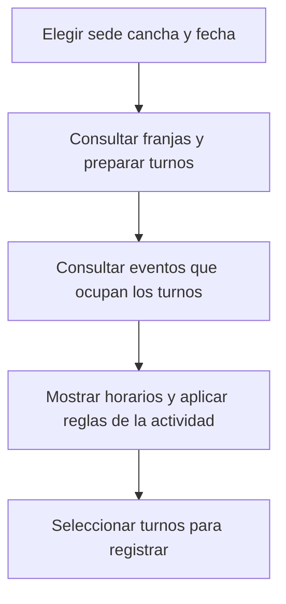
```mermaid
flowchart TD
    A[Elegir sede cancha y fecha] --> B[Consultar franjas y preparar turnos]
    B --> C[Consultar eventos que ocupan los turnos]
    C --> D[Mostrar horarios y aplicar reglas de la actividad]
    D --> E[Seleccionar turnos para registrar]
```

### 3.2 Usuarios

No existe un flujo separado de "registrar usuario": las cuentas no administrativas gestionadas por la academia se registran mediante **FL-02**, con credenciales de acceso propias y con Público y Reservas otorgados automáticamente en la misma operación. Los roles Profesor y Alumno pueden asignarse ya en ese mismo alta o en cualquier momento posterior mediante **FL-07**; Alumno, además, puede otorgarse automáticamente (ver **FL-20** y 4.4). Las cuentas administrativas se crean mediante `crear_administrador` y sólo reciben Administrador. Las asignaciones referencian el catálogo fijo `roles`, sin flujos para crear, modificar o eliminar sus cinco registros.

El perfil propio permite consultar la información y cambiar únicamente la contraseña mediante **FL-59**. La edición administrativa de datos personales se limita al correo (**FL-04**); el restablecimiento de la contraseña de otra cuenta se realiza mediante **FL-69**. Nombre, apellido, nombre de usuario, celular, fecha de nacimiento y observaciones se cargan en el alta y no tienen un flujo de edición. El estado y los roles utilizan **FL-05** y **FL-07** por separado.

#### FL-02. Registrar un usuario

- **Objetivo:** crear un usuario activo con credenciales de acceso, Público y Reservas, y opcionalmente Profesor o Alumno.
- **Actor:** administrador.
- **Entradas:** nombre, apellido, celular, email y fecha de nacimiento obligatorios; contraseña ingresada o sugerida por el sistema; observaciones opcionales; roles adicionales opcionales (Profesor, Alumno o ambos). El nombre de usuario se genera automáticamente y no es editable.

Recorrido:

1. El administrador completa nombre, apellido, celular, email y fecha de nacimiento.
2. Al escribir nombre y apellido, el sistema muestra el nombre de usuario formado por el apellido normalizado y la inicial del nombre. Consulta si ya existe y, si hace falta, agrega el primer número disponible desde `1`. El campo no se puede editar. El administrador puede pedir una contraseña alfanumérica aleatoria o ingresar una propia; en ambos casos se aplican los validadores de contraseña configurados en Django.
3. El administrador puede marcar, opcionalmente, los roles Profesor o Alumno para otorgar junto con el alta.
4. Al confirmar, el sistema valida los campos obligatorios, que la fecha de nacimiento esté dentro del rango permitido y que nombre y apellido no contengan números. Genera nuevamente el nombre de usuario disponible y comprueba la unicidad del email sin distinguir mayúsculas de minúsculas.
5. Django genera el hash PBKDF2-SHA256 de la contraseña; la base nunca recibe la contraseña en texto plano.
6. En una transacción, el sistema crea el usuario con estado **Activo** y `debe_cambiar_contrasena = true`, le asigna automáticamente **Público** y **Reservas** y, si se marcaron, los roles Profesor o Alumno seleccionados. Cada asignación guarda una clave foránea al catálogo `roles`.
7. Muestra el nombre de usuario definitivo y la contraseña provisoria en texto plano una única vez, para que el administrador se los comunique a la persona.

Alternativas:

- El celular puede pertenecer a un tercero y no es único. El email y el nombre de usuario, en cambio, son siempre obligatorios y únicos sin distinguir mayúsculas de minúsculas. Si otro usuario ocupa el nombre mostrado antes de guardar, se asigna el siguiente sufijo disponible.
- La persona debe reemplazar la contraseña provisoria en su primer inicio de sesión mediante **FL-68**. Si no la recuerda, puede establecer una propia mediante recuperación (**FL-46**).
- Administrador, Público y Reservas no pueden elegirse en este paso: Administrador se crea mediante el comando de gestión `crear_administrador`; Público y Reservas se asignan automáticamente.
- No marcar ningún rol adicional no impide asignarlo después mediante **FL-07**.
- Si se cancela antes de confirmar, no se crea el usuario.
- Este flujo es siempre un paso previo e independiente: ninguna otra operación (como crear una reserva o registrar un plan o pase contratado) lo invoca ni registra un usuario nuevo dentro de su propio trámite. El usuario debe existir antes.

- **Resultado:** nuevo usuario activo con contraseña provisoria pendiente de reemplazo, Público, Reservas y los roles adicionales seleccionados.
- **Datos:** usuarios, usuarios_roles.

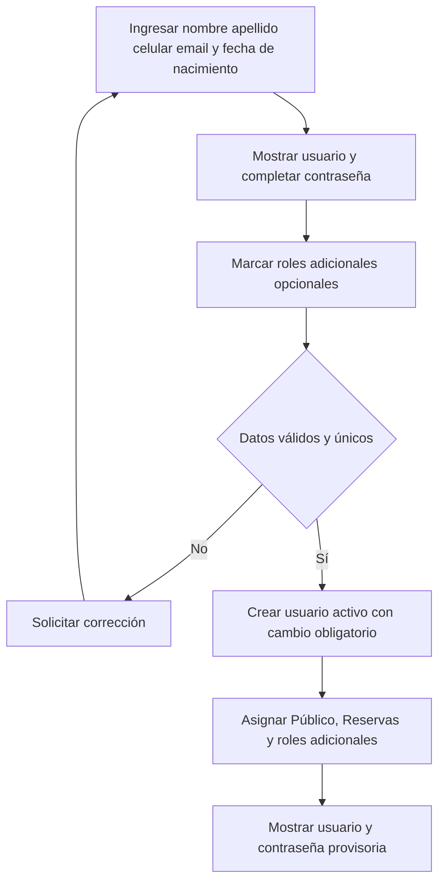
```mermaid
flowchart TD
    A[Ingresar nombre apellido celular email y fecha de nacimiento] --> B[Mostrar usuario y completar contraseña]
    B --> D[Marcar roles adicionales opcionales]
    D --> E{Datos válidos y únicos}
    E -->|No| F[Solicitar corrección]
    F --> A
    E -->|Sí| G[Crear usuario activo con cambio obligatorio]
    G --> H[Asignar Público, Reservas y roles adicionales]
    H --> I[Mostrar usuario y contraseña provisoria]
```

#### FL-03. Consultar un usuario

- **Objetivo:** localizar y visualizar la información de un usuario.
- **Actor:** administrador.
- **Entradas:** nombre, apellido, celular, email, nombre de usuario, rol, estado u otro criterio disponible.

Recorrido:

1. El administrador ingresa criterios de búsqueda.
2. El sistema muestra coincidencias activas e inactivas e identifica con una estrella a quienes tienen el rol Administrador.
3. El administrador selecciona un usuario.
4. El sistema muestra sus datos, roles y estado, nunca el hash de contraseña.

Alternativas:

- Si no hay coincidencias, informa que no se encontraron usuarios.
- Compartir celular no se considera duplicación.
- Filtrar por rol permite, por ejemplo, listar todos los usuarios con rol Alumno o Profesor.

- **Resultado:** detalle del usuario sin modificarlo.
- **Datos:** usuarios, usuarios_roles.

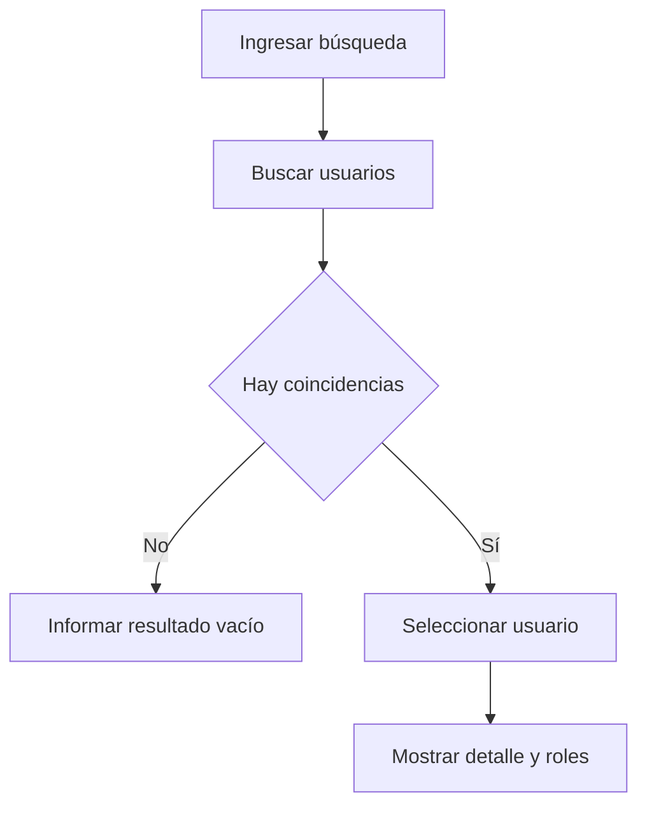
```mermaid
flowchart TD
    A[Ingresar búsqueda] --> B[Buscar usuarios]
    B --> C{Hay coincidencias}
    C -->|No| D[Informar resultado vacío]
    C -->|Sí| E[Seleccionar usuario]
    E --> F[Mostrar detalle y roles]
```

#### FL-04. Modificar el correo de un usuario

- **Objetivo:** modificar el correo de un usuario existente.
- **Actor:** administrador.
- **Precondición:** usuario localizado mediante **FL-03**.
- **Entrada:** nuevo correo.

Recorrido:

1. El sistema identifica al usuario mediante su nombre, apellido y nombre de usuario, y presenta el correo actual.
2. El administrador ingresa el nuevo correo.
3. El sistema valida el formato, que no quede vacío y que no pertenezca a otro usuario, sin distinguir mayúsculas de minúsculas.
4. Guarda el correo y actualiza la fecha de última modificación.

Alternativas:

- Este flujo no modifica los demás datos personales, el nombre de usuario, la contraseña, el estado ni los roles.
- Si el correo no es válido o ya está registrado, se informa el error sin modificar la cuenta.
- Cancelar la modificación conserva el correo anterior.

- **Resultado:** usuario con el correo actualizado.
- **Datos:** usuarios.

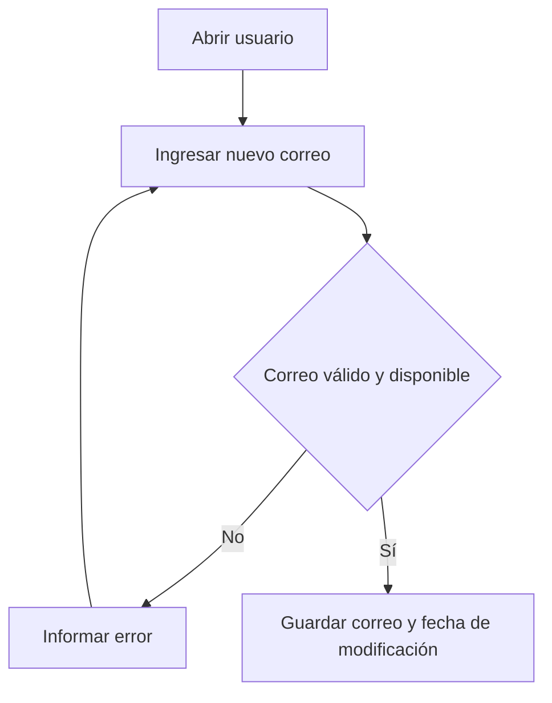
```mermaid
flowchart TD
    A[Abrir usuario] --> B[Ingresar nuevo correo]
    B --> C{Correo válido y disponible}
    C -->|No| D[Informar error]
    D --> B
    C -->|Sí| E[Guardar correo y fecha de modificación]
```

#### FL-05. Cambiar el estado de un usuario

- **Objetivo:** activar o inactivar un usuario sin eliminar su historia.
- **Actor:** administrador.
- **Precondición:** usuario localizado mediante **FL-03**.
- **Entrada:** nuevo estado.

Recorrido:

1. El administrador solicita cambiar el estado.
2. El sistema muestra el estado actual y el solicitado.
3. El administrador confirma.
4. El sistema valida que el actor no esté desactivando su propia cuenta y, si el usuario es administrador, que permanezca al menos otro administrador activo.
5. Si la cuenta queda inactiva, el sistema registra el momento actual en `fecha_baja`; si queda activa, limpia ese campo. Actualiza el estado, la fecha de baja y la fecha de última modificación dentro de la misma transacción de validación.

Alternativas:

- La inactivación no elimina clases, reservas, asistencias, contrataciones de planes y pases, ingresos ni roles asignados.
- Reactivar la cuenta limpia `fecha_baja`; el campo representa la baja vigente, no un historial de cambios de estado.
- Un usuario inactivo no podrá iniciar sesión ni ser asignado como profesor activo, aunque conserve credenciales cargadas.
- Ningún usuario con permiso para cambiar estados puede desactivar su propia cuenta.
- El último administrador activo no puede ser desactivado. Las filas de los administradores activos se bloquean durante la validación para que dos operaciones concurrentes no puedan eludir esta regla.
- El estado ya aplicado no genera cambios.

- **Resultado:** usuario activo sin fecha de baja, o usuario inactivo con la fecha de baja registrada.
- **Datos:** usuarios.

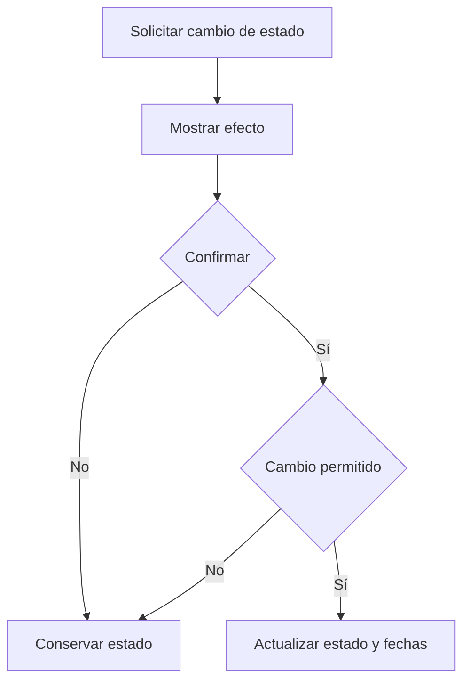
```mermaid
flowchart TD
    A[Solicitar cambio de estado] --> B[Mostrar efecto]
    B --> C{Confirmar}
    C -->|No| D[Conservar estado]
    C -->|Sí| E{Cambio permitido}
    E -->|No| D
    E -->|Sí| F[Actualizar estado y fechas]
```

#### FL-69. Restablecer la contraseña de un usuario

- **Objetivo:** reemplazar administrativamente una contraseña desconocida por una nueva contraseña provisoria.
- **Actor:** administrador.
- **Precondición:** usuario localizado mediante **FL-03**.
- **Entrada:** confirmación del restablecimiento.

Recorrido:

1. El administrador solicita restablecer la contraseña desde el detalle del usuario.
2. El sistema informa que la contraseña actual dejará de funcionar y solicita confirmación.
3. Genera una contraseña alfanumérica aleatoria que cumple los validadores configurados.
4. En una transacción, guarda solamente su hash PBKDF2-SHA256 de Django, activa `debe_cambiar_contrasena` y actualiza la fecha de última modificación.
5. Muestra la contraseña provisoria en texto plano una única vez para que el administrador se la comunique a la persona.
6. En el próximo inicio de sesión se ejecuta **FL-68**.

Alternativas:

- Cancelar la confirmación conserva la contraseña vigente.
- Ningún administrador puede restablecer su propia contraseña. Para su cuenta debe utilizar **FL-59** o, si no puede iniciar sesión, **FL-46**.
- La operación no modifica el correo, los datos personales, el estado ni los roles.
- La contraseña provisoria no se almacena ni puede volver a consultarse en texto plano.

- **Resultado:** contraseña restablecida y cambio obligatorio pendiente.
- **Datos:** usuarios.

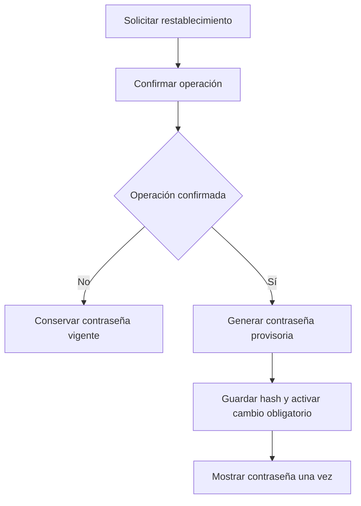
```mermaid
flowchart TD
    A[Solicitar restablecimiento] --> B[Confirmar operación]
    B --> C{Operación confirmada}
    C -->|No| D[Conservar contraseña vigente]
    C -->|Sí| E[Generar contraseña provisoria]
    E --> F[Guardar hash y activar cambio obligatorio]
    F --> G[Mostrar contraseña una vez]
```

#### FL-06. Registrarse

- **Objetivo:** crear una cuenta de usuario con credenciales propias, igual que **FL-02** pero autogestionada desde el portal.
- **Actor:** público, sin cuenta previa.
- **Entradas:** nombre, apellido, celular, email, fecha de nacimiento y contraseña, todos obligatorios. El nombre de usuario se genera automáticamente y no es editable.

Recorrido:

1. La persona completa sus datos personales y contraseña desde el portal. Al escribir nombre y apellido, ve el nombre de usuario generado según la regla de **FL-02**.
2. Al confirmar, el sistema valida los campos obligatorios, que la fecha de nacimiento esté dentro del rango permitido y que nombre y apellido no contengan números. Genera nuevamente el nombre de usuario disponible y comprueba la unicidad del email sin distinguir mayúsculas de minúsculas.
3. Django genera el hash PBKDF2-SHA256 de la contraseña.
4. En una transacción, crea el usuario **Activo** y le asigna automáticamente **Público** y **Reservas**, igual que en **FL-02**.
5. Envía la confirmación de alta por email (ver 4.2).
6. Muestra el nombre de usuario definitivo para que la persona pueda iniciar sesión.

Alternativas:

- Si el email ya pertenece a un usuario existente (por ejemplo, registrado antes por la administración mediante **FL-02**), el alta se rechaza informando que la cuenta ya existe; la persona podrá iniciar sesión con esas credenciales o recuperar la contraseña (**FL-46**) en vez de registrarse de nuevo. Si otro usuario ocupa el nombre mostrado antes de guardar, se asigna el siguiente sufijo disponible.
- La base nunca recibe la contraseña en texto plano.
- El autorregistro guarda `debe_cambiar_contrasena = false`: la persona eligió y confirmó su propia contraseña, por lo que no debe reemplazarla en su primer inicio de sesión.

- **Resultado:** nuevo usuario activo con Público, Reservas y sesión iniciable.
- **Datos:** usuarios, usuarios_roles.

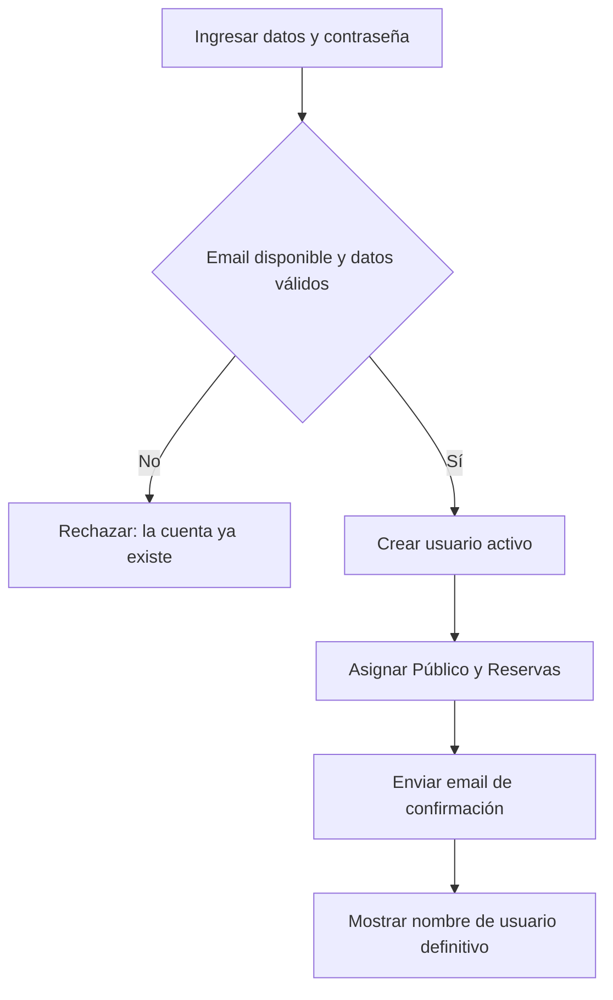
```mermaid
flowchart TD
    A[Ingresar datos y contraseña] --> B{Email disponible y datos válidos}
    B -->|No| C[Rechazar: la cuenta ya existe]
    B -->|Sí| D[Crear usuario activo]
    D --> E[Asignar Público y Reservas]
    E --> F[Enviar email de confirmación]
    F --> G[Mostrar nombre de usuario definitivo]
```

#### FL-07. Asignar o quitar un rol a un usuario

- **Objetivo:** otorgar o retirar Reservas, Profesor o Alumno a un usuario no administrador, conservando la coherencia con sus actividades y contrataciones.
- **Actor:** administrador.
- **Precondición:** usuario localizado mediante **FL-03**.
- **Entrada:** rol (Reservas, Profesor o Alumno) y acción (asignar o quitar).

Recorrido:

1. El administrador localiza al usuario.
2. El sistema muestra los roles vigentes del usuario.
3. El administrador elige Reservas, Profesor o Alumno y confirma asignarlo o quitarlo.
4. Si solicita quitarlo, comprueba que no existan relaciones que bloqueen el retiro: reservas propias Programadas para Reservas, contrataciones de planes Activas para Alumno o asignaciones activas como profesor en clases Programadas para Profesor.
5. Si la operación está permitida, actualiza `usuarios_roles`. La comprobación y el retiro se realizan en una misma operación transaccional, coordinada con la creación o reactivación de las relaciones involucradas.

Alternativas:

- **Público no se puede quitar.** Se asigna automáticamente en el alta de cuentas no administrativas. Administrador se gestiona exclusivamente mediante comandos ejecutados por el desarrollador y no puede combinarse con otros roles. Su perfil no ofrece la modificación de roles y el servidor rechaza solicitudes sobre esas cuentas. Este flujo tampoco permite crear, renombrar ni eliminar registros del catálogo `roles`.
- Reservas sigue asignándose automáticamente en el alta (**FL-02**, **FL-06**), pero puede retirarse si no hay reservas propias programadas y otorgarse nuevamente mediante este flujo.
- Si el usuario tiene reservas programadas, se rechaza el retiro de Reservas. Si tiene un plan contratado Activo, se rechaza el retiro de Alumno; un pase contratado no impide retirar ese rol. Si tiene clases programadas con una asignación activa como profesor, se rechaza el retiro de Profesor.
- Ante un rechazo, se informa la causa, se conserva el rol y no se cancelan ni modifican las relaciones que lo bloquean. Los estados registrados determinan el bloqueo; una fecha pasada por sí sola no lo libera.
- El rol Alumno también puede otorgarse automáticamente mediante **FL-20** o 4.4, además de por este flujo; ambas vías conviven sin conflicto.
- Quitar Reservas, Profesor o Alumno no elimina el historial de reservas, contrataciones, clases ni asistencia. Las reservas y clases canceladas o completadas y las contrataciones Vencidas o Anuladas no bloquean por sí solas el retiro.
- Asignar un rol ya vigente, o quitar uno que el usuario no tiene, no genera cambios.

- **Resultado:** asignación actualizada, o retiro rechazado conservando el rol y sus relaciones.
- **Datos:** usuarios_roles, roles, reservas, planes_usuarios, pases_usuarios, clases_profesores, clases y eventos, eventos_turnos, turnos.

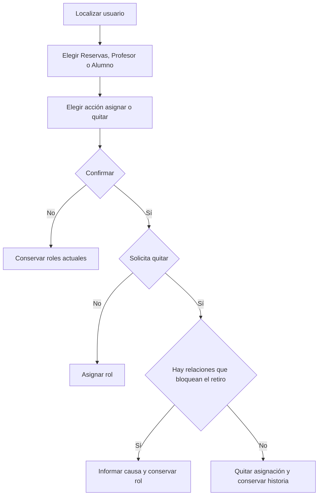
```mermaid
flowchart TD
    A[Localizar usuario] --> B[Elegir Reservas, Profesor o Alumno]
    B --> C[Elegir acción asignar o quitar]
    C --> D{Confirmar}
    D -->|No| E[Conservar roles actuales]
    D -->|Sí| F{Solicita quitar}
    F -->|No| G[Asignar rol]
    F -->|Sí| H{Hay relaciones que bloquean el retiro}
    H -->|Sí| I[Informar causa y conservar rol]
    H -->|No| J[Quitar asignación y conservar historia]
```

### 3.3 Sedes y canchas

#### FL-08. Consultar sedes y canchas

- **Objetivo:** visualizar las sedes y sus canchas asociadas.
- **Actor:** administrador.
- **Entradas:** sede seleccionada y filtros opcionales por nombre o estado de la sede.

Recorrido:

1. El administrador accede a la consulta.
2. El sistema muestra las sedes.
3. Al seleccionar una sede, muestra todas sus canchas, activas e inactivas, con sus superficies y estados.

Alternativas:

- Una sede sin canchas muestra una lista vacía.
- La consulta de sedes puede incluir registros inactivos.

- **Resultado:** jerarquía de sedes y canchas sin modificaciones.
- **Datos:** sedes y canchas.

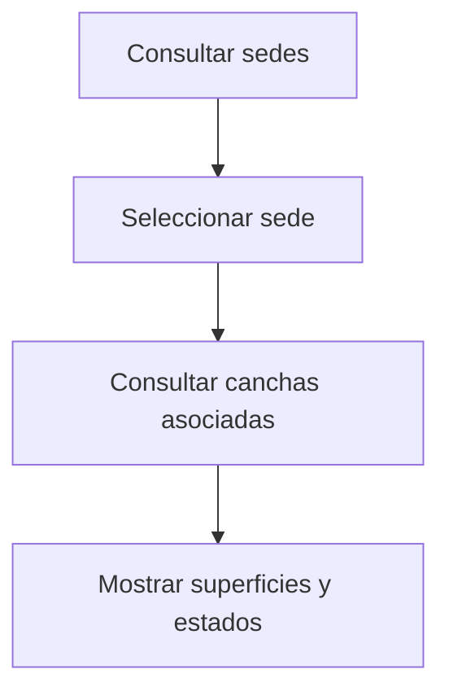
```mermaid
flowchart TD
    A[Consultar sedes] --> B[Seleccionar sede]
    B --> C[Consultar canchas asociadas]
    C --> D[Mostrar superficies y estados]
```

#### FL-09. Registrar una sede

- **Objetivo:** crear una sede activa.
- **Actor:** administrador.
- **Entradas:** nombre y dirección obligatorios; observaciones opcionales.

Recorrido:

1. El administrador completa los datos.
2. El sistema valida que el nombre no esté vacío ni repetido, sin distinguir mayúsculas de minúsculas.
3. Crea la sede con estado **Activa**.

Alternativas:

- Registrar la sede no crea canchas ni horario de funcionamiento automáticamente: hasta configurarlo mediante **FL-58**, la sede queda sin franjas y no funciona ningún día.

- **Resultado:** nueva sede activa.
- **Datos:** sedes.

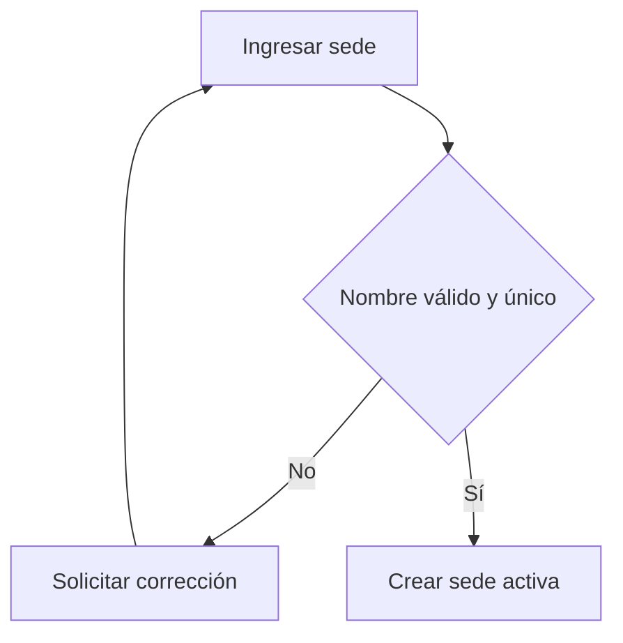
```mermaid
flowchart TD
    A[Ingresar sede] --> B{Nombre válido y único}
    B -->|No| C[Solicitar corrección]
    C --> A
    B -->|Sí| D[Crear sede activa]
```

#### FL-10. Actualizar una sede

- **Objetivo:** modificar nombre, dirección u observaciones de una sede.
- **Actor:** administrador.
- **Precondición:** sede seleccionada mediante **FL-08**.

Recorrido:

1. El sistema presenta los datos actuales.
2. El administrador realiza cambios.
3. El sistema valida que el nombre sea único sin distinguir mayúsculas de minúsculas.
4. Guarda la sede.

Alternativas:

- Este flujo no cambia el estado ni modifica canchas.

- **Resultado:** sede actualizada.
- **Datos:** sedes.

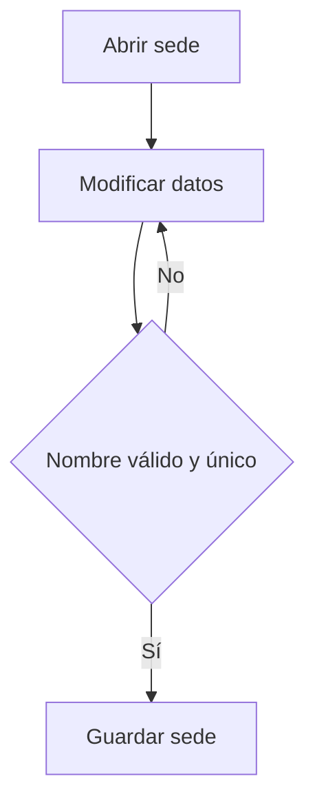
```mermaid
flowchart TD
    A[Abrir sede] --> B[Modificar datos]
    B --> C{Nombre válido y único}
    C -->|No| B
    C -->|Sí| D[Guardar sede]
```

#### FL-11. Cambiar el estado de una sede

- **Objetivo:** activar o inactivar una sede conservando su historia.
- **Actor:** administrador.
- **Precondición:** sede seleccionada mediante **FL-08**.

Recorrido:

1. El administrador solicita el nuevo estado.
2. El sistema muestra las canchas asociadas y el impacto operativo.
3. El administrador confirma.
4. El sistema bloquea la sede dentro de una transacción. Si se solicita inactivarla, comprueba que ninguna de sus canchas tenga reservas Programadas; si las hay, conserva el estado e informa el impedimento.
5. Si la operación está permitida, establece el estado solicitado. Repetir la solicitud no invierte la acción.

Alternativas:

- La operación no elimina ni cambia automáticamente el estado de sus canchas.
- Una sede inactiva no se ofrece para nuevas actividades.
- Una reserva en curso o vencida que siga Programada también impide inactivar. Las futuras pueden cancelarse según sus reglas; las demás sólo pueden finalizarse después del último turno, automáticamente o mediante **FL-42**. Las canceladas y completadas no impiden inactivar.
- La reactivación se permite aunque haya reservas Programadas. Editar los datos de la sede no modifica su estado.

- **Resultado:** sede activa o inactiva.
- **Datos:** sedes, canchas, turnos y reservas con sus detalles para informar impacto y validar la desactivación.

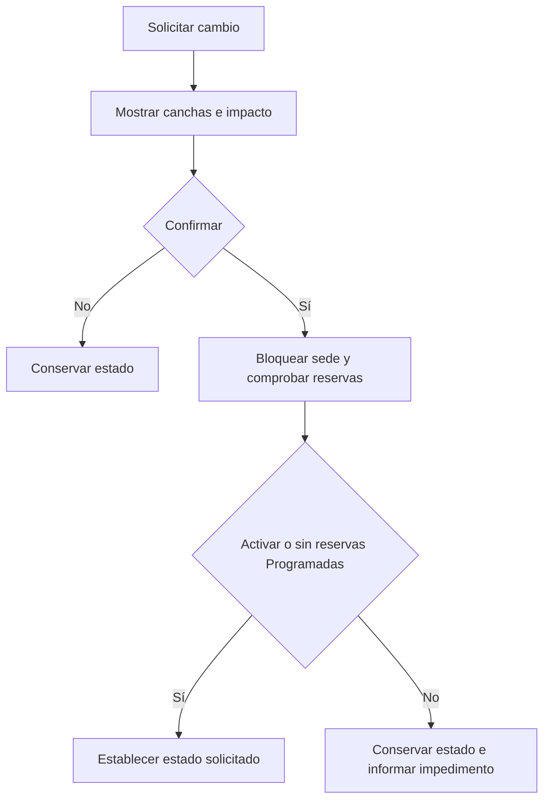
```mermaid
flowchart TD
    A[Solicitar cambio] --> B[Mostrar canchas e impacto]
    B --> C{Confirmar}
    C -->|No| D[Conservar estado]
    C -->|Sí| E[Bloquear sede y comprobar reservas]
    E --> F{Activar o sin reservas Programadas}
    F -->|Sí| G[Establecer estado solicitado]
    F -->|No| H[Conservar estado e informar impedimento]
```

#### FL-12. Registrar una cancha

- **Objetivo:** crear una cancha activa dentro de una sede.
- **Actor:** administrador.
- **Entradas:** sede, nombre, superficie; observaciones opcionales.
- **Precondición:** sede activa seleccionada mediante **FL-08**.

Recorrido:

1. El administrador completa los datos.
2. El sistema valida superficie y nombre único dentro de la sede sin distinguir mayúsculas de minúsculas.
3. Crea la cancha con estado **Activa**.

Alternativas:

- La superficie debe ser **Cemento** o **Polvo de ladrillo**.

- **Resultado:** nueva cancha activa.
- **Datos:** sedes y canchas.

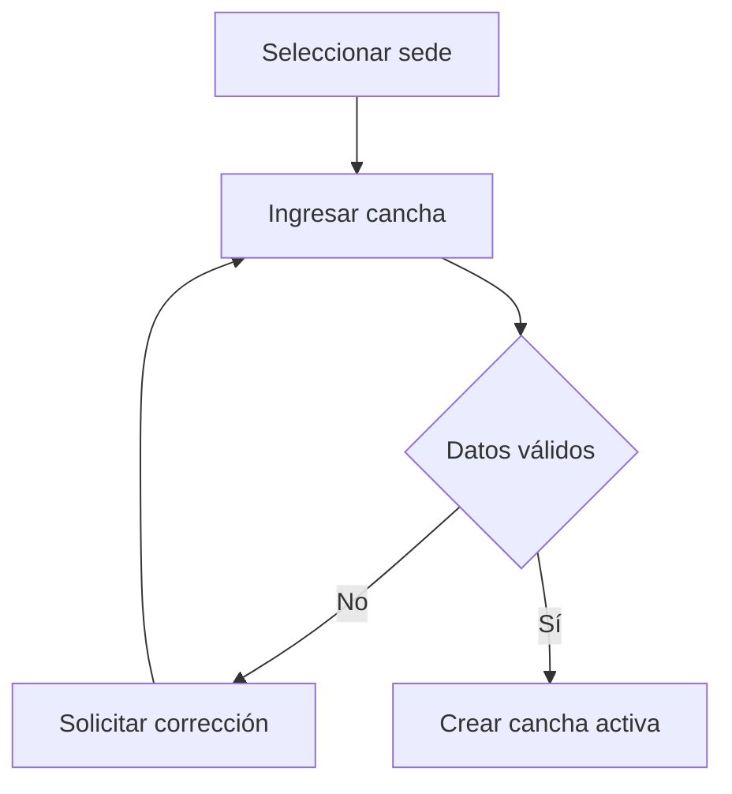
```mermaid
flowchart TD
    A[Seleccionar sede] --> B[Ingresar cancha]
    B --> C{Datos válidos}
    C -->|No| D[Solicitar corrección]
    D --> B
    C -->|Sí| E[Crear cancha activa]
```

#### FL-13. Actualizar una cancha

- **Objetivo:** modificar nombre, superficie u observaciones de una cancha.
- **Actor:** administrador.
- **Precondición:** cancha seleccionada mediante **FL-08**.

Recorrido:

1. El sistema presenta los datos actuales.
2. El administrador realiza cambios.
3. El sistema valida superficie y nombre único dentro de la sede sin distinguir mayúsculas de minúsculas.
4. Guarda la cancha.

Alternativas:

- Este flujo no cambia el estado de la cancha.
- La sede de contexto determina el ámbito del nombre.

- **Resultado:** cancha actualizada.
- **Datos:** canchas y sedes.

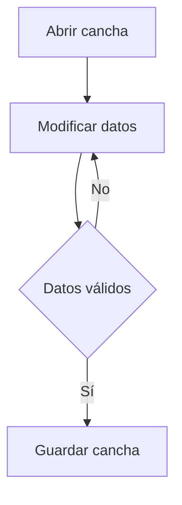
```mermaid
flowchart TD
    A[Abrir cancha] --> B[Modificar datos]
    B --> C{Datos válidos}
    C -->|No| B
    C -->|Sí| D[Guardar cancha]
```

#### FL-14. Cambiar el estado de una cancha

- **Objetivo:** activar o inactivar una cancha conservando su historia.
- **Actor:** administrador.
- **Precondición:** cancha seleccionada mediante **FL-08**.

Recorrido:

1. El administrador solicita el nuevo estado.
2. El sistema muestra el impacto sobre nuevas actividades.
3. El administrador confirma.
4. El sistema bloquea primero la sede y después la cancha dentro de una transacción. Si se solicita inactivarla, comprueba que no tenga reservas Programadas; si las hay, conserva el estado e informa el impedimento.
5. Si la operación está permitida, establece el estado solicitado. Repetir la solicitud no invierte la acción.

Alternativas:

- Una cancha inactiva no se ofrece para nuevas clases, reservas o turnos de planilla.
- Las actividades históricas conservan la referencia.
- Las reservas en curso o vencidas que sigan Programadas también impiden inactivar. Las canceladas y completadas no lo impiden.
- La reactivación está permitida aunque haya reservas Programadas. No activa la sede ni habilita nuevas reservas si la sede sigue inactiva. Editar los datos de la cancha no modifica su estado.

- **Resultado:** cancha activa o inactiva.
- **Datos:** sede, cancha, turnos y reservas con sus detalles para validar la desactivación.

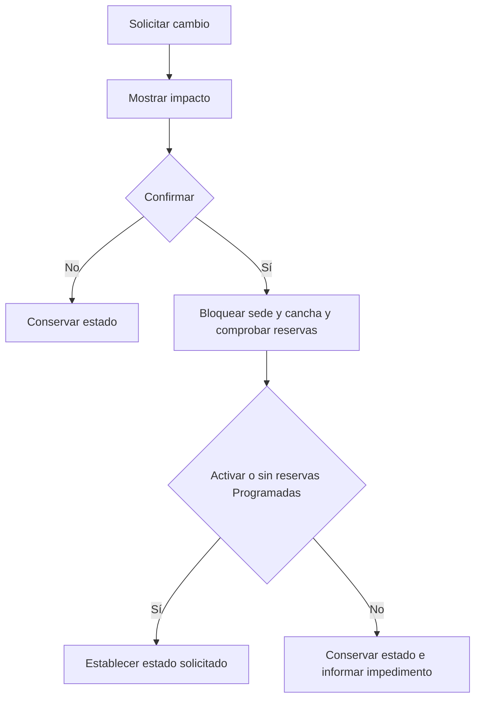
```mermaid
flowchart TD
    A[Solicitar cambio] --> B[Mostrar impacto]
    B --> C{Confirmar}
    C -->|No| D[Conservar estado]
    C -->|Sí| E[Bloquear sede y cancha y comprobar reservas]
    E --> F{Activar o sin reservas Programadas}
    F -->|Sí| G[Establecer estado solicitado]
    F -->|No| H[Conservar estado e informar impedimento]
```

#### FL-57. Consultar el horario de funcionamiento de una sede

- **Objetivo:** visualizar los días y franjas horarias en los que una sede funciona.
- **Actores:** administrador; cualquier persona, sin necesidad de cuenta, desde el portal.
- **Entradas:** sede.

Recorrido:

1. El actor selecciona una sede, entre las activas mediante **FL-08** o directamente en el portal.
2. El sistema muestra los siete días de la semana con sus franjas habilitadas, cuando las tiene.
3. Un día sin franjas configuradas se muestra sin funcionamiento.

Alternativas:

- Esta consulta muestra el horario general de la sede, no la ocupación real de cada cancha; para disponibilidad concreta ver **FL-01**.
- Este horario rige tanto para clases como para reservas, aunque con distinta exigencia según quién actúa (ver **FL-28**, **FL-34**, **FL-40** y **FL-51**).

- **Resultado:** horario semanal de funcionamiento de la sede consultado sin modificaciones.
- **Datos:** sedes y horarios de sede.

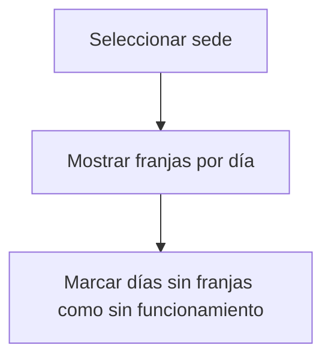
```mermaid
flowchart TD
    A[Seleccionar sede] --> B[Mostrar franjas por día]
    B --> C[Marcar días sin franjas como sin funcionamiento]
```

#### FL-58. Configurar el horario de funcionamiento de una sede

- **Objetivo:** definir o modificar hasta dos franjas horarias de funcionamiento para uno o varios días de la semana.
- **Actor:** administrador.
- **Precondición:** sede localizada mediante **FL-08**.
- **Entradas:** días de la semana seleccionados y una o dos franjas horarias, o la indicación de dejarlos sin funcionamiento.

Recorrido:

1. El administrador selecciona la sede mediante **FL-57** y marca los días que quiere modificar. Puede seleccionar lunes a viernes, fin de semana o toda la semana mediante accesos rápidos. Si abre la edición de un día, se precargan ese día y sus franjas.
2. Ingresa las horas de inicio y fin de la primera franja mediante campos numéricos de 0 a 23. Los minutos permanecen fijos en cero. Puede habilitar una segunda franja.
3. El sistema valida que todos los horarios sean en punto, que cada franja tenga el fin posterior al inicio y que, si hay dos, exista al menos una hora sin funcionamiento entre el fin de la primera y el inicio de la segunda. Se rechazan horarios con minutos o segundos distintos de cero y franjas contiguas o superpuestas.
4. El administrador aplica el horario y el sistema guarda la misma configuración en todos los días seleccionados, reemplazando sus franjas anteriores en una única transacción. Los días no seleccionados conservan su configuración.

Alternativas:

- La acción «Marcar como sin funcionamiento» elimina las franjas de los días seleccionados sin exigir horas de inicio ni fin, tanto para reservas como para clases.
- Este horario es independiente de la planilla (ver **FL-23** a **FL-26**): configurarlo no crea, modifica ni elimina turnos de planilla. Sí afecta la generación de clases (**FL-28**, **FL-29**) y la creación o el cambio de cancha de clases, y la creación o reprogramación de reservas, que lo validan en el momento (ver **FL-34**, **FL-35**, **FL-40**, **FL-51**).
- Cambiar el horario no afecta clases ni reservas ya creadas; solo rige para actividades nuevas a partir de ese momento.

- **Resultado:** horario de funcionamiento de la sede actualizado para los días seleccionados.
- **Datos:** sedes y horarios de sede.

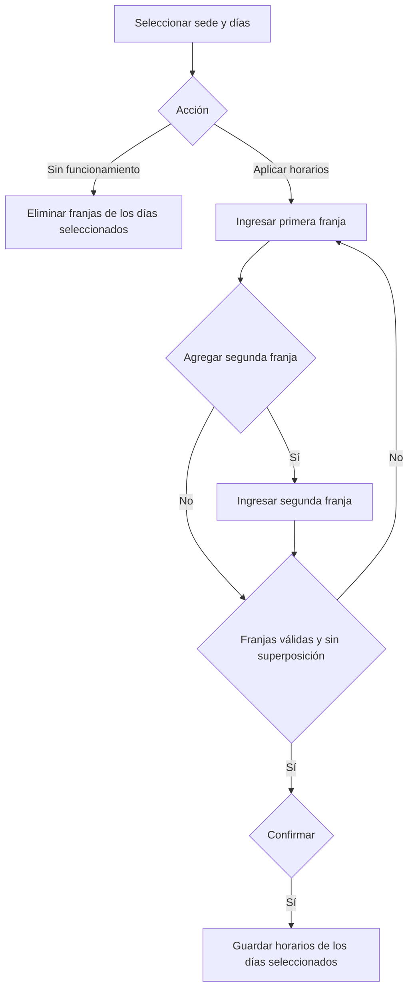
```mermaid
flowchart TD
    A[Seleccionar sede y días] --> H{Acción}
    H -->|Sin funcionamiento| I[Eliminar franjas de los días seleccionados]
    H -->|Aplicar horarios| B[Ingresar primera franja]
    B --> C{Agregar segunda franja}
    C -->|Sí| D[Ingresar segunda franja]
    C -->|No| E{Franjas válidas y sin superposición}
    D --> E
    E -->|No| B
    E -->|Sí| F{Confirmar}
    F -->|Sí| G[Guardar horarios de los días seleccionados]
```

### 3.4 Catálogos de planes y pases

#### FL-15. Consultar planes y pases

- **Objetivo:** consultar productos del catálogo.
- **Actores:** Administrador, con acceso a activos e inactivos; usuario autenticado con rol Público, limitado a activos.
- **Entradas:** catálogo de planes o pases y filtros por nombre, configuración o estado cuando el actor lo permite.

Recorrido:

1. El actor elige el catálogo y los filtros.
2. El sistema consulta `planes` o `pases`, según lo seleccionado.
3. Muestra nombre, descripción, configuración y precio vigente, con acceso al detalle.

Alternativas:

- El portal sólo ofrece productos Activos.
- El pase Libre y el de Fin de semana son productos distintos.
- Los nombres se validan dentro de cada catálogo, no entre ambas tablas.

- **Resultado:** listado y detalle de productos, sin modificar datos.
- **Datos:** planes o pases.

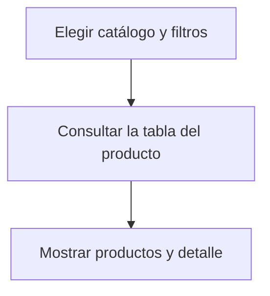
```mermaid
flowchart TD
    A[Elegir catálogo y filtros] --> B[Consultar la tabla del producto]
    B --> C[Mostrar productos y detalle]
```

#### FL-16. Registrar un plan o un pase

- **Objetivo:** registrar un producto completo en su catálogo.
- **Actor:** Administrador.
- **Entradas:** nombre, descripción y precio; configuración específica del plan o pase.

Recorrido:

1. Selecciona el catálogo y completa los datos.
2. Para un plan, indica modalidad, frecuencia semanal y cantidad de clases por encuentro. Para un pase, indica variante, límite diario y adicional por invitado.
3. Valida nombre disponible entre productos Activos del mismo catálogo, importes y configuración.
4. Registra una fila Activa en `planes` o `pases`.

Alternativas:

- Frecuencia de plan entre uno y siete, con una o dos clases de una hora por encuentro.
- Límite diario de pase positivo; Libre habilita todos los días y Fin de semana sólo sábado y domingo.
- Los precios no pueden ser negativos.

- **Resultado:** producto Activo en el catálogo correspondiente.
- **Datos:** planes o pases.

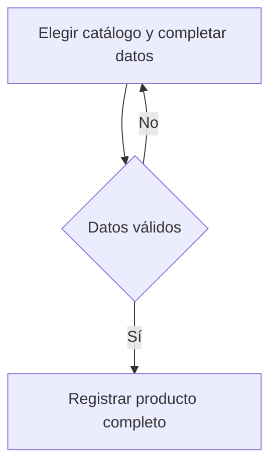
```mermaid
flowchart TD
    A[Elegir catálogo y completar datos] --> B{Datos válidos}
    B -->|No| A
    B -->|Sí| C[Registrar producto completo]
```

#### FL-17. Actualizar un plan o un pase

- **Objetivo:** modificar los datos comerciales de un producto.
- **Actor:** Administrador.
- **Precondición:** producto localizado mediante **FL-15**.

Recorrido:

1. El sistema informa si tiene contrataciones históricas.
2. El Administrador modifica nombre, descripción y precios vigentes.
3. Si no tiene contrataciones históricas, puede modificar también su configuración estructural.
4. Valida y guarda los cambios en su tabla, actualizando la fecha de modificación.

Alternativas:

- Con contrataciones históricas no se cambia modalidad, frecuencia o duración del plan, ni variante o límite diario del pase.
- Una configuración estructural distinta se registra como otro producto.
- Cambiar el precio vigente no modifica importes acordados ni intentos de pago ya iniciados.
- El adicional de invitados se conserva en cada reserva que lo aplica.

- **Resultado:** producto actualizado, conservando los datos aplicados a operaciones existentes.
- **Datos:** planes y planes_usuarios, o pases y pases_usuarios.

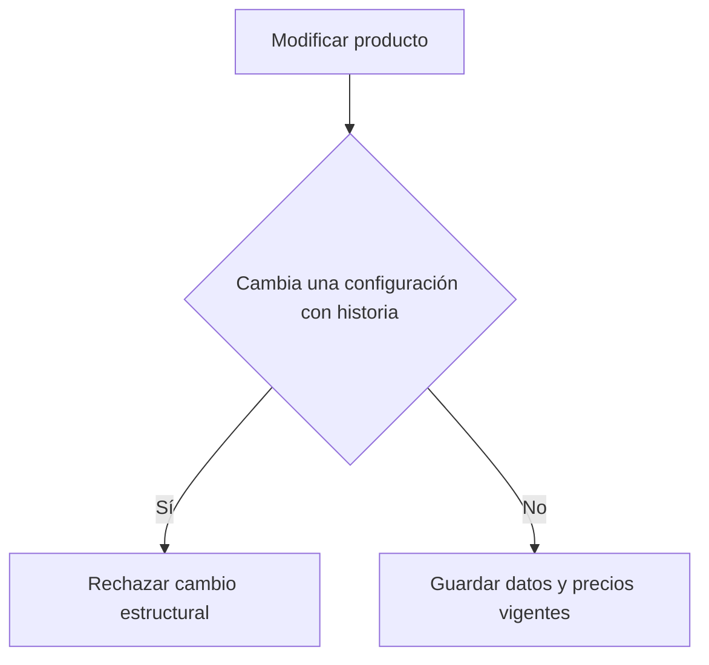
```mermaid
flowchart TD
    A[Modificar producto] --> B{Cambia una configuración con historia}
    B -->|Sí| C[Rechazar cambio estructural]
    B -->|No| D[Guardar datos y precios vigentes]
```

#### FL-18. Cambiar el estado de un plan o un pase

- **Objetivo:** activar o desactivar un producto sin alterar sus contrataciones.
- **Actor:** Administrador.
- **Precondición:** producto localizado mediante **FL-15**.
- **Entrada:** estado solicitado y confirmación.

Recorrido:

1. Solicita activar o desactivar el producto.
2. Confirma el efecto sobre nuevas contrataciones.
3. El sistema establece el estado y actualiza la marca de modificación en la tabla correspondiente.

Alternativas:

- Desactivar no anula contrataciones existentes.
- Un producto Inactivo no admite nuevas contrataciones.
- Repetir el estado aplicado no invierte la operación.
- Activar un producto del catálogo no asigna roles a usuarios.

- **Resultado:** producto con el estado solicitado.
- **Datos:** planes o pases.

```mermaid
flowchart TD
    A[Solicitar estado del producto] --> B{Confirmar}
    B -->|No| C[Conservar estado]
    B -->|Sí| D[Establecer estado solicitado]
```

### 3.5 Contrataciones de planes y pases

#### FL-19. Consultar un plan o pase contratado

- **Objetivo:** consultar una contratación mensual y sus cobros o usos.
- **Actores:** Administrador, sobre todas; titular autenticado, sólo sobre las propias.
- **Entradas:** tipo de contratación y filtros por usuario, producto, mes o estado.

Recorrido:

1. El sistema consulta `planes_usuarios` o `pases_usuarios` y limita el alcance según el actor.
2. El actor selecciona una contratación.
3. Muestra producto, mes, período calculado, importe acordado, estado, auditoría e ingresos.
4. Para pases, muestra también las reservas donde se aplicó como organizador o invitado.

Alternativas:

- Consultar un pase propio no exige Alumno.
- El titular consulta sus contrataciones en modo de sólo lectura.
- Cobrado, pendiente y excedente se calculan con los ingresos no Anulados.
- La consulta histórica utiliza la contratación concreta.

- **Resultado:** detalle autorizado, sin modificar datos.
- **Datos:** usuarios, planes, pases, planes_usuarios, pases_usuarios, ingresos, reservas e invitados.

```mermaid
flowchart TD
    A[Elegir tipo y filtros] --> B[Consultar contrataciones autorizadas]
    B --> C[Mostrar período importes auditoría y usos]
```

#### FL-20. Registrar un plan o pase para un usuario

- **Objetivo:** registrar una contratación mensual desde la administración.
- **Actor:** Administrador.
- **Entradas:** usuario, producto Activo, mes cubierto, fecha efectiva de alta, importe acordado y observaciones.

Recorrido:

1. Selecciona al usuario, un plan o pase y el mes.
2. Muestra el período calculado y propone el precio vigente.
3. El Administrador establece el importe final cuando corresponde un ajuste y confirma.
4. En una transacción, bloquea al usuario y verifica que no exista otra contratación no Anulada del mismo tipo para ese mes.
5. Registra una fila en `planes_usuarios` o `pases_usuarios`, con su producto obligatorio, mes, importe aplicado y responsable. Si el mes terminó nace Vencida; en otro caso, Activa.
6. Si registra un plan Activo, falta Alumno y el titular no es administrador, asigna el rol en la misma transacción.

Alternativas:

- Puede combinar un plan y un pase, pero no duplicar el mismo tipo en un mes, incluidos registros Vencidos.
- El mes se encuentra entre agosto de 2026 y el mes siguiente al actual.
- Renovar para otro mes crea una contratación nueva.
- Un pase no otorga Alumno y su vigencia se verifica para cada fecha de uso.
- El ingreso se registra por separado mediante **FL-43**; el importe aplicado no representa lo abonado.

- **Resultado:** contratación registrada con precio acordado e historia conservada.
- **Datos:** usuarios, planes o pases, planes_usuarios o pases_usuarios y usuarios_roles cuando corresponde.

```mermaid
flowchart TD
    A[Elegir usuario producto y mes] --> B[Revisar período e importe acordado]
    B --> C{Confirmar}
    C -->|Sí| D[Bloquear usuario y validar exclusividad]
    D --> E[Registrar contratación en su tabla]
    E --> F{Plan Activo de titular no administrador}
    F -->|Sí| G[Asignar Alumno si falta]
    F -->|No| H[Terminar]
    G --> H
```

#### FL-21. Anular un plan o pase contratado

- **Objetivo:** impedir nuevas aplicaciones de una contratación, conservando su historia.
- **Actor:** Administrador.
- **Precondición:** contratación Activa localizada mediante **FL-19**.
- **Entrada:** motivo obligatorio y confirmación.

Recorrido:

1. Consulta usos e ingresos de la contratación.
2. Ingresa el motivo y confirma.
3. En una transacción, bloquea la fila en su tabla, verifica estado Activo y establece Anulado.
4. Registra administrador, momento y motivo de anulación, actualizando la fecha de modificación.

Alternativas:

- Conserva producto, titular, mes, precio aplicado e ingresos.
- No anula automáticamente clases, reservas o coberturas de pase ya registradas.
- Un pase Anulado no cubre aplicaciones nuevas.
- No se retira Alumno automáticamente.
- El registro Anulado permite contratar un reemplazo para ese mes, conservando ambos.
- Repetir una anulación no sobrescribe su auditoría.

- **Resultado:** contratación Anulada.
- **Datos:** planes_usuarios o pases_usuarios, ingresos y reservas relacionadas.

```mermaid
flowchart TD
    A[Solicitar anulación de contratación] --> B[Revisar impacto e ingresar motivo]
    B --> C{Confirmar}
    C -->|Sí| D[Bloquear y comprobar estado]
    D --> E[Anular y registrar auditoría]
```

#### FL-22. Contratar un plan o un pase online

- **Objetivo:** iniciar el pago online de una contratación mensual propia.
- **Actor:** usuario autenticado con rol Público.
- **Entradas:** plan o pase Activo y mes cubierto.

Recorrido:

1. El usuario elige un producto de su catálogo y el mes.
2. Valida que no exista una contratación no Anulada del mismo tipo para ese usuario y mes.
3. Calcula el importe: un plan aplica el descuento o recargo por fecha previsto en la política comercial; un pase utiliza su precio vigente.
4. Busca un intento Pendiente propio del mismo producto y mes. Si existe, reutiliza su checkout y su importe congelado.
5. Si no existe, genera una referencia externa y solicita el checkout. Cuando la preferencia se crea correctamente, guarda el intento con exactamente uno de `plan_id` o `pase_id`, mes e importe aplicado.
6. El usuario realiza el pago en MercadoPago. La contratación y el ingreso se crean sólo al procesar la aprobación confirmada, mediante 4.4.

Alternativas:

- Si falla la creación del checkout, no se persiste el intento.
- Un abandono conserva el intento Pendiente, sin contratación ni ingreso.
- No admite pagos parciales.
- La creación de intentos se coordina para no duplicar un Pendiente del mismo usuario, producto y mes.
- El importe del intento no se recalcula cuando cambia el catálogo.
- La aprobación crea `planes_usuarios` o `pases_usuarios` según el producto; Alumno sólo corresponde al plan Activo.

- **Resultado:** intento de pago Pendiente de confirmación.
- **Datos:** usuarios, planes o pases, planes_usuarios o pases_usuarios y pagos_mercadopago.

```mermaid
flowchart TD
    A[Elegir producto y mes] --> B{Existe contratación incompatible}
    B -->|Sí| C[Rechazar]
    B -->|No| D[Calcular importe]
    D --> E{Existe intento Pendiente}
    E -->|Sí| F[Reutilizar checkout e importe]
    E -->|No| G[Crear checkout y registrar intento]
    F --> H[Esperar confirmación del pago]
    G --> H
```

### 3.6 Planilla y generación de clases

La planilla semanal de una cancha es única y viva (ver `1_organizacion.md`, 2.1 y `2_criterios_del_sistema.md`, 2.1): no existen versiones por período, ni un estado de "en preparación" o "confirmada". Editar la planilla no crea ni modifica clases por sí solo; generar clases para un período (**FL-28**) es la única operación que lee la planilla y crea clases concretas a partir de ella.

#### FL-23. Consultar la planilla de una cancha

- **Objetivo:** visualizar los turnos vigentes de la planilla semanal de una cancha.
- **Actor:** administrador.
- **Entradas:** sede y luego cancha.

Recorrido:

1. El administrador selecciona una sede y luego una de sus canchas activas.
2. El sistema muestra la grilla semanal con los turnos vigentes: día, horario, modalidad, profesores y alumnos previstos.
3. El administrador puede seleccionar un turno para ejecutar **FL-25** o **FL-26**, o crear uno nuevo mediante **FL-24**.

Alternativas:

- Una cancha sin turnos muestra la grilla vacía.

- **Resultado:** grilla semanal consultada sin modificaciones.
- **Datos:** canchas, turnos de planilla y sus profesores y usuarios previstos.

```mermaid
flowchart TD
    A[Seleccionar sede y cancha] --> B[Mostrar grilla semanal]
    B --> C{Selecciona turno}
    C -->|Sí| D[Ofrecer FL-25 o FL-26]
    C -->|No| E[Ofrecer FL-24]
```

#### FL-24. Crear un turno de planilla

- **Objetivo:** ocupar una celda de la planilla semanal de una cancha.
- **Actor:** administrador.
- **Precondición:** cancha activa seleccionada mediante **FL-23**.
- **Entradas:** día de la semana, horario, modalidad opcional, observaciones opcionales, profesores y alumnos previstos.

Recorrido:

1. El administrador selecciona una celda vacía (día y horario) de la cancha.
2. Ingresa modalidad, observaciones y profesores y alumnos previstos.
3. El sistema valida que no exista ya un turno para esa cancha, día y horario.
4. Guarda el turno y sus asignaciones.

Alternativas:

- Un turno puede guardarse sin profesor previsto; la generación de clases (**FL-28**) omitirá e informará los turnos sin profesor al momento de generar.
- No puede haber dos turnos para la misma cancha, día y horario.

- **Resultado:** nuevo turno visible en la grilla.
- **Datos:** turnos de planilla y sus profesores y usuarios previstos.

```mermaid
flowchart TD
    A[Seleccionar celda vacía] --> B[Ingresar datos y asignaciones]
    B --> C{Celda disponible}
    C -->|No| D[Informar duplicación]
    C -->|Sí| E[Guardar turno]
```

#### FL-25. Modificar un turno de planilla

- **Objetivo:** cambiar modalidad, observaciones, profesores o alumnos previstos de un turno, sin moverlo.
- **Actor:** administrador.
- **Precondición:** turno seleccionado mediante **FL-23**.

Recorrido:

1. El sistema muestra los datos del turno.
2. El administrador modifica modalidad, observaciones, profesores o alumnos previstos.
3. El sistema guarda los cambios.

Alternativas:

- La cancha, el día y el horario de un turno guardado no se modifican; para reubicarlo se ejecutan **FL-26** y luego **FL-24**.
- Los cambios no alteran clases ya generadas: para que una clase generada refleje el cambio hace falta regenerar el período (**FL-29**).

- **Resultado:** turno actualizado.
- **Datos:** turnos de planilla y sus profesores y usuarios previstos.

```mermaid
flowchart TD
    A[Abrir turno] --> B[Modificar datos o asignaciones]
    B --> C{Datos válidos}
    C -->|No| B
    C -->|Sí| D[Guardar turno]
```

#### FL-26. Quitar un turno de planilla

- **Objetivo:** retirar una celda de la planilla.
- **Actor:** administrador.
- **Precondición:** turno seleccionado mediante **FL-23**.

Recorrido:

1. El administrador solicita quitar el turno.
2. El sistema muestra sus profesores y alumnos previstos, y advierte si ya generó clases.
3. El administrador confirma.
4. El sistema elimina el turno y sus asignaciones.

Alternativas:

- Las clases ya generadas desde ese turno no se eliminan: conservan su historia y quedan sin turno de origen.

- **Resultado:** celda libre en la planilla.
- **Datos:** turnos de planilla, sus asignaciones, y clases (desvinculación de origen).

```mermaid
flowchart TD
    A[Solicitar quitar turno] --> B[Mostrar datos y clases ya generadas]
    B --> C{Confirmar}
    C -->|No| D[Conservar turno]
    C -->|Sí| E[Eliminar turno de la grilla]
```

#### FL-27. Gestionar feriados

- **Objetivo:** registrar o quitar una fecha sin dictado de clases, válida para todas las sedes por igual.
- **Actor:** administrador.
- **Entradas:** fecha y descripción.

Recorrido:

1. El administrador ingresa fecha y descripción.
2. El sistema valida que no exista ya un feriado para esa fecha.
3. Guarda el feriado.

Alternativas:

- Un feriado no puede registrarse por sede: rige siempre para todas las sedes.
- Su fecha debe estar comprendida entre el 01/08/2026 y cinco años después de la fecha local actual.
- Quitar un feriado ya registrado lo elimina sin afectar clases ya generadas.
- Un feriado no cancela clases ya generadas: solo evita que se generen nuevas ese día (ver **FL-28**).

- **Resultado:** feriado registrado o quitado.
- **Datos:** feriados.

```mermaid
flowchart TD
    A[Ingresar o seleccionar feriado] --> B{Registrar o quitar}
    B -->|Registrar| C{Fecha libre}
    C -->|No| D[Rechazar duplicado]
    C -->|Sí| E[Guardar feriado]
    B -->|Quitar| F[Eliminar feriado]
```

#### FL-28. Generar clases para un período

- **Objetivo:** crear las clases concretas de una sede para un rango de fechas, a partir del estado actual de la planilla.
- **Actor:** administrador.
- **Entradas:** sede y rango de fechas.

Recorrido:

1. El administrador selecciona sede y período.
2. El sistema recorre los turnos de planilla de las canchas de esa sede y calcula, para cada uno, las fechas del período que coinciden con su día de la semana, obteniendo así la lista completa de turnos candidatos del período. Para cada fecha candidata, la omite y la lista en la vista previa cuando: es feriado (**FL-27**); ya hay un evento **no cancelado** en esa cancha y horario (un evento Anulado no ocupa el turno: se trata como libre y se genera la clase igual); algún profesor previsto tiene otra actividad no cancelada superpuesta con ese horario, sin importar la cancha, **ya sea contra un evento ya existente o contra otro turno candidato de esta misma corrida** (comparando los candidatos entre sí en un orden estable, por cancha y horario, y omitiendo el que aparezca después cuando dos candidatos del mismo profesor se superponen); o la sede o la cancha están inactivas. Si algún alumno previsto tiene otra actividad no cancelada superpuesta, la fecha **no** se omite: se genera igual y queda como advertencia.
3. Muestra una vista previa: cuántas clases se crearán, qué fechas se omiten y por qué (feriado, conflicto de cancha, conflicto de profesor, sede o cancha inactiva), qué alumnos previstos quedan con advertencia de superposición, y cuáles de las clases a crear caen fuera del horario de funcionamiento de la sede (**FL-57**) para ese día.
4. El sistema advierte, en dos confirmaciones explícitas y sucesivas, que la generación no puede deshacerse, que para quitar clases generadas hace falta eliminarlas manualmente (**FL-30**) o regenerar el período (**FL-29**), y que las clases fuera de horario y con alumnos superpuestos listadas en la vista previa se crearán igual.
5. El administrador confirma ambas veces.
6. En una transacción, obtiene o crea los turnos concretos de las fechas válidas, los bloquea y comprueba nuevamente su ocupación. Por cada clase registra un evento Programado, un vínculo horario, la clase con indicador de generada y sus asignaciones. Las observaciones de la actividad se guardan en el evento.
7. Envía una notificación por email a cada profesor con turnos incluidos en la generación, resumiendo sus clases del período (ver 4.2).

Alternativas:

- El rango debe estar dentro del calendario operativo y abarcar como máximo 62 días corridos inclusive; para generar un período mayor se ejecuta el proceso por tramos.
- Un turno sin profesor previsto se omite e informa, igual que un conflicto de cancha, un conflicto de profesor, una sede o cancha inactiva, o un feriado.
- Un conflicto de profesor entre dos turnos candidatos de la misma corrida (por ejemplo, el mismo profesor previsto a la misma hora en dos canchas distintas de la planilla) se resuelve igual que contra datos ya existentes: se detecta antes de crear nada, no se delega en la restricción de la base de datos, que de otro modo abortaría toda la transacción del paso 6 en lugar de omitir solo ese turno.
- Un turno fuera del horario de funcionamiento de la sede no se omite: solo se lista en la vista previa. Las dos confirmaciones del paso 4 ya cubren esa advertencia, porque toda la generación es responsabilidad del administrador.
- Correr esta operación dos veces sobre el mismo rango no duplica nada: las fechas ya cubiertas por un evento no Anulado se omiten en la segunda corrida.
- La operación no admite deshacer automático.

- **Resultado:** clases concretas creadas para el período, con las fechas omitidas y las advertencias informadas.
- **Datos:** turnos de planilla, feriados, horarios de sede, eventos, eventos_turnos, turnos y clases.

```mermaid
flowchart TD
    A[Seleccionar sede y período] --> B[Expandir turnos a fechas]
    B --> C[Omitir feriados, conflictos de cancha o profesor, y sedes o canchas inactivas]
    C --> D[Mostrar vista previa con omisiones y advertencias]
    D --> E{Primera confirmación}
    E -->|No| F[Cancelar]
    E -->|Sí| G{Segunda confirmación}
    G -->|No| F
    G -->|Sí| H[Crear clases en una transacción]
    H --> I[Notificar a cada profesor asignado]
```

#### FL-29. Regenerar clases para un período

- **Objetivo:** reflejar cambios de la planilla en un período que ya fue generado, sin perder historia.
- **Actor:** administrador.
- **Precondición:** período previamente generado mediante **FL-28**.
- **Entradas:** sede y rango de fechas ya generados.

Recorrido:

1. El administrador selecciona sede y el período a regenerar.
2. El sistema identifica las clases de ese período en estado **Programada** generadas por la planilla.
3. Muestra cuántas eliminará y recreará, y advierte que las clases **Finalizadas**, **Anuladas** o creadas manualmente no se tocan.
4. El administrador confirma.
5. En una transacción, elimina esas clases, sus eventos y vínculos horarios, conservando los turnos concretos. Repite el procedimiento de **FL-28** con la planilla actual.

Alternativas:

- Las dos confirmaciones de **FL-28** vuelven a aplicar en la etapa de generación de este flujo, incluidas las mismas categorías de omisión y advertencia (feriado, conflicto de cancha o de profesor, sede o cancha inactiva, alumno superpuesto).
- Una clase **Finalizada**, **Anulada** o creada manualmente nunca se elimina por este flujo.
- Un turno cuya clase generada anteriormente fue cancelada se trata como libre: la generación puede crear ahí una clase nueva, ya que un evento Anulado no ocupa el turno. La clase cancelada no se toca ni se elimina; ambas coexisten como historia independiente.

- **Resultado:** clases programadas del período actualizadas según la planilla vigente, historia preservada.
- **Datos:** turnos de planilla, feriados, eventos, eventos_turnos, turnos y clases.

```mermaid
flowchart TD
    A[Seleccionar sede y período generado] --> B[Identificar clases programadas generadas]
    B --> C[Mostrar eliminables y protegidas]
    C --> D{Confirmar}
    D -->|No| E[Cancelar]
    D -->|Sí| F[Eliminar clases permitidas]
    F --> G[Repetir generación FL-28]
```

#### FL-30. Eliminar manualmente una clase generada

- **Objetivo:** quitar una clase puntual generada por la planilla y creada por error, sin regenerar todo el período.
- **Actor:** administrador.
- **Precondición:** clase localizada mediante **FL-33**, con `es_generada = true`, sin asistencia registrada ni completar.

Recorrido:

1. El administrador solicita eliminar la clase.
2. El sistema verifica que esté **Programada**, generada por la planilla (`es_generada = true`) y sin asistencia registrada.
3. El administrador confirma.
4. El sistema elimina la clase y su evento.

Alternativas:

- Una clase **Finalizada**, **Anulada** o con asistencia registrada no puede eliminarse por este flujo.
- Una clase creada manualmente (`es_generada = false`) tampoco puede eliminarse por este flujo: solo puede cancelarse (**FL-37**), para conservar el registro de que un administrador la creó a propósito.

- **Resultado:** clase eliminada, turno liberado.
- **Datos:** clases y eventos, eventos_turnos, turnos.

```mermaid
flowchart TD
    A[Solicitar eliminar clase] --> B{Programada, generada y sin asistencia}
    B -->|No| C[Impedir eliminación]
    B -->|Sí| D{Confirmar}
    D -->|Sí| E[Eliminar clase y evento]
```

### 3.7 Agenda de clases

#### FL-31. Consultar la agenda diaria de clases

- **Objetivo:** visualizar las clases de todas las canchas de una sede durante una fecha.
- **Actores:** administrador; profesor limitado a sus clases.
- **Entradas:** sede y fecha; filtros opcionales por profesor o estado.

Recorrido:

1. El usuario selecciona sede y fecha.
2. El sistema aplica permisos y filtros.
3. Muestra en paralelo las canchas de la sede y sus horarios.
4. El usuario puede seleccionar una clase para ejecutar **FL-33**.

Alternativas:

- Un profesor sólo ve clases donde está asignado y activo.
- Sin clases, se muestra la grilla vacía.

- **Resultado:** agenda diaria consultada sin modificaciones.
- **Datos:** sedes, canchas, eventos, eventos_turnos, turnos, clases y profesores asignados.

```mermaid
flowchart TD
    A[Seleccionar sede y fecha] --> B[Aplicar permisos y filtros]
    B --> C[Organizar canchas y horarios]
    C --> D[Mostrar agenda diaria]
    D --> E{Selecciona clase}
    E -->|Sí| F[Ejecutar FL-33]
```

#### FL-32. Consultar la agenda semanal de clases

- **Objetivo:** visualizar las clases de una cancha durante una semana.
- **Actores:** administrador; profesor limitado a sus clases.
- **Entradas:** sede, cancha de esa sede y semana; filtros opcionales por profesor o estado.

Recorrido:

1. El usuario selecciona una sede.
2. El sistema habilita sus canchas y el usuario selecciona una.
3. El usuario selecciona la semana.
4. El sistema aplica permisos y filtros y muestra días y horarios.
5. El usuario puede seleccionar una clase para ejecutar **FL-33**.

Alternativas:

- Cambiar o quitar la sede limpia la cancha seleccionada.
- Un profesor sólo ve sus clases.

- **Resultado:** agenda semanal consultada sin modificaciones.
- **Datos:** sedes, canchas, eventos, eventos_turnos, turnos, clases y profesores asignados.

```mermaid
flowchart TD
    A[Seleccionar sede] --> B[Seleccionar cancha]
    B --> C[Seleccionar semana]
    C --> D[Aplicar permisos y filtros]
    D --> E[Mostrar agenda semanal]
    E --> F{Selecciona clase}
    F -->|Sí| G[Ejecutar FL-33]
```

#### FL-33. Consultar el detalle de una clase

- **Objetivo:** visualizar toda la información disponible de una clase concreta.
- **Actores:** administrador; profesor asignado a la clase.
- **Entrada:** clase seleccionada desde una agenda.

Recorrido:

1. El sistema verifica el permiso del usuario.
2. Obtiene fecha, horario, sede, cancha, estado, origen, modalidad y observaciones.
3. Obtiene profesores, alumnos asignados y asistencia.
4. Muestra las acciones permitidas según rol y estado.

Alternativas:

- Un profesor no asignado no puede abrir el detalle.
- Las acciones de modificación y cancelación son exclusivas del administrador. Un profesor activo asignado también puede completar la clase y registrar su asistencia.

- **Resultado:** detalle consultado sin modificaciones.
- **Datos:** eventos, eventos_turnos, turnos, clases, turnos de origen, profesores, usuarios y asistencias.

```mermaid
flowchart TD
    A[Seleccionar clase] --> B{Usuario autorizado}
    B -->|No| C[Impedir acceso]
    B -->|Sí| D[Cargar datos y participantes]
    D --> E[Mostrar detalle y acciones permitidas]
```

### 3.8 Clases concretas

#### FL-34. Crear una clase concreta

- **Objetivo:** crear una clase concreta de una hora fuera de la planilla.
- **Actor:** administrador.
- **Entradas:** fecha, hora de inicio, sede, cancha, al menos un profesor, alumnos opcionales, modalidad y observaciones opcionales.

Recorrido:

1. El administrador completa el turno y los participantes.
2. El sistema calcula la hora de fin exactamente una hora después del inicio.
3. Valida profesores, sede, cancha, participantes y ausencia de eventos superpuestos. Si el turno cae fuera del horario de funcionamiento de la sede (**FL-57**) para ese día, advierte y exige una confirmación explícita para continuar.
4. Obtiene o crea el turno concreto, lo bloquea y comprueba su ocupación. En una transacción crea evento Programado, un vínculo horario, clase y asignaciones; las observaciones se guardan en el evento.
5. Envía una notificación por email a cada profesor asignado (ver 4.2).

Alternativas:

- Un turno ocupado obliga a elegir otro; el evento existente no se desplaza.
- La clase puede crearse sin alumnos, pero debe tener al menos un profesor activo.
- Superar seis alumnos en modalidad grupal genera advertencia, no bloqueo.
- Un profesor con otra actividad no cancelada superpuesta en el horario impide confirmar la clase, sin importar la cancha.
- Un alumno asignado con otra actividad no cancelada superpuesta en el horario genera una advertencia, no un bloqueo.
- Un turno fuera del horario de funcionamiento de la sede no impide crear la clase: como esta operación es siempre del administrador, solo genera advertencia.
- Las clases generadas desde la planilla se crean mediante **FL-28**, no mediante este flujo; esa generación notifica una sola vez por profesor y por corrida, no clase por clase. Una clase creada por este flujo queda marcada como no generada por planilla.

- **Resultado:** una clase concreta de una hora en estado **Programada**.
- **Datos:** eventos, eventos_turnos, turnos, clases, horarios de sede, profesores y usuarios asignados.

```mermaid
flowchart TD
    A[Completar turno y participantes] --> B[Calcular una hora de duración]
    B --> C{Datos válidos y turno libre}
    C -->|No| A
    C -->|Sí| F{Dentro del horario de funcionamiento}
    F -->|Sí| D[Crear evento clase y asignaciones]
    F -->|No| G{Confirmar fuera de horario}
    G -->|No| A
    G -->|Sí| D
    D --> E[Notificar a los profesores asignados]
```

#### FL-35. Actualizar los datos, participantes y cancha de una clase

- **Objetivo:** modificar modalidad, observaciones, profesores, alumnos o la cancha de una clase programada, sin cambiar su día ni horario.
- **Actor:** administrador.
- **Precondición:** clase programada localizada mediante **FL-33**.
- **Entradas:** modalidad, observaciones, asignaciones actualizadas y, opcionalmente, una nueva sede y cancha (mismo día y horario).

Recorrido:

1. El sistema muestra datos, participantes y turno actuales.
2. El administrador realiza cambios.
3. El sistema valida al menos un profesor activo y las asignaciones. Para cada profesor agregado que no estaba asignado antes, comprueba que no tenga otra actividad no cancelada superpuesta con el turno de la clase (bloqueante, sin importar la cancha). Para cada alumno agregado que no estaba asignado antes, si tiene otra actividad no cancelada superpuesta, genera una advertencia, sin bloquear.
4. Si se indicó una nueva sede o cancha, comprueba que estén activas y que ese turno (mismo día y horario, cancha nueva) esté disponible, excluyendo el evento actual de esa comprobación. Si cae fuera del horario de funcionamiento de la sede (**FL-57**) para ese día, advierte y exige una confirmación explícita para continuar.
5. Guarda modalidad y asignaciones en sus relaciones específicas y observaciones en el evento. Si cambió la cancha, sustituye el vínculo por el turno de la nueva cancha en la misma fecha y hora; bloquea origen y destino, valida la disponibilidad y conserva el turno original. Actualiza la fecha de modificación del evento. Día y hora no cambian.
6. Si se agregó un profesor que no estaba asignado antes, le envía una notificación por email (ver 4.2).

Alternativas:

- Una clase grupal con más de seis alumnos genera una advertencia.
- Este flujo no permite cambiar el día ni el horario de la clase: para eso se cancela (**FL-37**) y se crea una nueva (**FL-34**), sin ninguna vinculación entre ambas — a diferencia de las reservas, donde reprogramar sí vincula la nueva con la cancelada. No existe una "reprogramación de clases" como operación propia; es una decisión deliberada.
- Un conflicto de cancha, una sede o cancha inactiva, o un profesor ya asignado con otra actividad superpuesta obligan a elegir otra cancha; la actividad existente no se desplaza.
- Un turno fuera del horario de funcionamiento de la sede no impide guardar, solo genera advertencia, igual que en **FL-34**.
- Una clase cancelada o completada conserva su historia y no se edita mediante este flujo.
- Quitar un profesor o un alumno no genera notificación.
- Reactivar la asignación de un alumno que estaba inactiva resetea a `false` su marca de recordatorio enviado (ver 4.6), para que vuelva a recibirlo si la clase sigue programada para el día siguiente en una corrida posterior.

- **Resultado:** datos, participantes y, si correspondía, cancha actualizados, con el mismo día y horario.
- **Datos:** clases, eventos, eventos_turnos, turnos, profesores y usuarios asignados, y horarios de sede.

```mermaid
flowchart TD
    A[Abrir clase programada] --> B[Modificar datos, participantes o cancha]
    B --> C{Profesor agregado sin superposición}
    C -->|No| D[Solicitar corrección]
    D --> B
    C -->|Sí| E{Asignaciones válidas}
    E -->|No| D
    E -->|Sí| F{Cambia la cancha}
    F -->|No| J[Guardar]
    F -->|Sí| G{Sede y cancha activas y turno disponible}
    G -->|No| D
    G -->|Sí| H{Dentro del horario de funcionamiento}
    H -->|Sí| J
    H -->|No| I{Confirmar fuera de horario}
    I -->|No| D
    I -->|Sí| J
    J --> K[Notificar a profesores agregados]
```

#### FL-37. Cancelar una clase

- **Objetivo:** registrar que una clase programada no se dictará.
- **Actor:** administrador.
- **Precondición:** clase en estado **Programada**.
- **Entrada:** motivo en texto libre, obligatorio, y su clasificación en uno de cuatro tipos: clima adverso, torneo, mantenimiento u otro.

Recorrido:

1. El administrador solicita cancelar la clase.
2. Ingresa el motivo y lo clasifica, y confirma.
3. Bloquea el turno y el evento, comprueba que siga Programado y registra estado Anulado, administrador, momento y motivo de cancelación en el evento.
4. Si la clasificación es clima adverso, torneo o mantenimiento, crea un evento de bloqueo sobre el mismo turno y registra la clase anulada como origen mediante `bloqueos_origenes`, en la misma transacción. Si es otro, el turno queda libre.
5. Envía la notificación de cancelación a los alumnos asignados (ver 4.2).

Alternativas:

- Cancelar no elimina la clase ni crea otra actividad, más allá del bloqueo automático cuando corresponde.
- Una clase completada no puede cancelarse: solo puede cancelarse una clase **Programada**, y una clase programada nunca tiene asistencia efectiva registrada (ver **FL-39**), así que la cancelación nunca compite con asistencia ya cargada.

- **Resultado:** clase cancelada con motivo e historia preservada; turno bloqueado o liberado según la clasificación del motivo.
- **Datos:** eventos, eventos_turnos, turnos, clases y, cuando corresponde, bloqueos.

```mermaid
flowchart TD
    A[Solicitar cancelación] --> B[Ingresar motivo y clasificarlo]
    B --> C{Confirmar}
    C -->|No| D[Conservar programada]
    C -->|Sí| E[Cancelar evento]
    E --> G{Motivo bloqueante}
    G -->|Sí| H[Bloquear el turno con el mismo motivo]
    G -->|No| I[Turno queda disponible]
    H --> F[Notificar a los alumnos asignados]
    I --> F
```

#### FL-38. Completar una clase

- **Objetivo:** registrar la finalización de una clase y habilitar el registro de asistencia.
- **Actores:** Administrador o profesor activo asignado a la clase.
- **Precondiciones:** evento de clase Programado y turno terminado.

Recorrido:

1. El actor solicita completar la clase.
2. El sistema comprueba su autorización y el fin calculado del turno.
3. Al confirmar, bloquea el turno y el evento, y repite las comprobaciones.
4. En una transacción, cambia el evento a Finalizado, registra `eventos.finalizado_en` y `clases.finalizado_por_id`, y actualiza la fecha de modificación del evento.
5. Ofrece registrar la asistencia mediante **FL-39**.

Alternativas:

- Un profesor inactivo o no asignado no puede completar la clase.
- Una clase Anulada o Finalizada no se modifica ni permite sobrescribir la auditoría.
- La asistencia puede registrarse posteriormente y no es condición previa para finalizar.
- La tarea automática utiliza las mismas condiciones de estado y horario; deja vacío el responsable de clase. Si otra operación finalizó primero, no se sobrescriben sus datos.
- La finalización indica que terminó el horario; la asistencia se acredita mediante sus registros específicos.

- **Resultado:** evento de clase Finalizado, con responsable manual y momento de procesamiento.
- **Datos:** usuarios, clases, profesores asignados, eventos, eventos_turnos y turnos.

```mermaid
flowchart TD
    A[Solicitar completar la clase] --> B{Actor autorizado y turno terminado}
    B -->|No| C[Rechazar]
    B -->|Sí| D{Confirmar}
    D -->|Sí| E[Bloquear y validar nuevamente]
    E --> F[Finalizar evento y registrar responsable de clase]
    F --> G[Ofrecer registrar asistencia]
```

### 3.9 Asistencia

#### FL-39. Registrar la asistencia de una clase

- **Objetivo:** guardar la participación efectiva de usuarios en una clase ya dictada.
- **Actores:** administrador; profesor activo asignado a la clase.
- **Precondiciones:** clase en estado **Finalizada** (ver **FL-38**), accesible mediante **FL-33** o desde el propio **FL-38**.
- **Entradas:** alumno, estado presente, ausente o sin registrar y observaciones opcionales.

Recorrido:

1. El sistema muestra los alumnos asignados y sus estados actuales.
2. El administrador o profesor marca cada alumno como presente, ausente o sin registrar.
3. Puede buscar y agregar un alumno no asignado habitualmente.
4. Confirma y el sistema valida todas las filas antes de guardar en una transacción los estados, quién los registró y el momento.

Alternativas:

- Un profesor sólo registra asistencia en sus clases.
- La asistencia solo puede registrarse una vez que la clase quedó **Finalizada**; mientras está **Programada** no admite estados presente ni ausente.
- Agregar asistencia no incorpora al alumno a futuros turnos.
- El sistema no clasifica la asistencia como recuperación.
- Los cambios posteriores de asistencia se realizan repitiendo este flujo sobre la misma clase.
- Si alguna fila contiene un valor inválido, no se guarda ninguna de las filas.

- **Resultado:** asistencia de la clase actualizada.
- **Datos:** clases, eventos, profesores asignados, usuarios y asistencias.

```mermaid
flowchart TD
    A[Abrir asistencia] --> B{Evento de clase Finalizado y actor autorizado}
    B -->|No| C[Impedir registro]
    B -->|Sí| D[Marcar estados]
    D --> E{Agregar alumno no asignado}
    E -->|Sí| F[Buscar alumno]
    E -->|No| G[Confirmar]
    F --> G
    G --> H[Guardar asistencia]
```

### 3.10 Reservas

#### FL-40. Crear una reserva propia

- **Objetivo:** registrar una reserva propia con uno o varios turnos consecutivos, normal o con pase.
- **Actor:** usuario con rol Reservas.
- **Entradas:** sede, cancha, fecha, turnos y observaciones opcionales; decisión de usar pase cuando corresponda, cantidad de invitados e invitados identificados.
- **Precondición:** cuenta activa, acceso vigente y sin cambio obligatorio de contraseña pendiente.

Recorrido:

1. El usuario elige sede, cancha y fecha; el organizador es el usuario autenticado.
2. El sistema exige fecha entre hoy y catorce días después y prepara los turnos futuros y libres dentro de las franjas de funcionamiento.
3. Busca un pase vigente que cubra la fecha y habilite ese día. Si lo hay, permite decidir si utilizarlo; de lo contrario, continúa como reserva normal.
4. Selecciona uno o varios turnos consecutivos de la misma cancha, fecha y franja. La duración se obtiene de su cantidad.
5. En el camino normal, calcula el total con la tarifa vigente de la sede. En el camino con pase, verifica las horas disponibles considerando los turnos de reservas no Anuladas como organizador o invitado cubierto; la selección no puede superar el límite diario.
6. Si utiliza pase, informa la cantidad total de invitados e identifica opcionalmente usuarios existentes. El sistema evalúa sus pases y calcula los adicionales de quienes no tienen cobertura suficiente, incluidos los no identificados.
7. Muestra la selección, el precio o pase aplicado y el total, y solicita confirmación mediante el modal compartido.
8. Dentro de una transacción, vuelve a validar acceso, turnos, precio o pase, instalaciones y calendario. Bloquea los turnos y comprueba su ocupación compartida en Eventos.
9. Registra la reserva, un evento Programado, todos los vínculos horarios y los invitados cuando corresponda. En una reserva normal copia la tarifa validada en `precio_por_turno_aplicado`; con pase conserva la contratación y el adicional unitario por invitados.
10. Envía la confirmación al organizador y las invitaciones informativas a los invitados identificados.

Alternativas:

- No permite elegir otro organizador.
- Sin tarifa configurada no se confirma una reserva normal. Un cambio de sede obliga a recalcular; un cambio de precio desde la selección exige revisar el nuevo total y confirmar nuevamente.
- Las instalaciones deben estar activas y todos los turnos deben ser futuros, libres y estar dentro de una misma franja. No hay excepciones de fecha ni horario.
- Sin horas disponibles de pase puede continuar como reserva normal; si conserva algunas, limita la selección a ellas.
- La superposición de participación personal produce la advertencia definida en los criterios del sistema; la ocupación de cancha rechaza la selección.
- En reservas normales no se registran invitados. En reservas con pase, el organizador no puede repetirse como invitado.
- Los invitados identificados no necesitan tener pase; la cobertura depende de vigencia, día habilitado y horas suficientes.
- La invitación no requiere aceptación para confirmar la reserva.
- Los pagos se realizan en sede; el portal no registra ingresos ni cobra reservas online.
- Cancelar el modal o presionar Escape no registra la reserva. Si cambia la disponibilidad al confirmar, se rechaza toda la operación.
- No se crean reservas recurrentes.

- **Resultado:** una reserva propia, un evento Programado y un vínculo por turno, con invitados sólo cuando utiliza pase.
- **Datos:** usuarios, roles, sedes, canchas, horarios, turnos, eventos, eventos_turnos, reservas, tarifa de sede, pases, contrataciones de planes y pases e invitados.

```mermaid
flowchart TD
    A[Elegir sede cancha y fecha] --> B{Calendario válido}
    B -->|No| C[Solicitar corrección]
    B -->|Sí| D[Ofrecer turnos y opción de pase]
    D --> E[Seleccionar turnos consecutivos]
    E --> F[Calcular precio o cobertura e invitados]
    F --> G{Confirmar}
    G -->|Sí| H[Bloquear y validar selección completa]
    H --> I{Selección válida}
    I -->|No| C
    I -->|Sí| J[Registrar evento reserva vínculos e invitados]
    J --> K[Notificar confirmación e invitaciones]
```

#### FL-41. Reprogramar una reserva

- **Objetivo:** crear una nueva reserva vinculada a una cancelada por el administrador, para el turno acordado con el organizador.
- **Actor:** administrador.
- **Precondición:** reserva cancelada por el administrador (ver **FL-61**), no por el propio organizador, y aún no reprogramada; localizada mediante **FL-55**.
- **Entrada:** nuevo turno acordado (fecha, hora, sede, cancha) y, si corresponde, la decisión de usar o no un pase vigente, igual que en **FL-51**.

Recorrido:

1. El administrador acuerda con el organizador el nuevo turno, inmediatamente después de cancelar (**FL-61**) o más tarde, sobre una reserva ya cancelada.
2. Ejecuta **FL-51** para crear la nueva reserva, con el mismo organizador de la reserva cancelada, que resuelve por sí sola si corresponde precio normal o pase y ya envía la confirmación al organizador (y, si aplica, las invitaciones) como parte de su propio recorrido.
3. El sistema vincula la nueva reserva a la cancelada mediante `reprogramada_desde_id`.

Alternativas:

- Una reserva cancelada por el propio organizador (autoservicio, ver **FL-60**) nunca puede reprogramarse.
- Una reserva cancelada no puede reprogramarse dos veces.
- La reserva original no se modifica: conserva su evento Anulado y el motivo registrado.
- Si finalmente no se reprograma, no se crea ningún registro adicional: resolver el dinero ya cobrado queda fuera del sistema (ver `1_organizacion.md`, 5.2).
- Los ingresos de la reserva cancelada no se anulan ni se modifican.
- Este flujo no envía notificaciones propias: la confirmación de la nueva reserva ya la envía **FL-51** en el paso 2. Evita un segundo email idéntico.

- **Resultado:** reserva cancelada vinculada a una nueva reserva programada para el turno acordado.
- **Datos:** reservas (la cancelada y la nueva), eventos, eventos_turnos, turnos.

```mermaid
flowchart TD
    A[Localizar reserva cancelada por el administrador] --> B{Ya reprogramada}
    B -->|Sí| C[Impedir reprogramación]
    B -->|No| D[Acordar nuevo turno]
    D --> E[Ejecutar FL-51 para el mismo organizador]
    E --> F[Vincular como reprogramación]
```

#### FL-42. Finalizar una reserva de emergencia

- **Objetivo:** finalizar una reserva vencida cuando se necesita operar sin la tarea automática.
- **Actor:** administrador.
- **Precondición:** reserva Programada cuyo último turno terminó.
- **Entrada:** reserva seleccionada y confirmación.

Recorrido:

1. El administrador abre el detalle de la reserva y solicita finalizarla.
2. Confirma la operación en el modal.
3. En una transacción, el sistema comprueba el acceso vigente del administrador, bloquea los turnos y el evento de la reserva y valida nuevamente el estado y el fin del último turno.
4. Cambia el evento de la reserva a Finalizado y guarda `finalizado_en` con el momento de procesamiento, sin responsable de finalización.

Alternativas:

- Una reserva con evento Anulado o Finalizado, o cuyo último turno no terminó, no se modifica.
- Si coincide con la tarea automática, sólo la primera operación registra la finalización; la otra no sobrescribe su fecha.
- Funciona directamente sobre la base de datos, sin depender de Celery ni Redis.
- Conserva los turnos, el precio y la ocupación histórica. No acredita asistencia ni pago.

- **Resultado:** evento de reserva Finalizado o rechazo de la operación.
- **Datos:** usuarios, usuarios_roles, reservas, eventos, eventos_turnos y turnos.

```mermaid
flowchart TD
    A[Solicitar finalizar una reserva] --> B{Confirmar}
    B -->|No| C[Conservar la reserva]
    B -->|Sí| D[Bloquear y validar acceso estado y fin del último turno]
    D --> E{Condiciones válidas}
    E -->|No| F[Rechazar sin modificar]
    E -->|Sí| G[Registrar estado Finalizado y momento]
```

La finalización automática se describe en el proceso interno 4.3 y utiliza las mismas condiciones de estado y horario.

### 3.11 Ingresos

#### FL-43. Registrar un ingreso

- **Objetivo:** registrar dinero cobrado por la academia.
- **Actor:** administrador.
- **Entradas:** origen, fecha y hora, monto positivo, medio de pago y observaciones opcionales.
- **Orígenes posibles:** un plan contratado, un pase contratado, una reserva o un concepto libre de tipo **Otro**.
- **Origen guiado posible:** **FL-20** o **FL-51**.

Recorrido:

1. El Administrador elige exactamente uno de los cuatro tipos de origen.
2. Selecciona la contratación concreta en `planes_usuarios` o `pases_usuarios`, o la reserva. Para Otro ingresa una descripción obligatoria. No se aceptan nuevos cobros sobre contrataciones Anuladas ni reservas con evento Anulado.
3. Indica fecha, monto y medio de pago.
4. El sistema valida y muestra el resumen.
5. El administrador confirma y el sistema registra el ingreso **Cobrado** con su origen exacto.

Alternativas:

- La fecha y hora del cobro debe estar comprendida entre el 01/08/2026 a las 00:00 y el momento local actual. Puede ser anterior al inicio del período contratado o de la reserva si se trata de un pago anticipado.
- Una contratación de plan o pase o una reserva puede recibir varios pagos parciales; no se exige que su suma coincida automáticamente con el precio aplicado.
- Para contrataciones y reservas, el formulario muestra total aplicado, cobrado (sin ingresos anulados), pendiente y excedente. Si la suma de lo cobrado y el nuevo monto supera el total aplicado, se pide aceptar expresamente el sobrepago y explicar el motivo; este se conserva en las observaciones. La confirmación se vincula al origen y a los importes mostrados y vence a los 30 minutos: otro cobro, una anulación o un cambio de monto o total obliga a revisar nuevamente el excedente. La validación y el guardado se serializan por operación, también al registrar el primer ingreso durante el alta de una reserva.
- En este flujo manual, el medio debe ser efectivo, transferencia, débito, crédito o QR.
- Los ingresos con medio MercadoPago se originan únicamente en la confirmación automática del webhook (ver 4.4).
- Una reserva con evento Anulado y una contratación Anulada no admiten nuevos ingresos.
- El ingreso no puede editarse ni eliminarse después de guardar.
- En un recorrido guiado, el origen llega preseleccionado y el ingreso se persiste únicamente con la confirmación final de la operación principal.
- Este módulo es exclusivo del rol Administrador.

- **Resultado:** nuevo ingreso cobrado.
- **Datos:** ingresos y su origen exacto.

```mermaid
flowchart TD
    A[Elegir tipo de origen] --> B[Seleccionar origen o describir otro]
    B --> C[Ingresar monto fecha y medio]
    C --> D{Datos válidos y un solo origen}
    D -->|No| B
    D -->|Sí| E[Registrar ingreso cobrado]
```

#### FL-44. Anular un ingreso

- **Objetivo:** invalidar un ingreso sin alterar sus datos originales.
- **Actor:** administrador.
- **Precondición:** ingreso en estado **Cobrado**, localizado mediante **FL-56**.
- **Entrada:** motivo obligatorio en texto libre.

Recorrido:

1. El administrador solicita anular el ingreso.
2. Ingresa el motivo y confirma.
3. El sistema lo marca **Anulado** con usuario y momento.

Alternativas:

- No se modifican monto, fecha, medio, origen ni observaciones originales.
- La anulación de un ingreso no anula una contratación de plan o pase ni una reserva.
- El ingreso anulado deja de sumar al cobrado del origen; su resumen y estado de pago se recalculan, sin borrar el movimiento histórico.
- Un ingreso anulado no puede volver a modificarse.

- **Resultado:** ingreso anulado con trazabilidad completa.
- **Datos:** ingresos y su origen.

```mermaid
flowchart TD
    A[Solicitar anulación] --> B[Ingresar motivo]
    B --> C{Confirmar}
    C -->|No| D[Conservar cobrado]
    C -->|Sí| E[Marcar anulado]
```

---

### 3.12 Acceso

#### FL-45. Iniciar sesión normalmente

- **Objetivo:** autenticar a un usuario que ya posee una contraseña personal y habilitar las funciones correspondientes a los roles que tiene asignados.
- **Actor:** cualquier usuario, tanto desde la gestión interna como desde el portal.
- **Precondición:** usuario activo con `debe_cambiar_contrasena = false`.
- **Entradas:** nombre de usuario y contraseña.

Recorrido:

1. El usuario ingresa sus credenciales.
2. El sistema localiza la cuenta por su nombre de usuario.
3. La aplicación verifica la contraseña contra el hash PBKDF2-SHA256 de Django almacenado.
4. Comprueba que el usuario se encuentre activo.
5. Comprueba que `debe_cambiar_contrasena` se encuentre en `false`.
6. Establece la sesión autenticada con el identificador y todos los roles vigentes del usuario (ver **FL-02**, **FL-07**).

Alternativas:

- Si el usuario no existe o la contraseña es incorrecta, el sistema rechaza el acceso con un mensaje genérico. Si las credenciales son correctas pero la cuenta está inactiva, informa que debe contactar a un administrador.
- Si las credenciales son válidas pero `debe_cambiar_contrasena = true`, se ejecuta **FL-68**.
- El sistema no expone el hash de la contraseña.
- Un usuario sin roles asignados podrá autenticarse, consultar su propio perfil y cambiar su contraseña; no accede a las funciones de negocio que requieren roles.
- La sesión utiliza el mecanismo técnico provisto por Django, sin agregar una tabla de negocio al modelo funcional.

- **Resultado:** sesión autenticada con la identidad y los roles del usuario.
- **Datos:** usuarios, usuarios_roles y mecanismo técnico de sesión.

```mermaid
flowchart TD
    A[Ingresar nombre de usuario y contraseña] --> B[Localizar usuario]
    B --> C{Credenciales válidas y usuario activo}
    C -->|No| D[Rechazar acceso]
    C -->|Sí| E{Cambio obligatorio pendiente}
    E -->|Sí| G[Continuar por FL-68]
    E -->|No| F[Establecer sesión con identidad y roles]
```

#### FL-46. Recuperar contraseña

- **Objetivo:** permitir a un usuario recuperar el acceso cuando olvidó su contraseña, sin estar autenticado.
- **Actor:** cualquier persona que conozca el email de una cuenta, desde la pantalla de inicio de sesión.
- **Entradas:** email; luego, nueva contraseña.

Recorrido:

1. El usuario solicita la recuperación indicando su email.
2. Si existe un usuario activo con ese email, el sistema genera un enlace o código de un solo uso y lo envía por email (ver 4.2).
3. El usuario abre el enlace e ingresa una nueva contraseña.
4. En una transacción, la aplicación genera y guarda un nuevo hash PBKDF2-SHA256 de Django y establece `debe_cambiar_contrasena = false`.

Alternativas:

- Si el email no corresponde a ningún usuario o a un usuario inactivo, el sistema responde igual que si el envío se hubiera realizado, sin revelar la causa.
- Se utilizan las vistas, formularios y tokens nativos de Django. El enlace vence después de una hora; al guardar la nueva contraseña queda invalidado, junto con los demás enlaces anteriores de la cuenta. No requiere una tabla de recuperaciones.
- Para la demostración, el backend de correo de consola muestra el mensaje completo y el enlace en los logs del servicio `web`. No se entrega a una casilla real; el token y el cambio de contraseña sí son reales.
- Un usuario que recuerda su contraseña y solo quiere reemplazarla, estando autenticado, usa **FL-59** en su lugar; este flujo es exclusivamente para cuando no puede iniciar sesión.

- **Resultado:** usuario con contraseña renovada y sin cambio obligatorio pendiente.
- **Datos:** usuarios.

```mermaid
flowchart TD
    A[Solicitar recuperación con email] --> B{Usuario activo}
    B -->|Sí| C[Enviar enlace de un solo uso]
    B -->|No| D[Responder igual sin revelar causa]
    C --> E[Abrir enlace e ingresar nueva contraseña]
    E --> F[Guardar nuevo hash y desactivar cambio obligatorio]
```

#### FL-59. Cambiar contraseña

- **Objetivo:** permitir a un usuario autenticado reemplazar su propia contraseña desde su perfil.
- **Actor:** cualquier usuario autenticado, tanto desde la gestión interna como desde el portal.
- **Precondición:** sesión normal con `debe_cambiar_contrasena = false`; el cambio obligatorio utiliza **FL-68**.
- **Entradas:** contraseña actual, nueva contraseña y confirmación de la nueva.

Recorrido:

1. El usuario abre su perfil y solicita cambiar la contraseña.
   **Mi perfil** abre el detalle del usuario conectado; **Cambiar mi contraseña** aparece únicamente en el detalle propio y abre el formulario de cambio.
2. Ingresa su contraseña actual, la nueva y su confirmación.
3. La aplicación verifica la contraseña actual contra el hash PBKDF2-SHA256 de Django almacenado.
4. Valida que la nueva contraseña y su confirmación coincidan, que sea distinta de la vigente y que cumpla los validadores de Django.
5. Guarda el nuevo hash PBKDF2-SHA256 de Django y actualiza la fecha de última modificación, conservando `debe_cambiar_contrasena = false`.

Alternativas:

- Si la contraseña actual ingresada es incorrecta, el sistema rechaza el cambio sin modificar nada.
- Una nueva contraseña igual a la vigente, una confirmación diferente o una contraseña que no cumple los validadores también se rechaza sin modificar la cuenta.
- Este flujo no requiere email ni enlace: el usuario ya está autenticado y conoce su contraseña actual.
- No reemplaza a **FL-46**: un usuario que no puede iniciar sesión porque olvidó su contraseña debe usar la recuperación.
- Se utiliza el comportamiento nativo de Django: el cambio conserva la sesión desde la que se realiza y las otras sesiones se invalidan al volver a utilizarse.

- **Resultado:** usuario con contraseña renovada.
- **Datos:** usuarios.

```mermaid
flowchart TD
    A[Abrir perfil y solicitar cambio] --> B[Ingresar contraseña actual nueva y confirmación]
    B --> C{Contraseña actual correcta y nueva válida y distinta}
    C -->|No| D[Rechazar cambio]
    C -->|Sí| E[Generar nuevo hash y guardar]
```

#### FL-68. Iniciar sesión con cambio obligatorio de contraseña

- **Objetivo:** exigir que una persona reemplace la contraseña provisoria antes de acceder a cualquier función de la aplicación.
- **Actor:** usuario creado mediante un alta administrativa desde la aplicación o mediante `crear_administrador`, o cuya contraseña fue restablecida por un administrador.
- **Precondición:** usuario activo con `debe_cambiar_contrasena = true`.
- **Entradas:** nombre de usuario y contraseña provisoria; luego, contraseña provisoria actual, nueva contraseña personal y confirmación.

Recorrido:

1. El usuario ingresa sus credenciales provisorias.
2. El sistema localiza al usuario, verifica la contraseña contra el hash almacenado y comprueba que la cuenta esté activa.
3. Al detectar `debe_cambiar_contrasena = true`, establece una sesión restringida y dirige al formulario obligatorio de cambio de contraseña, sin aplicar un destino solicitado previamente.
4. Mientras la marca siga activa, toda solicitud a otra función vuelve al formulario. Solo permanecen disponibles el cambio y la recuperación de contraseña, los recursos visuales necesarios y el cierre de sesión.
5. El usuario ingresa la contraseña provisoria actual, elige una nueva contraseña personal y la confirma.
6. La aplicación verifica la contraseña actual y valida que la nueva sea distinta, que coincida con su confirmación y que cumpla los validadores de Django.
7. En una transacción, guarda el nuevo hash, establece `debe_cambiar_contrasena = false` y actualiza la fecha de última modificación, conservando la sesión actual.
8. El usuario puede acceder a las funciones habilitadas por sus roles.

Alternativas:

- Si el usuario no existe o la contraseña es incorrecta, el sistema rechaza el acceso con un mensaje genérico. Si las credenciales son correctas pero la cuenta está inactiva, informa que debe contactar a un administrador.
- Si la contraseña actual no coincide o la nueva contraseña no supera las validaciones, no se modifica la cuenta y la sesión continúa restringida.
- Cerrar sesión no desactiva la obligación.
- Si el usuario no recuerda la contraseña provisoria, puede ejecutar **FL-46**; la recuperación correcta establece su contraseña personal y desactiva la marca.
- El cambio no puede cancelarse ni postergarse.

- **Resultado:** usuario autenticado con contraseña personal, `debe_cambiar_contrasena = false` y acceso según sus roles.
- **Datos:** usuarios, usuarios_roles y mecanismo técnico de sesión.

```mermaid
flowchart TD
    A[Ingresar credenciales provisorias] --> B{Credenciales válidas y usuario activo}
    B -->|No| C[Rechazar acceso]
    B -->|Sí| D{Cambio obligatorio pendiente}
    D -->|No| E[Continuar por FL-45]
    D -->|Sí| F[Establecer sesión restringida]
    F --> G[Solicitar contraseña actual nueva y confirmación]
    G --> H{Cambio válido}
    H -->|No| G
    H -->|Sí| I[Guardar hash y desactivar obligación]
    I --> J[Habilitar acceso según roles]
```

### 3.13 Precios de reservas

#### FL-47. Consultar el precio de reservas de una sede

- **Objetivo:** consultar la tarifa vigente por turno de una sede.
- **Actor:** Administrador.
- **Entradas:** sede seleccionada.

Recorrido:

1. Abre el detalle de la sede.
2. El sistema muestra `precio_reserva_vigente`, o informa que no está configurado.
3. Ofrece establecerlo mediante **FL-48** si está vacío, o actualizarlo mediante **FL-49**.

Alternativas:

- El valor se aplica a todas las canchas de la sede.
- Una sede inactiva conserva su configuración.
- Los precios aplicados a reservas existentes se consultan en esas reservas.

- **Resultado:** tarifa vigente o falta de configuración.
- **Datos:** sedes.

```mermaid
flowchart TD
    A[Abrir sede] --> B[Consultar tarifa vigente]
    B --> C[Mostrar importe o falta de configuración]
```

#### FL-48. Establecer el precio de reservas de una sede

- **Objetivo:** configurar una tarifa por turno cuando la sede no tiene una.
- **Actor:** Administrador.
- **Entradas:** sede e importe positivo.

Recorrido:

1. Ingresa el importe por turno de una hora y confirma.
2. Dentro de una transacción, bloquea la sede y comprueba que su tarifa esté vacía.
3. Guarda `precio_reserva_vigente` y actualiza la marca de modificación.

Alternativas:

- Si ya tiene una tarifa, se solicita revisarla y utilizar **FL-49**.
- El importe debe ser positivo y común a todas las canchas.
- El registro de una reserva normal exige una tarifa configurada.

- **Resultado:** sede con tarifa vigente.
- **Datos:** sedes.

```mermaid
flowchart TD
    A[Ingresar tarifa y confirmar] --> B[Bloquear sede y comprobar configuración]
    B --> C{Tarifa vacía e importe válido}
    C -->|No| D[Informar impedimento]
    C -->|Sí| E[Guardar tarifa en la sede]
```

#### FL-49. Actualizar el precio de reservas de una sede

- **Objetivo:** establecer una nueva tarifa para reservas normales futuras.
- **Actor:** Administrador.
- **Entradas:** sede, importe vigente mostrado y nuevo importe positivo.

Recorrido:

1. Consulta la tarifa actual, ingresa el nuevo importe y confirma.
2. En una transacción, bloquea la sede y comprueba que el importe mostrado siga vigente.
3. Valida el nuevo importe y modifica `precio_reserva_vigente`, actualizando la marca de modificación.

Alternativas:

- Un importe igual al vigente no genera cambios.
- Si otra operación cambió la tarifa desde la consulta, se solicita revisar el valor actual antes de confirmar.
- Las reservas existentes conservan `precio_por_turno_aplicado`; su total no se modifica.
- Una reserva en preparación cuyo precio cambió debe mostrar el nuevo total y solicitar confirmación nuevamente.

- **Resultado:** tarifa actualizada para reservas nuevas.
- **Datos:** sedes.

```mermaid
flowchart TD
    A[Revisar tarifa e ingresar nuevo importe] --> B{Confirmar}
    B -->|Sí| C[Bloquear sede y validar valor vigente]
    C --> D{Nuevo importe válido y diferente}
    D -->|No| E[Informar resultado sin cambios]
    D -->|Sí| F[Actualizar tarifa de la sede]
```

### 3.14 Reservas creadas por el administrador

#### FL-51. Crear una reserva para un usuario

- **Objetivo:** registrar una reserva para un organizador existente y, opcionalmente, el ingreso recibido.
- **Actor:** Administrador.
- **Entradas:** organizador, sede, cancha, fecha, turnos y observaciones; pase e invitados cuando correspondan; ingreso opcional con monto, medio, fecha y observaciones.
- **Precondición:** organizador activo con rol Reservas o Administrador. Los invitados identificados ya existen como usuarios.
- **Proceso integrado posible:** **FL-43** para un ingreso opcional.

Recorrido:

1. El Administrador selecciona al organizador entre las cuentas activas habilitadas.
2. Elige sede, cancha y fecha. El sistema exige inicio futuro, fecha hasta catorce días después y turnos dentro de las franjas, con las mismas condiciones del portal.
3. Ofrece los turnos libres y la opción de utilizar un pase vigente que cubra la fecha, habilite ese día y tenga horas disponibles.
4. Selecciona uno o varios turnos consecutivos de la misma cancha, fecha y franja. La cantidad determina la duración.
5. Calcula el precio normal con la tarifa de la sede o valida el consumo diario de la contratación de pase. Si se utiliza pase, registra cantidad de invitados, evalúa la cobertura de los identificados y calcula adicionales.
6. Si recibió un pago, prepara **FL-43** con la reserva como origen, sin persistir todavía el ingreso. La confirmación de excedente y su motivo se exigen cuando corresponden.
7. Muestra organizador, turnos, precio o pase, invitados y total, junto con el ingreso opcional, y solicita confirmación.
8. En una transacción, comprueba nuevamente cuentas, roles, calendario, instalaciones, tarifa o pases y ocupación. Para una reserva normal bloquea la sede y copia la tarifa validada en `precio_por_turno_aplicado`; para una con pase conserva la contratación aplicada y el adicional unitario. Bloquea los turnos y registra evento Programado, reserva, vínculos horarios, invitados e ingreso opcional.
9. Envía la confirmación al organizador y las invitaciones informativas.

Alternativas:

- Registrar una reserva no crea usuarios ni asigna roles. Si el organizador no existe o no tiene acceso habilitado, se resuelve antes mediante **FL-02**, **FL-06** o **FL-07**.
- Sin tarifa configurada no se confirma una reserva normal. Si cambia el precio antes de guardar, se recalcula y se exige confirmar nuevamente.
- No permite reservas pasadas, fuera de las franjas, ni más allá de catorce días. El Administrador no puede confirmar una excepción a esos límites.
- Todos los turnos deben estar libres; un evento que ocupe cualquiera de ellos rechaza la selección completa.
- Las superposiciones personales conservan las advertencias de los criterios del sistema.
- En reservas normales no se registran invitados. En reservas con pase, los no identificados y los identificados sin cobertura suficiente generan el adicional histórico aplicado.
- El organizador no puede repetirse como invitado. El pase del organizador debe cubrir toda la selección.
- El ingreso requiere autorización explícita, no se genera si no hubo pago y puede registrarse más tarde mediante **FL-43**.
- Ante un error se revierte toda la operación, incluido el ingreso preparado. No se modifican registros preexistentes.
- No se crean reservas recurrentes.

- **Resultado:** reserva con un evento Programado y todos sus turnos; invitados e ingreso sólo cuando corresponden.
- **Datos:** usuarios, roles, sedes, canchas, horarios, turnos, eventos, eventos_turnos, reservas, tarifa de sede, pases, contrataciones de planes y pases, invitados e ingresos.

```mermaid
flowchart TD
    A[Seleccionar organizador habilitado] --> B[Elegir sede cancha y fecha]
    B --> C{Calendario válido}
    C -->|No| B
    C -->|Sí| D[Elegir turnos consecutivos y resolver precio o pase]
    D --> E[Resolver invitados e ingreso opcional]
    E --> F{Confirmar}
    F -->|Sí| G[Bloquear y validar toda la operación]
    G --> H{Datos válidos}
    H -->|No| E
    H -->|Sí| I[Registrar evento reserva vínculos y datos opcionales]
    I --> J[Notificar organizador e invitados]
```

#### FL-52. Modificar invitados identificados de una reserva con pase

- **Objetivo:** agregar o quitar invitados identificados mientras la reserva siga programada.
- **Actor:** administrador.
- **Precondición:** reserva con pase en estado **Programada**.
- **Entradas:** usuario que se desea agregar o quitar de la lista de invitados identificados.

Recorrido:

1. El sistema muestra la cantidad total declarada, los invitados identificados, el precio esperado y los ingresos actuales.
2. El administrador agrega un usuario existente o quita uno de los invitados identificados.
3. Al agregarlo, el sistema resuelve si posee un pase con el día habilitado y horas suficientes para la duración de la reserva; si no cumple, lo conserva como invitado sin pase.
4. El sistema guarda el cambio en una transacción y el detalle vuelve a mostrar el precio esperado, los pagos existentes y el saldo resultante.

Alternativas:

- La cantidad de invitados identificados no puede superar el total declarado.
- Un invitado sin el día habilitado o sin horas disponibles suficientes ese día no puede identificarse con pase; se cuenta como invitado sin pase.
- Si el invitado agregado ya participa en otra actividad no cancelada superpuesta, el sistema lo informa como advertencia sin impedir el cambio.
- No se registran nombres de invitados que no sean usuarios del sistema.
- Solo pueden agregarse usuarios activos como invitados identificados.
- Los ingresos existentes no se modifican, anulan ni generan automáticamente.
- Una reserva cancelada o completada conserva sus invitados como historia y no puede editarse.

- **Resultado:** lista de invitados identificados y precio esperado actualizados de manera consistente; la cantidad total declarada se conserva.
- **Datos:** reservas, invitados, pases contratados e ingresos.

```mermaid
flowchart TD
    A[Abrir reserva con pase] --> B[Agregar o quitar invitado identificado]
    B --> C{Datos consistentes}
    C -->|No| B
    C -->|Sí| D[Resolver pase y guardar en una transacción]
    D --> E[Mostrar precio pagos y saldo]
```

### 3.15 Consultas operativas

#### FL-53. Consultar el uso de un pase

- **Objetivo:** conocer cuántas horas utilizó una pase contratado en un período.
- **Actor:** administrador.
- **Entradas:** pase contratado y período; agrupación diaria opcional.

Recorrido:

1. El sistema busca reservas con pase no canceladas donde el pase contratado fue aplicado al organizador.
2. Busca reservas con pase no canceladas donde fue aplicada al usuario como invitado.
3. Cuenta una vez los vínculos horarios de cada evento de reserva no Anulado alcanzado; cada turno equivale a una hora.
4. Muestra total, detalle por reserva, rol y advertencias por días que superan la referencia.

Alternativas:

- Si una inconsistencia hiciera aparecer el mismo pase en ambos roles dentro de una reserva, esa reserva se cuenta una sola vez y se informa para revisión.
- La consulta histórica usa la contratación concreta, no cualquier pase posterior del mismo usuario.

- **Resultado:** horas organizadas, horas como invitado y total del período.
- **Datos:** pases contratados, reservas, invitados y eventos, eventos_turnos, turnos.

```mermaid
flowchart TD
    A[Elegir pase y período] --> B[Buscar uso como organizador]
    B --> C[Buscar uso como invitado cubierto]
    C --> D[Unificar reservas y sumar duraciones]
    D --> E[Mostrar detalle totales y advertencias]
```

#### FL-54. Consultar actividad de clases de un usuario

- **Objetivo:** conocer a cuántas clases fue asignado un usuario y a cuántas asistió durante un período.
- **Actores:** administrador; usuario con rol alumno, limitado a su propia actividad, desde el portal. Un alumno ve además, dentro de este mismo flujo, sus próximas clases asignadas que todavía no ocurrieron.
- **Entradas:** usuario, fecha inicial y fecha final; un alumno no ingresa criterios, ve directamente su propia actividad.

Recorrido:

1. El sistema obtiene las clases del período donde el usuario posee asignación (o el usuario autenticado, si el actor es un alumno).
2. Obtiene las asistencias del usuario, incluso cuando no existió asignación previa.
3. Calcula clases asignadas, presentes, ausentes y sin registro.
4. Muestra totales y detalle de fecha, hora, cancha y estado de cada clase.

Alternativas:

- Una asistencia como presente sin asignación previa suma asistencia, pero no suma clase asignada.
- Las clases canceladas se muestran separadas y no se consideran dictadas.
- La consulta no intenta atribuir cada clase a un plan: los planes sólo dan derecho a participar.
- Un alumno ve esta información en modo de solo lectura.

- **Resultado:** actividad de clases del usuario resumida y detallada.
- **Datos:** usuarios, clases, eventos, eventos_turnos, turnos, asignaciones y asistencias.

```mermaid
flowchart TD
    A[Elegir usuario y período] --> B[Buscar asignaciones]
    B --> C[Buscar asistencias]
    C --> D[Calcular indicadores]
    D --> E[Mostrar totales y detalle]
```

#### FL-55. Consultar reservas

- **Objetivo:** localizar y visualizar reservas existentes, normales o con pase.
- **Actores:** administrador, sin restricción; usuario con rol Reservas, limitado a las propias, desde el portal.
- **Entradas:** para el administrador, filtros opcionales por usuario organizador, sede, cancha, fecha o estado; un usuario con rol Reservas no ingresa criterios, ve directamente las suyas.

Recorrido:

1. El actor ingresa filtros, o accede directamente a sus propias reservas si tiene rol Reservas.
2. El sistema busca reservas coincidentes.
3. Muestra un listado con organizador, fecha, horario, cancha, precio o pase aplicado y estado.
4. El actor selecciona una reserva para ver el detalle completo, incluidos invitados si es con pase, ingresos asociados y, si corresponde, la reserva de la que proviene o hacia la que fue reprogramada.

Alternativas:

- Un usuario con rol Reservas solo ve las reservas donde es organizador, en modo de solo lectura.
- Esta consulta es la vía para localizar una reserva y ejecutar **FL-60** o **FL-61**; una reserva ya cancelada por el administrador también puede reprogramarse desde aquí mediante **FL-41**. La finalización se realiza automáticamente mediante 4.3 o por el administrador mediante **FL-42** cuando terminó el último turno.

- **Resultado:** listado y detalle de reservas sin modificaciones.
- **Datos:** usuarios, reservas, eventos, eventos_turnos, turnos, invitados, tarifa de sede, pases contratados e ingresos.

```mermaid
flowchart TD
    A[Ingresar filtros o acceder a las propias] --> B[Buscar reservas]
    B --> C[Mostrar listado]
    C --> D{Selecciona reserva}
    D -->|Sí| E[Mostrar detalle]
```

#### FL-56. Consultar ingresos

- **Objetivo:** localizar y visualizar ingresos registrados, cobrados o anulados.
- **Actor:** administrador.
- **Entradas:** filtros opcionales por origen (contratación de plan o pase, reserva u otro), usuario, período o estado.

Recorrido:

1. El administrador ingresa filtros.
2. El sistema busca ingresos coincidentes.
3. Muestra un listado con origen, monto, medio de pago, fecha y estado.
4. El administrador selecciona un ingreso para ver el detalle completo, incluido el motivo de anulación si corresponde.

Alternativas:

- Esta consulta es la vía para localizar un ingreso y ejecutar **FL-44**.
- Los ingresos anulados se muestran igual que los cobrados, para conservar la trazabilidad.
- Este módulo es exclusivo del rol Administrador, igual que el resto de la gestión de ingresos.

- **Resultado:** listado y detalle de ingresos sin modificaciones.
- **Datos:** ingresos y su origen exacto.

```mermaid
flowchart TD
    A[Ingresar filtros] --> B[Buscar ingresos]
    B --> C[Mostrar listado]
    C --> D{Selecciona ingreso}
    D -->|Sí| E[Mostrar detalle]
```

#### FL-60. Cancelar una reserva propia

- **Objetivo:** cancelar una reserva propia, sin ofrecer reprogramación.
- **Actor:** usuario con rol Reservas, sobre su propia reserva.
- **Precondición:** reserva propia en estado **Programada**, localizada mediante **FL-55**, con al menos una hora de antelación al inicio del primer turno.
- **Entrada:** motivo obligatorio en texto libre de al menos 25 caracteres, sin contar los espacios al principio y al final. El formulario y el servidor validan ese mínimo.

Recorrido:

1. El usuario localiza su reserva, solo entre las propias, y solicita cancelarla.
2. Ingresa el motivo.
3. Bloquea los turnos y el evento, valida nuevamente el plazo y el acceso, cambia el evento a Anulado y registra usuario, momento y motivo. En la reserva guarda `anulada_por_organizador = true`.
4. Envía al organizador el aviso de cancelación (ver 4.2).

Alternativas:

- Un usuario con rol Reservas no puede cancelar una reserva ajena.
- El plazo se verifica nuevamente dentro de la transacción al confirmar. Exactamente una hora antes del primer turno se permite cancelar; con menos tiempo, o cuando la reserva ya comenzó, se rechaza sin modificar el registro ni su ocupación.
- Este flujo nunca ofrece reprogramación, sin importar el motivo ni la anticipación: reprogramar una reserva cancelada es exclusivo del administrador (ver **FL-61**, **FL-41**).
- Una cancelación por este flujo nunca genera devolución (ver `2_criterios_del_sistema.md`, 2.2).
- Los ingresos originales no se anulan ni se modifican. Una reserva cancelada no podrá recibir nuevos ingresos.
- La reserva original no se elimina ni cambia de fecha, horario, duración o cancha.
- La cancelación actúa sobre el evento completo; una reserva no se divide en horas independientes.
- Una reserva cancelada o completada no puede cancelarse nuevamente.

- **Resultado:** reserva propia cancelada, turno liberado.
- **Datos:** reservas, eventos, eventos_turnos, turnos.

```mermaid
flowchart TD
    A[Localizar reserva propia] --> B[Ingresar motivo]
    B --> C{Confirmar}
    C -->|No| D[Conservar reserva]
    C -->|Sí| E[Cancelar evento y liberar turno]
    E --> F[Notificar cancelación al organizador]
```

#### FL-61. Cancelar una reserva (administrador)

- **Objetivo:** cancelar la reserva de cualquier usuario por una causa ajena al organizador, y ofrecer reprogramarla en el momento.
- **Actor:** administrador.
- **Precondición:** reserva en estado **Programada**, localizada mediante **FL-55**, cuyo primer turno todavía no comenzó.
- **Entrada:** motivo obligatorio en texto libre de al menos 25 caracteres, sin contar los espacios al principio y al final, siempre una causa ajena al organizador, y su clasificación en uno de cuatro tipos: clima adverso, torneo, mantenimiento u otro imprevisto. El formulario y el servidor validan ese mínimo.

Recorrido:

1. El administrador localiza la reserva y solicita cancelarla.
2. Ingresa el motivo y lo clasifica.
3. Bloquea los turnos y el evento, valida nuevamente el plazo y el acceso, cambia el evento a Anulado y registra usuario, momento y motivo. En la reserva guarda `anulada_por_organizador = false`.
4. Si la clasificación es clima adverso, torneo o mantenimiento, registra un bloqueo sobre todos los turnos de la reserva, con su vínculo de origen, en la misma transacción. Si es otro imprevisto, todos los turnos quedan libres para consultar una nueva disponibilidad.
5. Ofrece reprogramar en el mismo momento (ver **FL-41**).
6. Envía al organizador el aviso de cancelación (ver 4.2). Si se reprogramó, la confirmación de la nueva reserva ya la envió **FL-41** (a través de **FL-51**): este flujo no la repite.

Alternativas:

- Este flujo no es el camino para que un organizador cancele su propia reserva por su propio deseo: si el organizador quiere cancelar, lo hace él mismo mediante **FL-60**, que siempre libera el turno sin importar el motivo. Tener cuenta y gestionar la propia reserva es, en este sistema, un requisito, no una comodidad opcional.
- A diferencia de la cancelación propia (**FL-60**), este flujo siempre ofrece reprogramar, y su motivo se clasifica para decidir si el turno original queda bloqueado.
- El administrador puede cancelar aunque falte menos de una hora, pero nunca desde el inicio del primer turno. El límite se verifica nuevamente dentro de la transacción al confirmar.
- Si el administrador no reprograma en el momento, no se crea ningún registro adicional: resolver el dinero ya cobrado queda fuera del sistema (ver `1_organizacion.md`, 5.2).
- Ninguna cancelación genera devolución dentro del sistema, se reprograme o no.
- Los ingresos originales no se anulan ni se modifican. Una reserva cancelada no podrá recibir nuevos ingresos.
- La reserva original no se elimina ni cambia de fecha, horario, duración o cancha.
- La cancelación actúa sobre el evento completo; una reserva no se divide en horas independientes.
- Una reserva cancelada o completada no puede cancelarse nuevamente.

- **Resultado:** reserva cancelada; turno bloqueado o liberado según la clasificación del motivo, y, cuando se decide en el momento, una nueva reserva vinculada como reprogramación mediante **FL-41**.
- **Datos:** reservas, eventos, eventos_turnos, turnos y, cuando corresponde, bloqueos.

```mermaid
flowchart TD
    A[Localizar reserva] --> B[Ingresar motivo y clasificarlo]
    B --> C{Confirmar}
    C -->|No| D[Conservar reserva]
    C -->|Sí| E[Cancelar evento]
    E --> J{Motivo bloqueante}
    J -->|Sí| K[Bloquear el turno con el mismo motivo]
    J -->|No| L[Turno queda disponible]
    K --> F{Reprogramar ahora}
    L --> F
    F -->|Sí| G[Ejecutar FL-41]
    F -->|No| H[Notificar cancelación al organizador]
    G --> H
```

#### FL-62. Consultar intentos de pago de MercadoPago

- **Objetivo:** consultar pagos online y detectar aprobaciones pendientes de activación.
- **Actor:** Administrador.
- **Entradas:** filtros por usuario, tipo de producto, plan o pase, mes y estado.

Recorrido:

1. Aplica los filtros sobre `pagos_mercadopago`.
2. Muestra usuario, producto elegido, mes, importe congelado y estado.
3. Si se aplicó la aprobación, muestra la contratación resultante en `planes_usuarios` o `pases_usuarios` y el ingreso relacionado.
4. Permite consultar las referencias externas del intento y señala los Aprobados sin resultados.

Alternativas:

- La consulta no modifica pagos ni crea contrataciones.
- Un Aprobado sin resultados requiere resolución administrativa del dinero recibido y la contratación pendiente, según el alcance de gestión del sistema.

- **Resultado:** listado y detalle de intentos.
- **Datos:** pagos_mercadopago, planes, pases, planes_usuarios, pases_usuarios e ingresos.

```mermaid
flowchart TD
    A[Ingresar filtros] --> B[Consultar intentos]
    B --> C[Mostrar producto mes importe y estado]
    C --> D[Consultar resultados o identificar activación pendiente]
```

### 3.16 Bloqueos

#### FL-63. Bloquear un turno

- **Objetivo:** ocupar un turno hoy libre para que nadie pueda reservarlo ni dar de alta una clase, por una causa administrativa ajena a cualquier organizador (clima adverso, torneo o mantenimiento).
- **Actor:** administrador.
- **Precondición:** turno libre (sin reserva, clase ni otro bloqueo vigente) dentro de una cancha activa, localizado mediante **FL-01**.
- **Entradas:** cancha, fecha, horario y su clasificación en uno de tres motivos (clima adverso, torneo, mantenimiento); observaciones opcionales.

Recorrido:

1. El administrador selecciona en la vista de disponibilidad (**FL-01**) un bloque libre, o indica directamente cancha, fecha y horario.
2. Elige el motivo entre los tres disponibles y, opcionalmente, agrega observaciones.
3. Obtiene o prepara el turno de una hora y lo bloquea dentro de la transacción. Comprueba que ningún evento no Anulado lo ocupe y registra evento Programado, bloqueo y vínculo horario. Una creación directa sobre un turno libre no registra orígenes.

Alternativas:

- "Otro" no es un motivo válido para este flujo: bloquear un turno libre siempre requiere una de las tres causas que justifican impedir su uso. Un imprevisto sin esa causa no bloquea nada porque no hay nada que bloquear (ver 2.2).
- Si el turno ya no está libre al confirmar (una reserva o clase se creó mientras tanto), la operación se rechaza como conflicto, igual que al crear cualquier evento sobre un horario ya ocupado.
- Un bloqueo no respeta el horario de funcionamiento de la sede como límite: como toda gestión administrativa, quedar fuera de ese horario no tiene sentido impedirlo (no hay nada que reservar ahí de todas formas), así que este flujo no aplica esa validación.

- **Resultado:** turno ocupado por un bloqueo, con motivo, quién lo creó y cuándo.
- **Datos:** eventos, eventos_turnos, turnos, bloqueos.

```mermaid
flowchart TD
    A[Elegir cancha, fecha y horario libres] --> B[Elegir motivo]
    B --> C{Turno sigue libre}
    C -->|No| D[Rechazar como conflicto]
    C -->|Sí| E[Crear bloqueo]
```

#### FL-64. Bloquear varios turnos en lote

- **Objetivo:** registrar un bloqueo sobre varios turnos que comparten una causa.
- **Actor:** Administrador.
- **Entradas:** turnos concretos y motivo común: clima adverso, torneo o mantenimiento; observaciones opcionales.

Recorrido:

1. Selecciona los turnos y el motivo.
2. La vista previa informa los libres, los ocupados por actividades Programadas que pueden anularse completas y los conflictos.
3. Confirma las anulaciones y el bloqueo propuestos.
4. En una transacción, bloquea los turnos, vuelve a validar la ocupación y las condiciones de anulación, y anula las reservas o clases aceptadas.
5. Registra un evento Programado de tipo bloqueo, un vínculo por turno aceptado y una fila en `bloqueos_origenes` por cada actividad anulada que lo originó.

Alternativas:

- Si la selección contiene sólo parte de los turnos de una reserva, no puede anularla parcialmente. Los turnos afectados se reportan como conflicto; el Administrador debe resolver el alcance completo antes de confirmar.
- Las reservas que ya comenzaron y las actividades Finalizadas no se anulan mediante esta operación.
- Un turno ya bloqueado es un conflicto y no se vincula a otro bloqueo.
- La vista previa no escribe datos. Si cambian las condiciones después de revisarla, la operación se rechaza y requiere otra revisión.
- Las actividades reemplazadas conservan sus vínculos y datos comerciales. Esta operación no ofrece reprogramación ni modifica ingresos.
- Los turnos libres no tienen un evento de origen.
- El bloqueo reúne todos los turnos aceptados bajo un estado común. La liberación parcial de sus turnos queda pendiente de definición funcional.

- **Resultado:** evento de bloqueo sobre los turnos aceptados, con trazabilidad de todas las actividades anuladas.
- **Datos:** usuarios, turnos, eventos, eventos_turnos, reservas, clases, bloqueos y bloqueos_origenes.

```mermaid
flowchart TD
    A[Seleccionar turnos y motivo] --> B[Revisar ocupación y actividades completas]
    B --> C[Mostrar libres anulaciones posibles y conflictos]
    C --> D{Confirmar}
    D -->|Sí| E[Bloquear turnos y validar nuevamente]
    E --> F[Anular actividades aceptadas]
    F --> G[Registrar evento de bloqueo vínculos y orígenes]
```

#### FL-65. Liberar un bloqueo

- **Objetivo:** dejar nuevamente disponible un turno bloqueado, cuando la causa que lo motivó ya no aplica.
- **Actor:** administrador.
- **Precondición:** bloqueo vigente, localizado mediante **FL-67**.
- **Entrada:** motivo obligatorio en texto libre.

Recorrido:

1. El administrador localiza el bloqueo y solicita liberarlo.
2. Ingresa el motivo de la liberación y confirma.
3. Bloquea todos los turnos del bloqueo y su evento, comprueba estado Programado y cambia el evento a Anulado, registrando usuario, momento y motivo. Todos los turnos quedan disponibles de inmediato y sus vínculos históricos se conservan.

Alternativas:

- Un bloqueo ya liberado no puede liberarse nuevamente.
- La operación libera el bloqueo completo, aunque abarque varios turnos. La liberación parcial permanece pendiente de definición funcional.
- Liberar un bloqueo no notifica a ningún usuario: a diferencia de cancelar una reserva o una clase, un bloqueo no tiene un organizador ni alumnos asignados.

- **Resultado:** bloqueo liberado, turno disponible.
- **Datos:** eventos, eventos_turnos, turnos, bloqueos.

```mermaid
flowchart TD
    A[Localizar bloqueo] --> B[Ingresar motivo]
    B --> C{Confirmar}
    C -->|Sí| D[Cancelar bloqueo y liberar turno]
```

#### FL-66. Liberar varios bloqueos en lote

- **Objetivo:** liberar de una sola vez varios bloqueos relacionados (por ejemplo, todos los que dejó una previsión de lluvia que finalmente no se cumplió), sin repetir **FL-65** uno por uno.
- **Actor:** administrador.
- **Entradas:** la lista de bloqueos a liberar y un motivo de liberación común.

Recorrido:

1. El administrador selecciona los bloqueos a liberar, localizados mediante **FL-67**, e ingresa el motivo común.
2. El sistema libera cada uno, con el mismo criterio que **FL-65**.

Alternativas:

- Un bloqueo ya liberado dentro de la lista se rechaza igual que en **FL-65**: no se ignora en silencio.

- **Resultado:** todos los bloqueos solicitados quedan liberados, turnos disponibles.
- **Datos:** eventos, eventos_turnos, turnos, bloqueos.

```mermaid
flowchart TD
    A[Seleccionar bloqueos y motivo] --> B[Liberar cada uno]
```

#### FL-67. Consultar bloqueos

- **Objetivo:** localizar y visualizar bloqueos, vigentes o liberados, para gestionarlos o para entender por qué un turno no está disponible.
- **Actor:** administrador.
- **Entradas:** filtros opcionales por cancha, fecha o estado.

Recorrido:

1. El administrador ingresa filtros.
2. El sistema busca bloqueos coincidentes.
3. Muestra un listado con cancha, fecha, horario, motivo y estado; si el bloqueo nació de cancelar una reserva o una clase, referencia ese evento de origen.

Alternativas:

- Esta consulta es la vía para localizar un bloqueo y ejecutar **FL-65** o **FL-66**.
- Un bloqueo también aparece, sin distinguirse de una clase o una reserva salvo por su tipo, en la vista unificada de ocupación de **FL-01**.

- **Resultado:** listado y detalle de bloqueos sin modificaciones.
- **Datos:** eventos, eventos_turnos, turnos, bloqueos.

```mermaid
flowchart TD
    A[Ingresar filtros] --> B[Buscar bloqueos]
    B --> C[Mostrar listado]
    C --> D{Selecciona bloqueo}
    D -->|Sí| E[Mostrar detalle]
```

## 4. Procesos automáticos

Estos procesos no son flujos: no representan la intención de un actor humano que busca completar una tarea, sino comportamiento que el sistema ejecuta por sí solo. Se documentan aparte, con el mismo nivel de detalle que un flujo, y se referencian desde los flujos que los disparan o que compiten con ellos; por ejemplo, **FL-38** para la finalización manual de clases que la 4.3 también puede hacer. Las reservas se finalizan exclusivamente mediante 4.3.

### 4.1 Vencimiento de planes y pases contratados

- **Objetivo:** actualizar el estado de contrataciones cuyo mes terminó.
- **Disparador:** tarea diaria de Celery en la zona de Buenos Aires.

Procedimiento:

1. Consulta `planes_usuarios` y `pases_usuarios` por separado.
2. Selecciona los Activos cuyo fin de mes calculado es anterior a la fecha local actual.
3. Los marca Vencidos y actualiza su fecha de modificación.
4. Registra la cantidad procesada.

Condiciones:

- No modifica Anulados o Vencidos ni retira roles.
- Una repetición sólo encuentra los que siguen Activos.
- Cada uso comprueba también el mes cubierto; no depende exclusivamente de que la tarea haya actualizado el estado.
- Conserva productos, importes aplicados, ingresos y relaciones históricas.

- **Resultado:** contrataciones vencidas actualizadas.
- **Datos:** planes_usuarios y pases_usuarios.

```mermaid
flowchart TD
    A[Tarea diaria] --> B[Consultar Activos cuyo mes terminó en ambas tablas]
    B --> C{Hay pendientes}
    C -->|No| D[Terminar sin cambios]
    C -->|Sí| E[Marcar Vencidos y actualizar fecha]
    E --> F[Registrar cantidad]
```

### 4.2 Notificaciones por email

- **Objetivo:** avisar por email a un usuario sobre un evento relevante de su cuenta.
- **Disparador:** invocación desde otro flujo o desde un proceso automático (4.5, 4.6), nunca por iniciativa propia.
- **Entradas:** usuario destinatario y tipo de evento.

Recorrido:

1. El flujo de origen invoca este proceso indicando el usuario destinatario y el tipo de evento.
2. El sistema arma el contenido del email según el tipo de evento.
3. En las operaciones que modifican datos, programa el envío para después de confirmar la transacción; los procesos periódicos bloquean y revalidan cada registro antes de enviarlo y marcarlo, para que dos ejecuciones simultáneas no dupliquen el aviso.
4. Envía el email a la dirección registrada del usuario.

Alternativas:

- Los tipos de evento contemplados son: confirmación de alta de cuenta (**FL-06**), recuperación de contraseña (**FL-46**), confirmación de suscripción (ver 4.4), confirmación de una reserva propia (**FL-40**, **FL-51**), invitación a una reserva con pase (**FL-40**, **FL-51**), cancelación de una reserva o clase que afecta al usuario (**FL-37**, **FL-60**, **FL-61**), confirmación de una reserva reprogramada tras la cancelación de otra (**FL-41**), vencimiento próximo de una contratación (ver 4.5), recordatorio de la próxima clase asignada (ver 4.6), y asignación de un profesor a una clase o turno de planilla.
- Si el envío falla, registra el error y no revierte la operación que lo originó; queda para reintento según la infraestructura de envío.
- No existe una bandeja de notificaciones dentro del sistema: el email es el único canal.

- **Resultado:** email enviado o encolado para envío.
- **Datos:** usuarios, para obtener la dirección de email; no se persiste una tabla de notificaciones.

```mermaid
flowchart TD
    A[Flujo de origen dispara el evento] --> B[Armar contenido según el tipo]
    B --> C[Enviar email al usuario]
```

### 4.3 Finalización automática de clases y reservas vencidas

- **Objetivo:** finalizar eventos de clases y reservas cuyo último turno terminó.
- **Disparador:** Celery Beat cada hora en punto de Buenos Aires; Redis transporta la tarea y el worker la ejecuta.

Procedimiento:

1. Consulta los eventos de clase o reserva Programados y calcula el fin de su último turno mediante `eventos_turnos` y `turnos`.
2. Selecciona los que terminaron antes o en el momento actual.
3. Para cada actividad, bloquea sus turnos y su evento dentro de una transacción, y comprueba nuevamente estado y horario.
4. Cambia el evento a Finalizado y registra `finalizado_en` con el momento real de procesamiento. No registra responsable de reserva; el responsable manual de clase queda vacío si la tarea la finaliza.
5. Conserva vínculos horarios, ocupación histórica, precios y participantes, sin modificar asistencias.

Condiciones:

- No modifica eventos Anulados o Finalizados ni sobrescribe sus fechas.
- Los bloqueos quedan fuera de esta tarea; se liberan mediante anulación.
- Consulta todas las vencidas pendientes, incluidas las que terminaron mientras los servicios estuvieron apagados.
- Una reserva puede finalizarse manualmente como emergencia mediante **FL-42**. Las clases conservan **FL-38** para administradores o profesores autorizados.
- Una ejecución concurrente utiliza los mismos bloqueos. Sólo la primera operación válida registra la finalización.
- Los errores transitorios de base de datos se reintentan con espera creciente, hasta cinco veces. La ejecución horaria también encuentra las pendientes.
- Una operación fallida revierte sólo esa actividad; no revierte las ya procesadas.
- La finalización habilita el registro de asistencia de clase mediante **FL-39**, sin acreditar asistencia por sí misma.

- **Resultado:** eventos vencidos Finalizados con fecha de procesamiento.
- **Datos:** eventos, eventos_turnos, turnos y clases.

```mermaid
flowchart TD
    A[Hora en punto] --> B[Consultar eventos Programados cuyo último turno terminó]
    B --> C{Hay pendientes}
    C -->|No| D[Terminar sin cambios]
    C -->|Sí| E[Bloquear turnos y evento]
    E --> F{Estado y horario válidos}
    F -->|No| G[Continuar con otra actividad]
    F -->|Sí| H[Finalizar evento y registrar momento]
    H --> G
```

### 4.4 Confirmación de pago de MercadoPago

- **Objetivo:** registrar la contratación y el ingreso de un pago online aprobado.
- **Disparador:** notificación de MercadoPago.

Procedimiento:

1. Valida la autenticidad de la notificación con su firma, cabeceras `x-signature` y `x-request-id`, identificador `data.id` y clave secreta configurada. Consulta el pago en la API de la plataforma; no confía sólo en el contenido recibido.
2. Localiza el intento por `external_reference`, comprueba el pago en ARS y conserva `payment_id`. Una referencia ajena al sistema se descarta sin crear datos y se responde a la plataforma para evitar reintentos sin un intento local.
3. Valida moneda e importe contra el precio congelado del intento.
4. En una aprobación, bloquea el intento y al usuario, y comprueba si ya existen los resultados de esa aprobación.
5. Si no existe una contratación no Anulada del mismo tipo para ese usuario y mes, registra `planes_usuarios` o `pases_usuarios` según el producto. Copia el mes y el importe acordado del intento.
6. Crea un ingreso con medio MercadoPago que referencia esa contratación, sin administrador responsable del registro.
7. Guarda la contratación resultante y el ingreso en el intento Aprobado, dentro de la misma transacción. Sólo un plan que queda Activo otorga Alumno si el titular no lo tiene y no es administrador.
8. Envía la confirmación cuando se aplicó la contratación y responde a la plataforma.

Condiciones:

- Pendiente y Rechazado no crean contrataciones ni ingresos.
- Si existe un conflicto de exclusividad, el intento queda Aprobado sin resultados y se señala para resolución administrativa.
- Una firma inválida, datos de pago incompatibles o un error transitorio no producen una activación válida. Una validación o consulta transitoria fallida se responde como error para permitir el reintento; una referencia ajena se descarta con respuesta exitosa.
- Repetir una notificación no duplica resultados. La idempotencia depende de si se aplicó el efecto, no sólo de haber recibido el identificador del pago.
- Un estado terminal no vuelve a Pendiente por una notificación posterior. Los estados posteriores de devolución o contracargo mantienen el alcance de gestión administrativa definido para esos casos.
- Si falla una escritura, se revierte toda la creación local de contratación e ingreso; el procesamiento puede reintentarse.
- Una contratación de un mes que ya terminó se registra Vencida. Renovar otro mes crea otra fila.
- El precio se conserva aunque el catálogo cambie mientras el pago está pendiente.
- No se envía una confirmación de contratación cuando quedó pendiente de resolución.
- La respuesta a una notificación válida es `200` o `201`. El procesamiento conserva un presupuesto máximo de 22 segundos por notificación, y puede reintentarse sin duplicar sus efectos.

- **Resultado:** contratación e ingreso registrados, o intento sin activar según su estado o impedimento.
- **Datos:** pagos_mercadopago, usuarios, planes_usuarios o pases_usuarios, ingresos y usuarios_roles.

```mermaid
flowchart TD
    A[Recibir y validar notificación] --> B[Consultar pago e intento]
    B --> C{Pago aprobado}
    C -->|No| D[Actualizar estado sin crear resultados]
    C -->|Sí| E[Bloquear intento y usuario]
    E --> F{Efecto ya aplicado}
    F -->|Sí| G[Conservar resultados]
    F -->|No| H{Mes disponible e importe válido}
    H -->|No| I[Señalar aprobación sin activar]
    H -->|Sí| J[Crear contratación e ingreso en una transacción]
    J --> K[Asignar Alumno si corresponde y notificar]
```

### 4.5 Aviso de vencimiento próximo de una contratación

- **Objetivo:** avisar al titular que su plan o pase está por vencer.
- **Disparador:** tarea diaria de Celery.

Procedimiento:

1. Consulta por separado las contrataciones Activas de planes y pases.
2. Calcula el fin de cada mes cubierto y selecciona las que terminan dentro de los próximos tres días.
3. Si `aviso_vencimiento_enviado` es falso, envía el email y conserva la marca para no repetirlo.

Condiciones:

- No avisa contrataciones Anuladas o Vencidas.
- No renueva, cobra ni cambia el estado de la contratación.
- El aviso pertenece a la contratación concreta, no al producto del catálogo.

- **Resultado:** avisos enviados y registrados.
- **Datos:** usuarios, planes_usuarios y pases_usuarios.

```mermaid
flowchart TD
    A[Tarea diaria] --> B[Consultar Activos próximos a vencer en ambas tablas]
    B --> C{Aviso pendiente}
    C -->|No| D[Conservar marca]
    C -->|Sí| E[Enviar email y registrar envío]
```

### 4.6 Recordatorio de la próxima clase asignada

- **Objetivo:** recordarle a cada alumno la clase que tiene programada, para reducir ausencias.
- **Disparador:** tarea periódica de Celery, ejecución diaria.

Recorrido:

1. Celery Beat programa la ejecución diaria.
2. El sistema localiza asignaciones activas de alumnos a clases **Programadas** cuya fecha sea la del día siguiente y que todavía no recibieron este recordatorio.
3. Envía el recordatorio a cada alumno por su propia asignación (ver 4.2).
4. Marca cada asignación avisada, para no repetir su envío en corridas posteriores.

Alternativas:

- El aviso se envía una vez por asignación alumno–clase, no una vez por clase: si el envío falla para un alumno puntual, o se lo asigna después de una corrida, la siguiente corrida lo alcanza igual, sin depender del resto de la clase.
- Una clase cancelada antes del envío queda fuera de esta tarea.
- Reactivar una asignación inactiva resetea su recordatorio a `false`.
- Sin asignaciones elegibles, la operación finaliza sin modificaciones.

- **Resultado:** alumnos con clase programada para el día siguiente notificados, cada uno por su propia asignación.
- **Datos:** clases, asignaciones.

```mermaid
flowchart TD
    A[Celery inicia tarea diaria] --> B[Buscar asignaciones activas de clases de mañana sin aviso]
    B --> C{Hay coincidencias}
    C -->|No| D[Finalizar sin cambios]
    C -->|Sí| E[Enviar recordatorio y marcar la asignación como avisada]
```
