# Diagramas de Flujo de Datos

## 1. Criterio de representación

Este documento contiene los DFD de nivel 1 correspondientes a las funciones de usuarios, sedes y canchas. Mas adelante se inluiran los demas.

Cada diagrama representa una sola intención y contiene:

- entidades externas que entregan o reciben datos;
- un único proceso, con un nombre concreto y no ambiguo;
- los almacenes consultados o modificados;
- los flujos de datos entre esos elementos.

Los números escritos sobre las flechas identifican los datos descriptos debajo de cada diagrama. No expresan orden, tiempo ni una secuencia de ejecución. Dos flujos pueden producirse al mismo tiempo y un DFD no indica que un proceso deba ejecutarse antes o después de otro. La numeración de los diagramas solo permite identificarlos y tampoco establece un orden de ejecución.

No se combinan acciones opuestas dentro de un mismo proceso. Activar y desactivar son procesos diferentes, al igual que asignar y retirar un rol. El inicio de sesión normal también se separa del inicio de sesión con una contraseña provisoria.

El comando `crear_administrador` corresponde a la preparación técnica del entorno y no a una operación cotidiana de los actores del sistema, por lo que no se representa como proceso. La sugerencia de credenciales y la asignación automática de roles forman parte del alta que las origina y no constituyen intenciones externas independientes.

### Almacenes

- **D1: Usuarios**
- **D2: Roles**
- **D3: Usuarios_Roles**
- **D4: Sesiones** (almacén técnico de autenticación)
- **D5: Sedes**
- **D6: Canchas**

---

## 2. Sedes

### DFD 1: consultar sedes

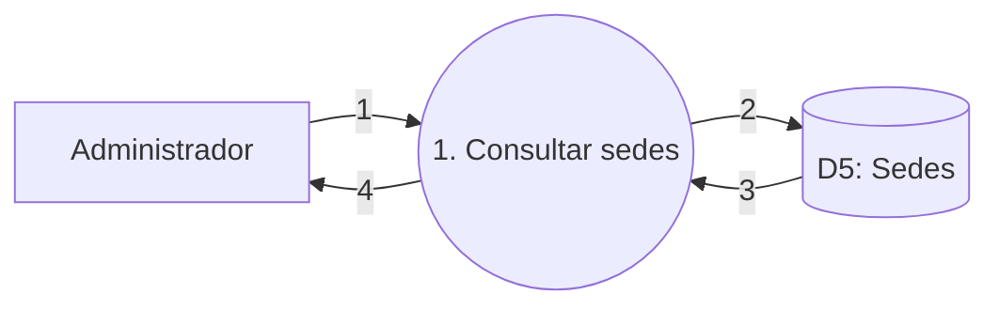

**Datos que circulan**

1. Criterio de estado o identificador de la sede seleccionada.
2. Criterios de consulta de sedes.
3. Datos de las sedes encontradas.
4. Listado o detalle de la sede.

### DFD 2: dar de alta una sede

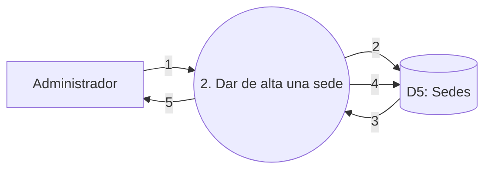

**Datos que circulan**

1. Datos de la nueva sede.
2. Nombre de la sede que debe validarse.
3. Coincidencias existentes para ese nombre.
4. Datos validados de la sede activa.
5. Resultado del alta o errores de validación.

### DFD 3: modificar una sede

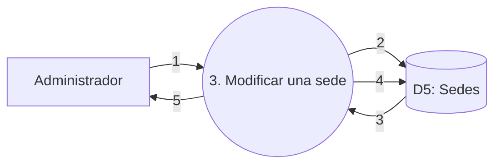

**Datos que circulan**

1. Identificador y datos modificables de la sede.
2. Identificador y nombre que deben validarse.
3. Datos actuales de la sede y coincidencias de nombre.
4. Nombre, dirección, observaciones y fecha de modificación actualizados.
5. Resultado de la modificación o errores de validación.

### DFD 4: activar una sede

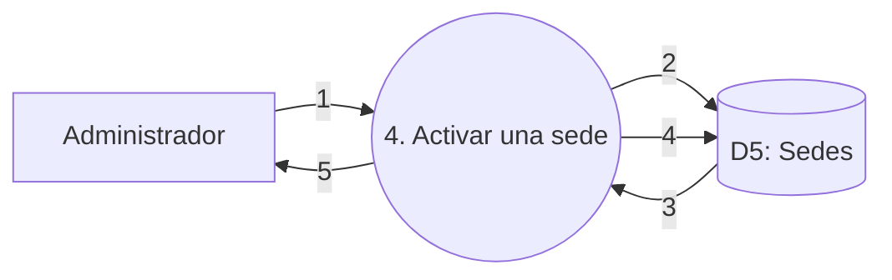

**Datos que circulan**

1. Sede seleccionada y confirmación de activación.
2. Identificador de la sede.
3. Datos y estado actual de la sede.
4. Estado activo y fecha de modificación.
5. Resultado de la activación.

### DFD 5: desactivar una sede

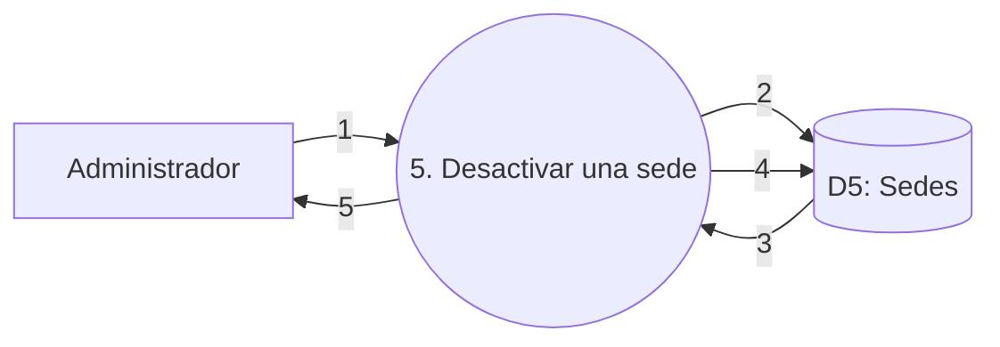

**Datos que circulan**

1. Sede seleccionada y confirmación de desactivación.
2. Identificador de la sede.
3. Datos y estado actual de la sede.
4. Estado inactivo y fecha de modificación.
5. Resultado de la desactivación.

---

## 3. Canchas

### DFD 6: consultar canchas de una sede

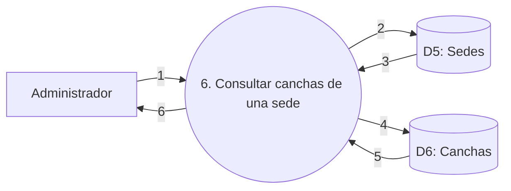

**Datos que circulan**

1. Sede seleccionada y criterio de estado de las canchas.
2. Identificador de la sede.
3. Datos de la sede encontrada.
4. Sede y criterio de consulta de canchas.
5. Datos de las canchas encontradas.
6. Listado o detalle de las canchas de la sede.

### DFD 7: dar de alta una cancha

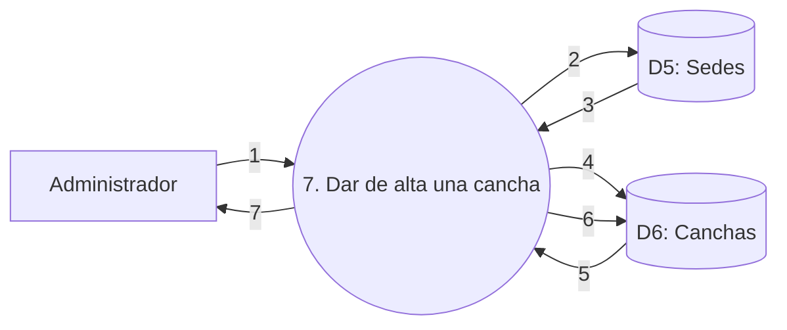

**Datos que circulan**

1. Sede seleccionada y datos de la nueva cancha.
2. Identificador de la sede.
3. Datos de la sede encontrada.
4. Sede y nombre de cancha que deben validarse.
5. Coincidencias existentes en esa sede.
6. Datos validados de la cancha activa y referencia a su sede.
7. Resultado del alta o errores de validación.

### DFD 8: modificar una cancha

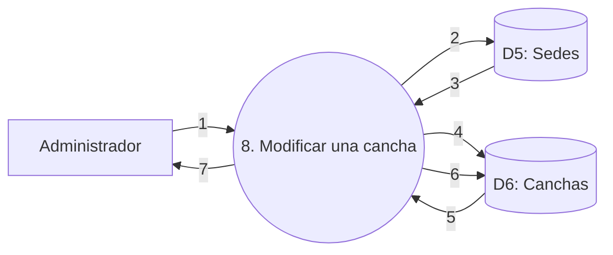

**Datos que circulan**

1. Sede, cancha seleccionada y datos modificables.
2. Identificador de la sede.
3. Datos de la sede encontrada.
4. Identificador de la cancha y nombre que debe validarse dentro de la sede.
5. Datos actuales de la cancha y coincidencias de nombre.
6. Nombre, superficie, observaciones y fecha de modificación actualizados.
7. Resultado de la modificación o errores de validación.

### DFD 9: activar una cancha

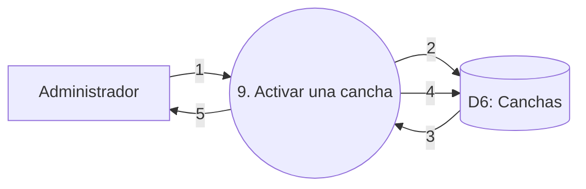

**Datos que circulan**

1. Cancha seleccionada y confirmación de activación.
2. Identificador de la cancha y de su sede.
3. Datos y estado actual de la cancha.
4. Estado activo y fecha de modificación.
5. Resultado de la activación.

### DFD 10: desactivar una cancha

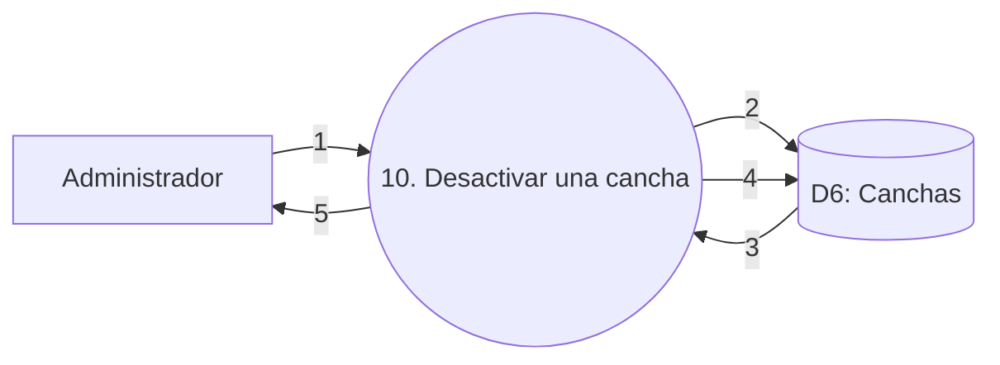

**Datos que circulan**

1. Cancha seleccionada y confirmación de desactivación.
2. Identificador de la cancha y de su sede.
3. Datos y estado actual de la cancha.
4. Estado inactivo y fecha de modificación.
5. Resultado de la desactivación.

---

## 4. Usuarios y roles

### DFD 11: dar de alta un usuario desde la administración

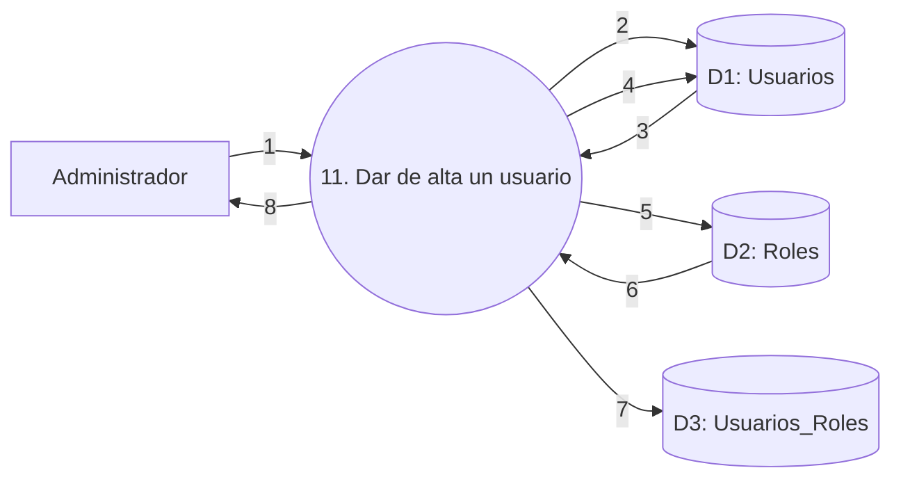

**Datos que circulan**

1. Datos del usuario, credenciales provisorias y roles seleccionados.
2. Email y nombre de usuario que deben validarse.
3. Coincidencias existentes para esos datos.
4. Datos del usuario activo, hash de contraseña y cambio obligatorio pendiente.
5. Códigos de los roles que deben asignarse.
6. Roles válidos del catálogo.
7. Asignaciones entre el usuario y sus roles.
8. Resultado del alta y credenciales provisorias.

### DFD 12: autorregistrar un usuario

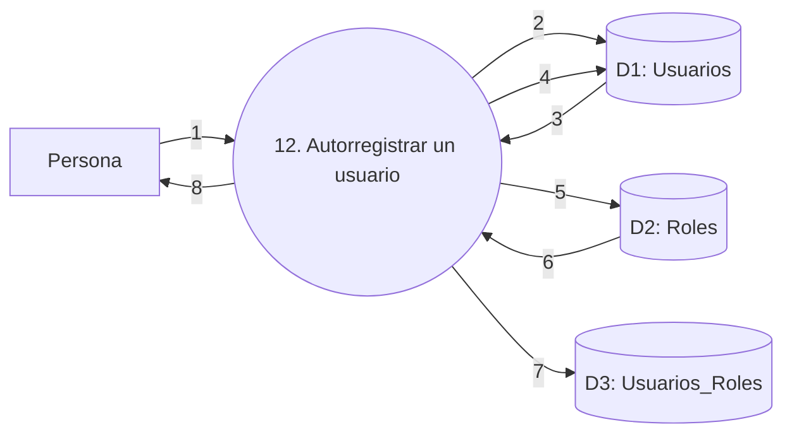

**Datos que circulan**

1. Datos personales y credenciales elegidas por la persona.
2. Email y nombre de usuario que deben validarse.
3. Coincidencias existentes para esos datos.
4. Datos del usuario activo, hash de contraseña y ausencia de cambio obligatorio.
5. Códigos de los roles Público y Reservas.
6. Roles automáticos del catálogo.
7. Asignaciones automáticas de Público y Reservas.
8. Resultado del autorregistro o errores de validación.

### DFD 13: consultar un usuario

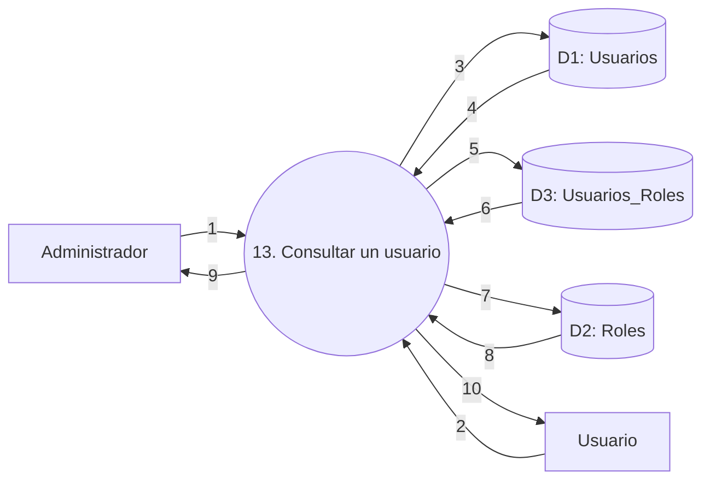

**Datos que circulan**

1. Criterios de búsqueda o identificador seleccionado por el administrador.
2. Identidad del usuario que consulta su propio perfil.
3. Criterios autorizados de consulta.
4. Datos de los usuarios encontrados.
5. Identificadores de los usuarios cuyos roles se consultan.
6. Asignaciones de roles de esos usuarios.
7. Identificadores de los roles asignados.
8. Datos descriptivos de los roles.
9. Listado o detalle solicitado por el administrador.
10. Datos del perfil propio.

### DFD 14: modificar el correo de un usuario

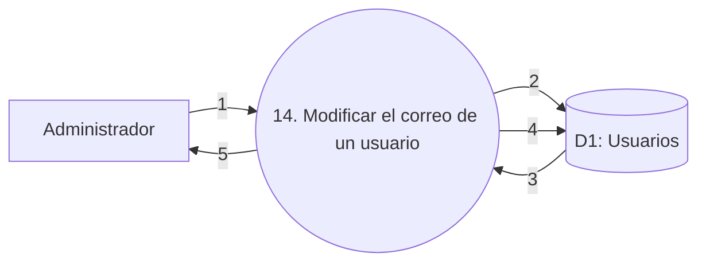

**Datos que circulan**

1. Usuario seleccionado y nuevo correo.
2. Identificador y correo que deben validarse.
3. Datos actuales del usuario y coincidencias de correo.
4. Nuevo correo y fecha de modificación.
5. Resultado de la modificación o errores de validación.

### DFD 15: activar un usuario

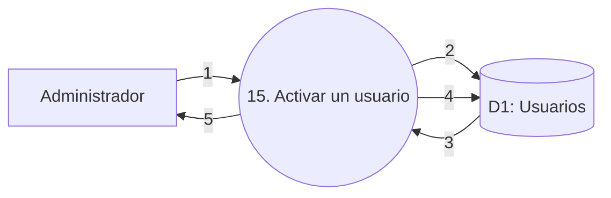

**Datos que circulan**

1. Usuario seleccionado y confirmación de activación.
2. Identificador del usuario.
3. Datos, estado y fecha de baja actuales.
4. Estado activo, fecha de baja vacía y fecha de modificación.
5. Resultado de la activación.

### DFD 16: desactivar un usuario

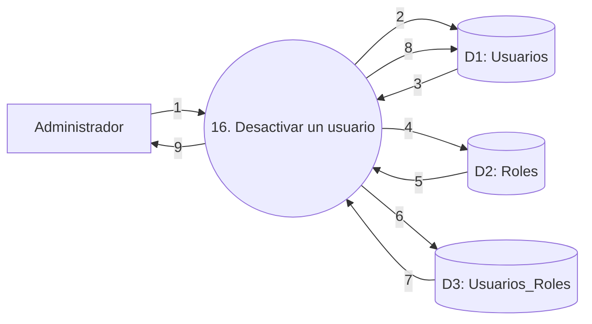

**Datos que circulan**

1. Usuario seleccionado y confirmación de desactivación.
2. Datos del usuario seleccionado y de los administradores activos.
3. Identidades y estados de las cuentas consultadas.
4. Código del rol Administrador.
5. Datos del rol Administrador.
6. Usuarios activos cuyas asignaciones deben comprobarse.
7. Asignaciones del rol Administrador encontradas.
8. Estado inactivo, fecha de baja y fecha de modificación.
9. Resultado de la desactivación o motivo del rechazo.

### DFD 17: asignar un rol a un usuario


**Datos que circulan**

1. Usuario y rol seleccionados.
2. Identificador del usuario.
3. Datos básicos del usuario encontrado.
4. Código del rol seleccionado.
5. Datos del rol permitido.
6. Usuario y rol cuya asignación debe comprobarse.
7. Asignación existente, si la hubiera.
8. Nueva asignación con el administrador que la realizó.
9. Resultado de la asignación o errores encontrados.

### DFD 18: retirar un rol de un usuario

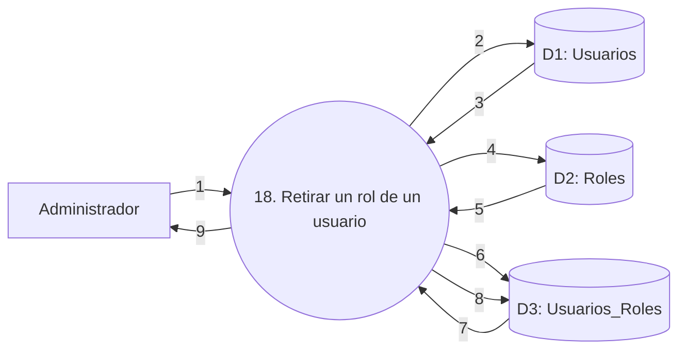

**Datos que circulan**

1. Usuario y rol seleccionados.
2. Identificador del usuario.
3. Datos básicos del usuario encontrado.
4. Código del rol seleccionado.
5. Datos del rol permitido.
6. Usuario y rol cuya asignación debe consultarse.
7. Asignación existente y datos necesarios para validar el retiro.
8. Asignación que debe eliminarse.
9. Resultado del retiro o motivo del rechazo.

### DFD 19: restablecer la contraseña de otro usuario

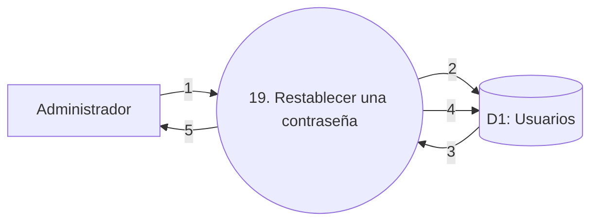

**Datos que circulan**

1. Otro usuario seleccionado y confirmación del restablecimiento.
2. Identificador del usuario.
3. Datos de la cuenta y validadores aplicables.
4. Nuevo hash, cambio obligatorio pendiente y fecha de modificación.
5. Resultado y contraseña provisoria mostrada una única vez.

---

## 5. Acceso y contraseñas

### DFD 20: iniciar sesión normalmente

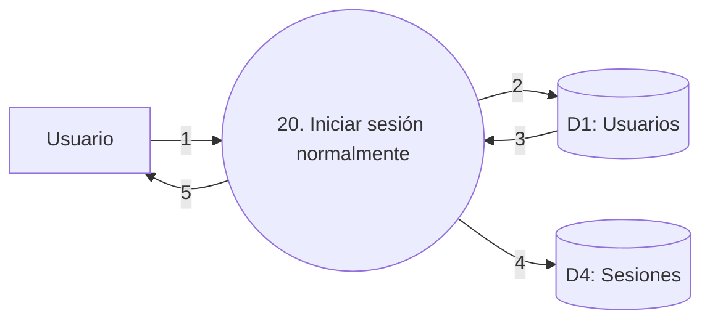

**Datos que circulan**

1. Nombre de usuario y contraseña personal.
2. Nombre de usuario que debe autenticarse.
3. Cuenta activa, hash almacenado y ausencia de cambio obligatorio.
4. Datos de la sesión autenticada.
5. Acceso normal o error de autenticación.

### DFD 21: iniciar sesión con una contraseña provisoria

```mermaid
flowchart LR
    U[Usuario]
    P((21. Iniciar sesión con contraseña provisoria))
    D1[(D1: Usuarios)]
    D4[(D4: Sesiones)]

    U -->|1| P
    P -->|2| D1
    D1 -->|3| P
    P -->|4| D4
    P -->|5| U
```

**Datos que circulan**

1. Nombre de usuario y contraseña provisoria.
2. Nombre de usuario que debe autenticarse.
3. Cuenta activa, hash almacenado y cambio obligatorio pendiente.
4. Datos de la sesión autenticada.
5. Acceso restringido al reemplazo obligatorio o error de autenticación.

### DFD 22: reemplazar una contraseña provisoria

```mermaid
flowchart LR
    U[Usuario]
    P((22. Reemplazar contraseña provisoria))
    D1[(D1: Usuarios)]
    D4[(D4: Sesiones)]

    U -->|1| P
    P -->|2| D1
    D1 -->|3| P
    P -->|4| D1
    P -->|5| D4
    P -->|6| U
```

**Datos que circulan**

1. Contraseña provisoria actual y nueva contraseña personal.
2. Identidad del usuario autenticado.
3. Hash vigente y cambio obligatorio pendiente.
4. Nuevo hash, cambio obligatorio desactivado y fecha de modificación.
5. Datos actualizados de la sesión autenticada.
6. Acceso normal o errores de validación.

### DFD 23: cambiar la contraseña propia

```mermaid
flowchart LR
    U[Usuario]
    P((23. Cambiar la contraseña propia))
    D1[(D1: Usuarios)]
    D4[(D4: Sesiones)]

    U -->|1| P
    P -->|2| D1
    D1 -->|3| P
    P -->|4| D1
    P -->|5| D4
    P -->|6| U
```

**Datos que circulan**

1. Contraseña actual y nueva contraseña.
2. Identidad del usuario autenticado.
3. Hash vigente y ausencia de cambio obligatorio.
4. Nuevo hash y fecha de modificación.
5. Datos actualizados de la sesión autenticada.
6. Resultado del cambio o errores de validación.

### DFD 24: cerrar sesión

```mermaid
flowchart LR
    U[Usuario]
    P((24. Cerrar sesión))
    D4[(D4: Sesiones)]

    U -->|1| P
    P -->|2| D4
    D4 -->|3| P
    P -->|4| D4
    P -->|5| U
```

**Datos que circulan**

1. Solicitud de cierre de la sesión actual.
2. Identificador de la sesión.
3. Datos de la sesión autenticada.
4. Sesión que debe invalidarse.
5. Confirmación del cierre de sesión.
