# Diagramas de Flujo de Datos

## 1. Criterio de representación

Este documento contiene los DFD de nivel 1 correspondientes a las funciones de usuarios, sedes, canchas, precios de reservas por sede, registro de reservas, consulta del listado, consulta de su detalle y anulación. Los demás procesos del sistema están pendientes de representación.

Cada diagrama representa una sola intención y contiene:

- entidades externas que entregan o reciben datos;
- un único proceso, con un nombre concreto y no ambiguo;
- los almacenes consultados o modificados;
- los flujos de datos entre esos elementos.

Los números escritos sobre las flechas identifican los datos descriptos debajo de cada diagrama. No expresan orden, tiempo ni una secuencia de ejecución. Dos flujos pueden producirse al mismo tiempo y un DFD no indica que un proceso deba ejecutarse antes o después de otro. La numeración de los diagramas solo permite identificarlos y tampoco establece un orden de ejecución.

### Almacenes

- **D1: Usuarios**
- **D2: Roles**
- **D3: Usuarios_Roles**
- **D4: Sesiones** (almacén técnico de autenticación)
- **D5: Sedes**
- **D6: Canchas**
- **D7: Precios de reservas**
- **D8: Horarios de sedes**
- **D9: Turnos**
- **D10: Reservas**
- **D11: Detalles de reservas**

---

## 2. Sedes

### DFD 1: consultar sedes

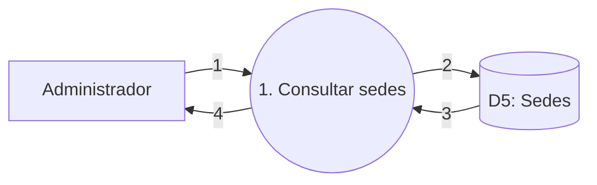
```mermaid
flowchart LR
    A[Administrador]
    P((1. Consultar sedes))
    D5[(D5: Sedes)]

    A -->|1| P
    P -->|2| D5
    D5 -->|3| P
    P -->|4| A
```

**Datos que circulan**

1. Criterio de estado o identificador de la sede seleccionada.
2. Criterios de consulta de sedes.
3. Datos de las sedes encontradas.
4. Listado o detalle de la sede.

### DFD 2: dar de alta una sede

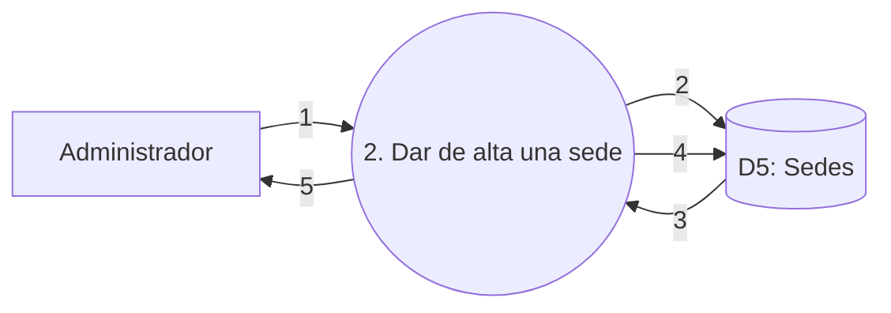
```mermaid
flowchart LR
    A[Administrador]
    P((2. Dar de alta una sede))
    D5[(D5: Sedes)]

    A -->|1| P
    P -->|2| D5
    D5 -->|3| P
    P -->|4| D5
    P -->|5| A
```

**Datos que circulan**

1. Datos de la nueva sede.
2. Nombre de la sede que debe validarse.
3. Coincidencias existentes para ese nombre.
4. Datos validados de la sede activa.
5. Resultado del alta o errores de validación.

### DFD 3: modificar una sede

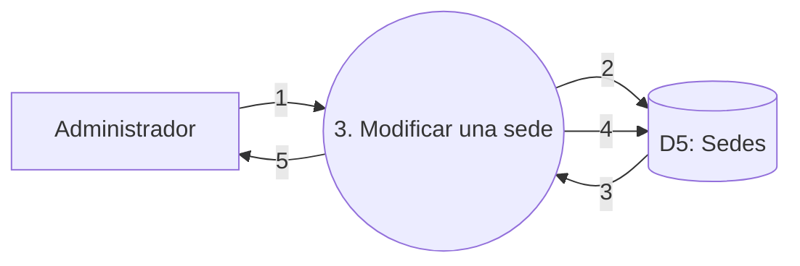
```mermaid
flowchart LR
    A[Administrador]
    P((3. Modificar una sede))
    D5[(D5: Sedes)]

    A -->|1| P
    P -->|2| D5
    D5 -->|3| P
    P -->|4| D5
    P -->|5| A
```

**Datos que circulan**

1. Identificador y datos modificables de la sede.
2. Identificador y nombre que deben validarse.
3. Datos actuales de la sede y coincidencias de nombre.
4. Nombre, dirección, observaciones y fecha de modificación actualizados.
5. Resultado de la modificación o errores de validación.

### DFD 4: activar una sede

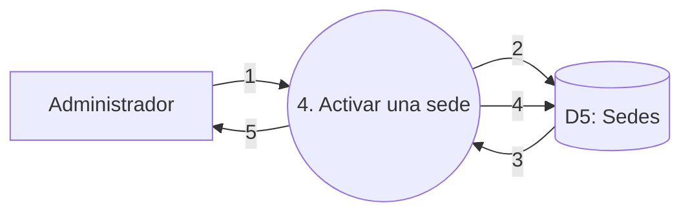
```mermaid
flowchart LR
    A[Administrador]
    P((4. Activar una sede))
    D5[(D5: Sedes)]

    A -->|1| P
    P -->|2| D5
    D5 -->|3| P
    P -->|4| D5
    P -->|5| A
```

**Datos que circulan**

1. Sede seleccionada y confirmación de activación.
2. Identificador de la sede.
3. Datos y estado actual de la sede.
4. Estado activo y fecha de modificación.
5. Resultado de la activación.

### DFD 5: desactivar una sede

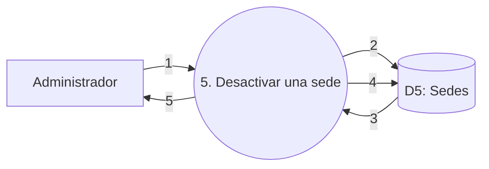
```mermaid
flowchart LR
    A[Administrador]
    P((5. Desactivar una sede))
    D5[(D5: Sedes)]

    A -->|1| P
    P -->|2| D5
    D5 -->|3| P
    P -->|4| D5
    P -->|5| A
```

**Datos que circulan**

1. Sede seleccionada y confirmación de desactivación.
2. Identificador de la sede.
3. Datos y estado actual de la sede.
4. Estado inactivo y fecha de modificación.
5. Resultado de la desactivación.

---

## 3. Canchas

### DFD 6: consultar canchas de una sede

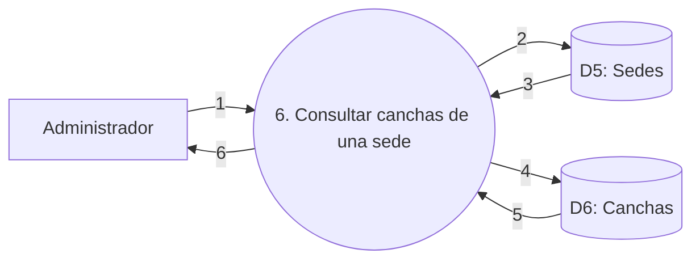
```mermaid
flowchart LR
    A[Administrador]
    P((6. Consultar canchas de una sede))
    D5[(D5: Sedes)]
    D6[(D6: Canchas)]

    A -->|1| P
    P -->|2| D5
    D5 -->|3| P
    P -->|4| D6
    D6 -->|5| P
    P -->|6| A
```

**Datos que circulan**

1. Sede seleccionada y criterio de estado de las canchas.
2. Identificador de la sede.
3. Datos de la sede encontrada.
4. Sede y criterio de consulta de canchas.
5. Datos de las canchas encontradas.
6. Listado o detalle de las canchas de la sede.

### DFD 7: dar de alta una cancha

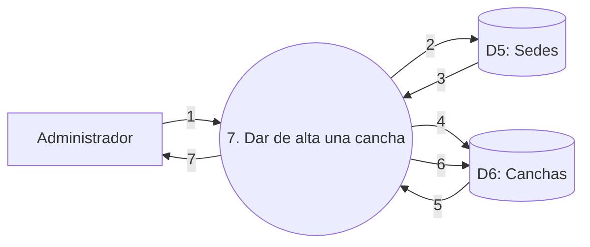
```mermaid
flowchart LR
    A[Administrador]
    P((7. Dar de alta una cancha))
    D5[(D5: Sedes)]
    D6[(D6: Canchas)]

    A -->|1| P
    P -->|2| D5
    D5 -->|3| P
    P -->|4| D6
    D6 -->|5| P
    P -->|6| D6
    P -->|7| A
```

**Datos que circulan**

1. Sede seleccionada y datos de la nueva cancha.
2. Identificador de la sede.
3. Datos de la sede encontrada.
4. Sede y nombre de cancha que deben validarse.
5. Coincidencias existentes en esa sede.
6. Datos validados de la cancha activa y referencia a su sede.
7. Resultado del alta o errores de validación.

### DFD 8: modificar una cancha

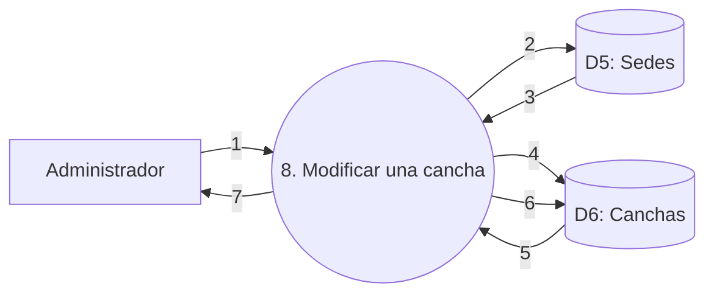
```mermaid
flowchart LR
    A[Administrador]
    P((8. Modificar una cancha))
    D5[(D5: Sedes)]
    D6[(D6: Canchas)]

    A -->|1| P
    P -->|2| D5
    D5 -->|3| P
    P -->|4| D6
    D6 -->|5| P
    P -->|6| D6
    P -->|7| A
```

**Datos que circulan**

1. Sede, cancha seleccionada y datos modificables.
2. Identificador de la sede.
3. Datos de la sede encontrada.
4. Identificador de la cancha y nombre que debe validarse dentro de la sede.
5. Datos actuales de la cancha y coincidencias de nombre.
6. Nombre, superficie, observaciones y fecha de modificación actualizados.
7. Resultado de la modificación o errores de validación.

### DFD 9: activar una cancha

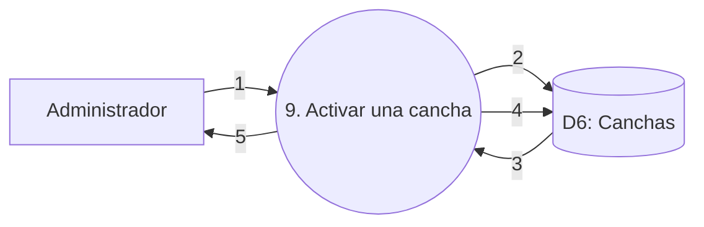
```mermaid
flowchart LR
    A[Administrador]
    P((9. Activar una cancha))
    D6[(D6: Canchas)]

    A -->|1| P
    P -->|2| D6
    D6 -->|3| P
    P -->|4| D6
    P -->|5| A
```

**Datos que circulan**

1. Cancha seleccionada y confirmación de activación.
2. Identificador de la cancha y de su sede.
3. Datos y estado actual de la cancha.
4. Estado activo y fecha de modificación.
5. Resultado de la activación.

### DFD 10: desactivar una cancha

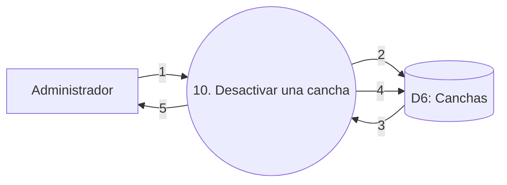
```mermaid
flowchart LR
    A[Administrador]
    P((10. Desactivar una cancha))
    D6[(D6: Canchas)]

    A -->|1| P
    P -->|2| D6
    D6 -->|3| P
    P -->|4| D6
    P -->|5| A
```

**Datos que circulan**

1. Cancha seleccionada y confirmación de desactivación.
2. Identificador de la cancha y de su sede.
3. Datos y estado actual de la cancha.
4. Estado inactivo y fecha de modificación.
5. Resultado de la desactivación.

---

## 4. Usuarios y roles

### DFD 11: dar de alta un usuario desde la administración

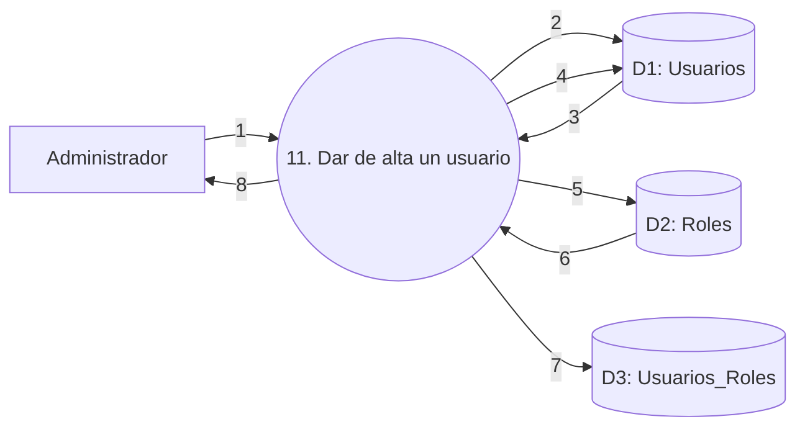
```mermaid
flowchart LR
    A[Administrador]
    P((11. Dar de alta un usuario))
    D1[(D1: Usuarios)]
    D2[(D2: Roles)]
    D3[(D3: Usuarios_Roles)]

    A -->|1| P
    P -->|2| D1
    D1 -->|3| P
    P -->|4| D1
    P -->|5| D2
    D2 -->|6| P
    P -->|7| D3
    P -->|8| A
```

**Datos que circulan**

1. Datos del usuario, contraseña provisoria y roles seleccionados.
2. Email y nombre de usuario generado que deben validarse.
3. Coincidencias existentes para esos datos.
4. Datos del usuario activo, hash de contraseña y cambio obligatorio pendiente.
5. Códigos de los roles que deben asignarse.
6. Roles válidos del catálogo.
7. Asignaciones entre el usuario y sus roles.
8. Resultado del alta y credenciales provisorias.

### DFD 12: autorregistrar un usuario

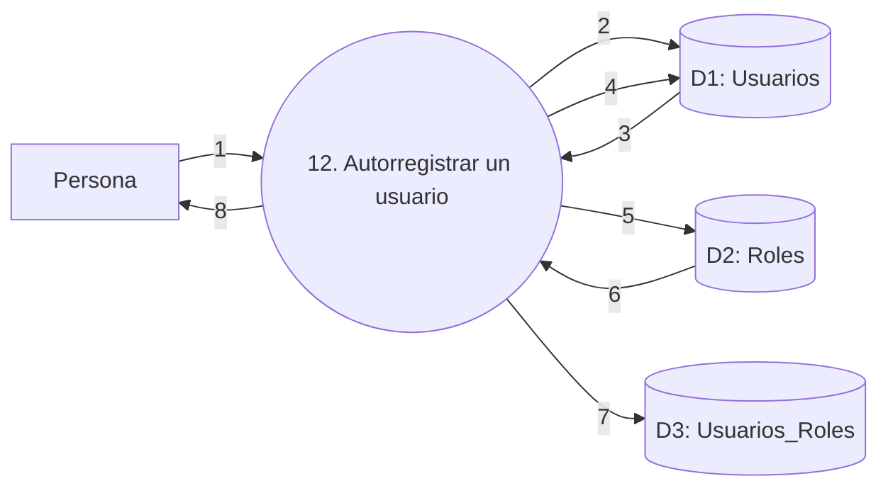
```mermaid
flowchart LR
    V[Persona]
    P((12. Autorregistrar un usuario))
    D1[(D1: Usuarios)]
    D2[(D2: Roles)]
    D3[(D3: Usuarios_Roles)]

    V -->|1| P
    P -->|2| D1
    D1 -->|3| P
    P -->|4| D1
    P -->|5| D2
    D2 -->|6| P
    P -->|7| D3
    P -->|8| V
```

**Datos que circulan**

1. Datos personales y contraseña elegida por la persona.
2. Email y nombre de usuario generado que deben validarse.
3. Coincidencias existentes para esos datos.
4. Datos del usuario activo, hash de contraseña y ausencia de cambio obligatorio.
5. Códigos de los roles Público y Reservas.
6. Roles automáticos del catálogo.
7. Asignaciones automáticas de Público y Reservas.
8. Resultado del autorregistro o errores de validación.

### DFD 13: consultar un usuario

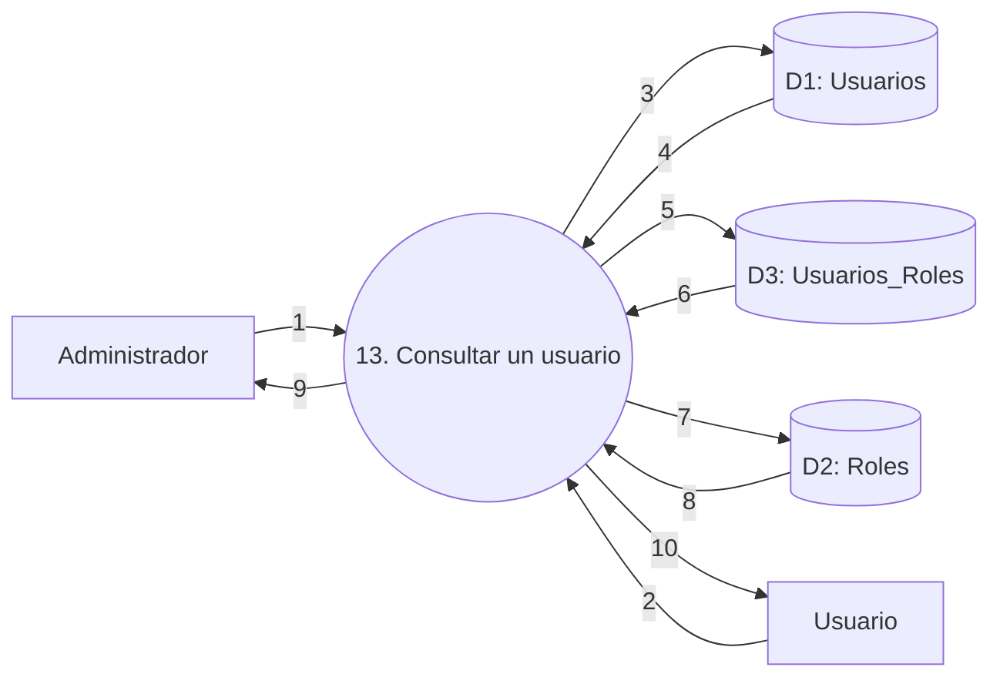
```mermaid
flowchart LR
    A[Administrador]
    U[Usuario]
    P((13. Consultar un usuario))
    D1[(D1: Usuarios)]
    D2[(D2: Roles)]
    D3[(D3: Usuarios_Roles)]

    A -->|1| P
    U -->|2| P
    P -->|3| D1
    D1 -->|4| P
    P -->|5| D3
    D3 -->|6| P
    P -->|7| D2
    D2 -->|8| P
    P -->|9| A
    P -->|10| U
```

**Datos que circulan**

1. Criterios de búsqueda o identificador seleccionado por el administrador.
2. Identidad del usuario que consulta su propio perfil.
3. Criterios autorizados de consulta.
4. Datos de los usuarios encontrados.
5. Identificadores de los usuarios cuyos roles se consultan.
6. Asignaciones de roles de esos usuarios.
7. Identificadores de los roles asignados.
8. Datos descriptivos de los roles.
9. Listado o detalle solicitado por el administrador.
10. Datos del perfil propio.

### DFD 14: modificar el correo de un usuario

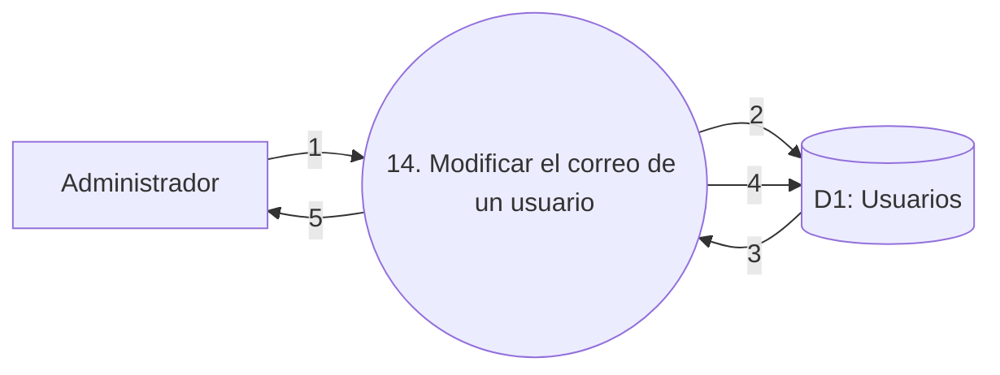
```mermaid
flowchart LR
    A[Administrador]
    P((14. Modificar el correo de un usuario))
    D1[(D1: Usuarios)]

    A -->|1| P
    P -->|2| D1
    D1 -->|3| P
    P -->|4| D1
    P -->|5| A
```

**Datos que circulan**

1. Usuario seleccionado y nuevo correo.
2. Identificador y correo que deben validarse.
3. Datos actuales del usuario y coincidencias de correo.
4. Nuevo correo y fecha de modificación.
5. Resultado de la modificación o errores de validación.

### DFD 15: activar un usuario

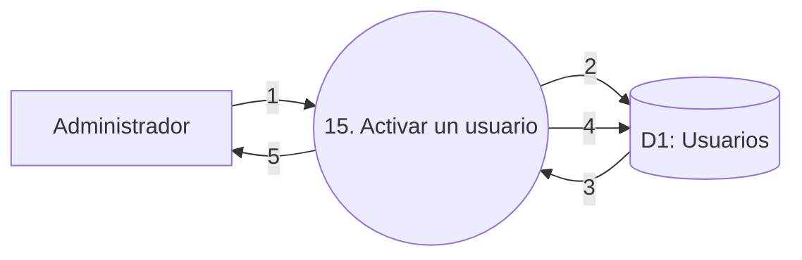
```mermaid
flowchart LR
    A[Administrador]
    P((15. Activar un usuario))
    D1[(D1: Usuarios)]

    A -->|1| P
    P -->|2| D1
    D1 -->|3| P
    P -->|4| D1
    P -->|5| A
```

**Datos que circulan**

1. Usuario seleccionado y confirmación de activación.
2. Identificador del usuario.
3. Datos, estado y fecha de baja actuales.
4. Estado activo, fecha de baja vacía y fecha de modificación.
5. Resultado de la activación.

### DFD 16: desactivar un usuario

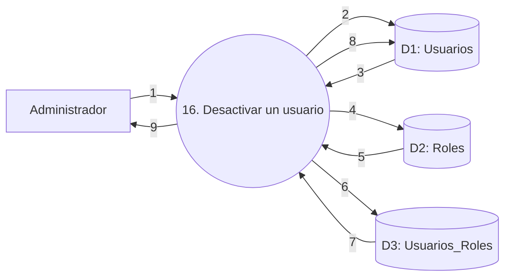
```mermaid
flowchart LR
    A[Administrador]
    P((16. Desactivar un usuario))
    D1[(D1: Usuarios)]
    D2[(D2: Roles)]
    D3[(D3: Usuarios_Roles)]

    A -->|1| P
    P -->|2| D1
    D1 -->|3| P
    P -->|4| D2
    D2 -->|5| P
    P -->|6| D3
    D3 -->|7| P
    P -->|8| D1
    P -->|9| A
```

**Datos que circulan**

1. Usuario seleccionado y confirmación de desactivación.
2. Datos del usuario seleccionado y de los administradores activos.
3. Identidades y estados de las cuentas consultadas.
4. Código del rol Administrador.
5. Datos del rol Administrador.
6. Usuarios activos cuyas asignaciones deben comprobarse.
7. Asignaciones del rol Administrador encontradas.
8. Estado inactivo, fecha de baja y fecha de modificación.
9. Resultado de la desactivación o motivo del rechazo.

### DFD 17: asignar un rol a un usuario

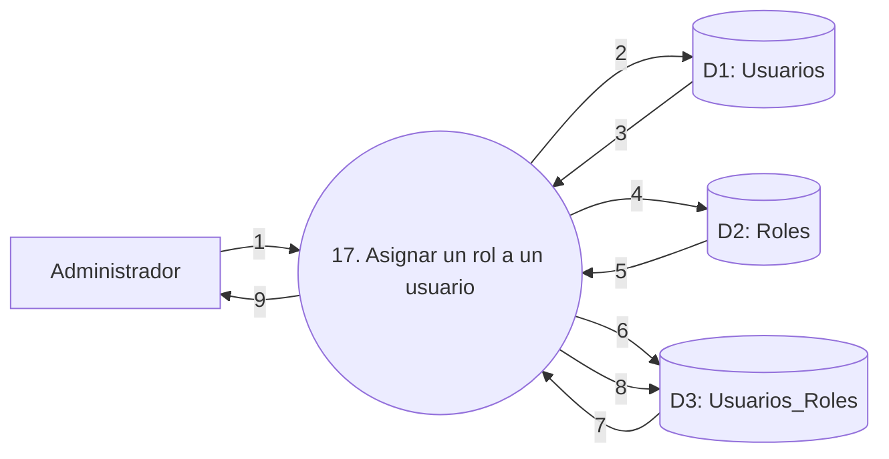
```mermaid
flowchart LR
    A[Administrador]
    P((17. Asignar un rol a un usuario))
    D1[(D1: Usuarios)]
    D2[(D2: Roles)]
    D3[(D3: Usuarios_Roles)]

    A -->|1| P
    P -->|2| D1
    D1 -->|3| P
    P -->|4| D2
    D2 -->|5| P
    P -->|6| D3
    D3 -->|7| P
    P -->|8| D3
    P -->|9| A
```

**Datos que circulan**

1. Usuario y rol seleccionados.
2. Identificador del usuario.
3. Datos básicos del usuario encontrado.
4. Código del rol seleccionado.
5. Datos del rol permitido.
6. Usuario y rol cuya asignación debe comprobarse.
7. Asignación existente, si la hubiera.
8. Nueva asignación con el administrador que la realizó.
9. Resultado de la asignación o errores encontrados.

### DFD 18: retirar un rol de un usuario

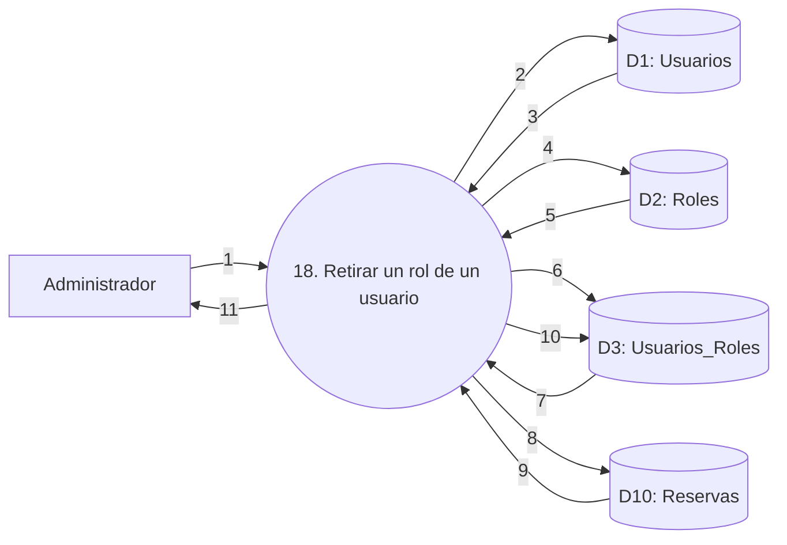
```mermaid
flowchart LR
    A[Administrador]
    P((18. Retirar un rol de un usuario))
    D1[(D1: Usuarios)]
    D2[(D2: Roles)]
    D3[(D3: Usuarios_Roles)]
    D10[(D10: Reservas)]

    A -->|1| P
    P -->|2| D1
    D1 -->|3| P
    P -->|4| D2
    D2 -->|5| P
    P -->|6| D3
    D3 -->|7| P
    P -->|8| D10
    D10 -->|9| P
    P -->|10| D3
    P -->|11| A
```

**Datos que circulan**

1. Usuario y rol seleccionados.
2. Identificador del usuario.
3. Datos básicos del usuario encontrado.
4. Código del rol seleccionado.
5. Datos del rol permitido.
6. Usuario y rol cuya asignación debe consultarse.
7. Asignación existente y datos necesarios para validar el retiro.
8. Usuario para consultar sus reservas Programadas cuando se retira el rol Reservas.
9. Reservas Programadas del usuario, si las hay.
10. Asignación que debe eliminarse.
11. Resultado del retiro o motivo del rechazo.

### DFD 19: restablecer la contraseña de otro usuario

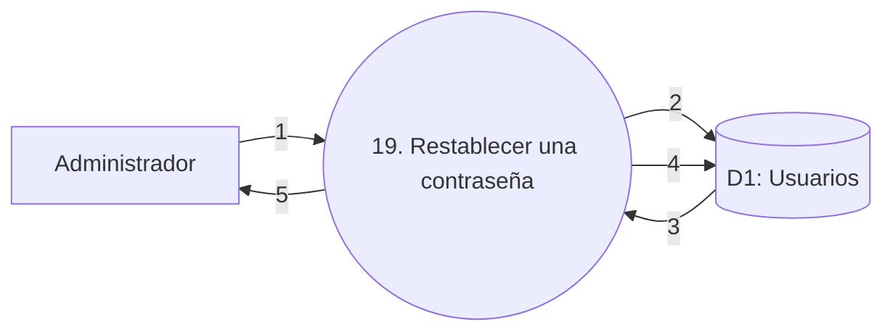
```mermaid
flowchart LR
    A[Administrador]
    P((19. Restablecer una contraseña))
    D1[(D1: Usuarios)]

    A -->|1| P
    P -->|2| D1
    D1 -->|3| P
    P -->|4| D1
    P -->|5| A
```

**Datos que circulan**

1. Otro usuario seleccionado y confirmación del restablecimiento.
2. Identificador del usuario.
3. Datos de la cuenta y validadores aplicables.
4. Nuevo hash, cambio obligatorio pendiente y fecha de modificación.
5. Resultado y contraseña provisoria mostrada una única vez.

---

## 5. Acceso y contraseñas

### DFD 20: iniciar sesión normalmente

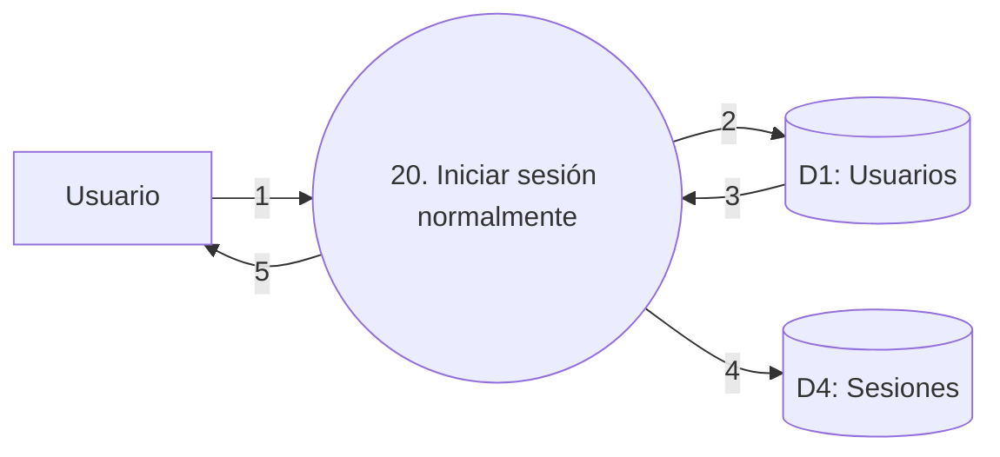
```mermaid
flowchart LR
    U[Usuario]
    P((20. Iniciar sesión normalmente))
    D1[(D1: Usuarios)]
    D4[(D4: Sesiones)]

    U -->|1| P
    P -->|2| D1
    D1 -->|3| P
    P -->|4| D4
    P -->|5| U
```

**Datos que circulan**

1. Nombre de usuario y contraseña personal.
2. Nombre de usuario que debe autenticarse.
3. Cuenta activa, hash almacenado y ausencia de cambio obligatorio.
4. Datos de la sesión autenticada.
5. Acceso normal o error de autenticación.

### DFD 21: iniciar sesión con una contraseña provisoria

```mermaid
flowchart LR
    U[Usuario]
    P((21. Iniciar sesión con contraseña provisoria))
    D1[(D1: Usuarios)]
    D4[(D4: Sesiones)]

    U -->|1| P
    P -->|2| D1
    D1 -->|3| P
    P -->|4| D4
    P -->|5| U
```

**Datos que circulan**

1. Nombre de usuario y contraseña provisoria.
2. Nombre de usuario que debe autenticarse.
3. Cuenta activa, hash almacenado y cambio obligatorio pendiente.
4. Datos de la sesión autenticada.
5. Acceso restringido al reemplazo obligatorio o error de autenticación.

### DFD 22: reemplazar una contraseña provisoria

```mermaid
flowchart LR
    U[Usuario]
    P((22. Reemplazar contraseña provisoria))
    D1[(D1: Usuarios)]
    D4[(D4: Sesiones)]

    U -->|1| P
    P -->|2| D1
    D1 -->|3| P
    P -->|4| D1
    P -->|5| D4
    P -->|6| U
```

**Datos que circulan**

1. Contraseña provisoria actual y nueva contraseña personal.
2. Identidad del usuario autenticado.
3. Hash vigente y cambio obligatorio pendiente.
4. Nuevo hash, cambio obligatorio desactivado y fecha de modificación.
5. Datos actualizados de la sesión autenticada.
6. Acceso normal o errores de validación.

### DFD 23: cambiar la contraseña propia

```mermaid
flowchart LR
    U[Usuario]
    P((23. Cambiar la contraseña propia))
    D1[(D1: Usuarios)]
    D4[(D4: Sesiones)]

    U -->|1| P
    P -->|2| D1
    D1 -->|3| P
    P -->|4| D1
    P -->|5| D4
    P -->|6| U
```

**Datos que circulan**

1. Contraseña actual y nueva contraseña.
2. Identidad del usuario autenticado.
3. Hash vigente y ausencia de cambio obligatorio.
4. Nuevo hash y fecha de modificación.
5. Datos actualizados de la sesión autenticada.
6. Resultado del cambio o errores de validación.

### DFD 24: cerrar sesión

```mermaid
flowchart LR
    U[Usuario]
    P((24. Cerrar sesión))
    D4[(D4: Sesiones)]

    U -->|1| P
    P -->|2| D4
    D4 -->|3| P
    P -->|4| D4
    P -->|5| U
```

**Datos que circulan**

1. Solicitud de cierre de la sesión actual.
2. Identificador de la sesión.
3. Datos de la sesión autenticada.
4. Sesión que debe invalidarse.
5. Confirmación del cierre de sesión.

---

## 6. Precios de reservas por sede

### DFD 25: consultar precios de reservas de una sede

```mermaid
flowchart LR
    A[Administrador]
    P((25. Consultar precios de reservas de una sede))
    D5[(D5: Sedes)]
    D7[(D7: Precios de reservas)]

    A -->|1| P
    P -->|2| D5
    D5 -->|3| P
    P -->|4| D7
    D7 -->|5| P
    P -->|6| A
```

**Datos que circulan**

1. Sede seleccionada y filtro de estado.
2. Identificador de la sede consultada.
3. Datos de la sede.
4. Criterios de consulta de precios de esa sede.
5. Precio activo y precios históricos encontrados.
6. Tabla de precios por turno de la sede, con importes, estados y fechas de creación y desactivación.

### DFD 26: registrar un precio por turno en una sede

```mermaid
flowchart LR
    A[Administrador]
    P((26. Registrar un precio por turno en una sede))
    D5[(D5: Sedes)]
    D7[(D7: Precios de reservas)]

    A -->|1| P
    P -->|2| D5
    D5 -->|3| P
    P -->|4| D7
    D7 -->|5| P
    P -->|6| D7
    P -->|7| A
```

**Datos que circulan**

1. Sede seleccionada, importe por turno y confirmación del alta.
2. Identificador de la sede seleccionada.
3. Datos de la sede.
4. Sede para consultar su precio activo.
5. Precio activo existente para esa sede, si lo hay.
6. Nuevo precio de la sede, con importe por turno, estado Activo y fechas de registración.
7. Resultado del alta o errores de validación.

### DFD 27: actualizar el precio por turno de una sede

```mermaid
flowchart LR
    A[Administrador]
    P((27. Actualizar el precio por turno de una sede))
    D5[(D5: Sedes)]
    D7[(D7: Precios de reservas)]

    A -->|1| P
    P -->|2| D5
    D5 -->|3| P
    P -->|4| D7
    D7 -->|5| P
    P -->|6| D7
    P -->|7| D7
    P -->|8| A
```

**Datos que circulan**

1. Sede y precio seleccionados, nuevo importe por turno y confirmación.
2. Identificador de la sede consultada.
3. Datos de la sede.
4. Identificadores de la sede y precio consultados.
5. Importe y estado del precio seleccionado.
6. Estado Inactivo y fecha de desactivación del precio sustituido.
7. Nuevo precio por turno de la sede, con estado Activo y fechas de registración.
8. Resultado de la actualización o errores de validación.

---

## 7. Reservas de cancha

### DFD 28: registrar una reserva de cancha

```mermaid
flowchart LR
    U[Administrador o usuario con rol Reservas]
    P((28. Registrar una reserva de cancha))
    D1[(D1: Usuarios)]
    D3[(D3: Usuarios_Roles)]
    D5[(D5: Sedes)]
    D6[(D6: Canchas)]
    D7[(D7: Precios de reservas)]
    D8[(D8: Horarios de sedes)]
    D9[(D9: Turnos)]
    D10[(D10: Reservas)]
    D11[(D11: Detalles de reservas)]

    U -->|1| P
    P -->|2| D1
    D1 -->|3| P
    P -->|4| D3
    D3 -->|5| P
    P -->|6| D5
    D5 -->|7| P
    P -->|8| D6
    D6 -->|9| P
    P -->|10| D7
    D7 -->|11| P
    P -->|12| D8
    D8 -->|13| P
    P -->|14| D9
    D9 -->|15| P
    P -->|16| D9
    P -->|17| D11
    D11 -->|18| P
    P -->|19| D10
    D10 -->|20| P
    P -->|21| D10
    P -->|22| D11
    P -->|23| U
```

**Datos que circulan**

1. Sede, cancha, fecha, organizador, turnos seleccionados, observaciones y confirmación.
2. Identidad del actor y del organizador.
3. Datos y estados de las cuentas, incluido el cambio obligatorio de contraseña del actor.
4. Usuario que solicita registrar la reserva.
5. Roles asignados al actor.
6. Sede seleccionada.
7. Datos y estado de la sede.
8. Cancha seleccionada.
9. Datos, sede y estado de la cancha.
10. Sede cuyo precio vigente debe aplicarse.
11. Identificación e importe del precio activo por turno.
12. Sede y día de la semana de la fecha elegida.
13. Franjas de funcionamiento para ese día.
14. Cancha, fecha y turnos seleccionados.
15. Turnos existentes con sus fechas y horas.
16. Turnos de una hora que faltan dentro de las franjas habilitadas.
17. Turnos para consultar sus vínculos con reservas.
18. Detalles que relacionan los turnos con sus reservas.
19. Reservas relacionadas con los turnos seleccionados.
20. Estados de las reservas que determinan la ocupación.
21. Nueva cabecera con organizador, responsable, precio aplicado, estado Programada, observaciones y fecha de registro.
22. Detalles que vinculan la nueva reserva con todos los turnos seleccionados.
23. Turnos ofrecidos, importes calculados y resultado del registro o errores de validación.

### DFD 29: consultar el detalle de una reserva

```mermaid
flowchart LR
    U[Administrador o usuario con rol Reservas]
    P((29. Consultar el detalle de una reserva))
    D1[(D1: Usuarios)]
    D3[(D3: Usuarios_Roles)]
    D5[(D5: Sedes)]
    D6[(D6: Canchas)]
    D7[(D7: Precios de reservas)]
    D9[(D9: Turnos)]
    D10[(D10: Reservas)]
    D11[(D11: Detalles de reservas)]

    U -->|1| P
    P -->|2| D10
    D10 -->|3| P
    P -->|4| D1
    D1 -->|5| P
    P -->|6| D11
    D11 -->|7| P
    P -->|8| D9
    D9 -->|9| P
    P -->|10| D6
    D6 -->|11| P
    P -->|12| D5
    D5 -->|13| P
    P -->|14| D7
    D7 -->|15| P
    P -->|16| U
    P -->|17| D3
    D3 -->|18| P
```

**Datos que circulan**

1. Reserva seleccionada e identidad del usuario que consulta.
2. Identificador de la reserva y criterio de acceso a las propias para el usuario del portal.
3. Cabecera de la reserva con organizador, responsables, estado, precio, observaciones y fechas de registro, anulación o finalización.
4. Identidad del actor e identificadores del organizador y de los responsables del registro, anulación o finalización.
5. Datos de los usuarios relacionados y estado de acceso del actor.
6. Reserva cuyos detalles deben consultarse.
7. Vínculos de la reserva con sus turnos.
8. Turnos incluidos en los detalles.
9. Fecha de uso, horas y cancha de cada turno.
10. Cancha de los turnos reservados.
11. Datos de la cancha y su sede.
12. Sede de la cancha reservada.
13. Datos de la sede.
14. Precio referenciado por la reserva.
15. Importe histórico por turno.
16. Detalle de la reserva con estado, usuarios, fecha, cancha, turnos, duración, subtotales, total y datos de anulación o finalización, o rechazo del acceso.
17. Usuario que solicita consultar el detalle.
18. Roles asignados al actor.

### DFD 30: consultar reservas de cancha

```mermaid
flowchart LR
    U[Administrador o usuario con rol Reservas]
    P((30. Consultar reservas de cancha))
    D1[(D1: Usuarios)]
    D3[(D3: Usuarios_Roles)]
    D5[(D5: Sedes)]
    D6[(D6: Canchas)]
    D7[(D7: Precios de reservas)]
    D9[(D9: Turnos)]
    D10[(D10: Reservas)]
    D11[(D11: Detalles de reservas)]

    U -->|1| P
    P -->|2| D1
    D1 -->|3| P
    P -->|4| D3
    D3 -->|5| P
    P -->|6| D5
    D5 -->|7| P
    P -->|8| D6
    D6 -->|9| P
    P -->|10| D9
    D9 -->|11| P
    P -->|12| D11
    D11 -->|13| P
    P -->|14| D10
    D10 -->|15| P
    P -->|16| D7
    D7 -->|17| P
    P -->|18| U
```

**Datos que circulan**

1. Identidad del actor y filtros opcionales de sede, cancha, fechas de uso y estado.
2. Identidad del actor y de los organizadores de las reservas consultadas.
3. Estado de acceso del actor y datos de los organizadores.
4. Usuario que solicita consultar reservas.
5. Roles asignados al actor.
6. Criterios de consulta de sedes para el filtro y el listado.
7. Datos de las sedes, incluidas las inactivas.
8. Sede seleccionada y canchas relacionadas con las reservas consultadas.
9. Datos de las canchas y su pertenencia a las sedes, incluidas las inactivas.
10. Cancha, rango de fechas de uso y turnos relacionados con las reservas consultadas.
11. Cancha, fecha y horas de los turnos.
12. Reservas y turnos cuyos vínculos deben consultarse.
13. Detalles que relacionan cada reserva con todos sus turnos.
14. Criterios de estado y acceso a todas las reservas o sólo a las propias.
15. Cabeceras de las reservas que cumplen los filtros.
16. Precios aplicados a las reservas consultadas.
17. Importes históricos por turno.
18. Opciones de filtros y listado con número, organizador cuando corresponde, sede, cancha, fecha, horario, total, estado y acceso al detalle, o errores de validación y acceso.

### DFD 31: anular una reserva de cancha

```mermaid
flowchart LR
    A[Administrador]
    P((31. Anular una reserva de cancha))
    D1[(D1: Usuarios)]
    D3[(D3: Usuarios_Roles)]
    D5[(D5: Sedes)]
    D6[(D6: Canchas)]
    D7[(D7: Precios de reservas)]
    D9[(D9: Turnos)]
    D10[(D10: Reservas)]
    D11[(D11: Detalles de reservas)]

    A -->|1| P
    P -->|2| D1
    D1 -->|3| P
    P -->|4| D3
    D3 -->|5| P
    P -->|6| D10
    D10 -->|7| P
    P -->|8| D11
    D11 -->|9| P
    P -->|10| D9
    D9 -->|11| P
    P -->|12| D6
    D6 -->|13| P
    P -->|14| D5
    D5 -->|15| P
    P -->|16| D7
    D7 -->|17| P
    P -->|18| D10
    P -->|19| A
```

**Datos que circulan**

1. Reserva seleccionada, motivo de anulación, identidad del actor y confirmación.
2. Identidad del actor y de los usuarios relacionados con la reserva.
3. Estado de acceso del actor y datos de los usuarios relacionados.
4. Usuario que solicita anular la reserva.
5. Roles asignados al actor.
6. Identificador de la reserva seleccionada.
7. Cabecera con estado, organizador, responsables, precio aplicado y datos de registro o anulación.
8. Reserva cuyos detalles deben consultarse.
9. Vínculos de la reserva con todos sus turnos.
10. Turnos incluidos en la reserva.
11. Fecha, hora de inicio, hora de fin y cancha de cada turno.
12. Cancha de los turnos reservados.
13. Datos de la cancha y su sede.
14. Sede de la cancha reservada.
15. Datos de la sede.
16. Precio aplicado a la reserva.
17. Importe histórico por turno para mostrar el total de la reserva.
18. Estado Anulada, motivo, fecha, hora y administrador responsable; este estado libera la ocupación de todos sus turnos.
19. Resultado de la anulación y detalle conservado de la reserva, o errores de validación y acceso.
