# Diagramas de Flujo de Datos

## 1. Criterio de representación

Este documento contiene los DFD de nivel 1 correspondientes a las funciones de usuarios, sedes, canchas, precios de reservas por sede, registro de reservas, consulta del listado, consulta de su detalle, anulación, finalización y emisión del comprobante. Los demás procesos del sistema están pendientes de representación. La ocupación y auditoría pertenecen a Eventos (D12); las reservas guardan sus datos específicos y se vinculan con sus turnos mediante Eventos_Turnos (D11). Una fecha y hora de fin se obtiene del último turno, sumando una hora a su inicio.

Cada diagrama representa una sola intención y contiene:

- entidades externas que entregan o reciben datos;
- un único proceso, con un nombre concreto y no ambiguo;
- los almacenes consultados o modificados;
- los flujos de datos entre esos elementos.

Los números escritos sobre las flechas identifican los datos descriptos debajo de cada diagrama. No expresan orden, tiempo ni una secuencia de ejecución. Dos flujos pueden producirse al mismo tiempo y un DFD no indica que un proceso deba ejecutarse antes o después de otro. La numeración de los diagramas solo permite identificarlos y tampoco establece un orden de ejecución.

### Almacenes

- **D1: Usuarios**
- **D2: Roles**
- **D3: Usuarios_Roles**
- **D4: Sesiones** (almacén técnico de autenticación)
- **D5: Sedes**
- **D6: Canchas**
- **D8: Horarios de sedes**
- **D9: Turnos**
- **D10: Reservas**
- **D11: Eventos_Turnos**
- **D12: Eventos**
- **D13: Pases_Usuarios**
- **D14: Pases**
- **D15: Invitados de reservas**
- **D16: Ingresos**
- **D17: Bloqueos**
- **D18: Orígenes de bloqueos**
- **D19: Clases**
- **D20: Profesores de clases**
- **D21: Planes_Usuarios**

---

## 2. Sedes

### DFD 1: consultar sedes

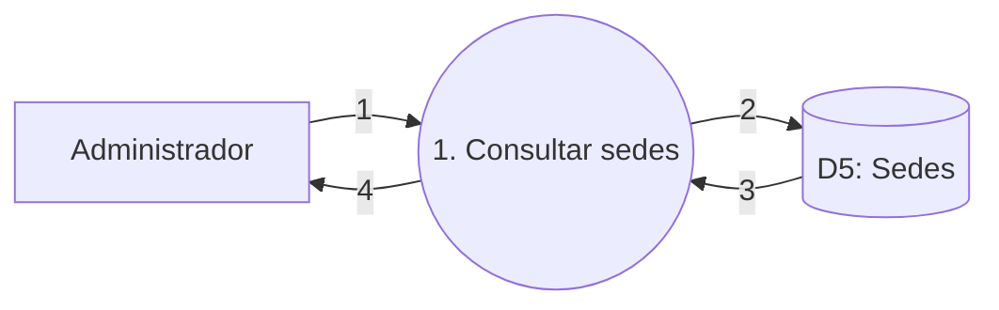
```mermaid
flowchart LR
    A[Administrador]
    P((1. Consultar sedes))
    D5[(D5: Sedes)]

    A -->|1| P
    P -->|2| D5
    D5 -->|3| P
    P -->|4| A
```

**Datos que circulan**

1. Criterio de estado o identificador de la sede seleccionada.
2. Criterios de consulta de sedes.
3. Datos de las sedes encontradas.
4. Listado o detalle de la sede.

### DFD 2: dar de alta una sede

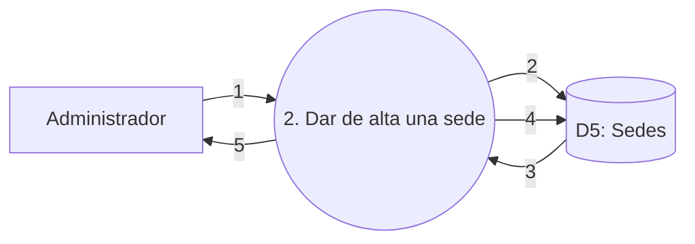
```mermaid
flowchart LR
    A[Administrador]
    P((2. Dar de alta una sede))
    D5[(D5: Sedes)]

    A -->|1| P
    P -->|2| D5
    D5 -->|3| P
    P -->|4| D5
    P -->|5| A
```

**Datos que circulan**

1. Datos de la nueva sede.
2. Nombre de la sede que debe validarse.
3. Coincidencias existentes para ese nombre.
4. Datos validados de la sede activa.
5. Resultado del alta o errores de validación.

### DFD 3: modificar una sede

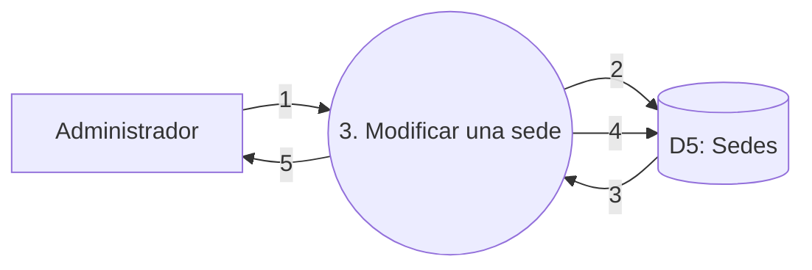
```mermaid
flowchart LR
    A[Administrador]
    P((3. Modificar una sede))
    D5[(D5: Sedes)]

    A -->|1| P
    P -->|2| D5
    D5 -->|3| P
    P -->|4| D5
    P -->|5| A
```

**Datos que circulan**

1. Identificador y datos modificables de la sede.
2. Identificador y nombre que deben validarse.
3. Datos actuales de la sede y coincidencias de nombre.
4. Nombre, dirección, observaciones y fecha de modificación actualizados.
5. Resultado de la modificación o errores de validación.

### DFD 4: activar una sede

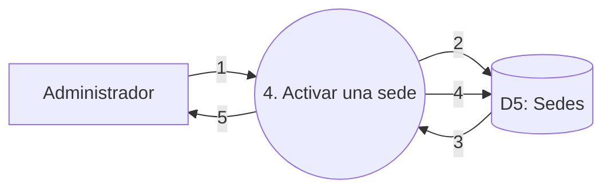
```mermaid
flowchart LR
    A[Administrador]
    P((4. Activar una sede))
    D5[(D5: Sedes)]

    A -->|1| P
    P -->|2| D5
    D5 -->|3| P
    P -->|4| D5
    P -->|5| A
```

**Datos que circulan**

1. Sede seleccionada y confirmación de activación.
2. Identificador de la sede.
3. Datos y estado actual de la sede.
4. Estado activo y fecha de modificación.
5. Resultado de la activación.

### DFD 5: desactivar una sede

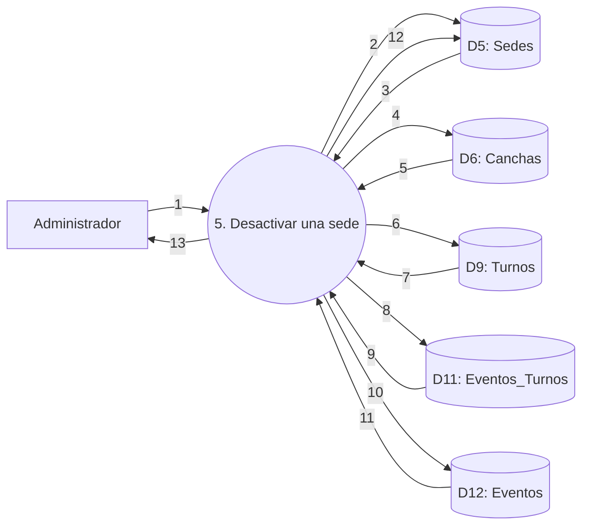
```mermaid
flowchart LR
    A[Administrador]
    P((5. Desactivar una sede))
    D5[(D5: Sedes)]
    D6[(D6: Canchas)]
    D9[(D9: Turnos)]
    D11[(D11: Eventos_Turnos)]
    D12[(D12: Eventos)]

    A -->|1| P
    P -->|2| D5
    D5 -->|3| P
    P -->|4| D6
    D6 -->|5| P
    P -->|6| D9
    D9 -->|7| P
    P -->|8| D11
    D11 -->|9| P
    P -->|10| D12
    D12 -->|11| P
    P -->|12| D5
    P -->|13| A
```

**Datos que circulan**

1. Sede seleccionada y confirmación.
2. Identificador de la sede.
3. Datos y estado actual de la sede.
4. Sede cuyas canchas deben consultarse.
5. Canchas de la sede, incluidas las inactivas.
6. Canchas cuyos turnos se consultan.
7. Turnos pertenecientes a las canchas.
8. Turnos para consultar sus vínculos con eventos.
9. Vínculos de los turnos con eventos.
10. Eventos relacionados y criterio de tipo Reserva y estado Programado.
11. Eventos de reservas Programados que impiden desactivar.
12. Estado inactivo y fecha de modificación, si la operación está permitida.
13. Resultado de la desactivación o impedimento por reservas Programadas.

---

## 3. Canchas

### DFD 6: consultar canchas de una sede

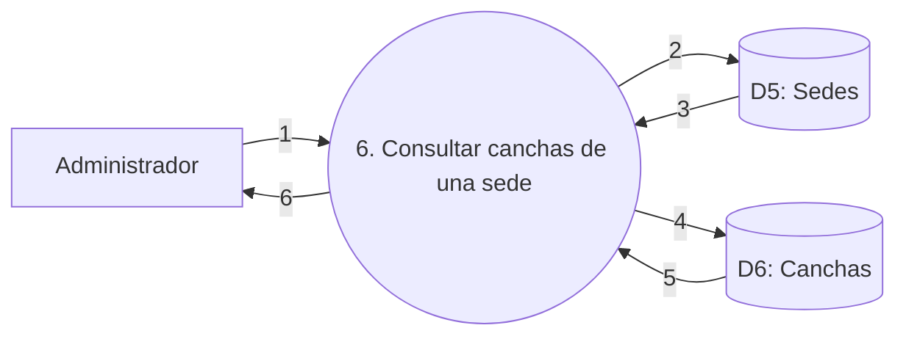
```mermaid
flowchart LR
    A[Administrador]
    P((6. Consultar canchas de una sede))
    D5[(D5: Sedes)]
    D6[(D6: Canchas)]

    A -->|1| P
    P -->|2| D5
    D5 -->|3| P
    P -->|4| D6
    D6 -->|5| P
    P -->|6| A
```

**Datos que circulan**

1. Sede seleccionada.
2. Identificador de la sede.
3. Datos de la sede encontrada.
4. Sede cuyas canchas se consultan.
5. Datos de todas las canchas de la sede, activas e inactivas.
6. Listado o detalle de las canchas de la sede.

### DFD 7: dar de alta una cancha

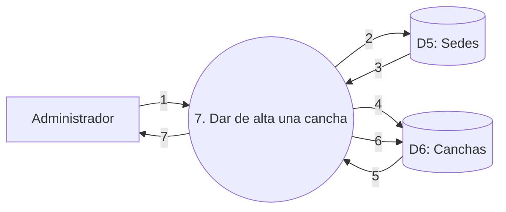
```mermaid
flowchart LR
    A[Administrador]
    P((7. Dar de alta una cancha))
    D5[(D5: Sedes)]
    D6[(D6: Canchas)]

    A -->|1| P
    P -->|2| D5
    D5 -->|3| P
    P -->|4| D6
    D6 -->|5| P
    P -->|6| D6
    P -->|7| A
```

**Datos que circulan**

1. Sede seleccionada y datos de la nueva cancha.
2. Identificador de la sede.
3. Datos de la sede encontrada.
4. Sede y nombre de cancha que deben validarse.
5. Coincidencias existentes en esa sede.
6. Datos validados de la cancha activa y referencia a su sede.
7. Resultado del alta o errores de validación.

### DFD 8: modificar una cancha

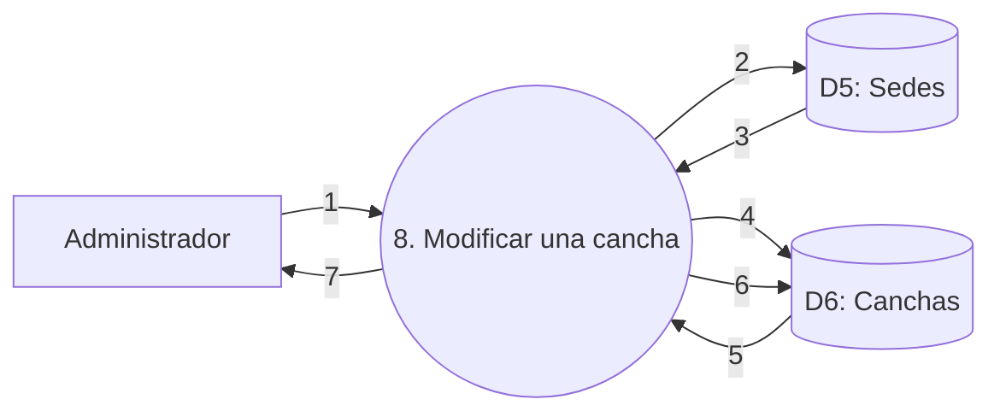
```mermaid
flowchart LR
    A[Administrador]
    P((8. Modificar una cancha))
    D5[(D5: Sedes)]
    D6[(D6: Canchas)]

    A -->|1| P
    P -->|2| D5
    D5 -->|3| P
    P -->|4| D6
    D6 -->|5| P
    P -->|6| D6
    P -->|7| A
```

**Datos que circulan**

1. Sede, cancha seleccionada y datos modificables.
2. Identificador de la sede.
3. Datos de la sede encontrada.
4. Identificador de la cancha y nombre que debe validarse dentro de la sede.
5. Datos actuales de la cancha y coincidencias de nombre.
6. Nombre, superficie, observaciones y fecha de modificación actualizados.
7. Resultado de la modificación o errores de validación.

### DFD 9: activar una cancha

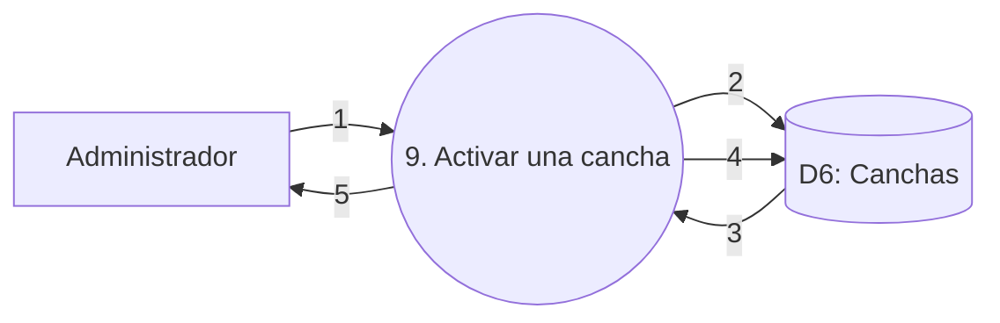
```mermaid
flowchart LR
    A[Administrador]
    P((9. Activar una cancha))
    D6[(D6: Canchas)]

    A -->|1| P
    P -->|2| D6
    D6 -->|3| P
    P -->|4| D6
    P -->|5| A
```

**Datos que circulan**

1. Cancha seleccionada y confirmación de activación.
2. Identificador de la cancha y de su sede.
3. Datos y estado actual de la cancha.
4. Estado activo y fecha de modificación.
5. Resultado de la activación.

### DFD 10: desactivar una cancha

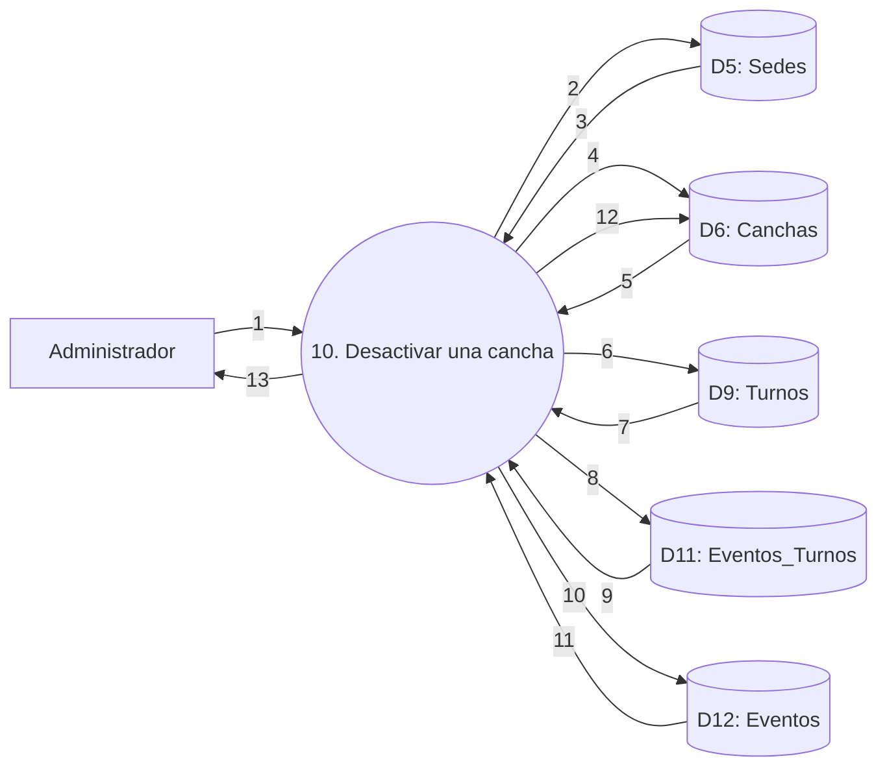
```mermaid
flowchart LR
    A[Administrador]
    P((10. Desactivar una cancha))
    D5[(D5: Sedes)]
    D6[(D6: Canchas)]
    D9[(D9: Turnos)]
    D11[(D11: Eventos_Turnos)]
    D12[(D12: Eventos)]

    A -->|1| P
    P -->|2| D5
    D5 -->|3| P
    P -->|4| D6
    D6 -->|5| P
    P -->|6| D9
    D9 -->|7| P
    P -->|8| D11
    D11 -->|9| P
    P -->|10| D12
    D12 -->|11| P
    P -->|12| D6
    P -->|13| A
```

**Datos que circulan**

1. Cancha seleccionada y confirmación.
2. Identificador de la sede.
3. Datos de la sede.
4. Identificador de la cancha y sede a la que debe pertenecer.
5. Datos y estado actual de la cancha.
6. Cancha cuyos turnos se consultan.
7. Turnos de la cancha.
8. Turnos para consultar sus vínculos con eventos.
9. Vínculos de los turnos con eventos.
10. Eventos relacionados y criterio de tipo Reserva y estado Programado.
11. Eventos de reservas Programados que impiden desactivar.
12. Estado inactivo y fecha de modificación, si la operación está permitida.
13. Resultado de la desactivación o impedimento por reservas Programadas.

---

## 4. Usuarios y roles

### DFD 11: dar de alta un usuario desde la administración

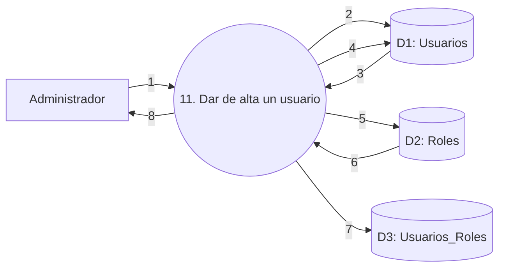
```mermaid
flowchart LR
    A[Administrador]
    P((11. Dar de alta un usuario))
    D1[(D1: Usuarios)]
    D2[(D2: Roles)]
    D3[(D3: Usuarios_Roles)]

    A -->|1| P
    P -->|2| D1
    D1 -->|3| P
    P -->|4| D1
    P -->|5| D2
    D2 -->|6| P
    P -->|7| D3
    P -->|8| A
```

**Datos que circulan**

1. Datos del usuario, contraseña provisoria y roles seleccionados.
2. Email y nombre de usuario generado que deben validarse.
3. Coincidencias existentes para esos datos.
4. Datos del usuario activo, hash de contraseña y cambio obligatorio pendiente.
5. Códigos de los roles que deben asignarse.
6. Roles válidos del catálogo.
7. Asignaciones entre el usuario y sus roles.
8. Resultado del alta y credenciales provisorias.

### DFD 12: autorregistrar un usuario

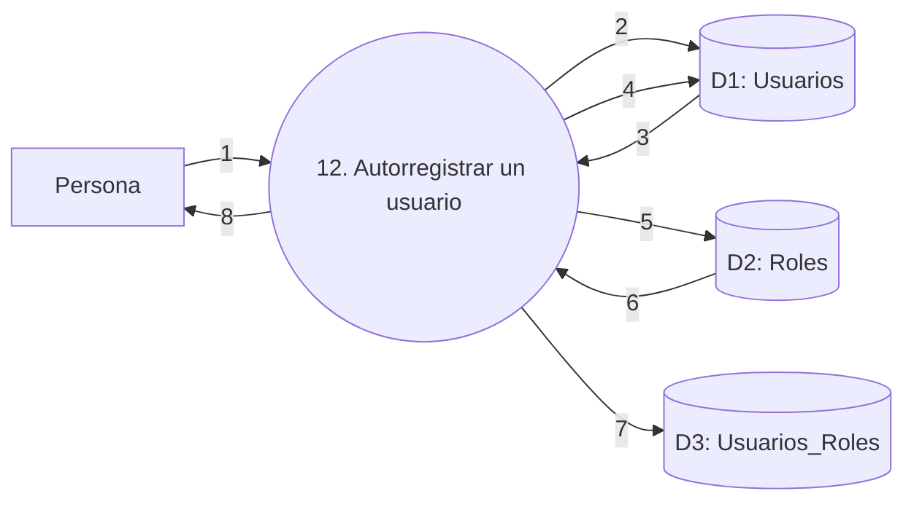
```mermaid
flowchart LR
    V[Persona]
    P((12. Autorregistrar un usuario))
    D1[(D1: Usuarios)]
    D2[(D2: Roles)]
    D3[(D3: Usuarios_Roles)]

    V -->|1| P
    P -->|2| D1
    D1 -->|3| P
    P -->|4| D1
    P -->|5| D2
    D2 -->|6| P
    P -->|7| D3
    P -->|8| V
```

**Datos que circulan**

1. Datos personales y contraseña elegida por la persona.
2. Email y nombre de usuario generado que deben validarse.
3. Coincidencias existentes para esos datos.
4. Datos del usuario activo, hash de contraseña y ausencia de cambio obligatorio.
5. Códigos de los roles Público y Reservas.
6. Roles automáticos del catálogo.
7. Asignaciones automáticas de Público y Reservas.
8. Resultado del autorregistro o errores de validación.

### DFD 13: consultar un usuario

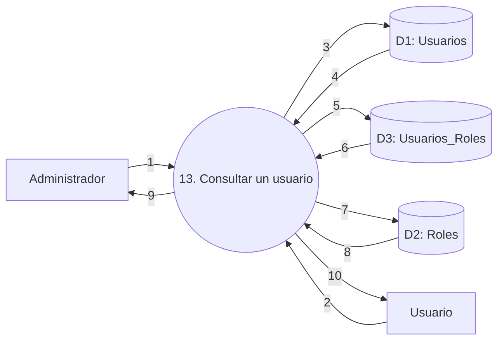
```mermaid
flowchart LR
    A[Administrador]
    U[Usuario]
    P((13. Consultar un usuario))
    D1[(D1: Usuarios)]
    D2[(D2: Roles)]
    D3[(D3: Usuarios_Roles)]

    A -->|1| P
    U -->|2| P
    P -->|3| D1
    D1 -->|4| P
    P -->|5| D3
    D3 -->|6| P
    P -->|7| D2
    D2 -->|8| P
    P -->|9| A
    P -->|10| U
```

**Datos que circulan**

1. Criterios de búsqueda o identificador seleccionado por el administrador.
2. Identidad del usuario que consulta su propio perfil.
3. Criterios autorizados de consulta.
4. Datos de los usuarios encontrados.
5. Identificadores de los usuarios cuyos roles se consultan.
6. Asignaciones de roles de esos usuarios.
7. Identificadores de los roles asignados.
8. Datos descriptivos de los roles.
9. Listado o detalle solicitado por el administrador.
10. Datos del perfil propio.

### DFD 14: modificar el correo de un usuario

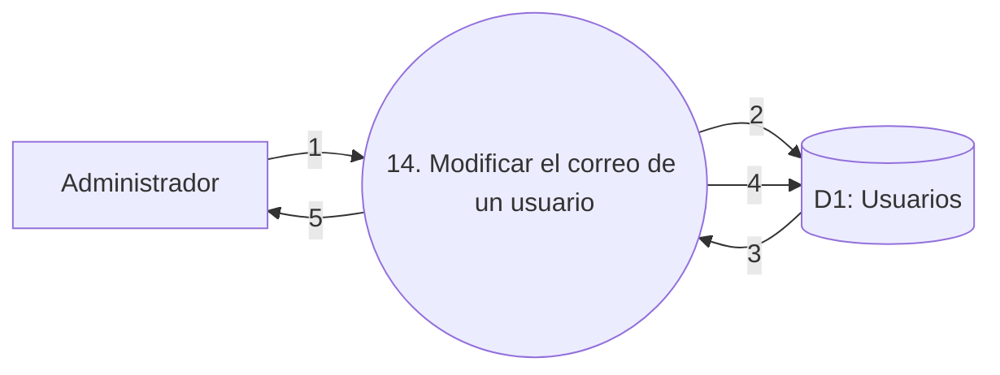
```mermaid
flowchart LR
    A[Administrador]
    P((14. Modificar el correo de un usuario))
    D1[(D1: Usuarios)]

    A -->|1| P
    P -->|2| D1
    D1 -->|3| P
    P -->|4| D1
    P -->|5| A
```

**Datos que circulan**

1. Usuario seleccionado y nuevo correo.
2. Identificador y correo que deben validarse.
3. Datos actuales del usuario y coincidencias de correo.
4. Nuevo correo y fecha de modificación.
5. Resultado de la modificación o errores de validación.

### DFD 15: activar un usuario

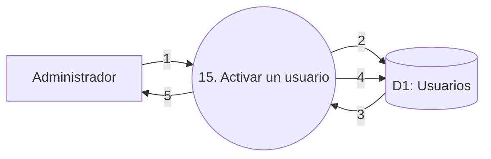
```mermaid
flowchart LR
    A[Administrador]
    P((15. Activar un usuario))
    D1[(D1: Usuarios)]

    A -->|1| P
    P -->|2| D1
    D1 -->|3| P
    P -->|4| D1
    P -->|5| A
```

**Datos que circulan**

1. Usuario seleccionado y confirmación de activación.
2. Identificador del usuario.
3. Datos, estado y fecha de baja actuales.
4. Estado activo, fecha de baja vacía y fecha de modificación.
5. Resultado de la activación.

### DFD 16: desactivar un usuario

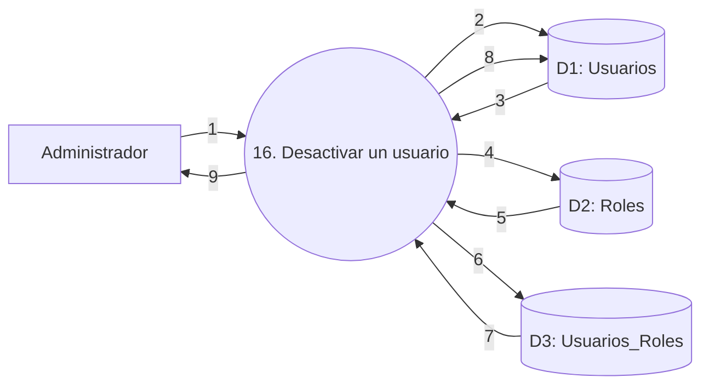
```mermaid
flowchart LR
    A[Administrador]
    P((16. Desactivar un usuario))
    D1[(D1: Usuarios)]
    D2[(D2: Roles)]
    D3[(D3: Usuarios_Roles)]

    A -->|1| P
    P -->|2| D1
    D1 -->|3| P
    P -->|4| D2
    D2 -->|5| P
    P -->|6| D3
    D3 -->|7| P
    P -->|8| D1
    P -->|9| A
```

**Datos que circulan**

1. Usuario seleccionado y confirmación de desactivación.
2. Datos del usuario seleccionado y de los administradores activos.
3. Identidades y estados de las cuentas consultadas.
4. Código del rol Administrador.
5. Datos del rol Administrador.
6. Usuarios activos cuyas asignaciones deben comprobarse.
7. Asignaciones del rol Administrador encontradas.
8. Estado inactivo, fecha de baja y fecha de modificación.
9. Resultado de la desactivación o motivo del rechazo.

### DFD 17: asignar un rol a un usuario

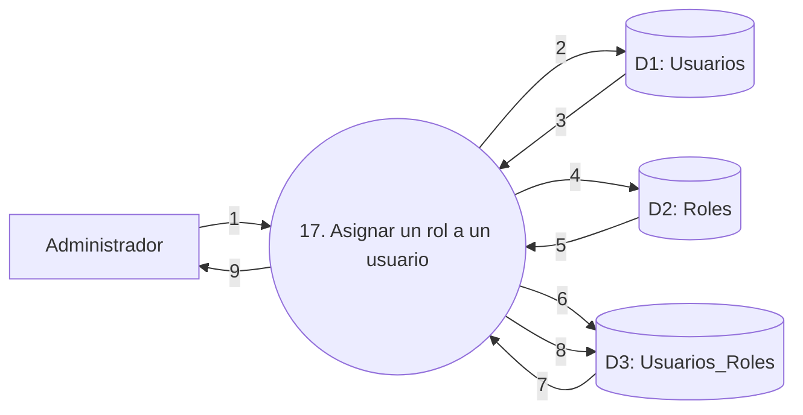
```mermaid
flowchart LR
    A[Administrador]
    P((17. Asignar un rol a un usuario))
    D1[(D1: Usuarios)]
    D2[(D2: Roles)]
    D3[(D3: Usuarios_Roles)]

    A -->|1| P
    P -->|2| D1
    D1 -->|3| P
    P -->|4| D2
    D2 -->|5| P
    P -->|6| D3
    D3 -->|7| P
    P -->|8| D3
    P -->|9| A
```

**Datos que circulan**

1. Usuario y rol seleccionados.
2. Identificador del usuario.
3. Datos básicos del usuario encontrado.
4. Código del rol seleccionado.
5. Datos del rol permitido.
6. Usuario y rol cuya asignación debe comprobarse.
7. Asignación existente, si la hubiera.
8. Nueva asignación con el administrador que la realizó.
9. Resultado de la asignación o errores encontrados.

Sólo se asignan roles adicionales a cuentas no administrativas. Administrador es exclusivo y el proceso rechaza una solicitud sobre una cuenta administrativa.

### DFD 18: retirar un rol de un usuario

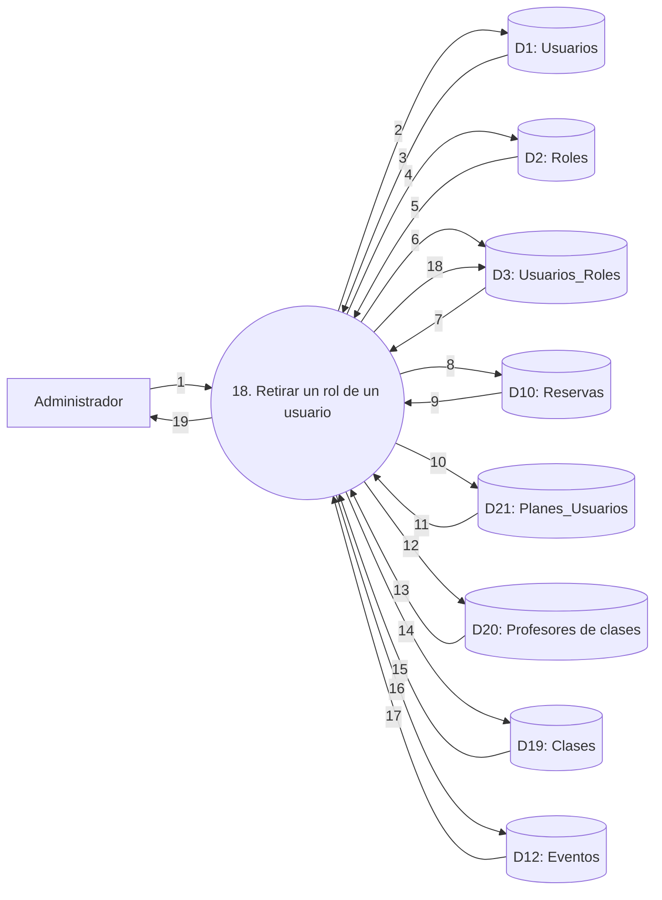
```mermaid
flowchart LR
    A[Administrador]
    P((18. Retirar un rol de un usuario))
    D1[(D1: Usuarios)]
    D2[(D2: Roles)]
    D3[(D3: Usuarios_Roles)]
    D10[(D10: Reservas)]
    D12[(D12: Eventos)]
    D19[(D19: Clases)]
    D20[(D20: Profesores de clases)]
    D21[(D21: Planes_Usuarios)]

    A -->|1| P
    P -->|2| D1
    D1 -->|3| P
    P -->|4| D2
    D2 -->|5| P
    P -->|6| D3
    D3 -->|7| P
    P -->|8| D10
    D10 -->|9| P
    P -->|10| D21
    D21 -->|11| P
    P -->|12| D20
    D20 -->|13| P
    P -->|14| D19
    D19 -->|15| P
    P -->|16| D12
    D12 -->|17| P
    P -->|18| D3
    P -->|19| A
```

**Datos que circulan**

1. Usuario, rol seleccionado y confirmación del retiro.
2. Identificador del usuario.
3. Datos de la cuenta.
4. Código del rol seleccionado.
5. Rol del catálogo y condiciones de retiro.
6. Usuario y rol para consultar la asignación.
7. Asignación vigente, si existe.
8. Organizador para consultar sus reservas.
9. Reservas del usuario y eventos asociados.
10. Titular para consultar sus planes contratados.
11. Contrataciones de planes Activas que impiden retirar Alumno.
12. Profesor para consultar sus asignaciones activas.
13. Clases con asignaciones activas del profesor.
14. Clases que deben consultar sus eventos.
15. Eventos asociados a las clases.
16. Eventos de las reservas o clases y criterio de estado Programado.
17. Estados que determinan si hay relaciones que impiden el retiro.
18. Asignación que debe retirarse cuando está permitido.
19. Resultado del retiro o motivo del rechazo.

Las asignaciones de roles sólo se modifican para cuentas no administrativas. Público y Administrador no se retiran desde la aplicación. Reservas se conserva mientras el usuario tenga reservas propias Programadas; Alumno, mientras tenga un plan contratado Activo; Profesor, mientras tenga asignaciones activas en clases Programadas.

### DFD 19: restablecer la contraseña de otro usuario

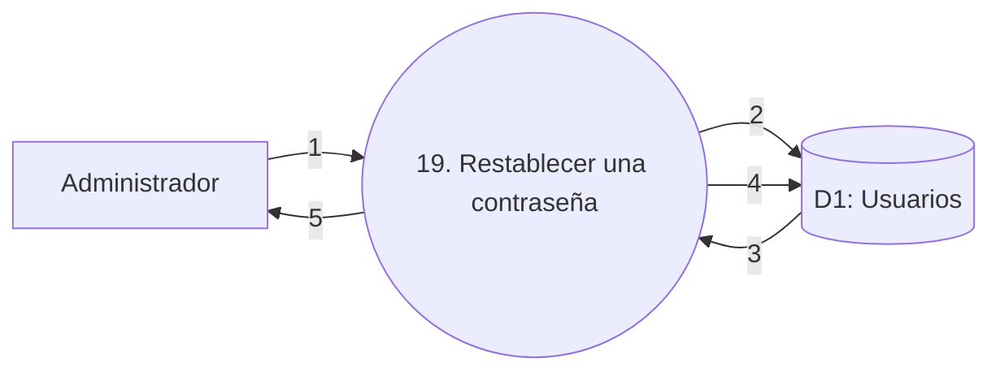
```mermaid
flowchart LR
    A[Administrador]
    P((19. Restablecer una contraseña))
    D1[(D1: Usuarios)]

    A -->|1| P
    P -->|2| D1
    D1 -->|3| P
    P -->|4| D1
    P -->|5| A
```

**Datos que circulan**

1. Otro usuario seleccionado y confirmación del restablecimiento.
2. Identificador del usuario.
3. Datos de la cuenta y validadores aplicables.
4. Nuevo hash, cambio obligatorio pendiente y fecha de modificación.
5. Resultado y contraseña provisoria mostrada una única vez.

---

## 5. Acceso y contraseñas

### DFD 20: iniciar sesión normalmente

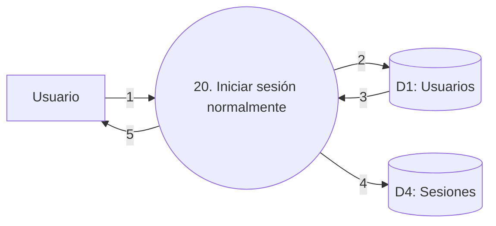
```mermaid
flowchart LR
    U[Usuario]
    P((20. Iniciar sesión normalmente))
    D1[(D1: Usuarios)]
    D4[(D4: Sesiones)]

    U -->|1| P
    P -->|2| D1
    D1 -->|3| P
    P -->|4| D4
    P -->|5| U
```

**Datos que circulan**

1. Nombre de usuario y contraseña personal.
2. Nombre de usuario que debe autenticarse.
3. Cuenta activa, hash almacenado y ausencia de cambio obligatorio.
4. Datos de la sesión autenticada.
5. Acceso normal o error de autenticación.

### DFD 21: iniciar sesión con una contraseña provisoria

```mermaid
flowchart LR
    U[Usuario]
    P((21. Iniciar sesión con contraseña provisoria))
    D1[(D1: Usuarios)]
    D4[(D4: Sesiones)]

    U -->|1| P
    P -->|2| D1
    D1 -->|3| P
    P -->|4| D4
    P -->|5| U
```

**Datos que circulan**

1. Nombre de usuario y contraseña provisoria.
2. Nombre de usuario que debe autenticarse.
3. Cuenta activa, hash almacenado y cambio obligatorio pendiente.
4. Datos de la sesión autenticada.
5. Acceso restringido al reemplazo obligatorio o error de autenticación.

### DFD 22: reemplazar una contraseña provisoria

```mermaid
flowchart LR
    U[Usuario]
    P((22. Reemplazar contraseña provisoria))
    D1[(D1: Usuarios)]
    D4[(D4: Sesiones)]

    U -->|1| P
    P -->|2| D1
    D1 -->|3| P
    P -->|4| D1
    P -->|5| D4
    P -->|6| U
```

**Datos que circulan**

1. Contraseña provisoria actual y nueva contraseña personal.
2. Identidad del usuario autenticado.
3. Hash vigente y cambio obligatorio pendiente.
4. Nuevo hash, cambio obligatorio desactivado y fecha de modificación.
5. Datos actualizados de la sesión autenticada.
6. Acceso normal o errores de validación.

La contraseña nueva debe ser distinta de la provisoria, coincidir con su confirmación y superar los validadores de Django. El cambio correcto desactiva la obligación y actualiza la fecha de última modificación en la misma transacción.

### DFD 23: cambiar la contraseña propia

```mermaid
flowchart LR
    U[Usuario]
    P((23. Cambiar la contraseña propia))
    D1[(D1: Usuarios)]
    D4[(D4: Sesiones)]

    U -->|1| P
    P -->|2| D1
    D1 -->|3| P
    P -->|4| D1
    P -->|5| D4
    P -->|6| U
```

**Datos que circulan**

1. Contraseña actual y nueva contraseña.
2. Identidad del usuario autenticado.
3. Hash vigente y ausencia de cambio obligatorio.
4. Nuevo hash y fecha de modificación.
5. Datos actualizados de la sesión autenticada.
6. Resultado del cambio o errores de validación.

Sólo el titular puede cambiar su contraseña. La nueva debe ser distinta de la vigente, coincidir con su confirmación y superar los validadores de Django. El cambio conserva la sesión actual y no modifica los demás datos del perfil.

### DFD 24: cerrar sesión

```mermaid
flowchart LR
    U[Usuario]
    P((24. Cerrar sesión))
    D4[(D4: Sesiones)]

    U -->|1| P
    P -->|2| D4
    D4 -->|3| P
    P -->|4| D4
    P -->|5| U
```

**Datos que circulan**

1. Solicitud de cierre de la sesión actual.
2. Identificador de la sesión.
3. Datos de la sesión autenticada.
4. Sesión que debe invalidarse.
5. Confirmación del cierre de sesión.

---

## 6. Precio vigente de reservas por sede

### DFD 25: consultar el precio de reservas de una sede

```mermaid
flowchart LR
    A[Administrador]
    P((25. Consultar el precio de reservas de una sede))
    D5[(D5: Sedes)]

    A -->|1| P
    P -->|2| D5
    D5 -->|3| P
    P -->|4| A
```

**Datos que circulan**

1. Sede seleccionada.
2. Identificador de la sede.
3. Datos de la sede y tarifa vigente por turno, si está configurada.
4. Importe vigente o falta de configuración.

### DFD 26: establecer el precio de reservas de una sede

```mermaid
flowchart LR
    A[Administrador]
    P((26. Establecer el precio de reservas de una sede))
    D5[(D5: Sedes)]

    A -->|1| P
    P -->|2| D5
    D5 -->|3| P
    P -->|4| D5
    P -->|5| A
```

**Datos que circulan**

1. Sede, importe positivo por turno y confirmación.
2. Identificador de la sede.
3. Estado y tarifa actual de la sede.
4. Tarifa vigente por turno y fecha de modificación, cuando el valor estaba vacío.
5. Resultado de la configuración o impedimento.

### DFD 27: actualizar el precio de reservas de una sede

```mermaid
flowchart LR
    A[Administrador]
    P((27. Actualizar el precio de reservas de una sede))
    D5[(D5: Sedes)]

    A -->|1| P
    P -->|2| D5
    D5 -->|3| P
    P -->|4| D5
    P -->|5| A
```

**Datos que circulan**

1. Sede, importe mostrado, nuevo importe positivo y confirmación.
2. Identificador de la sede.
3. Tarifa vigente para comprobar que coincide con la revisada.
4. Nuevo precio vigente y fecha de modificación.
5. Resultado de la actualización o solicitud de revisar la tarifa actual.

La operación modifica la tarifa de la sede. Las reservas existentes conservan su importe unitario aplicado.

---

## 7. Reservas de cancha

### DFD 28: registrar una reserva de cancha

```mermaid
flowchart LR
    A[Administrador o usuario con rol Reservas]
    P((28. Registrar una reserva de cancha))
    D1[(D1: Usuarios)]
    D3[(D3: Usuarios_Roles)]
    D5[(D5: Sedes)]
    D6[(D6: Canchas)]
    D8[(D8: Horarios de sedes)]
    D9[(D9: Turnos)]
    D10[(D10: Reservas)]
    D11[(D11: Eventos_Turnos)]
    D12[(D12: Eventos)]
    D13[(D13: Pases_Usuarios)]
    D14[(D14: Pases)]
    D15[(D15: Invitados de reservas)]
    D16[(D16: Ingresos)]

    A -->|1| P
    P -->|2| D1
    D1 -->|3| P
    P -->|4| D3
    D3 -->|5| P
    P -->|6| D5
    D5 -->|7| P
    P -->|8| D6
    D6 -->|9| P
    P -->|10| D8
    D8 -->|11| P
    P -->|12| D9
    D9 -->|13| P
    P -->|14| D9
    P -->|15| D11
    D11 -->|16| P
    P -->|17| D12
    D12 -->|18| P
    P -->|19| D10
    D10 -->|20| P
    P -->|21| D13
    D13 -->|22| P
    P -->|23| D14
    D14 -->|24| P
    P -->|25| D15
    D15 -->|26| P
    P -->|27| D12
    P -->|28| D10
    P -->|29| D11
    P -->|30| D15
    P -->|31| D16
    P -->|32| A
```

**Datos que circulan**

1. Organizador, sede, cancha, fecha, turnos, observaciones y confirmación; pase, invitados e ingreso opcional cuando correspondan.
2. Identidad del actor, organizador e invitados identificados.
3. Datos y estados de las cuentas, incluido el cambio obligatorio del actor.
4. Actor y organizador cuyos roles deben comprobarse.
5. Roles asignados.
6. Sede seleccionada.
7. Datos y estado de la sede, incluida su tarifa vigente por turno.
8. Cancha seleccionada.
9. Datos, sede y estado de la cancha.
10. Sede y día de la fecha elegida.
11. Franjas de funcionamiento.
12. Cancha, fecha y turnos solicitados.
13. Turnos existentes con su cancha, fecha y hora de inicio.
14. Turnos de una hora que faltan, sin ocuparlos.
15. Turnos para consultar sus vínculos horarios y el uso de pases.
16. Vínculos existentes con eventos.
17. Eventos relacionados con los turnos y reservas consultadas.
18. Estados que determinan ocupación y consumo de pase.
19. Reservas de los titulares cuyos pases se evalúan, para consultar su consumo diario.
20. Organizadores, pases aplicados y eventos de las reservas.
21. Titulares y fecha para consultar sus pases contratados.
22. Contrataciones de pase, titular, producto y mes cubierto.
23. Pases para consultar día habilitado, límite diario y adicional vigente.
24. Configuración de los pases.
25. Invitados cubiertos para consultar el consumo de sus pases.
26. Cobertura aplicada en otras reservas.
27. Nuevo evento de reserva Programado, con responsable, observaciones y fecha de registro.
28. Nueva reserva con organizador y copia de la tarifa por turno aplicada, o contratación de pase; datos de invitados y adicional unitario cuando correspondan.
29. Vínculos del evento nuevo con todos los turnos seleccionados.
30. Invitados identificados y cobertura aplicada, sólo para una reserva con pase.
31. Ingreso opcional autorizado por el Administrador, con la reserva como origen.
32. Selección y cálculos para confirmar; número y resultado del registro, o errores de validación.

Todos los turnos deben ser futuros, libres y consecutivos, de una misma cancha, fecha y franja. La confirmación registra una reserva y un evento con todos sus vínculos dentro de una transacción; el portal no registra ingresos.

### DFD 29: consultar el detalle de una reserva

```mermaid
flowchart LR
    A[Administrador o usuario con rol Reservas]
    P((29. Consultar el detalle de una reserva))
    D1[(D1: Usuarios)]
    D3[(D3: Usuarios_Roles)]
    D5[(D5: Sedes)]
    D6[(D6: Canchas)]
    D9[(D9: Turnos)]
    D10[(D10: Reservas)]
    D11[(D11: Eventos_Turnos)]
    D12[(D12: Eventos)]
    D13[(D13: Pases_Usuarios)]
    D14[(D14: Pases)]
    D15[(D15: Invitados de reservas)]
    D16[(D16: Ingresos)]

    A -->|1| P
    P -->|2| D1
    D1 -->|3| P
    P -->|4| D3
    D3 -->|5| P
    P -->|6| D10
    D10 -->|7| P
    P -->|8| D12
    D12 -->|9| P
    P -->|10| D11
    D11 -->|11| P
    P -->|12| D9
    D9 -->|13| P
    P -->|14| D6
    D6 -->|15| P
    P -->|16| D5
    D5 -->|17| P
    P -->|18| D13
    D13 -->|19| P
    P -->|20| D14
    D14 -->|21| P
    P -->|22| D15
    D15 -->|23| P
    P -->|24| D16
    D16 -->|25| P
    P -->|26| A
```

**Datos que circulan**

1. Reserva seleccionada e identidad del actor.
2. Actor y usuarios relacionados.
3. Datos de las cuentas y estado de acceso.
4. Actor cuyos roles deben consultarse.
5. Roles asignados.
6. Reserva seleccionada y acceso a todas o sólo a las propias.
7. Organizador, evento, importe unitario aplicado o contratación de pase y datos comerciales.
8. Evento asociado a la reserva.
9. Estado, observaciones, responsables y fechas de registro, anulación o finalización.
10. Evento cuyos vínculos deben consultarse.
11. Turnos incluidos en el evento.
12. Turnos de la reserva.
13. Cancha, fecha e inicio de cada turno, para calcular fin y duración.
14. Cancha de los turnos.
15. Datos de la cancha y su sede.
16. Sede relacionada.
17. Datos de la sede.
18. Contrataciones de pase aplicadas para consultar sus datos y período.
19. Contrataciones de pase, titular, producto y mes cubierto.
20. Productos de las contrataciones de pase aplicadas.
21. Nombre y configuración de los pases, sin recalcular importes históricos.
22. Reserva cuyos invitados se consultan.
23. Invitados identificados y su cobertura.
24. Reserva cuyos ingresos deben consultarse.
25. Ingresos y estados para calcular el resumen de cobro.
26. Detalle, turnos, importes, auditoría y acciones habilitadas, o rechazo del acceso.

### DFD 30: consultar reservas de cancha

```mermaid
flowchart LR
    A[Administrador o usuario con rol Reservas]
    P((30. Consultar reservas de cancha))
    D1[(D1: Usuarios)]
    D3[(D3: Usuarios_Roles)]
    D5[(D5: Sedes)]
    D6[(D6: Canchas)]
    D9[(D9: Turnos)]
    D10[(D10: Reservas)]
    D11[(D11: Eventos_Turnos)]
    D12[(D12: Eventos)]
    D15[(D15: Invitados de reservas)]

    A -->|1| P
    P -->|2| D1
    D1 -->|3| P
    P -->|4| D3
    D3 -->|5| P
    P -->|6| D5
    D5 -->|7| P
    P -->|8| D6
    D6 -->|9| P
    P -->|10| D9
    D9 -->|11| P
    P -->|12| D11
    D11 -->|13| P
    P -->|14| D12
    D12 -->|15| P
    P -->|16| D10
    D10 -->|17| P
    P -->|18| D15
    D15 -->|19| P
    P -->|20| A
```

**Datos que circulan**

1. Identidad del actor y filtros opcionales de sede, cancha, fechas de uso, organizador, número y estado.
2. Actor y organizadores consultados.
3. Estado de acceso y datos de los organizadores.
4. Actor cuyos roles deben consultarse.
5. Roles asignados.
6. Criterios de consulta de sedes.
7. Sedes, incluidas las inactivas.
8. Sede seleccionada y canchas relacionadas.
9. Canchas y su pertenencia a las sedes.
10. Cancha y rango de fechas de uso.
11. Turnos con cancha, fecha y hora de inicio.
12. Turnos o eventos cuyos vínculos se consultan.
13. Vínculos completos que permiten obtener duración e intervalo.
14. Eventos asociados y filtro de estado.
15. Estados y fechas de registro de los eventos.
16. Criterios de número y organizador, con acceso a todas o sólo a las propias.
17. Reservas, evento asociado, importe unitario aplicado o contratación de pase y adicional de invitados.
18. Invitados de reservas con pase para calcular adicionales.
19. Coberturas de los invitados identificados.
20. Filtros y listado con número, organizador cuando corresponde, cancha, fecha, horario, total, estado y acceso al detalle, o errores.

### DFD 31: anular una reserva de cancha

```mermaid
flowchart LR
    A[Administrador o usuario con rol Reservas]
    P((31. Anular una reserva de cancha))
    D1[(D1: Usuarios)]
    D3[(D3: Usuarios_Roles)]
    D9[(D9: Turnos)]
    D10[(D10: Reservas)]
    D11[(D11: Eventos_Turnos)]
    D12[(D12: Eventos)]
    D17[(D17: Bloqueos)]
    D18[(D18: Orígenes de bloqueos)]

    A -->|1| P
    P -->|2| D1
    D1 -->|3| P
    P -->|4| D3
    D3 -->|5| P
    P -->|6| D10
    D10 -->|7| P
    P -->|8| D12
    D12 -->|9| P
    P -->|10| D11
    D11 -->|11| P
    P -->|12| D9
    D9 -->|13| P
    P -->|14| D12
    P -->|15| D10
    P -->|16| D12
    P -->|17| D17
    P -->|18| D11
    P -->|19| D18
    P -->|20| A
```

**Datos que circulan**

1. Reserva, motivo y confirmación; clasificación administrativa cuando corresponda.
2. Identidad del actor.
3. Estado de acceso y datos de la cuenta.
4. Actor cuyos roles deben comprobarse.
5. Roles asignados.
6. Reserva seleccionada, con criterio de titularidad para el portal.
7. Organizador, evento asociado y origen de una anulación previa, si existe.
8. Evento asociado a la reserva.
9. Estado y auditoría vigente.
10. Evento cuyos turnos deben consultarse.
11. Vínculos del evento con sus turnos.
12. Turnos de la reserva.
13. Fechas y horas de inicio para comprobar el plazo.
14. Estado Anulado, actor, momento, motivo y fecha de modificación del evento.
15. Origen de la anulación: organizador o administración.
16. Evento de bloqueo Programado con su responsable y observaciones, sólo por causa bloqueante.
17. Bloqueo con motivo de clima adverso, torneo o mantenimiento, cuando corresponda.
18. Vínculos del bloqueo con todos los turnos de la reserva anulada, cuando corresponda.
19. Vínculo del bloqueo con el evento anulado de origen.
20. Resultado de la anulación y condición de los turnos, o errores de acceso, motivo, estado o plazo.

El Administrador puede anular antes del primer turno; el organizador del portal necesita al menos una hora de antelación. Los vínculos históricos se conservan. Las causas administrativas bloqueantes crean el bloqueo y su trazabilidad en la misma transacción.

### DFD 32: finalizar una reserva de cancha

```mermaid
flowchart LR
    A[Administrador]
    P((32. Finalizar una reserva de cancha))
    D1[(D1: Usuarios)]
    D3[(D3: Usuarios_Roles)]
    D9[(D9: Turnos)]
    D10[(D10: Reservas)]
    D11[(D11: Eventos_Turnos)]
    D12[(D12: Eventos)]

    A -->|1| P
    P -->|2| D1
    D1 -->|3| P
    P -->|4| D3
    D3 -->|5| P
    P -->|6| D10
    D10 -->|7| P
    P -->|8| D12
    D12 -->|9| P
    P -->|10| D11
    D11 -->|11| P
    P -->|12| D9
    D9 -->|13| P
    P -->|14| D12
    P -->|15| A
```

**Datos que circulan**

1. Reserva seleccionada, identidad del Administrador y confirmación.
2. Identidad del actor.
3. Estado de acceso.
4. Actor cuyos roles deben consultarse.
5. Roles asignados.
6. Reserva seleccionada.
7. Evento asociado a la reserva.
8. Evento que se solicita finalizar.
9. Estado y fecha de finalización existente.
10. Evento cuyos turnos deben consultarse.
11. Vínculos con todos los turnos.
12. Turnos de la reserva.
13. Fechas e inicios para calcular el fin del último turno.
14. Estado Finalizado, momento de procesamiento y fecha de modificación.
15. Resultado de la finalización o rechazo por acceso, estado u horario.

La acción de emergencia sólo finaliza eventos de reservas Programados cuyo último turno terminó. No registra responsable de finalización ni sobrescribe una fecha existente. La finalización manual y la tarea automática coordinan la operación con los mismos turnos y evento.

### Finalización automática de reservas

La tarea horaria es un proceso interno y no tiene un DFD de nivel 1. Consulta Eventos (D12), Eventos_Turnos (D11) y Turnos (D9), y actualiza sólo eventos de tipo Reserva Programados cuyo último turno terminó. Registra estado Finalizado y momento de procesamiento, sin responsable. Conserva vínculos y ocupación histórica. Las clases utilizan la misma condición y los bloqueos quedan fuera de la tarea. Su operación se describe en `3_modelo_relacional.md`, sección 7.11, y `4_flujos_del_sistema.md`, sección 4.3.

### DFD 33: emitir el comprobante de una reserva

```mermaid
flowchart LR
    A[Administrador o usuario con rol Reservas]
    P((33. Emitir el comprobante de una reserva))
    D1[(D1: Usuarios)]
    D3[(D3: Usuarios_Roles)]
    D5[(D5: Sedes)]
    D6[(D6: Canchas)]
    D9[(D9: Turnos)]
    D10[(D10: Reservas)]
    D11[(D11: Eventos_Turnos)]
    D12[(D12: Eventos)]
    D13[(D13: Pases_Usuarios)]
    D14[(D14: Pases)]
    D15[(D15: Invitados de reservas)]

    A -->|1| P
    P -->|2| D1
    D1 -->|3| P
    P -->|4| D3
    D3 -->|5| P
    P -->|6| D10
    D10 -->|7| P
    P -->|8| D12
    D12 -->|9| P
    P -->|10| D11
    D11 -->|11| P
    P -->|12| D9
    D9 -->|13| P
    P -->|14| D6
    D6 -->|15| P
    P -->|16| D5
    D5 -->|17| P
    P -->|18| D13
    D13 -->|19| P
    P -->|20| D14
    D14 -->|21| P
    P -->|22| D15
    D15 -->|23| P
    P -->|24| A
```

**Datos que circulan**

1. Reserva seleccionada e identidad del actor.
2. Actor, organizador y responsables relacionados.
3. Datos de las cuentas y estado de acceso del actor.
4. Actor cuyos roles deben consultarse.
5. Roles asignados.
6. Reserva y criterio de acceso a todas o sólo a las propias.
7. Número, organizador, evento e importes aplicados o contratación de pase.
8. Evento asociado a la reserva.
9. Estado, observaciones y auditoría.
10. Evento cuyos vínculos se consultan.
11. Vínculos con todos los turnos.
12. Turnos incluidos en el comprobante.
13. Cancha, fecha e inicio para calcular fin y duración.
14. Cancha de los turnos.
15. Datos de la cancha y sede.
16. Sede relacionada.
17. Nombre y datos de la sede.
18. Contrataciones de pase aplicadas para consultar sus datos y período.
19. Contrataciones de pase, titular, producto y mes cubierto.
20. Productos de las contrataciones de pase aplicadas.
21. Nombre y configuración de los pases, sin recalcular importes históricos.
22. Invitados de la reserva con pase.
23. Identificación y cobertura de invitados.
24. Comprobante imprimible con número, estado, usuarios, fechas, sede, cancha, turnos, duración, importes y auditoría, o rechazo del acceso.

El comprobante se obtiene de los datos de la reserva, su evento y sus relaciones. Emitirlo no modifica datos ni registra un cobro.
